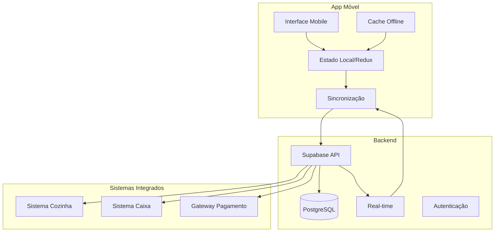

# Documento de Design - Aplicativo Nativo do Garçom

## Visão Geral

O aplicativo nativo do garçom será desenvolvido como uma Progressive Web App (PWA) otimizada para dispositivos móveis, utilizando React Native ou uma abordagem híbrida com Capacitor. O app integrará com o sistema web existente através da API Supabase, mantendo sincronização em tempo real e funcionamento offline robusto.

## Arquitetura

### Arquitetura Geral



### Stack Tecnológico

**Frontend Mobile:**
- React Native com Expo (para desenvolvimento rápido e multiplataforma)
- TypeScript para type safety
- Redux Toolkit para gerenciamento de estado
- React Query para cache e sincronização
- AsyncStorage para persistência local
- React Navigation para navegação

**Backend (Existente):**
- Supabase (PostgreSQL + Real-time + Auth)
- Row Level Security (RLS) para segurança
- Triggers para notificações em tempo real

**Integrações:**
- Expo Camera para QR codes e fotos
- Expo Print para impressão de comandas
- Expo Notifications para push notifications
- Expo Network para detecção de conectividade

## Componentes e Interfaces

### 1. Componentes de Interface

#### MapaMesas
```typescript
interface Mesa {
  id: string;
  numero: number;
  status: 'livre' | 'ocupada' | 'aguardando' | 'limpeza';
  posicaoX: number;
  posicaoY: number;
  capacidade: number;
  garcomResponsavel?: string;
  tempoOcupacao?: Date;
  comandaAtiva?: string;
}

interface MapaMesasProps {
  mesas: Mesa[];
  onMesaPress: (mesa: Mesa) => void;
  layoutRestaurante: LayoutConfig;
}
```

#### GerenciadorComanda
```typescript
interface Comanda {
  id: string;
  numeroMesa: number;
  garcom: string;
  cliente?: string;
  itens: ItemComanda[];
  status: 'aberta' | 'fechada' | 'cancelada';
  dataAbertura: Date;
  dataFechamento?: Date;
  subtotal: number;
  taxaServico: number;
  total: number;
  formaPagamento?: FormaPagamento;
}

interface ItemComanda {
  id: string;
  produtoId: string;
  nome: string;
  quantidade: number;
  preco: number;
  observacoes?: string;
  status: 'pendente' | 'preparando' | 'pronto' | 'servido';
  tempoSolicitacao: Date;
}
```

#### CardapioMobile
```typescript
interface ProdutoCardapio {
  id: string;
  nome: string;
  descricao: string;
  preco: number;
  categoria: string;
  disponivel: boolean;
  tempoPreparoMedio: number;
  ingredientes: string[];
  alergenos: string[];
  imagem?: string;
}

interface CardapioProps {
  produtos: ProdutoCardapio[];
  onProdutoSelect: (produto: ProdutoCardapio, quantidade: number) => void;
  filtroCategoria?: string;
}
```

### 2. Serviços de Dados

#### SincronizacaoService
```typescript
class SincronizacaoService {
  private queue: OperacaoPendente[] = [];
  private isOnline: boolean = true;
  
  async sincronizarDados(): Promise<void>;
  async adicionarOperacao(operacao: OperacaoPendente): Promise<void>;
  async processarFilaOffline(): Promise<void>;
  onConectividadeMudou(callback: (online: boolean) => void): void;
}

interface OperacaoPendente {
  id: string;
  tipo: 'criar_comanda' | 'adicionar_item' | 'fechar_comanda' | 'atualizar_status';
  dados: any;
  timestamp: Date;
  tentativas: number;
}
```

#### NotificacaoService
```typescript
class NotificacaoService {
  async configurarNotificacoes(): Promise<void>;
  async enviarNotificacao(tipo: TipoNotificacao, dados: any): Promise<void>;
  async registrarToken(): Promise<string>;
}

type TipoNotificacao = 
  | 'pedido_pronto'
  | 'cliente_chamando'
  | 'problema_cozinha'
  | 'turno_terminando'
  | 'emergencia';
```

### 3. Gerenciamento de Estado

#### Store Redux
```typescript
interface AppState {
  auth: AuthState;
  mesas: MesasState;
  comandas: ComandasState;
  cardapio: CardapioState;
  sincronizacao: SincronizacaoState;
  notificacoes: NotificacoesState;
}

interface MesasState {
  layout: Mesa[];
  mesaSelecionada?: Mesa;
  filtroStatus?: StatusMesa;
  loading: boolean;
}

interface ComandasState {
  comandasAbertas: Comanda[];
  comandaAtiva?: Comanda;
  historico: Comanda[];
  loading: boolean;
}
```

## Modelos de Dados

### Esquema do Banco de Dados

```sql
-- Tabela de mesas
CREATE TABLE mesas (
  id UUID PRIMARY KEY DEFAULT gen_random_uuid(),
  numero INTEGER UNIQUE NOT NULL,
  capacidade INTEGER NOT NULL,
  posicao_x FLOAT NOT NULL,
  posicao_y FLOAT NOT NULL,
  status mesa_status DEFAULT 'livre',
  created_at TIMESTAMP DEFAULT NOW(),
  updated_at TIMESTAMP DEFAULT NOW()
);

-- Tabela de comandas
CREATE TABLE comandas (
  id UUID PRIMARY KEY DEFAULT gen_random_uuid(),
  numero_sequencial SERIAL,
  mesa_id UUID REFERENCES mesas(id),
  garcom_id UUID REFERENCES auth.users(id),
  cliente_nome VARCHAR(255),
  status comanda_status DEFAULT 'aberta',
  data_abertura TIMESTAMP DEFAULT NOW(),
  data_fechamento TIMESTAMP,
  subtotal DECIMAL(10,2) DEFAULT 0,
  taxa_servico DECIMAL(10,2) DEFAULT 0,
  desconto DECIMAL(10,2) DEFAULT 0,
  total DECIMAL(10,2) DEFAULT 0,
  forma_pagamento VARCHAR(50),
  observacoes TEXT
);

-- Tabela de itens da comanda
CREATE TABLE itens_comanda (
  id UUID PRIMARY KEY DEFAULT gen_random_uuid(),
  comanda_id UUID REFERENCES comandas(id) ON DELETE CASCADE,
  produto_id UUID REFERENCES produtos(id),
  quantidade INTEGER NOT NULL,
  preco_unitario DECIMAL(10,2) NOT NULL,
  subtotal DECIMAL(10,2) NOT NULL,
  observacoes TEXT,
  status item_status DEFAULT 'pendente',
  tempo_solicitacao TIMESTAMP DEFAULT NOW(),
  tempo_preparo_inicio TIMESTAMP,
  tempo_preparo_fim TIMESTAMP
);

-- Enums
CREATE TYPE mesa_status AS ENUM ('livre', 'ocupada', 'aguardando', 'limpeza');
CREATE TYPE comanda_status AS ENUM ('aberta', 'fechada', 'cancelada');
CREATE TYPE item_status AS ENUM ('pendente', 'preparando', 'pronto', 'servido', 'cancelado');
```

### Triggers para Real-time

```sql
-- Trigger para atualizar status da mesa quando comanda muda
CREATE OR REPLACE FUNCTION atualizar_status_mesa()
RETURNS TRIGGER AS $$
BEGIN
  IF NEW.status = 'fechada' THEN
    UPDATE mesas SET status = 'limpeza' WHERE id = NEW.mesa_id;
  ELSIF NEW.status = 'aberta' THEN
    UPDATE mesas SET status = 'ocupada' WHERE id = NEW.mesa_id;
  END IF;
  RETURN NEW;
END;
$$ LANGUAGE plpgsql;

CREATE TRIGGER trigger_atualizar_status_mesa
  AFTER UPDATE ON comandas
  FOR EACH ROW
  EXECUTE FUNCTION atualizar_status_mesa();

-- Trigger para notificar quando item fica pronto
CREATE OR REPLACE FUNCTION notificar_item_pronto()
RETURNS TRIGGER AS $$
BEGIN
  IF NEW.status = 'pronto' AND OLD.status != 'pronto' THEN
    PERFORM pg_notify('item_pronto', json_build_object(
      'comanda_id', NEW.comanda_id,
      'produto_id', NEW.produto_id,
      'mesa_numero', (SELECT m.numero FROM mesas m 
                      JOIN comandas c ON c.mesa_id = m.id 
                      WHERE c.id = NEW.comanda_id)
    )::text);
  END IF;
  RETURN NEW;
END;
$$ LANGUAGE plpgsql;

CREATE TRIGGER trigger_notificar_item_pronto
  AFTER UPDATE ON itens_comanda
  FOR EACH ROW
  EXECUTE FUNCTION notificar_item_pronto();
```

## Tratamento de Erros

### Estratégias de Error Handling

1. **Erros de Conectividade**
   - Detecção automática de perda de conexão
   - Queue de operações offline
   - Retry automático com backoff exponencial
   - Feedback visual do status de conectividade

2. **Erros de Sincronização**
   - Resolução de conflitos por timestamp
   - Merge inteligente de dados
   - Rollback de operações falhadas
   - Log detalhado para debugging

3. **Erros de Pagamento**
   - Validação prévia de dados
   - Timeout configurável
   - Fallback para outros métodos
   - Recuperação de transações pendentes

### Implementação de Error Boundaries

```typescript
class ErrorBoundary extends React.Component {
  constructor(props: any) {
    super(props);
    this.state = { hasError: false, error: null };
  }

  static getDerivedStateFromError(error: Error) {
    return { hasError: true, error };
  }

  componentDidCatch(error: Error, errorInfo: any) {
    // Log para serviço de monitoramento
    console.error('App Error:', error, errorInfo);
    // Enviar para Sentry ou similar
  }

  render() {
    if (this.state.hasError) {
      return <ErrorFallback error={this.state.error} />;
    }
    return this.props.children;
  }
}
```

## Estratégia de Testes

### Testes Unitários
- Jest para lógica de negócio
- React Native Testing Library para componentes
- Cobertura mínima de 80%

### Testes de Integração
- Testes de API com mock do Supabase
- Testes de sincronização offline/online
- Testes de fluxos completos de comanda

### Testes E2E
- Detox para testes end-to-end
- Cenários críticos: abrir comanda, fazer pedido, processar pagamento
- Testes de performance e memory leaks

### Testes de Usabilidade
- Testes com garçons reais
- Métricas de tempo de execução de tarefas
- Feedback sobre interface e fluxos

## Considerações de Performance

### Otimizações de Interface
- Lazy loading de componentes
- Virtualização de listas longas
- Debounce em buscas e filtros
- Memoização de componentes pesados

### Otimizações de Dados
- Paginação de comandas históricas
- Cache inteligente com TTL
- Compressão de dados offline
- Sincronização incremental

### Otimizações de Bateria
- Background sync otimizado
- Redução de polling desnecessário
- Uso eficiente de GPS e câmera
- Modo de economia de energia

## Segurança

### Autenticação e Autorização
- JWT tokens com refresh automático
- Row Level Security no Supabase
- Biometria para login rápido
- Timeout de sessão configurável

### Proteção de Dados
- Criptografia de dados sensíveis locais
- HTTPS obrigatório para todas as comunicações
- Sanitização de inputs
- Logs sem informações sensíveis

### Auditoria
- Log de todas as operações críticas
- Rastreamento de alterações em comandas
- Monitoramento de tentativas de acesso
- Backup automático de dados críticos

## Integração com Sistemas Existentes

### Sistema de Cozinha
- WebSocket para comunicação em tempo real
- API REST para operações CRUD
- Formato padronizado de pedidos
- Fallback para impressão local

### Sistema de Caixa
- Integração via API Supabase
- Sincronização de produtos e preços
- Processamento de pagamentos
- Conciliação automática

### Sistema de Estoque
- Atualização automática de disponibilidade
- Alertas de produtos em falta
- Integração com sistema de compras
- Relatórios de consumo

## Deployment e Distribuição

### Build e Deploy
- CI/CD com GitHub Actions
- Builds automatizados para iOS/Android
- Code signing automático
- Distribuição via App Store/Play Store

### Atualizações
- Over-the-air updates com CodePush
- Versionamento semântico
- Rollback automático em caso de erro
- Notificação de atualizações disponíveis

### Monitoramento
- Crashlytics para crash reporting
- Analytics de uso e performance
- Alertas de problemas críticos
- Dashboard de métricas operacionais