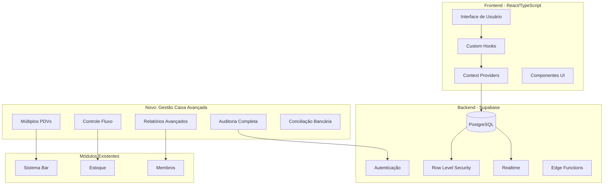
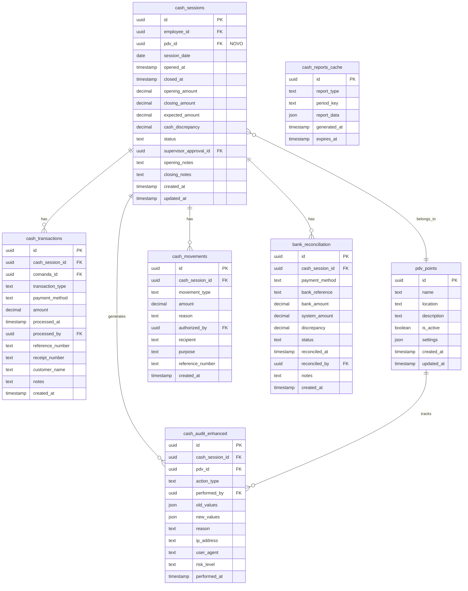

# Design - Gestão Avançada de Caixa

## Visão Geral

O sistema de gestão avançada de caixa expande o módulo básico já implementado, adicionando funcionalidades empresariais robustas para controle financeiro completo. O design mantém compatibilidade com a arquitetura existente enquanto introduz novos componentes para múltiplos PDVs, controle de sangria/suprimento, relatórios avançados e auditoria completa.

## Arquitetura

### Arquitetura Geral do Sistema



### Arquitetura de Dados Expandida



## Componentes e Interfaces

### Estrutura de Componentes Expandida

```
src/pages/CashManagement/
├── index.tsx                           # Roteamento principal
├── components/
│   ├── Dashboard/
│   │   ├── DashboardOverview.tsx       # Dashboard principal (expandido)
│   │   ├── PDVSelector.tsx             # NOVO: Seletor de PDV
│   │   ├── MultiPDVDashboard.tsx       # NOVO: Dashboard múltiplos PDVs
│   │   └── RealTimeMetrics.tsx         # NOVO: Métricas tempo real
│   ├── Session/
│   │   ├── OpenCashModal.tsx           # Modal abertura (expandido)
│   │   ├── CloseCashModal.tsx          # Modal fechamento (expandido)
│   │   └── PDVSessionManager.tsx       # NOVO: Gerenciador sessões PDV
│   ├── Transactions/
│   │   ├── PaymentModal.tsx            # Modal pagamento (expandido)
│   │   ├── CashMovementModal.tsx       # NOVO: Modal sangria/suprimento
│   │   └── TransactionHistory.tsx      # Histórico (expandido)
│   ├── Reports/
│   │   ├── AdvancedReports.tsx         # NOVO: Relatórios avançados
│   │   ├── PerformanceAnalytics.tsx    # NOVO: Análise performance
│   │   ├── DiscrepancyAnalysis.tsx     # NOVO: Análise discrepâncias
│   │   └── ExportManager.tsx           # NOVO: Gerenciador exportação
│   ├── Banking/
│   │   ├── BankReconciliation.tsx      # NOVO: Conciliação bancária
│   │   ├── ReconciliationHistory.tsx   # NOVO: Histórico conciliação
│   │   └── PaymentMethodAnalysis.tsx   # NOVO: Análise métodos pagamento
│   ├── Audit/
│   │   ├── AuditLog.tsx                # NOVO: Log auditoria
│   │   ├── SecurityAlerts.tsx          # NOVO: Alertas segurança
│   │   └── ComplianceReports.tsx       # NOVO: Relatórios conformidade
│   └── Settings/
│       ├── PDVConfiguration.tsx        # NOVO: Configuração PDVs
│       ├── CashSystemSettings.tsx      # NOVO: Configurações sistema
│       └── UserPermissions.tsx         # NOVO: Permissões usuários
```

### Hooks Expandidos

```typescript
// Hook principal expandido
export interface UseCashManagementAdvanced extends UseCashManagement {
  // Gestão de PDVs
  pdvPoints: PDVPoint[];
  currentPDV: PDVPoint | null;
  switchPDV: (pdvId: string) => Promise<void>;
  createPDV: (data: CreatePDVData) => Promise<void>;
  updatePDV: (pdvId: string, data: UpdatePDVData) => Promise<void>;
  
  // Movimentação de caixa
  processCashSupply: (data: CashSupplyData) => Promise<string>;
  processCashWithdrawal: (data: CashWithdrawalData) => Promise<string>;
  getCashMovements: (sessionId?: string) => Promise<CashMovement[]>;
  
  // Conciliação bancária
  importBankStatement: (file: File) => Promise<void>;
  reconcileTransaction: (data: ReconciliationData) => Promise<void>;
  getReconciliationStatus: (period: DateRange) => Promise<ReconciliationStatus>;
  
  // Relatórios avançados
  getAdvancedReport: (type: ReportType, filters: ReportFilters) => Promise<AdvancedReport>;
  getPerformanceMetrics: (period: DateRange) => Promise<PerformanceMetrics>;
  getDiscrepancyAnalysis: (period: DateRange) => Promise<DiscrepancyAnalysis>;
  
  // Auditoria
  getAuditLog: (filters: AuditFilters) => Promise<AuditEntry[]>;
  getSecurityAlerts: () => Promise<SecurityAlert[]>;
  generateComplianceReport: (period: DateRange) => Promise<ComplianceReport>;
}
```

## Modelos de Dados

### Novos Tipos TypeScript

```typescript
// PDV (Ponto de Venda)
export interface PDVPoint {
  id: string;
  name: string;
  location: string;
  description?: string;
  isActive: boolean;
  settings: PDVSettings;
  createdAt: Date;
  updatedAt: Date;
}

export interface PDVSettings {
  maxCashAmount: number;
  requireSupervisorApproval: boolean;
  autoSangriaThreshold: number;
  allowedPaymentMethods: PaymentMethod[];
  printerConfig?: PrinterConfig;
}

// Movimentação de Caixa
export interface CashMovement {
  id: string;
  cashSessionId: string;
  movementType: 'supply' | 'withdrawal' | 'transfer';
  amount: number;
  reason: string;
  authorizedBy: string;
  recipient?: string;
  purpose: CashMovementPurpose;
  referenceNumber?: string;
  createdAt: Date;
}

export type CashMovementPurpose = 
  | 'change_fund'      // Fundo de troco
  | 'security'         // Segurança (sangria)
  | 'expense'          // Despesa
  | 'transfer'         // Transferência
  | 'correction'       // Correção
  | 'other';           // Outros

// Conciliação Bancária
export interface BankReconciliation {
  id: string;
  cashSessionId: string;
  paymentMethod: PaymentMethod;
  bankReference: string;
  bankAmount: number;
  systemAmount: number;
  discrepancy: number;
  status: ReconciliationStatus;
  reconciledAt?: Date;
  reconciledBy?: string;
  notes?: string;
  createdAt: Date;
}

export type ReconciliationStatus = 
  | 'pending'
  | 'matched'
  | 'discrepant'
  | 'manual_review'
  | 'resolved';

// Auditoria Avançada
export interface AuditEntry {
  id: string;
  cashSessionId?: string;
  pdvId?: string;
  actionType: AuditActionType;
  performedBy: string;
  oldValues?: Record<string, any>;
  newValues?: Record<string, any>;
  reason?: string;
  ipAddress?: string;
  userAgent?: string;
  riskLevel: RiskLevel;
  performedAt: Date;
}

export type RiskLevel = 'low' | 'medium' | 'high' | 'critical';

// Relatórios Avançados
export interface AdvancedReport {
  id: string;
  type: ReportType;
  period: DateRange;
  data: ReportData;
  generatedAt: Date;
  generatedBy: string;
}

export type ReportType = 
  | 'daily_summary'
  | 'weekly_analysis'
  | 'monthly_performance'
  | 'discrepancy_trends'
  | 'employee_performance'
  | 'payment_method_analysis'
  | 'cash_flow_analysis'
  | 'audit_summary';

// Métricas de Performance
export interface PerformanceMetrics {
  period: DateRange;
  totalSales: number;
  transactionCount: number;
  averageTicket: number;
  discrepancyRate: number;
  employeeMetrics: EmployeeMetrics[];
  pdvMetrics: PDVMetrics[];
  paymentMethodBreakdown: PaymentMethodMetrics[];
  hourlyDistribution: HourlyMetrics[];
  trends: TrendAnalysis;
}

export interface EmployeeMetrics {
  employeeId: string;
  employeeName: string;
  totalSales: number;
  transactionCount: number;
  averageTicket: number;
  discrepancyRate: number;
  efficiency: number;
  sessionsCount: number;
  totalHours: number;
}

export interface PDVMetrics {
  pdvId: string;
  pdvName: string;
  totalSales: number;
  transactionCount: number;
  averageTicket: number;
  discrepancyRate: number;
  utilizationRate: number;
  peakHours: string[];
}
```

## Tratamento de Erros

### Sistema de Tratamento de Erros Robusto

```typescript
export class CashManagementError extends Error {
  constructor(
    message: string,
    public code: string,
    public context?: Record<string, any>,
    public severity: 'low' | 'medium' | 'high' | 'critical' = 'medium'
  ) {
    super(message);
    this.name = 'CashManagementError';
  }
}

export const ERROR_CODES = {
  // Sessão
  SESSION_NOT_FOUND: 'SESSION_NOT_FOUND',
  SESSION_ALREADY_OPEN: 'SESSION_ALREADY_OPEN',
  SESSION_ALREADY_CLOSED: 'SESSION_ALREADY_CLOSED',
  
  // PDV
  PDV_NOT_AVAILABLE: 'PDV_NOT_AVAILABLE',
  PDV_ALREADY_IN_USE: 'PDV_ALREADY_IN_USE',
  
  // Transações
  INSUFFICIENT_CASH: 'INSUFFICIENT_CASH',
  INVALID_PAYMENT_METHOD: 'INVALID_PAYMENT_METHOD',
  TRANSACTION_LIMIT_EXCEEDED: 'TRANSACTION_LIMIT_EXCEEDED',
  
  // Conciliação
  RECONCILIATION_FAILED: 'RECONCILIATION_FAILED',
  BANK_DATA_INVALID: 'BANK_DATA_INVALID',
  
  // Auditoria
  UNAUTHORIZED_ACTION: 'UNAUTHORIZED_ACTION',
  AUDIT_LOG_CORRUPTED: 'AUDIT_LOG_CORRUPTED',
  
  // Sistema
  DATABASE_ERROR: 'DATABASE_ERROR',
  NETWORK_ERROR: 'NETWORK_ERROR',
  VALIDATION_ERROR: 'VALIDATION_ERROR'
} as const;

// Sistema de recuperação automática
export interface ErrorRecoveryStrategy {
  retryCount: number;
  retryDelay: number;
  fallbackAction?: () => Promise<void>;
  notifyUser: boolean;
  logLevel: 'info' | 'warn' | 'error' | 'critical';
}
```

## Estratégia de Testes

### Estrutura de Testes Abrangente

```typescript
// Testes Unitários
describe('CashManagementAdvanced', () => {
  describe('PDV Management', () => {
    it('should create new PDV point');
    it('should switch between PDV points');
    it('should validate PDV permissions');
  });
  
  describe('Cash Movements', () => {
    it('should process cash supply with authorization');
    it('should process cash withdrawal with limits');
    it('should validate movement amounts');
  });
  
  describe('Bank Reconciliation', () => {
    it('should import bank statement');
    it('should match transactions automatically');
    it('should handle reconciliation discrepancies');
  });
});

// Testes de Integração
describe('Integration Tests', () => {
  it('should sync data between multiple PDVs');
  it('should maintain audit trail across operations');
  it('should handle concurrent transactions');
});

// Testes de Performance
describe('Performance Tests', () => {
  it('should handle 1000+ concurrent transactions');
  it('should generate reports within 5 seconds');
  it('should maintain real-time updates');
});
```

### Validação de Dados

```typescript
export const validationSchemas = {
  pdvPoint: z.object({
    name: z.string().min(1).max(100),
    location: z.string().min(1).max(200),
    settings: z.object({
      maxCashAmount: z.number().positive(),
      requireSupervisorApproval: z.boolean(),
      autoSangriaThreshold: z.number().positive()
    })
  }),
  
  cashMovement: z.object({
    amount: z.number().positive(),
    reason: z.string().min(1).max(500),
    authorizedBy: z.string().uuid(),
    purpose: z.enum(['change_fund', 'security', 'expense', 'transfer', 'correction', 'other'])
  }),
  
  bankReconciliation: z.object({
    paymentMethod: z.enum(['cartao_debito', 'cartao_credito', 'pix', 'transferencia']),
    bankReference: z.string().min(1),
    bankAmount: z.number(),
    systemAmount: z.number()
  })
};
```

## Segurança e Conformidade

### Controles de Segurança Avançados

```sql
-- RLS Policies Expandidas
CREATE POLICY "pdv_access_control" ON pdv_points
  FOR ALL USING (
    auth.uid() IN (
      SELECT user_id FROM user_pdv_permissions 
      WHERE pdv_id = pdv_points.id
    )
  );

CREATE POLICY "cash_movement_authorization" ON cash_movements
  FOR INSERT WITH CHECK (
    amount <= get_user_cash_limit(auth.uid()) OR
    EXISTS (
      SELECT 1 FROM supervisor_approvals 
      WHERE movement_id = cash_movements.id
    )
  );

-- Triggers de Auditoria
CREATE OR REPLACE FUNCTION audit_cash_operations()
RETURNS TRIGGER AS $$
BEGIN
  INSERT INTO cash_audit_enhanced (
    cash_session_id,
    action_type,
    performed_by,
    old_values,
    new_values,
    risk_level,
    performed_at
  ) VALUES (
    COALESCE(NEW.cash_session_id, OLD.cash_session_id),
    TG_OP,
    auth.uid(),
    CASE WHEN TG_OP = 'DELETE' THEN row_to_json(OLD) ELSE NULL END,
    CASE WHEN TG_OP != 'DELETE' THEN row_to_json(NEW) ELSE NULL END,
    calculate_risk_level(NEW, OLD),
    NOW()
  );
  RETURN COALESCE(NEW, OLD);
END;
$$ LANGUAGE plpgsql;
```

### Conformidade e Regulamentações

- **LGPD**: Anonimização de dados pessoais em relatórios
- **Receita Federal**: Logs de auditoria para fiscalização
- **Controles Internos**: Segregação de funções e aprovações
- **Backup e Recuperação**: Estratégia de continuidade de negócios

## Otimização de Performance

### Estratégias de Cache e Indexação

```sql
-- Índices Otimizados
CREATE INDEX CONCURRENTLY idx_cash_sessions_pdv_date 
  ON cash_sessions(pdv_id, session_date) 
  WHERE status = 'open';

CREATE INDEX CONCURRENTLY idx_cash_transactions_session_method 
  ON cash_transactions(cash_session_id, payment_method, processed_at);

CREATE INDEX CONCURRENTLY idx_bank_reconciliation_status 
  ON bank_reconciliation(status, created_at) 
  WHERE status IN ('pending', 'discrepant');

-- Views Materializadas para Relatórios
CREATE MATERIALIZED VIEW mv_daily_pdv_summary AS
SELECT 
  pdv_id,
  session_date,
  COUNT(*) as session_count,
  SUM(total_sales) as total_sales,
  AVG(cash_discrepancy) as avg_discrepancy
FROM cash_sessions_with_totals
GROUP BY pdv_id, session_date;

-- Refresh automático
CREATE OR REPLACE FUNCTION refresh_materialized_views()
RETURNS void AS $$
BEGIN
  REFRESH MATERIALIZED VIEW CONCURRENTLY mv_daily_pdv_summary;
  REFRESH MATERIALIZED VIEW CONCURRENTLY mv_employee_performance;
END;
$$ LANGUAGE plpgsql;
```

### Cache de Aplicação

```typescript
// Cache Redis para dados frequentes
export class CacheManager {
  private redis: Redis;
  
  async getCachedReport(key: string): Promise<any> {
    const cached = await this.redis.get(key);
    return cached ? JSON.parse(cached) : null;
  }
  
  async setCachedReport(key: string, data: any, ttl: number = 300): Promise<void> {
    await this.redis.setex(key, ttl, JSON.stringify(data));
  }
  
  async invalidateCache(pattern: string): Promise<void> {
    const keys = await this.redis.keys(pattern);
    if (keys.length > 0) {
      await this.redis.del(...keys);
    }
  }
}
```

## Integração com Sistemas Externos

### APIs de Integração

```typescript
// Integração com ERPs
export interface ERPIntegration {
  exportDailyReport(date: Date): Promise<void>;
  syncChartOfAccounts(): Promise<void>;
  validateTaxCompliance(): Promise<ComplianceStatus>;
}

// Integração com Bancos
export interface BankingIntegration {
  importStatement(bankCode: string, account: string, period: DateRange): Promise<BankTransaction[]>;
  validateTransaction(reference: string): Promise<TransactionStatus>;
  getExchangeRates(): Promise<ExchangeRates>;
}

// Integração com Contabilidade
export interface AccountingIntegration {
  generateJournalEntries(period: DateRange): Promise<JournalEntry[]>;
  exportTaxReport(period: DateRange): Promise<TaxReport>;
  validateBookkeeping(): Promise<ValidationResult>;
}
```

Este design expandido mantém a compatibilidade com o sistema existente enquanto adiciona funcionalidades empresariais robustas para gestão completa de caixa, preparando o sistema para crescimento futuro e conformidade regulatória.