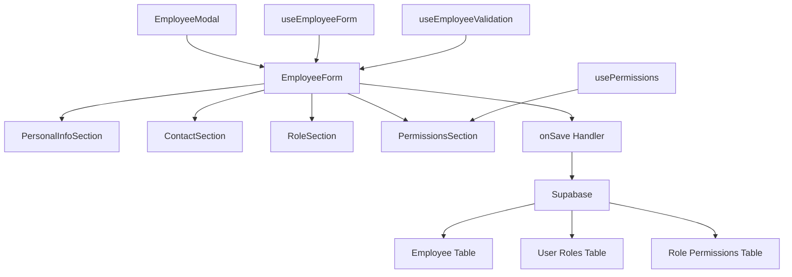
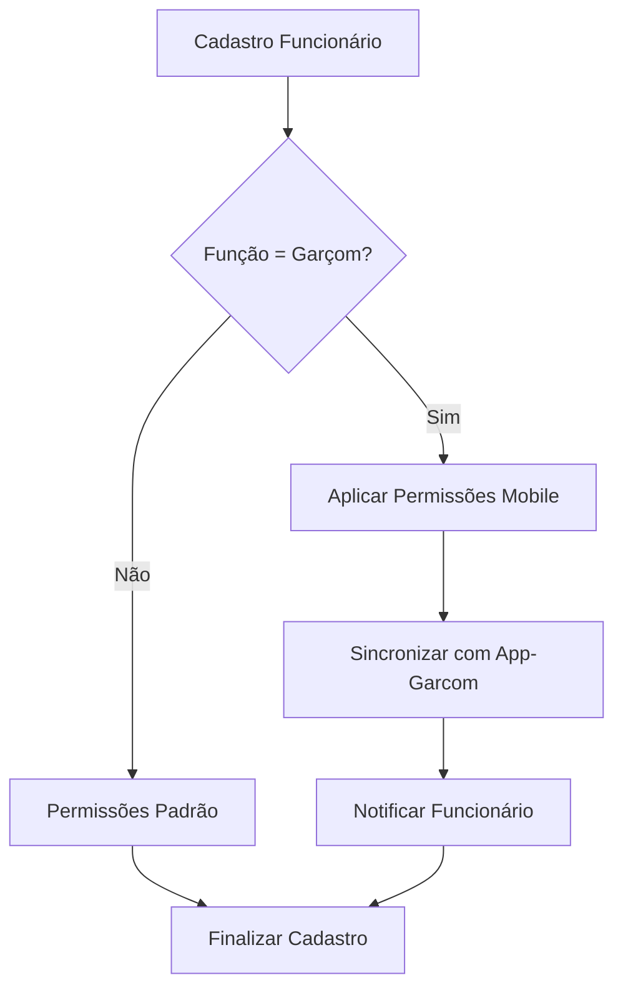

# Documento de Design - Melhorias no Modal de Cadastro de Funcionário

## Overview

O design proposto visa criar um modal de cadastro de funcionário moderno, responsivo e funcional que resolve os problemas atuais de rolagem e implementa um sistema robusto de permissões. A solução será baseada em componentes reutilizáveis, seguindo as melhores práticas de UX/UI e integração com o sistema de autenticação existente.

## Architecture

### Estrutura de Componentes

```
EmployeeModal/
├── EmployeeModal.tsx (Container principal)
├── components/
│   ├── EmployeeForm.tsx (Formulário principal)
│   ├── PersonalInfoSection.tsx (Dados pessoais)
│   ├── ContactSection.tsx (Informações de contato)
│   ├── RoleSection.tsx (Função e cargo)
│   ├── PermissionsSection.tsx (Sistema de permissões)
│   └── ValidationSummary.tsx (Resumo de validações)
├── hooks/
│   ├── useEmployeeForm.ts (Lógica do formulário)
│   ├── usePermissions.ts (Gerenciamento de permissões)
│   └── useEmployeeValidation.ts (Validações)
├── types/
│   ├── employee.types.ts (Tipos do funcionário)
│   └── permissions.types.ts (Tipos de permissões)
└── utils/
    ├── permissionPresets.ts (Perfis pré-definidos)
    └── validationRules.ts (Regras de validação)
```

### Fluxo de Dados



## Components and Interfaces

### EmployeeModal Component

```typescript
interface EmployeeModalProps {
  isOpen: boolean;
  onClose: () => void;
  onSave: (employee: Employee) => Promise<void>;
  employee?: Employee; // Para edição
  mode: 'create' | 'edit';
}

interface Employee {
  id?: string;
  name: string;
  email: string;
  cpf: string;
  phone: string;
  role: EmployeeRole;
  permissions: Permission[];
  status: 'active' | 'inactive';
  hireDate: Date;
  observations?: string;
}
```

### Sistema de Permissões

```typescript
interface Permission {
  id: string;
  module: ModuleType;
  action: ActionType;
  resource?: string;
}

type ModuleType = 
  | 'bar' 
  | 'kitchen' 
  | 'cashier' 
  | 'reports' 
  | 'inventory' 
  | 'customers' 
  | 'settings'
  | 'app-garcom'; // Módulo do aplicativo mobile

type ActionType = 
  | 'view' 
  | 'create' 
  | 'edit' 
  | 'delete' 
  | 'manage'
  | 'access'; // Para controle de acesso a aplicativos

interface RolePreset {
  role: EmployeeRole;
  permissions: Permission[];
  description: string;
}

type EmployeeRole = 
  | 'waiter' 
  | 'cook' 
  | 'cashier' 
  | 'supervisor' 
  | 'manager' 
  | 'admin';
```

### Layout Responsivo com Rolagem

```typescript
interface ModalLayoutProps {
  maxHeight: string;
  enableScroll: boolean;
  stickyHeader: boolean;
  stickyFooter: boolean;
}

const ModalLayout = styled.div<ModalLayoutProps>`
  max-height: ${props => props.maxHeight || '90vh'};
  overflow-y: ${props => props.enableScroll ? 'auto' : 'hidden'};
  display: flex;
  flex-direction: column;
  
  .modal-header {
    position: ${props => props.stickyHeader ? 'sticky' : 'static'};
    top: 0;
    z-index: 10;
    background: white;
    border-bottom: 1px solid #e5e7eb;
  }
  
  .modal-body {
    flex: 1;
    overflow-y: auto;
    padding: 1.5rem;
  }
  
  .modal-footer {
    position: ${props => props.stickyFooter ? 'sticky' : 'static'};
    bottom: 0;
    z-index: 10;
    background: white;
    border-top: 1px solid #e5e7eb;
  }
`;
```

## Integração com App-Garcom

### Controle de Acesso Mobile

Quando um funcionário é cadastrado como garçom, o sistema deve automaticamente:

1. **Conceder Permissões Mobile**: Aplicar permissões específicas para o app-garcom
2. **Sincronizar Credenciais**: Garantir que as credenciais funcionem no app mobile
3. **Configurar Perfil Mobile**: Definir configurações específicas do app

```typescript
interface MobileAppAccess {
  appName: 'app-garcom';
  hasAccess: boolean;
  permissions: MobilePermission[];
  deviceLimit?: number;
  lastSync?: Date;
}

interface MobilePermission {
  feature: 'tables' | 'orders' | 'menu' | 'customers' | 'payments';
  level: 'read' | 'write' | 'full';
}

const WAITER_MOBILE_PERMISSIONS: MobilePermission[] = [
  { feature: 'tables', level: 'full' },
  { feature: 'orders', level: 'full' },
  { feature: 'menu', level: 'read' },
  { feature: 'customers', level: 'write' },
  { feature: 'payments', level: 'read' }
];
```

### Fluxo de Sincronização



## Data Models

### Estrutura do Banco de Dados

```sql
-- Tabela de funcionários
CREATE TABLE employees (
  id UUID PRIMARY KEY DEFAULT gen_random_uuid(),
  company_id UUID REFERENCES companies(id) NOT NULL,
  name VARCHAR(255) NOT NULL,
  email VARCHAR(255) UNIQUE NOT NULL,
  cpf VARCHAR(14) UNIQUE NOT NULL,
  phone VARCHAR(20),
  role employee_role NOT NULL,
  status employee_status DEFAULT 'active',
  hire_date DATE NOT NULL,
  observations TEXT,
  created_at TIMESTAMP WITH TIME ZONE DEFAULT NOW(),
  updated_at TIMESTAMP WITH TIME ZONE DEFAULT NOW()
);

-- Enum para roles
CREATE TYPE employee_role AS ENUM (
  'waiter', 'cook', 'cashier', 'supervisor', 'manager', 'admin'
);

-- Enum para status
CREATE TYPE employee_status AS ENUM ('active', 'inactive', 'suspended');

-- Tabela de permissões por funcionário
CREATE TABLE employee_permissions (
  id UUID PRIMARY KEY DEFAULT gen_random_uuid(),
  employee_id UUID REFERENCES employees(id) ON DELETE CASCADE,
  module VARCHAR(50) NOT NULL,
  action VARCHAR(50) NOT NULL,
  resource VARCHAR(100),
  granted_by UUID REFERENCES employees(id),
  granted_at TIMESTAMP WITH TIME ZONE DEFAULT NOW(),
  UNIQUE(employee_id, module, action, resource)
);

-- Tabela de histórico de permissões
CREATE TABLE permission_history (
  id UUID PRIMARY KEY DEFAULT gen_random_uuid(),
  employee_id UUID REFERENCES employees(id),
  module VARCHAR(50) NOT NULL,
  action VARCHAR(50) NOT NULL,
  resource VARCHAR(100),
  operation VARCHAR(20) NOT NULL, -- 'granted', 'revoked'
  changed_by UUID REFERENCES employees(id),
  changed_at TIMESTAMP WITH TIME ZONE DEFAULT NOW()
);

-- Tabela de acesso a aplicativos mobile
CREATE TABLE mobile_app_access (
  id UUID PRIMARY KEY DEFAULT gen_random_uuid(),
  employee_id UUID REFERENCES employees(id) ON DELETE CASCADE,
  app_name VARCHAR(50) NOT NULL, -- 'app-garcom'
  has_access BOOLEAN DEFAULT false,
  device_limit INTEGER DEFAULT 2,
  last_sync TIMESTAMP WITH TIME ZONE,
  created_at TIMESTAMP WITH TIME ZONE DEFAULT NOW(),
  updated_at TIMESTAMP WITH TIME ZONE DEFAULT NOW(),
  UNIQUE(employee_id, app_name)
);

-- Tabela de permissões específicas do mobile
CREATE TABLE mobile_permissions (
  id UUID PRIMARY KEY DEFAULT gen_random_uuid(),
  mobile_access_id UUID REFERENCES mobile_app_access(id) ON DELETE CASCADE,
  feature VARCHAR(50) NOT NULL, -- 'tables', 'orders', 'menu', etc.
  permission_level VARCHAR(20) NOT NULL, -- 'read', 'write', 'full'
  created_at TIMESTAMP WITH TIME ZONE DEFAULT NOW(),
  UNIQUE(mobile_access_id, feature)
);
```

### Perfis de Permissão Pré-definidos

```typescript
const ROLE_PRESETS: Record<EmployeeRole, RolePreset> = {
  waiter: {
    role: 'waiter',
    description: 'Garçom - Atendimento e pedidos',
    permissions: [
      { module: 'bar', action: 'view' },
      { module: 'bar', action: 'create', resource: 'orders' },
      { module: 'bar', action: 'edit', resource: 'own_orders' },
      { module: 'customers', action: 'view' },
      { module: 'customers', action: 'create' },
      { module: 'app-garcom', action: 'access' }, // Acesso ao app mobile
      { module: 'app-garcom', action: 'manage', resource: 'tables' },
      { module: 'app-garcom', action: 'manage', resource: 'orders' }
    ]
  },
  cook: {
    role: 'cook',
    description: 'Cozinheiro - Preparo e cozinha',
    permissions: [
      { module: 'kitchen', action: 'view' },
      { module: 'kitchen', action: 'edit', resource: 'order_status' },
      { module: 'inventory', action: 'view' },
      { module: 'bar', action: 'view', resource: 'orders' }
    ]
  },
  cashier: {
    role: 'cashier',
    description: 'Caixa - Pagamentos e fechamento',
    permissions: [
      { module: 'cashier', action: 'view' },
      { module: 'cashier', action: 'manage' },
      { module: 'bar', action: 'view', resource: 'orders' },
      { module: 'reports', action: 'view', resource: 'daily_sales' }
    ]
  },
  supervisor: {
    role: 'supervisor',
    description: 'Supervisor - Supervisão operacional',
    permissions: [
      { module: 'bar', action: 'manage' },
      { module: 'kitchen', action: 'manage' },
      { module: 'cashier', action: 'view' },
      { module: 'reports', action: 'view' },
      { module: 'inventory', action: 'view' },
      { module: 'customers', action: 'manage' }
    ]
  },
  manager: {
    role: 'manager',
    description: 'Gerente - Gestão completa',
    permissions: [
      { module: 'bar', action: 'manage' },
      { module: 'kitchen', action: 'manage' },
      { module: 'cashier', action: 'manage' },
      { module: 'reports', action: 'manage' },
      { module: 'inventory', action: 'manage' },
      { module: 'customers', action: 'manage' },
      { module: 'settings', action: 'view' }
    ]
  },
  admin: {
    role: 'admin',
    description: 'Administrador - Acesso total',
    permissions: [
      { module: 'bar', action: 'manage' },
      { module: 'kitchen', action: 'manage' },
      { module: 'cashier', action: 'manage' },
      { module: 'reports', action: 'manage' },
      { module: 'inventory', action: 'manage' },
      { module: 'customers', action: 'manage' },
      { module: 'settings', action: 'manage' }
    ]
  }
};
```

## Error Handling

### Estratégia de Tratamento de Erros

```typescript
interface ValidationError {
  field: string;
  message: string;
  type: 'required' | 'format' | 'duplicate' | 'custom';
}

interface EmployeeFormErrors {
  general?: string;
  fields: ValidationError[];
}

const useEmployeeValidation = () => {
  const validateEmployee = (employee: Partial<Employee>): EmployeeFormErrors => {
    const errors: ValidationError[] = [];
    
    // Validação de campos obrigatórios
    if (!employee.name?.trim()) {
      errors.push({
        field: 'name',
        message: 'Nome é obrigatório',
        type: 'required'
      });
    }
    
    // Validação de CPF
    if (!employee.cpf || !isValidCPF(employee.cpf)) {
      errors.push({
        field: 'cpf',
        message: 'CPF inválido',
        type: 'format'
      });
    }
    
    // Validação de email
    if (!employee.email || !isValidEmail(employee.email)) {
      errors.push({
        field: 'email',
        message: 'Email inválido',
        type: 'format'
      });
    }
    
    return { fields: errors };
  };
  
  return { validateEmployee };
};
```

### Estados de Loading e Erro

```typescript
interface EmployeeModalState {
  loading: boolean;
  saving: boolean;
  errors: EmployeeFormErrors;
  isDirty: boolean;
  isValid: boolean;
}

const useEmployeeForm = () => {
  const [state, setState] = useState<EmployeeModalState>({
    loading: false,
    saving: false,
    errors: { fields: [] },
    isDirty: false,
    isValid: false
  });
  
  const handleSave = async (employee: Employee) => {
    setState(prev => ({ ...prev, saving: true }));
    
    try {
      // Salvar funcionário
      const savedEmployee = await saveEmployee(employee);
      
      // Se for garçom, configurar acesso ao app-garcom
      if (employee.role === 'waiter') {
        await configureMobileAccess(savedEmployee.id, 'app-garcom', WAITER_MOBILE_PERMISSIONS);
      }
      
      // Success handling
    } catch (error) {
      setState(prev => ({
        ...prev,
        errors: {
          general: 'Erro ao salvar funcionário. Tente novamente.',
          fields: []
        }
      }));
    } finally {
      setState(prev => ({ ...prev, saving: false }));
    }
  };
  
  const configureMobileAccess = async (
    employeeId: string, 
    appName: string, 
    permissions: MobilePermission[]
  ) => {
    // Criar registro de acesso mobile
    const mobileAccess = await supabase
      .from('mobile_app_access')
      .insert({
        employee_id: employeeId,
        app_name: appName,
        has_access: true,
        device_limit: 2
      })
      .select()
      .single();
    
    // Aplicar permissões específicas
    const permissionInserts = permissions.map(perm => ({
      mobile_access_id: mobileAccess.data.id,
      feature: perm.feature,
      permission_level: perm.level
    }));
    
    await supabase
      .from('mobile_permissions')
      .insert(permissionInserts);
  };
  
  return { state, handleSave };
};
```

## Testing Strategy

### Estrutura de Testes

```typescript
// __tests__/EmployeeModal.test.tsx
describe('EmployeeModal', () => {
  describe('Rendering', () => {
    it('should render modal when open', () => {
      render(<EmployeeModal isOpen={true} onClose={jest.fn()} onSave={jest.fn()} />);
      expect(screen.getByRole('dialog')).toBeInTheDocument();
    });
    
    it('should not render modal when closed', () => {
      render(<EmployeeModal isOpen={false} onClose={jest.fn()} onSave={jest.fn()} />);
      expect(screen.queryByRole('dialog')).not.toBeInTheDocument();
    });
  });
  
  describe('Scrolling', () => {
    it('should enable vertical scroll when content exceeds max height', () => {
      render(<EmployeeModal isOpen={true} onClose={jest.fn()} onSave={jest.fn()} />);
      const modalBody = screen.getByTestId('modal-body');
      expect(modalBody).toHaveStyle('overflow-y: auto');
    });
  });
  
  describe('Permissions', () => {
    it('should apply role preset when role is selected', () => {
      render(<EmployeeModal isOpen={true} onClose={jest.fn()} onSave={jest.fn()} />);
      
      const roleSelect = screen.getByLabelText('Função');
      fireEvent.change(roleSelect, { target: { value: 'waiter' } });
      
      expect(screen.getByText('Atendimento e pedidos')).toBeInTheDocument();
    });
  });
  
  describe('Validation', () => {
    it('should show validation errors for required fields', async () => {
      render(<EmployeeModal isOpen={true} onClose={jest.fn()} onSave={jest.fn()} />);
      
      const saveButton = screen.getByText('Salvar');
      fireEvent.click(saveButton);
      
      await waitFor(() => {
        expect(screen.getByText('Nome é obrigatório')).toBeInTheDocument();
      });
    });
  });
});
```

### Testes de Integração

```typescript
// __tests__/integration/EmployeeManagement.test.tsx
describe('Employee Management Integration', () => {
  it('should create employee with permissions and save to database', async () => {
    const mockSave = jest.fn();
    render(<EmployeeModal isOpen={true} onClose={jest.fn()} onSave={mockSave} />);
    
    // Preencher formulário
    fireEvent.change(screen.getByLabelText('Nome'), { 
      target: { value: 'João Silva' } 
    });
    fireEvent.change(screen.getByLabelText('Email'), { 
      target: { value: 'joao@example.com' } 
    });
    fireEvent.change(screen.getByLabelText('CPF'), { 
      target: { value: '123.456.789-00' } 
    });
    fireEvent.change(screen.getByLabelText('Função'), { 
      target: { value: 'waiter' } 
    });
    
    // Salvar
    fireEvent.click(screen.getByText('Salvar'));
    
    await waitFor(() => {
      expect(mockSave).toHaveBeenCalledWith(
        expect.objectContaining({
          name: 'João Silva',
          email: 'joao@example.com',
          role: 'waiter',
          permissions: expect.arrayContaining([
            expect.objectContaining({ module: 'bar', action: 'view' })
          ])
        })
      );
    });
  });
});
```

## Implementação de Acessibilidade

### Padrões ARIA

```typescript
const EmployeeModal: React.FC<EmployeeModalProps> = ({ isOpen, onClose }) => {
  return (
    <div
      role="dialog"
      aria-modal="true"
      aria-labelledby="employee-modal-title"
      aria-describedby="employee-modal-description"
      className={`fixed inset-0 z-50 ${isOpen ? 'block' : 'hidden'}`}
    >
      <div className="modal-overlay" onClick={onClose} />
      <div className="modal-container">
        <header className="modal-header">
          <h2 id="employee-modal-title">Cadastro de Funcionário</h2>
          <button
            aria-label="Fechar modal"
            onClick={onClose}
            className="close-button"
          >
            <X size={24} />
          </button>
        </header>
        
        <div 
          id="employee-modal-description" 
          className="sr-only"
        >
          Formulário para cadastro e edição de funcionários com definição de permissões
        </div>
        
        <main className="modal-body" tabIndex={-1}>
          <EmployeeForm />
        </main>
      </div>
    </div>
  );
};
```

### Navegação por Teclado

```typescript
const useKeyboardNavigation = (isOpen: boolean, onClose: () => void) => {
  useEffect(() => {
    if (!isOpen) return;
    
    const handleKeyDown = (event: KeyboardEvent) => {
      if (event.key === 'Escape') {
        onClose();
      }
      
      if (event.key === 'Tab') {
        // Implementar trap de foco dentro do modal
        trapFocus(event);
      }
    };
    
    document.addEventListener('keydown', handleKeyDown);
    return () => document.removeEventListener('keydown', handleKeyDown);
  }, [isOpen, onClose]);
};
```

## Performance e Otimização

### Lazy Loading de Componentes

```typescript
const PermissionsSection = lazy(() => import('./components/PermissionsSection'));
const ValidationSummary = lazy(() => import('./components/ValidationSummary'));

const EmployeeModal: React.FC<EmployeeModalProps> = (props) => {
  return (
    <div>
      {/* Componentes principais sempre carregados */}
      <PersonalInfoSection />
      <ContactSection />
      
      {/* Componentes secundários com lazy loading */}
      <Suspense fallback={<div>Carregando...</div>}>
        <PermissionsSection />
        <ValidationSummary />
      </Suspense>
    </div>
  );
};
```

### Memoização de Componentes

```typescript
const PermissionItem = memo<PermissionItemProps>(({ permission, onChange }) => {
  return (
    <div className="permission-item">
      <input
        type="checkbox"
        checked={permission.granted}
        onChange={(e) => onChange(permission.id, e.target.checked)}
      />
      <label>{permission.description}</label>
    </div>
  );
});
```

Este design garante uma experiência de usuário moderna, acessível e performática, resolvendo os problemas identificados no modal atual e implementando um sistema robusto de permissões.