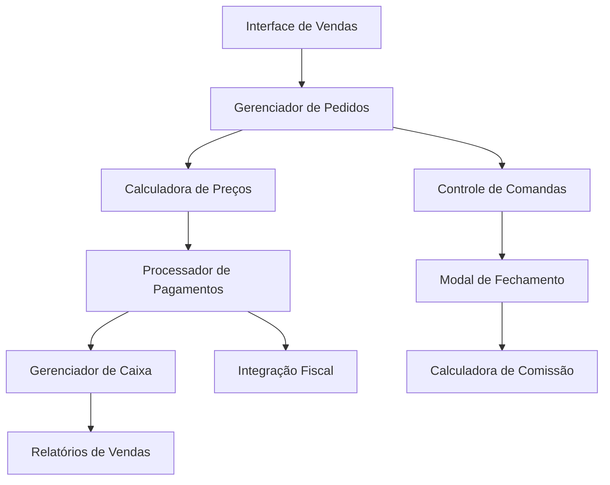
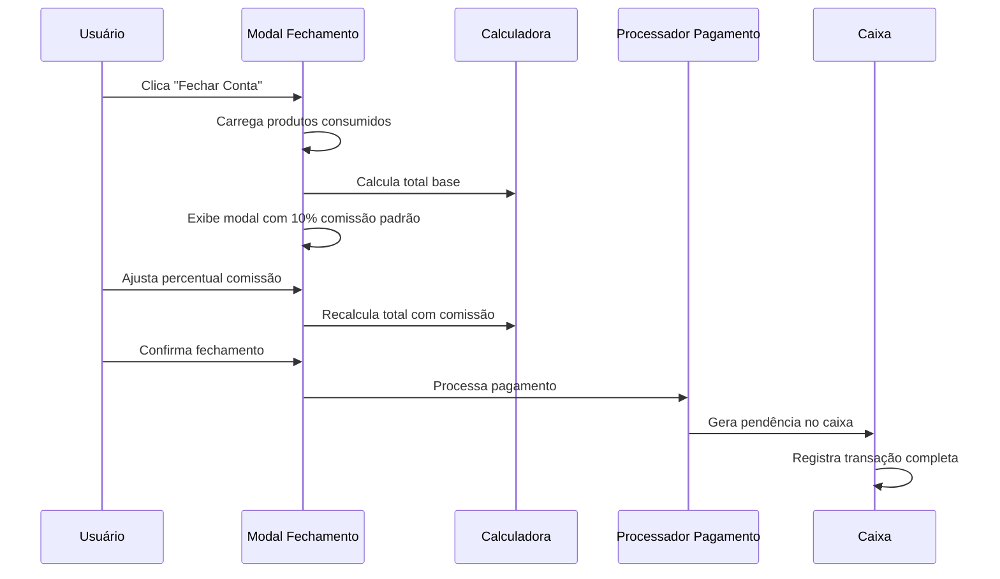

# Documento de Design - Módulo de Gestão de Vendas

## Visão Geral

O módulo de gestão de vendas é o sistema central para processamento de transações comerciais no ClubManager Pro. Este módulo gerencia todo o fluxo de vendas desde a seleção de produtos até o fechamento de caixa, incluindo múltiplas formas de pagamento, controle de comandas, comissões de garçom e integração fiscal.

## Arquitetura

### Componentes Principais



### Fluxo de Fechamento de Conta



## Componentes e Interfaces

### 1. Interface de Vendas (SalesInterface)

**Responsabilidades:**
- Exibir cardápio e produtos disponíveis
- Gerenciar seleção de itens
- Mostrar carrinho de compras em tempo real
- Integrar com controle de estoque

**Props/Estado:**
```typescript
interface SalesInterfaceState {
  selectedItems: CartItem[]
  currentTable?: Table
  currentCommand?: Command
  totalAmount: number
  availableProducts: Product[]
}
```

### 2. Gerenciador de Pedidos (OrderManager)

**Responsabilidades:**
- Processar adição/remoção de itens
- Validar disponibilidade em estoque
- Gerar números únicos de pedido
- Enviar pedidos para cozinha

**Métodos principais:**
```typescript
class OrderManager {
  addItem(productId: string, quantity: number): Promise<void>
  removeItem(itemId: string): Promise<void>
  validateStock(productId: string, quantity: number): Promise<boolean>
  generateOrderNumber(): string
  sendToKitchen(order: Order): Promise<void>
}
```

### 3. Modal de Fechamento de Conta (CloseAccountModal)

**Responsabilidades:**
- Exibir lista completa de produtos consumidos
- Mostrar totalizador geral
- Permitir ajuste de percentual de comissão (0-30%)
- Calcular valor final incluindo comissão
- Processar confirmação de fechamento

**Interface:**
```typescript
interface CloseAccountModalProps {
  command: Command
  onClose: () => void
  onConfirm: (paymentData: PaymentData) => void
}

interface PaymentData {
  totalAmount: number
  commissionPercentage: number
  commissionAmount: number
  paymentMethod: PaymentMethod
  observations?: string
}
```

### 4. Calculadora de Comissão (CommissionCalculator)

**Responsabilidades:**
- Calcular comissão baseada no percentual
- Validar limites de comissão (0-30%)
- Recalcular total quando percentual muda

**Métodos:**
```typescript
class CommissionCalculator {
  calculateCommission(baseAmount: number, percentage: number): number
  validatePercentage(percentage: number): boolean
  calculateTotal(baseAmount: number, commissionPercentage: number): number
}
```

### 5. Processador de Pagamentos (PaymentProcessor)

**Responsabilidades:**
- Gerenciar múltiplas formas de pagamento
- Integrar com terminais de cartão
- Gerar QR codes para PIX
- Validar crédito de membros
- Emitir comprovantes

**Interface:**
```typescript
interface PaymentProcessor {
  processPayment(paymentData: PaymentData): Promise<PaymentResult>
  generatePixQR(amount: number): Promise<string>
  validateMemberCredit(memberId: string, amount: number): Promise<boolean>
  issueReceipt(transaction: Transaction): Promise<Receipt>
}
```

### 6. Gerenciador de Caixa (CashManager)

**Responsabilidades:**
- Controlar abertura/fechamento de caixa
- Registrar todas as transações
- Gerenciar sangrias e suprimentos
- Calcular divergências
- Gerar pendências de pagamento

**Métodos principais:**
```typescript
class CashManager {
  openCash(initialAmount: number): Promise<CashSession>
  closeCash(): Promise<CashClosing>
  registerTransaction(transaction: Transaction): Promise<void>
  createPaymentPending(paymentData: PaymentData): Promise<Pending>
  calculateExpectedAmount(): number
}
```

## Modelos de Dados

### Command (Comanda)
```typescript
interface Command {
  id: string
  tableId?: string
  customerId?: string
  items: CommandItem[]
  status: 'open' | 'closed' | 'cancelled'
  openedAt: Date
  closedAt?: Date
  totalAmount: number
  waiterId?: string
}
```

### CommandItem
```typescript
interface CommandItem {
  id: string
  productId: string
  productName: string
  quantity: number
  unitPrice: number
  totalPrice: number
  addedAt: Date
  status: 'pending' | 'preparing' | 'ready' | 'served'
}
```

### PaymentPending
```typescript
interface PaymentPending {
  id: string
  commandId: string
  amount: number
  commissionPercentage: number
  commissionAmount: number
  paymentMethod: PaymentMethod
  status: 'pending' | 'paid' | 'cancelled'
  createdAt: Date
  paidAt?: Date
  observations?: string
}
```

### Transaction
```typescript
interface Transaction {
  id: string
  type: 'sale' | 'refund' | 'withdrawal' | 'deposit'
  amount: number
  paymentMethod: PaymentMethod
  commandId?: string
  cashSessionId: string
  processedAt: Date
  processedBy: string
  fiscalDocumentId?: string
}
```

## Tratamento de Erros

### Validações de Negócio
- **Estoque insuficiente**: Exibir mensagem clara e sugerir produtos alternativos
- **Comissão inválida**: Limitar entrada entre 0-30% com feedback visual
- **Pagamento falhou**: Permitir retry ou mudança de método
- **Caixa fechado**: Impedir vendas e exibir status do caixa

### Recuperação de Falhas
- **Conexão perdida**: Armazenar transações localmente e sincronizar quando reconectar
- **Erro fiscal**: Permitir reemissão de documentos fiscais
- **Falha no terminal**: Oferecer métodos alternativos de pagamento

## Estratégia de Testes

### Testes Unitários
- Calculadora de preços e comissões
- Validações de entrada
- Processamento de pagamentos
- Gerenciamento de estado das comandas

### Testes de Integração
- Fluxo completo de venda
- Integração com sistema fiscal
- Sincronização com estoque
- Processamento de múltiplas formas de pagamento

### Testes de Interface
- Modal de fechamento de conta
- Cálculo dinâmico de comissão
- Validação de campos de entrada
- Responsividade em diferentes dispositivos

### Cenários de Teste Específicos

#### Fechamento de Conta com Comissão
1. **Cenário padrão**: Comissão 10%, pagamento em dinheiro
2. **Comissão zerada**: Verificar cálculo correto com 0%
3. **Comissão máxima**: Testar com 30% de comissão
4. **Múltiplos itens**: Comanda com vários produtos e quantidades
5. **Diferentes métodos**: PIX, cartão, crédito de membro

#### Integração com Caixa
1. **Pendência criada**: Verificar registro correto no caixa
2. **Múltiplas pendências**: Gerenciar várias contas em aberto
3. **Fechamento de caixa**: Incluir pendências no cálculo final

## Considerações de Performance

### Otimizações
- Cache de produtos e preços
- Debounce em cálculos de comissão
- Lazy loading de histórico de comandas
- Compressão de dados fiscais

### Monitoramento
- Tempo de resposta do modal de fechamento
- Taxa de sucesso de pagamentos
- Performance de cálculos em comandas grandes
- Uso de memória durante picos de vendas