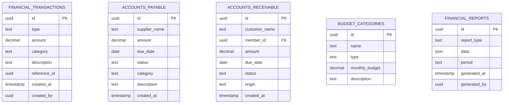

# Documento de Design - Módulo de Relatórios Financeiros

## Visão Geral

O módulo de relatórios financeiros é uma extensão crítica do ClubManager Pro que transforma dados operacionais em insights financeiros acionáveis. O design foca em visualizações interativas, análises em tempo real e integração com sistemas externos, utilizando bibliotecas modernas como Recharts para gráficos e implementando padrões de cache para performance otimizada.

## Arquitetura

### Componentes Principais

1. **FinancialDashboard**: Painel principal com KPIs e visão geral
2. **ReportsModule**: Módulo de relatórios detalhados
3. **AccountsPayable/Receivable**: Gestão de contas a pagar e receber
4. **ExportService**: Serviço de exportação de relatórios
5. **IntegrationService**: Integração com sistemas externos
6. **FinancialContext**: Contexto para gerenciamento de estado financeiro

### Arquitetura de Dados



## Componentes e Interfaces

### FinancialContext Interface

```typescript
interface FinancialContextType {
  // Transações
  transactions: FinancialTransaction[];
  addTransaction: (transaction: Omit<FinancialTransaction, 'id' | 'createdAt'>) => Promise<void>;
  
  // Contas a Pagar/Receber
  accountsPayable: AccountPayable[];
  accountsReceivable: AccountReceivable[];
  addAccountPayable: (account: Omit<AccountPayable, 'id' | 'createdAt'>) => Promise<void>;
  addAccountReceivable: (account: Omit<AccountReceivable, 'id' | 'createdAt'>) => Promise<void>;
  updateAccountStatus: (id: string, status: 'pending' | 'paid' | 'overdue') => Promise<void>;
  
  // Relatórios
  generateReport: (type: ReportType, period: DateRange) => Promise<FinancialReport>;
  exportReport: (report: FinancialReport, format: 'pdf' | 'csv') => Promise<Blob>;
  
  // KPIs
  getKPIs: (period: DateRange) => Promise<FinancialKPIs>;
  
  // Cache e Performance
  isLoading: boolean;
  lastUpdated: Date;
}
```

### Interfaces de Dados

```typescript
interface FinancialTransaction {
  id: string;
  type: 'income' | 'expense';
  amount: number;
  category: string;
  description: string;
  referenceId?: string; // ID do pedido, membro, etc.
  createdAt: Date;
  createdBy: string;
}

interface AccountPayable {
  id: string;
  supplierName: string;
  amount: number;
  dueDate: Date;
  status: 'pending' | 'paid' | 'overdue';
  category: string;
  description: string;
  createdAt: Date;
}

interface FinancialKPIs {
  totalRevenue: number;
  totalExpenses: number;
  netProfit: number;
  profitMargin: number;
  cashFlow: number;
  accountsPayableTotal: number;
  accountsReceivableTotal: number;
  overdueAccounts: number;
}
```

## Modelos de Dados

### Tabela Financial Transactions

```sql
CREATE TABLE public.financial_transactions (
  id UUID PRIMARY KEY DEFAULT gen_random_uuid(),
  type TEXT NOT NULL CHECK (type IN ('income', 'expense')),
  amount DECIMAL(12, 2) NOT NULL,
  category TEXT NOT NULL,
  description TEXT,
  reference_id UUID, -- Referência para orders, members, etc.
  reference_type TEXT, -- 'order', 'member', 'supplier', etc.
  created_at TIMESTAMPTZ NOT NULL DEFAULT NOW(),
  created_by UUID REFERENCES public.profiles(id)
);
```

### Tabela Accounts Payable

```sql
CREATE TABLE public.accounts_payable (
  id UUID PRIMARY KEY DEFAULT gen_random_uuid(),
  supplier_name TEXT NOT NULL,
  amount DECIMAL(12, 2) NOT NULL,
  due_date DATE NOT NULL,
  status TEXT NOT NULL DEFAULT 'pending' CHECK (status IN ('pending', 'paid', 'overdue')),
  category TEXT NOT NULL,
  description TEXT,
  paid_date DATE,
  created_at TIMESTAMPTZ NOT NULL DEFAULT NOW(),
  created_by UUID REFERENCES public.profiles(id)
);
```

### Tabela Accounts Receivable

```sql
CREATE TABLE public.accounts_receivable (
  id UUID PRIMARY KEY DEFAULT gen_random_uuid(),
  customer_name TEXT NOT NULL,
  member_id UUID REFERENCES public.members(id),
  amount DECIMAL(12, 2) NOT NULL,
  due_date DATE NOT NULL,
  status TEXT NOT NULL DEFAULT 'pending' CHECK (status IN ('pending', 'paid', 'overdue')),
  origin TEXT NOT NULL, -- 'membership', 'event', 'service', etc.
  description TEXT,
  paid_date DATE,
  created_at TIMESTAMPTZ NOT NULL DEFAULT NOW(),
  created_by UUID REFERENCES public.profiles(id)
);
```

## Visualizações e Gráficos

### Dashboard Financeiro

1. **KPI Cards**: Receita, Despesas, Lucro Líquido, Margem de Lucro
2. **Gráfico de Linha**: Evolução da receita ao longo do tempo
3. **Gráfico de Pizza**: Distribuição de receita por categoria
4. **Gráfico de Barras**: Comparação mensal de receitas vs despesas
5. **Lista de Alertas**: Contas vencidas e indicadores críticos

### Relatórios Detalhados

1. **Relatório de Vendas por Produto**
   - Tabela com ranking de produtos
   - Gráfico de barras horizontais
   - Filtros por categoria e período

2. **Análise de Fluxo de Caixa**
   - Gráfico de linha com entradas e saídas
   - Projeções futuras baseadas em contas a pagar/receber
   - Indicadores de liquidez

3. **Relatório de Custos Operacionais**
   - Gráfico de pizza por categoria de custo
   - Comparação com orçamento planejado
   - Tendências de crescimento de custos

## Tratamento de Erros

### Estratégias de Erro

1. **Dados Insuficientes**: Exibir mensagens informativas quando não há dados
2. **Erro de Cálculo**: Validação de dados antes de processamento
3. **Falha na Exportação**: Retry automático e fallback para formatos alternativos
4. **Erro de Integração**: Queue de retry e notificação de administradores

### Validações

1. **Valores Monetários**: Validação de formato e limites razoáveis
2. **Datas**: Verificação de períodos válidos e consistência
3. **Categorias**: Validação contra lista pré-definida
4. **Permissões**: Verificação de acesso baseada em roles

## Estratégia de Testes

### Testes Unitários

1. **Cálculos Financeiros**: Testar todas as fórmulas de KPIs
2. **Formatação de Dados**: Validar formatação de moeda e datas
3. **Filtros e Agregações**: Testar lógica de filtragem de dados
4. **Validações**: Testar todas as regras de validação

### Testes de Integração

1. **Fluxo de Geração de Relatórios**: Do request até a exibição
2. **Exportação**: Testar geração de PDF e CSV
3. **Sincronização de Dados**: Testar atualizações em tempo real
4. **Cache**: Verificar invalidação e atualização de cache

### Testes E2E

1. **Cenário Completo**: Criar transação → Visualizar relatório → Exportar
2. **Gestão de Contas**: Adicionar conta → Marcar como paga → Verificar KPIs
3. **Filtros e Períodos**: Testar todas as combinações de filtros

## Performance e Otimização

### Estratégias de Cache

1. **Cache de Relatórios**: Armazenar relatórios gerados por período
2. **Cache de KPIs**: Atualização incremental de indicadores
3. **Lazy Loading**: Carregar dados sob demanda
4. **Pagination**: Para listas grandes de transações

### Otimizações de Banco

```sql
-- Índices para performance
CREATE INDEX idx_financial_transactions_date ON financial_transactions(created_at);
CREATE INDEX idx_financial_transactions_category ON financial_transactions(category);
CREATE INDEX idx_accounts_payable_due_date ON accounts_payable(due_date);
CREATE INDEX idx_accounts_receivable_due_date ON accounts_receivable(due_date);
```

### Agregações Pré-calculadas

```sql
-- View para KPIs diários
CREATE VIEW daily_financial_summary AS
SELECT 
  DATE(created_at) as date,
  SUM(CASE WHEN type = 'income' THEN amount ELSE 0 END) as daily_revenue,
  SUM(CASE WHEN type = 'expense' THEN amount ELSE 0 END) as daily_expenses,
  COUNT(*) as transaction_count
FROM financial_transactions
GROUP BY DATE(created_at);
```

## Segurança

### Políticas RLS

```sql
-- Acesso baseado em roles
CREATE POLICY "Financial data access" ON financial_transactions
FOR ALL USING (
  public.get_my_role() IN ('admin', 'manager') OR
  (public.get_my_role() = 'employee' AND created_by = auth.uid())
);

-- Auditoria de mudanças
CREATE POLICY "Audit trail" ON accounts_payable
FOR UPDATE USING (public.get_my_role() IN ('admin', 'manager'));
```

### Auditoria

1. **Log de Alterações**: Registrar todas as modificações financeiras
2. **Trilha de Aprovação**: Para transações acima de valores específicos
3. **Backup Automático**: Backup diário de dados financeiros
4. **Controle de Acesso**: Logs detalhados de quem acessou quais relatórios