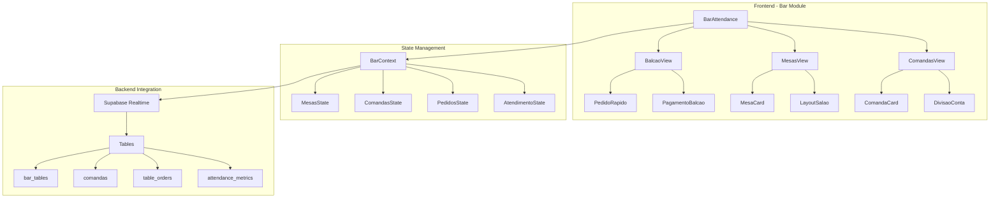
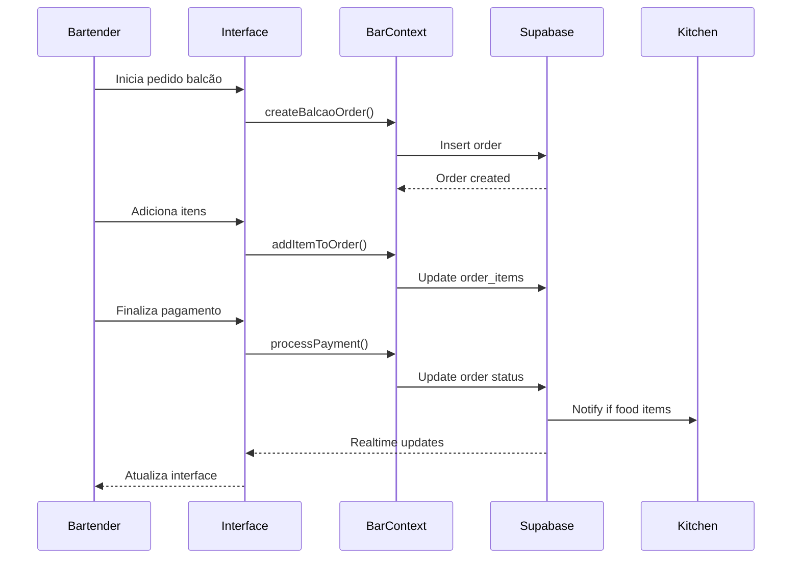

# Documento de Design - Sistema de Atendimento no Bar

## Visão Geral

O Sistema de Atendimento no Bar é um módulo especializado que expande as funcionalidades existentes do ClubManager Pro, focando na otimização do fluxo de trabalho presencial. O design prioriza interface intuitiva, performance em tempo real e integração seamless com os módulos existentes de vendas, estoque e cozinha.

## Arquitetura

### Arquitetura de Componentes



### Fluxo de Dados



## Componentes e Interfaces

### 1. Componente Principal - BarAttendance

```typescript
interface BarAttendanceProps {
  user: User;
  onModeChange: (mode: 'balcao' | 'mesas' | 'comandas') => void;
}

const BarAttendance: React.FC<BarAttendanceProps> = ({ user, onModeChange }) => {
  const [activeMode, setActiveMode] = useState<'balcao' | 'mesas' | 'comandas'>('balcao');
  const { mesas, comandas, pedidos, metrics } = useBarAttendance();
  
  return (
    <div className="bar-attendance-container">
      <BarHeader mode={activeMode} onModeChange={setActiveMode} metrics={metrics} />
      <BarContent mode={activeMode} />
      <BarNotifications />
    </div>
  );
};
```

### 2. Gestão de Mesas - MesasView

```typescript
interface Mesa {
  id: string;
  number: string;
  capacity: number;
  status: 'available' | 'occupied' | 'reserved' | 'cleaning';
  currentComanda?: string;
  occupiedSince?: Date;
  reservedFor?: Date;
  position: { x: number; y: number };
}

interface MesasViewProps {
  mesas: Mesa[];
  onMesaSelect: (mesa: Mesa) => void;
  onMesaAction: (mesaId: string, action: MesaAction) => void;
}

const MesasView: React.FC<MesasViewProps> = ({ mesas, onMesaSelect, onMesaAction }) => {
  return (
    <div className="mesas-container">
      <MesasToolbar />
      <LayoutSalao mesas={mesas} onMesaClick={onMesaSelect} />
      <MesasLegend />
    </div>
  );
};
```

### 3. Sistema de Comandas - ComandasView

```typescript
interface Comanda {
  id: string;
  mesaId?: string;
  customerName?: string;
  items: ComandaItem[];
  status: 'open' | 'pending_payment' | 'closed';
  openedAt: Date;
  total: number;
  employeeId: string;
  notes?: string;
}

interface ComandaItem {
  id: string;
  menuItemId: string;
  quantity: number;
  price: number;
  addedAt: Date;
  status: 'pending' | 'preparing' | 'ready' | 'delivered';
  notes?: string;
}

const ComandasView: React.FC = () => {
  const { comandas, addItemToComanda, closeComanda, splitBill } = useComandas();
  
  return (
    <div className="comandas-container">
      <ComandasHeader />
      <ComandasGrid comandas={comandas} />
      <ComandaModal />
    </div>
  );
};
```

### 4. Pedido Rápido - BalcaoView

```typescript
interface PedidoRapido {
  items: OrderItem[];
  customer?: Member;
  paymentMethod?: PaymentMethod;
  total: number;
  discounts: Discount[];
}

const BalcaoView: React.FC = () => {
  const [pedidoAtual, setPedidoAtual] = useState<PedidoRapido | null>(null);
  const { menuItems, processBalcaoOrder } = useBarAttendance();
  
  return (
    <div className="balcao-container">
      <MenuGrid items={menuItems} onItemSelect={addToCurrentOrder} />
      <PedidoSummary pedido={pedidoAtual} />
      <PaymentPanel onPayment={processBalcaoOrder} />
    </div>
  );
};
```

## Modelos de Dados

### Tabelas do Banco de Dados

```sql
-- Tabela de mesas do bar
CREATE TABLE bar_tables (
  id UUID PRIMARY KEY DEFAULT gen_random_uuid(),
  number VARCHAR(10) NOT NULL UNIQUE,
  capacity INTEGER NOT NULL,
  position_x FLOAT,
  position_y FLOAT,
  status VARCHAR(20) DEFAULT 'available',
  created_at TIMESTAMPTZ DEFAULT NOW()
);

-- Tabela de comandas
CREATE TABLE comandas (
  id UUID PRIMARY KEY DEFAULT gen_random_uuid(),
  table_id UUID REFERENCES bar_tables(id),
  customer_name VARCHAR(255),
  employee_id UUID REFERENCES profiles(id),
  status VARCHAR(20) DEFAULT 'open',
  total DECIMAL(10,2) DEFAULT 0,
  opened_at TIMESTAMPTZ DEFAULT NOW(),
  closed_at TIMESTAMPTZ,
  notes TEXT
);

-- Itens da comanda
CREATE TABLE comanda_items (
  id UUID PRIMARY KEY DEFAULT gen_random_uuid(),
  comanda_id UUID REFERENCES comandas(id) ON DELETE CASCADE,
  menu_item_id UUID REFERENCES menu_items(id),
  quantity INTEGER NOT NULL,
  price DECIMAL(10,2) NOT NULL,
  status VARCHAR(20) DEFAULT 'pending',
  added_at TIMESTAMPTZ DEFAULT NOW(),
  notes TEXT
);

-- Métricas de atendimento
CREATE TABLE attendance_metrics (
  id UUID PRIMARY KEY DEFAULT gen_random_uuid(),
  employee_id UUID REFERENCES profiles(id),
  date DATE DEFAULT CURRENT_DATE,
  orders_count INTEGER DEFAULT 0,
  avg_service_time INTERVAL,
  total_sales DECIMAL(10,2) DEFAULT 0,
  customer_satisfaction DECIMAL(3,2),
  created_at TIMESTAMPTZ DEFAULT NOW()
);

-- Divisão de contas
CREATE TABLE bill_splits (
  id UUID PRIMARY KEY DEFAULT gen_random_uuid(),
  comanda_id UUID REFERENCES comandas(id),
  split_type VARCHAR(20), -- 'equal', 'by_item', 'by_person'
  person_count INTEGER,
  splits JSONB, -- Detalhes da divisão
  created_at TIMESTAMPTZ DEFAULT NOW()
);
```

### Hooks Customizados

```typescript
// Hook principal para gerenciamento do bar
const useBarAttendance = () => {
  const [mesas, setMesas] = useState<Mesa[]>([]);
  const [comandas, setComandasState] = useState<Comanda[]>([]);
  const [metrics, setMetrics] = useState<AttendanceMetrics | null>(null);
  
  // Realtime subscriptions
  useEffect(() => {
    const mesasChannel = supabase
      .channel('bar-tables')
      .on('postgres_changes', { event: '*', schema: 'public', table: 'bar_tables' }, 
          handleMesasChange)
      .subscribe();
      
    const comandasChannel = supabase
      .channel('comandas')
      .on('postgres_changes', { event: '*', schema: 'public', table: 'comandas' }, 
          handleComandasChange)
      .subscribe();
      
    return () => {
      supabase.removeChannel(mesasChannel);
      supabase.removeChannel(comandasChannel);
    };
  }, []);
  
  const openComanda = async (mesaId?: string, customerName?: string) => {
    // Implementação
  };
  
  const addItemToComanda = async (comandaId: string, item: OrderItem) => {
    // Implementação
  };
  
  const processBalcaoOrder = async (order: PedidoRapido) => {
    // Implementação
  };
  
  return {
    mesas,
    comandas,
    metrics,
    openComanda,
    addItemToComanda,
    processBalcaoOrder,
    // ... outras funções
  };
};

// Hook para gestão de comandas
const useComandas = () => {
  const { comandas } = useBarAttendance();
  
  const splitBill = async (comandaId: string, splitConfig: BillSplitConfig) => {
    // Implementação da divisão de conta
  };
  
  const closeComanda = async (comandaId: string, paymentDetails: PaymentDetails[]) => {
    // Implementação do fechamento
  };
  
  return {
    comandas,
    splitBill,
    closeComanda
  };
};
```

## Estratégia de Testes

### Testes Unitários
```typescript
// Exemplo de teste para hook useBarAttendance
describe('useBarAttendance', () => {
  test('should open new comanda correctly', async () => {
    const { result } = renderHook(() => useBarAttendance());
    
    await act(async () => {
      await result.current.openComanda('mesa-1', 'João Silva');
    });
    
    expect(result.current.comandas).toHaveLength(1);
    expect(result.current.comandas[0].customerName).toBe('João Silva');
  });
  
  test('should calculate bill split correctly', () => {
    const comanda = createMockComanda();
    const splitConfig = { type: 'equal', personCount: 3 };
    
    const result = calculateBillSplit(comanda, splitConfig);
    
    expect(result.splits).toHaveLength(3);
    expect(result.splits[0].amount).toBe(comanda.total / 3);
  });
});
```

### Testes de Integração
```typescript
describe('Bar Attendance Integration', () => {
  test('should sync comanda updates in real-time', async () => {
    // Teste de sincronização em tempo real
  });
  
  test('should integrate with kitchen module', async () => {
    // Teste de integração com cozinha
  });
});
```

## Considerações de Performance

### Otimizações
1. **Lazy Loading**: Carregar comandas sob demanda
2. **Memoização**: Usar React.memo para componentes de mesa
3. **Debounce**: Para atualizações de pedidos em tempo real
4. **Virtual Scrolling**: Para listas grandes de comandas
5. **Caching**: Cache local para dados frequentemente acessados

### Métricas de Performance
- Tempo de resposta para criar pedido: < 500ms
- Atualização em tempo real: < 100ms
- Carregamento inicial: < 2s
- Sincronização entre dispositivos: < 200ms

## Integração com Módulos Existentes

### Módulo de Vendas
- Reutilizar lógica de processamento de pagamentos
- Integrar com sistema de descontos existente
- Compartilhar dados de vendas para relatórios

### Módulo de Estoque
- Verificação automática de disponibilidade
- Atualização de estoque em tempo real
- Alertas de produtos em falta

### Módulo de Cozinha
- Envio automático de pedidos de comida
- Recebimento de status de preparo
- Notificações de pratos prontos

## Considerações de UX/UI

### Design Responsivo
- Layout adaptável para tablets e desktops
- Botões grandes para facilitar uso em ambiente de trabalho
- Cores intuitivas para status (verde=disponível, vermelho=ocupado)

### Acessibilidade
- Suporte a navegação por teclado
- Alto contraste para ambientes com pouca luz
- Feedback sonoro para ações críticas

### Fluxo de Trabalho
- Minimizar cliques para ações frequentes
- Atalhos de teclado para bartenders experientes
- Confirmações apenas para ações irreversíveis