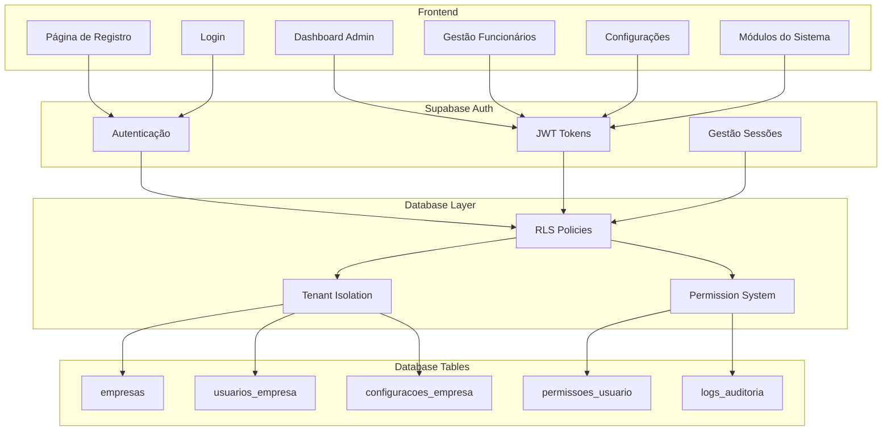
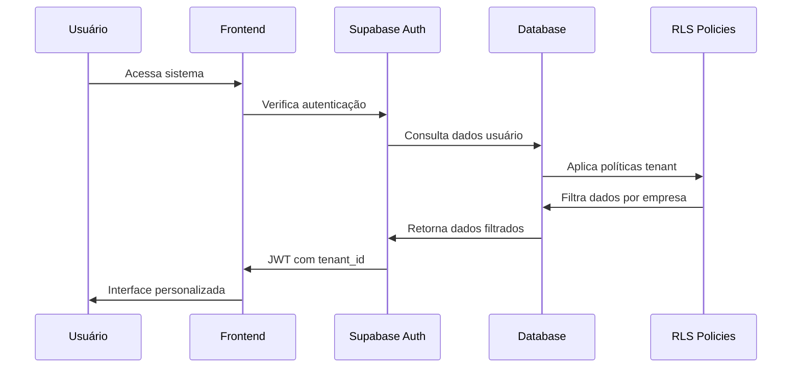
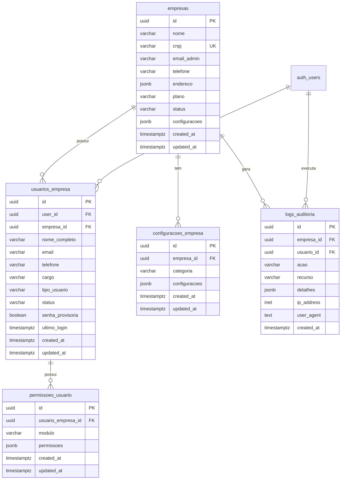

# Design Document

## Overview

Este documento descreve o design técnico para um sistema completo de autenticação e gerenciamento de usuários multitenant. O sistema implementará isolamento total de dados entre empresas (tenants), controle granular de permissões por módulos, e funcionalidades administrativas robustas para cada empresa.

O design utiliza Supabase Auth como base, combinado com Row Level Security (RLS) do PostgreSQL para garantir isolamento de dados e segurança. Cada empresa terá seu próprio espaço isolado no sistema, com um administrador principal e usuários com diferentes níveis de acesso.

## Architecture

### Arquitetura Geral



### Fluxo de Autenticação Multitenant



## Components and Interfaces

### 1. Sistema de Empresas (Tenants)

#### Tabela `empresas`
```sql
CREATE TABLE empresas (
  id UUID PRIMARY KEY DEFAULT gen_random_uuid(),
  nome VARCHAR(255) NOT NULL,
  cnpj VARCHAR(18) UNIQUE NOT NULL,
  email_admin VARCHAR(255) NOT NULL,
  telefone VARCHAR(20),
  endereco JSONB,
  plano VARCHAR(50) DEFAULT 'basico',
  status VARCHAR(20) DEFAULT 'ativo',
  configuracoes JSONB DEFAULT '{}',
  created_at TIMESTAMPTZ DEFAULT NOW(),
  updated_at TIMESTAMPTZ DEFAULT NOW()
);
```

#### Interface TypeScript
```typescript
interface Empresa {
  id: string;
  nome: string;
  cnpj: string;
  email_admin: string;
  telefone?: string;
  endereco?: {
    rua: string;
    numero: string;
    cidade: string;
    estado: string;
    cep: string;
  };
  plano: 'basico' | 'premium' | 'enterprise';
  status: 'ativo' | 'inativo' | 'suspenso';
  configuracoes: Record<string, any>;
  created_at: string;
  updated_at: string;
}
```

### 2. Sistema de Usuários da Empresa

#### Tabela `usuarios_empresa`
```sql
CREATE TABLE usuarios_empresa (
  id UUID PRIMARY KEY DEFAULT gen_random_uuid(),
  user_id UUID REFERENCES auth.users(id) ON DELETE CASCADE,
  empresa_id UUID REFERENCES empresas(id) ON DELETE CASCADE,
  nome_completo VARCHAR(255) NOT NULL,
  email VARCHAR(255) NOT NULL,
  telefone VARCHAR(20),
  cargo VARCHAR(100),
  tipo_usuario VARCHAR(20) DEFAULT 'funcionario',
  status VARCHAR(20) DEFAULT 'ativo',
  senha_provisoria BOOLEAN DEFAULT FALSE,
  ultimo_login TIMESTAMPTZ,
  created_at TIMESTAMPTZ DEFAULT NOW(),
  updated_at TIMESTAMPTZ DEFAULT NOW(),
  UNIQUE(user_id, empresa_id)
);
```

#### Interface TypeScript
```typescript
interface UsuarioEmpresa {
  id: string;
  user_id: string;
  empresa_id: string;
  nome_completo: string;
  email: string;
  telefone?: string;
  cargo?: string;
  tipo_usuario: 'administrador' | 'funcionario';
  status: 'ativo' | 'inativo' | 'bloqueado';
  senha_provisoria: boolean;
  ultimo_login?: string;
  created_at: string;
  updated_at: string;
}
```

### 3. Sistema de Permissões

#### Tabela `permissoes_usuario`
```sql
CREATE TABLE permissoes_usuario (
  id UUID PRIMARY KEY DEFAULT gen_random_uuid(),
  usuario_empresa_id UUID REFERENCES usuarios_empresa(id) ON DELETE CASCADE,
  modulo VARCHAR(50) NOT NULL,
  permissoes JSONB DEFAULT '{}',
  created_at TIMESTAMPTZ DEFAULT NOW(),
  updated_at TIMESTAMPTZ DEFAULT NOW(),
  UNIQUE(usuario_empresa_id, modulo)
);
```

#### Módulos do Sistema
```typescript
enum Modulos {
  DASHBOARD = 'dashboard',
  MONITOR_BAR = 'monitor_bar',
  ATENDIMENTO_BAR = 'atendimento_bar',
  MONITOR_COZINHA = 'monitor_cozinha',
  GESTAO_CAIXA = 'gestao_caixa',
  CLIENTES = 'clientes',
  FUNCIONARIOS = 'funcionarios',
  SOCIOS = 'socios',
  CONFIGURACOES = 'configuracoes',
  RELATORIOS = 'relatorios'
}

interface PermissaoModulo {
  visualizar: boolean;
  criar: boolean;
  editar: boolean;
  excluir: boolean;
  administrar?: boolean;
}
```

### 4. Sistema de Configurações

#### Tabela `configuracoes_empresa`
```sql
CREATE TABLE configuracoes_empresa (
  id UUID PRIMARY KEY DEFAULT gen_random_uuid(),
  empresa_id UUID REFERENCES empresas(id) ON DELETE CASCADE,
  categoria VARCHAR(50) NOT NULL,
  configuracoes JSONB NOT NULL DEFAULT '{}',
  created_at TIMESTAMPTZ DEFAULT NOW(),
  updated_at TIMESTAMPTZ DEFAULT NOW(),
  UNIQUE(empresa_id, categoria)
);
```

#### Categorias de Configuração
```typescript
interface ConfiguracoesEmpresa {
  seguranca: {
    tempo_sessao: number;
    tentativas_login: number;
    bloqueio_temporario: number;
    exigir_2fa: boolean;
  };
  sistema: {
    tema: 'claro' | 'escuro' | 'auto';
    idioma: string;
    timezone: string;
    formato_data: string;
  };
  notificacoes: {
    email_novos_usuarios: boolean;
    email_tentativas_login: boolean;
    email_alteracoes_config: boolean;
  };
  integracao: {
    webhook_url?: string;
    api_keys: Record<string, string>;
  };
}
```

### 5. Sistema de Auditoria

#### Tabela `logs_auditoria`
```sql
CREATE TABLE logs_auditoria (
  id UUID PRIMARY KEY DEFAULT gen_random_uuid(),
  empresa_id UUID REFERENCES empresas(id) ON DELETE CASCADE,
  usuario_id UUID REFERENCES auth.users(id),
  acao VARCHAR(100) NOT NULL,
  recurso VARCHAR(100),
  detalhes JSONB,
  ip_address INET,
  user_agent TEXT,
  created_at TIMESTAMPTZ DEFAULT NOW()
);
```

## Data Models

### Modelo de Dados Completo



## Error Handling

### Estratégia de Tratamento de Erros

#### 1. Erros de Autenticação
```typescript
enum AuthErrors {
  INVALID_CREDENTIALS = 'INVALID_CREDENTIALS',
  ACCOUNT_LOCKED = 'ACCOUNT_LOCKED',
  PASSWORD_EXPIRED = 'PASSWORD_EXPIRED',
  TENANT_NOT_FOUND = 'TENANT_NOT_FOUND',
  INSUFFICIENT_PERMISSIONS = 'INSUFFICIENT_PERMISSIONS'
}

interface AuthError {
  code: AuthErrors;
  message: string;
  details?: Record<string, any>;
  timestamp: string;
}
```

#### 2. Erros de Validação
```typescript
interface ValidationError {
  field: string;
  code: string;
  message: string;
  value?: any;
}

interface ValidationResult {
  valid: boolean;
  errors: ValidationError[];
}
```

#### 3. Tratamento de Erros RLS
```sql
-- Função para capturar erros de RLS
CREATE OR REPLACE FUNCTION handle_rls_error()
RETURNS TRIGGER AS $$
BEGIN
  -- Log da tentativa de acesso negado
  INSERT INTO logs_auditoria (
    empresa_id,
    usuario_id,
    acao,
    recurso,
    detalhes,
    ip_address
  ) VALUES (
    COALESCE(NEW.empresa_id, OLD.empresa_id),
    auth.uid(),
    'ACCESS_DENIED',
    TG_TABLE_NAME,
    jsonb_build_object('operation', TG_OP),
    inet_client_addr()
  );
  
  RAISE EXCEPTION 'Acesso negado: dados não encontrados ou sem permissão';
END;
$$ LANGUAGE plpgsql;
```

## Testing Strategy

### 1. Testes de Unidade
- Validação de funções de autenticação
- Testes de políticas RLS
- Validação de permissões por módulo
- Testes de configurações de empresa

### 2. Testes de Integração
- Fluxo completo de registro de empresa
- Processo de criação de usuários
- Sistema de permissões end-to-end
- Integração com Supabase Auth

### 3. Testes de Segurança
- Tentativas de acesso cross-tenant
- Validação de isolamento de dados
- Testes de força bruta
- Verificação de logs de auditoria

### 4. Testes de Performance
- Consultas com RLS em grandes volumes
- Performance de autenticação
- Otimização de índices
- Carga de usuários simultâneos

### Estrutura de Testes
```typescript
describe('Sistema Multitenant', () => {
  describe('Isolamento de Dados', () => {
    it('deve impedir acesso cross-tenant', async () => {
      // Teste de isolamento
    });
    
    it('deve aplicar RLS corretamente', async () => {
      // Teste de RLS
    });
  });
  
  describe('Sistema de Permissões', () => {
    it('deve validar permissões por módulo', async () => {
      // Teste de permissões
    });
    
    it('deve negar acesso sem permissão', async () => {
      // Teste de negação
    });
  });
});
```

## Row Level Security Policies

### Políticas RLS Principais

#### 1. Isolamento por Empresa
```sql
-- Política para tabela empresas
CREATE POLICY "Empresa pode ver apenas seus dados"
ON empresas FOR ALL
TO authenticated
USING (
  id IN (
    SELECT empresa_id 
    FROM usuarios_empresa 
    WHERE user_id = auth.uid()
  )
);

-- Política para usuarios_empresa
CREATE POLICY "Usuários veem apenas colegas da empresa"
ON usuarios_empresa FOR ALL
TO authenticated
USING (
  empresa_id IN (
    SELECT empresa_id 
    FROM usuarios_empresa 
    WHERE user_id = auth.uid()
  )
);
```

#### 2. Controle de Permissões
```sql
-- Função para verificar permissões
CREATE OR REPLACE FUNCTION tem_permissao(modulo TEXT, acao TEXT)
RETURNS BOOLEAN AS $$
BEGIN
  RETURN EXISTS (
    SELECT 1 
    FROM permissoes_usuario pu
    JOIN usuarios_empresa ue ON pu.usuario_empresa_id = ue.id
    WHERE ue.user_id = auth.uid()
    AND pu.modulo = modulo
    AND (pu.permissoes->acao)::boolean = true
  );
END;
$$ LANGUAGE plpgsql SECURITY DEFINER;
```

#### 3. Auditoria Automática
```sql
-- Trigger para logs automáticos
CREATE OR REPLACE FUNCTION log_auditoria()
RETURNS TRIGGER AS $$
BEGIN
  INSERT INTO logs_auditoria (
    empresa_id,
    usuario_id,
    acao,
    recurso,
    detalhes
  ) VALUES (
    COALESCE(NEW.empresa_id, OLD.empresa_id),
    auth.uid(),
    TG_OP,
    TG_TABLE_NAME,
    to_jsonb(COALESCE(NEW, OLD))
  );
  
  RETURN COALESCE(NEW, OLD);
END;
$$ LANGUAGE plpgsql;
```

## Security Considerations

### 1. Isolamento de Dados
- RLS obrigatório em todas as tabelas
- Validação de tenant_id em todas as operações
- Índices otimizados para consultas por empresa
- Funções security definer para operações administrativas

### 2. Autenticação e Autorização
- JWT com claims de empresa e permissões
- Refresh tokens seguros
- Bloqueio automático por tentativas falhadas
- Logs detalhados de todas as ações

### 3. Configurações de Segurança
- Senhas com política forte
- 2FA opcional por empresa
- Sessões com timeout configurável
- Whitelist de IPs por empresa (opcional)

### 4. Monitoramento e Alertas
- Logs de auditoria completos
- Alertas para tentativas suspeitas
- Monitoramento de performance
- Backup automático de configurações