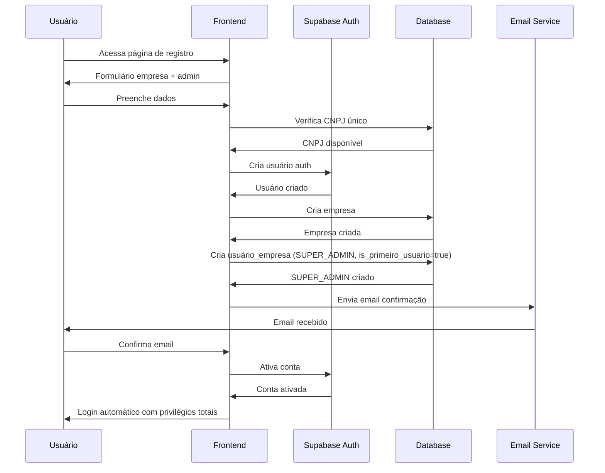
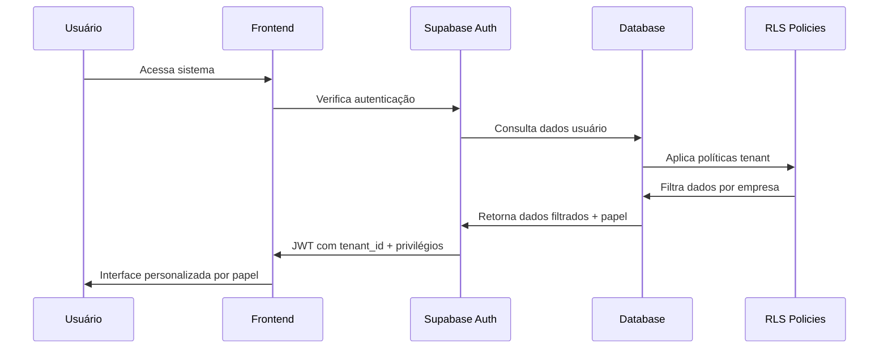

# Design Document

## Overview

Este documento descreve o design técnico para um sistema completo de autenticação e gerenciamento de usuários multitenant. O sistema implementará isolamento total de dados entre empresas (tenants), controle granular de permissões por módulos, e funcionalidades administrativas robustas para cada empresa.

O design utiliza Supabase Auth como base, combinado com Row Level Security (RLS) do PostgreSQL para garantir isolamento de dados e segurança. Cada empresa terá seu próprio espaço isolado no sistema, com um administrador principal e usuários com diferentes níveis de acesso.

## Architecture

### Arquitetura Geral


### Fluxo de Registro do Primeiro Usuário (SUPER_ADMIN)



### Fluxo de Autenticação Multitenant



## Components and Interfaces

### 1. Sistema de Empresas (Tenants)

#### Tabela `empresas`
```sql
CREATE TABLE empresas (
  id UUID PRIMARY KEY DEFAULT gen_random_uuid(),
  nome VARCHAR(255) NOT NULL,
  cnpj VARCHAR(18) UNIQUE NOT NULL,
  email_admin VARCHAR(255) NOT NULL,
  telefone VARCHAR(20),
  endereco JSONB,
  plano VARCHAR(50) DEFAULT 'basico',
  status VARCHAR(20) DEFAULT 'ativo',
  configuracoes JSONB DEFAULT '{}',
  created_at TIMESTAMPTZ DEFAULT NOW(),
  updated_at TIMESTAMPTZ DEFAULT NOW()
);
```

#### Interface TypeScript
```typescript
interface Empresa {
  id: string;
  nome: string;
  cnpj: string;
  email_admin: string;
  telefone?: string;
  endereco?: {
    rua: string;
    numero: string;
    cidade: string;
    estado: string;
    cep: string;
  };
  plano: 'basico' | 'premium' | 'enterprise';
  status: 'ativo' | 'inativo' | 'suspenso';
  configuracoes: Record<string, any>;
  created_at: string;
  updated_at: string;
}
```

### 2. Sistema de Usuários da Empresa com Hierarquia de Administradores

#### Tabela `usuarios_empresa`
```sql
CREATE TABLE usuarios_empresa (
  id UUID PRIMARY KEY DEFAULT gen_random_uuid(),
  user_id UUID REFERENCES auth.users(id) ON DELETE CASCADE,
  empresa_id UUID REFERENCES empresas(id) ON DELETE CASCADE,
  nome_completo VARCHAR(255) NOT NULL,
  email VARCHAR(255) NOT NULL,
  telefone VARCHAR(20),
  cargo VARCHAR(100),
  papel VARCHAR(20) DEFAULT 'USER',
  is_primeiro_usuario BOOLEAN DEFAULT FALSE,
  status VARCHAR(20) DEFAULT 'ativo',
  senha_provisoria BOOLEAN DEFAULT FALSE,
  ultimo_login TIMESTAMPTZ,
  created_at TIMESTAMPTZ DEFAULT NOW(),
  updated_at TIMESTAMPTZ DEFAULT NOW(),
  UNIQUE(user_id, empresa_id)
);

-- Índice para garantir apenas um primeiro usuário por empresa
CREATE UNIQUE INDEX idx_primeiro_usuario_empresa 
ON usuarios_empresa (empresa_id) 
WHERE is_primeiro_usuario = true;
```

#### Interface TypeScript
```typescript
enum PapelUsuario {
  SUPER_ADMIN = 'SUPER_ADMIN',    // Primeiro usuário - privilégios totais
  ADMIN = 'ADMIN',                // Administrador com algumas restrições
  MANAGER = 'MANAGER',            // Gerente com acesso limitado
  USER = 'USER'                   // Usuário comum
}

interface UsuarioEmpresa {
  id: string;
  user_id: string;
  empresa_id: string;
  nome_completo: string;
  email: string;
  telefone?: string;
  cargo?: string;
  papel: PapelUsuario;
  is_primeiro_usuario: boolean;
  status: 'ativo' | 'inativo' | 'bloqueado';
  senha_provisoria: boolean;
  ultimo_login?: string;
  created_at: string;
  updated_at: string;
}

interface PrivilegiosAdmin {
  configuracoes_empresa: boolean;
  gerenciar_usuarios: boolean;
  configuracoes_seguranca: boolean;
  integracao_externa: boolean;
  backup_restauracao: boolean;
  relatorios_avancados: boolean;
  auditoria_completa: boolean;
  configuracoes_sistema: boolean;
}
```

### 3. Sistema de Privilégios Administrativos

#### Matriz de Privilégios por Papel
```typescript
const PRIVILEGIOS_POR_PAPEL: Record<PapelUsuario, PrivilegiosAdmin> = {
  [PapelUsuario.SUPER_ADMIN]: {
    configuracoes_empresa: true,
    gerenciar_usuarios: true,
    configuracoes_seguranca: true,
    integracao_externa: true,
    backup_restauracao: true,
    relatorios_avancados: true,
    auditoria_completa: true,
    configuracoes_sistema: true
  },
  [PapelUsuario.ADMIN]: {
    configuracoes_empresa: true,
    gerenciar_usuarios: true,
    configuracoes_seguranca: false,  // Restrito ao SUPER_ADMIN
    integracao_externa: false,       // Restrito ao SUPER_ADMIN
    backup_restauracao: true,
    relatorios_avancados: true,
    auditoria_completa: false,       // Restrito ao SUPER_ADMIN
    configuracoes_sistema: false     // Restrito ao SUPER_ADMIN
  },
  [PapelUsuario.MANAGER]: {
    configuracoes_empresa: false,
    gerenciar_usuarios: true,
    configuracoes_seguranca: false,
    integracao_externa: false,
    backup_restauracao: false,
    relatorios_avancados: true,
    auditoria_completa: false,
    configuracoes_sistema: false
  },
  [PapelUsuario.USER]: {
    configuracoes_empresa: false,
    gerenciar_usuarios: false,
    configuracoes_seguranca: false,
    integracao_externa: false,
    backup_restauracao: false,
    relatorios_avancados: false,
    auditoria_completa: false,
    configuracoes_sistema: false
  }
};
```

#### Função de Verificação de Privilégios
```sql
-- Função para verificar privilégios administrativos
CREATE OR REPLACE FUNCTION tem_privilegio_admin(privilegio TEXT)
RETURNS BOOLEAN AS $
BEGIN
  RETURN EXISTS (
    SELECT 1 
    FROM usuarios_empresa ue
    WHERE ue.user_id = auth.uid()
    AND (
      (ue.papel = 'SUPER_ADMIN') OR
      (ue.papel = 'ADMIN' AND privilegio NOT IN ('configuracoes_seguranca', 'integracao_externa', 'auditoria_completa', 'configuracoes_sistema')) OR
      (ue.papel = 'MANAGER' AND privilegio IN ('gerenciar_usuarios', 'relatorios_avancados'))
    )
  );
END;
$ LANGUAGE plpgsql SECURITY DEFINER;
```

#### Processo de Criação do Primeiro Usuário
```typescript
interface ProcessoRegistroEmpresa {
  // 1. Validação de dados da empresa
  validarDadosEmpresa(dados: DadosEmpresa): ValidationResult;
  
  // 2. Criação da empresa
  criarEmpresa(dados: DadosEmpresa): Promise<Empresa>;
  
  // 3. Criação automática do SUPER_ADMIN
  criarPrimeiroUsuario(empresaId: string, dadosAdmin: DadosAdmin): Promise<UsuarioEmpresa>;
  
  // 4. Configuração de privilégios totais
  configurarPrivilegiosCompletos(usuarioId: string): Promise<void>;
  
  // 5. Envio de confirmação
  enviarEmailConfirmacao(email: string, token: string): Promise<void>;
}
```

### 4. Sistema de Permissões por Módulos

#### Tabela `permissoes_usuario`
```sql
CREATE TABLE permissoes_usuario (
  id UUID PRIMARY KEY DEFAULT gen_random_uuid(),
  usuario_empresa_id UUID REFERENCES usuarios_empresa(id) ON DELETE CASCADE,
  modulo VARCHAR(50) NOT NULL,
  permissoes JSONB DEFAULT '{}',
  created_at TIMESTAMPTZ DEFAULT NOW(),
  updated_at TIMESTAMPTZ DEFAULT NOW(),
  UNIQUE(usuario_empresa_id, modulo)
);
```

#### Módulos do Sistema
```typescript
enum Modulos {
  DASHBOARD = 'dashboard',
  MONITOR_BAR = 'monitor_bar',
  ATENDIMENTO_BAR = 'atendimento_bar',
  MONITOR_COZINHA = 'monitor_cozinha',
  GESTAO_CAIXA = 'gestao_caixa',
  CLIENTES = 'clientes',
  FUNCIONARIOS = 'funcionarios',
  SOCIOS = 'socios',
  CONFIGURACOES = 'configuracoes',
  RELATORIOS = 'relatorios'
}

interface PermissaoModulo {
  visualizar: boolean;
  criar: boolean;
  editar: boolean;
  excluir: boolean;
  administrar?: boolean;
}
```

### 4. Sistema de Configurações

#### Tabela `configuracoes_empresa`
```sql
CREATE TABLE configuracoes_empresa (
  id UUID PRIMARY KEY DEFAULT gen_random_uuid(),
  empresa_id UUID REFERENCES empresas(id) ON DELETE CASCADE,
  categoria VARCHAR(50) NOT NULL,
  configuracoes JSONB NOT NULL DEFAULT '{}',
  created_at TIMESTAMPTZ DEFAULT NOW(),
  updated_at TIMESTAMPTZ DEFAULT NOW(),
  UNIQUE(empresa_id, categoria)
);
```

#### Categorias de Configuração (com Controle de Acesso)
```typescript
interface ConfiguracoesEmpresa {
  // Configurações gerais - Acesso: ADMIN+
  geral: {
    nome_empresa: string;
    logo_url?: string;
    tema: 'claro' | 'escuro' | 'auto';
    idioma: string;
    timezone: string;
    formato_data: string;
  };
  
  // Configurações de segurança - Acesso: SUPER_ADMIN apenas
  seguranca: {
    tempo_sessao: number;
    tentativas_login: number;
    bloqueio_temporario: number;
    exigir_2fa: boolean;
    whitelist_ips?: string[];
    politica_senha: {
      min_caracteres: number;
      exigir_maiuscula: boolean;
      exigir_numero: boolean;
      exigir_simbolo: boolean;
    };
  };
  
  // Configurações de sistema - Acesso: SUPER_ADMIN apenas
  sistema: {
    backup_automatico: boolean;
    retencao_logs_dias: number;
    limite_usuarios: number;
    modulos_habilitados: string[];
  };
  
  // Configurações de notificações - Acesso: ADMIN+
  notificacoes: {
    email_novos_usuarios: boolean;
    email_tentativas_login: boolean;
    email_alteracoes_config: boolean;
    webhook_eventos: string[];
  };
  
  // Configurações de integração - Acesso: SUPER_ADMIN apenas
  integracao: {
    webhook_url?: string;
    api_keys: Record<string, string>;
    integracao_externa: {
      erp_ativo: boolean;
      api_endpoint?: string;
      token_acesso?: string;
    };
  };
}

// Mapeamento de acesso por categoria
const ACESSO_CONFIGURACAO: Record<string, PapelUsuario[]> = {
  geral: [PapelUsuario.SUPER_ADMIN, PapelUsuario.ADMIN],
  seguranca: [PapelUsuario.SUPER_ADMIN],
  sistema: [PapelUsuario.SUPER_ADMIN],
  notificacoes: [PapelUsuario.SUPER_ADMIN, PapelUsuario.ADMIN],
  integracao: [PapelUsuario.SUPER_ADMIN]
};
```

### 5. Sistema de Auditoria

#### Tabela `logs_auditoria`
```sql
CREATE TABLE logs_auditoria (
  id UUID PRIMARY KEY DEFAULT gen_random_uuid(),
  empresa_id UUID REFERENCES empresas(id) ON DELETE CASCADE,
  usuario_id UUID REFERENCES auth.users(id),
  acao VARCHAR(100) NOT NULL,
  recurso VARCHAR(100),
  detalhes JSONB,
  ip_address INET,
  user_agent TEXT,
  created_at TIMESTAMPTZ DEFAULT NOW()
);
```

## Data Models

### Modelo de Dados Completo


## Error Handling

### Estratégia de Tratamento de Erros

#### 1. Erros de Autenticação
```typescript
enum AuthErrors {
  INVALID_CREDENTIALS = 'INVALID_CREDENTIALS',
  ACCOUNT_LOCKED = 'ACCOUNT_LOCKED',
  PASSWORD_EXPIRED = 'PASSWORD_EXPIRED',
  TENANT_NOT_FOUND = 'TENANT_NOT_FOUND',
  INSUFFICIENT_PERMISSIONS = 'INSUFFICIENT_PERMISSIONS'
}

interface AuthError {
  code: AuthErrors;
  message: string;
  details?: Record<string, any>;
  timestamp: string;
}
```

#### 2. Erros de Validação
```typescript
interface ValidationError {
  field: string;
  code: string;
  message: string;
  value?: any;
}

interface ValidationResult {
  valid: boolean;
  errors: ValidationError[];
}
```

#### 3. Tratamento de Erros RLS
```sql
-- Função para capturar erros de RLS
CREATE OR REPLACE FUNCTION handle_rls_error()
RETURNS TRIGGER AS $$
BEGIN
  -- Log da tentativa de acesso negado
  INSERT INTO logs_auditoria (
    empresa_id,
    usuario_id,
    acao,
    recurso,
    detalhes,
    ip_address
  ) VALUES (
    COALESCE(NEW.empresa_id, OLD.empresa_id),
    auth.uid(),
    'ACCESS_DENIED',
    TG_TABLE_NAME,
    jsonb_build_object('operation', TG_OP),
    inet_client_addr()
  );
  
  RAISE EXCEPTION 'Acesso negado: dados não encontrados ou sem permissão';
END;
$$ LANGUAGE plpgsql;
```

## Testing Strategy

### 1. Testes de Unidade
- Validação de funções de autenticação
- Testes de políticas RLS
- Validação de permissões por módulo
- Testes de configurações de empresa

### 2. Testes de Integração
- Fluxo completo de registro de empresa
- Processo de criação de usuários
- Sistema de permissões end-to-end
- Integração com Supabase Auth

### 3. Testes de Segurança
- Tentativas de acesso cross-tenant
- Validação de isolamento de dados
- Testes de força bruta
- Verificação de logs de auditoria

### 4. Testes de Performance
- Consultas com RLS em grandes volumes
- Performance de autenticação
- Otimização de índices
- Carga de usuários simultâneos

### Estrutura de Testes
```typescript
describe('Sistema Multitenant', () => {
  describe('Isolamento de Dados', () => {
    it('deve impedir acesso cross-tenant', async () => {
      // Teste de isolamento
    });
    
    it('deve aplicar RLS corretamente', async () => {
      // Teste de RLS
    });
  });
  
  describe('Sistema de Permissões', () => {
    it('deve validar permissões por módulo', async () => {
      // Teste de permissões
    });
    
    it('deve negar acesso sem permissão', async () => {
      // Teste de negação
    });
  });
});
```

## Row Level Security Policies

### Políticas RLS Principais

#### 1. Isolamento por Empresa
```sql
-- Política para tabela empresas
CREATE POLICY "Empresa pode ver apenas seus dados"
ON empresas FOR ALL
TO authenticated
USING (
  id IN (
    SELECT empresa_id 
    FROM usuarios_empresa 
    WHERE user_id = auth.uid()
  )
);

-- Política para usuarios_empresa
CREATE POLICY "Usuários veem apenas colegas da empresa"
ON usuarios_empresa FOR ALL
TO authenticated
USING (
  empresa_id IN (
    SELECT empresa_id 
    FROM usuarios_empresa 
    WHERE user_id = auth.uid()
  )
);
```

#### 2. Controle de Privilégios Administrativos
```sql
-- Função para verificar privilégios administrativos
CREATE OR REPLACE FUNCTION tem_privilegio_admin(privilegio TEXT)
RETURNS BOOLEAN AS $
BEGIN
  RETURN EXISTS (
    SELECT 1 
    FROM usuarios_empresa ue
    WHERE ue.user_id = auth.uid()
    AND (
      (ue.papel = 'SUPER_ADMIN') OR
      (ue.papel = 'ADMIN' AND privilegio NOT IN ('seguranca', 'integracao', 'sistema')) OR
      (ue.papel = 'MANAGER' AND privilegio IN ('geral', 'notificacoes'))
    )
  );
END;
$ LANGUAGE plpgsql SECURITY DEFINER;

-- Política para configurações com controle de acesso
CREATE POLICY "Configurações por nível de acesso"
ON configuracoes_empresa FOR ALL
TO authenticated
USING (
  empresa_id IN (
    SELECT empresa_id FROM usuarios_empresa WHERE user_id = auth.uid()
  )
  AND (
    categoria = 'geral' OR
    (categoria IN ('seguranca', 'sistema', 'integracao') AND tem_privilegio_admin(categoria)) OR
    (categoria = 'notificacoes' AND tem_privilegio_admin('notificacoes'))
  )
);

-- Função para verificar se é primeiro usuário
CREATE OR REPLACE FUNCTION is_primeiro_usuario()
RETURNS BOOLEAN AS $
BEGIN
  RETURN EXISTS (
    SELECT 1 FROM usuarios_empresa 
    WHERE user_id = auth.uid() 
    AND is_primeiro_usuario = true
  );
END;
$ LANGUAGE plpgsql SECURITY DEFINER;

-- Trigger para garantir apenas um primeiro usuário por empresa
CREATE OR REPLACE FUNCTION validate_primeiro_usuario()
RETURNS TRIGGER AS $
BEGIN
  -- Se está marcando como primeiro usuário
  IF NEW.is_primeiro_usuario = true THEN
    -- Verifica se já existe um primeiro usuário na empresa
    IF EXISTS (
      SELECT 1 FROM usuarios_empresa 
      WHERE empresa_id = NEW.empresa_id 
      AND is_primeiro_usuario = true 
      AND id != COALESCE(NEW.id, '00000000-0000-0000-0000-000000000000'::uuid)
    ) THEN
      RAISE EXCEPTION 'Já existe um primeiro usuário para esta empresa';
    END IF;
    
    -- Automaticamente define como SUPER_ADMIN
    NEW.papel = 'SUPER_ADMIN';
  END IF;
  
  RETURN NEW;
END;
$ LANGUAGE plpgsql;

CREATE TRIGGER trigger_validate_primeiro_usuario
  BEFORE INSERT OR UPDATE ON usuarios_empresa
  FOR EACH ROW EXECUTE FUNCTION validate_primeiro_usuario();
```

#### 2. Controle de Permissões
```sql
-- Função para verificar permissões
CREATE OR REPLACE FUNCTION tem_permissao(modulo TEXT, acao TEXT)
RETURNS BOOLEAN AS $$
BEGIN
  RETURN EXISTS (
    SELECT 1 
    FROM permissoes_usuario pu
    JOIN usuarios_empresa ue ON pu.usuario_empresa_id = ue.id
    WHERE ue.user_id = auth.uid()
    AND pu.modulo = modulo
    AND (pu.permissoes->acao)::boolean = true
  );
END;
$$ LANGUAGE plpgsql SECURITY DEFINER;
```

#### 3. Auditoria Automática
```sql
-- Trigger para logs automáticos
CREATE OR REPLACE FUNCTION log_auditoria()
RETURNS TRIGGER AS $$
BEGIN
  INSERT INTO logs_auditoria (
    empresa_id,
    usuario_id,
    acao,
    recurso,
    detalhes
  ) VALUES (
    COALESCE(NEW.empresa_id, OLD.empresa_id),
    auth.uid(),
    TG_OP,
    TG_TABLE_NAME,
    to_jsonb(COALESCE(NEW, OLD))
  );
  
  RETURN COALESCE(NEW, OLD);
END;
$$ LANGUAGE plpgsql;
```

## Processo de Onboarding do Primeiro Usuário

### Fluxo Completo de Registro

#### 1. Validação e Criação da Empresa
```typescript
interface ProcessoRegistro {
  // Etapa 1: Validação inicial
  async validarRegistro(dados: DadosRegistro): Promise<ValidationResult> {
    // Validar CNPJ único
    // Validar formato de email
    // Validar dados obrigatórios
  }
  
  // Etapa 2: Criação da empresa
  async criarEmpresa(dados: DadosEmpresa): Promise<Empresa> {
    // Criar registro na tabela empresas
    // Configurar configurações padrão
  }
  
  // Etapa 3: Criação do SUPER_ADMIN
  async criarPrimeiroUsuario(empresaId: string, dadosAdmin: DadosAdmin): Promise<void> {
    // Criar usuário no Supabase Auth
    // Criar registro em usuarios_empresa com:
    //   - papel = 'SUPER_ADMIN'
    //   - is_primeiro_usuario = true
    // Configurar permissões completas
  }
  
  // Etapa 4: Configuração inicial
  async configurarEmpresaInicial(empresaId: string): Promise<void> {
    // Criar configurações padrão para todas as categorias
    // Configurar módulos habilitados
    // Criar estrutura inicial de dados
  }
}
```

#### 2. Configurações Automáticas para SUPER_ADMIN
```sql
-- Função executada após criação do primeiro usuário
CREATE OR REPLACE FUNCTION setup_primeiro_usuario()
RETURNS TRIGGER AS $
BEGIN
  -- Se é o primeiro usuário, configurar tudo automaticamente
  IF NEW.is_primeiro_usuario = true THEN
    
    -- Criar configurações padrão da empresa
    INSERT INTO configuracoes_empresa (empresa_id, categoria, configuracoes)
    VALUES 
      (NEW.empresa_id, 'geral', '{"tema": "claro", "idioma": "pt-BR", "timezone": "America/Sao_Paulo"}'),
      (NEW.empresa_id, 'seguranca', '{"tempo_sessao": 480, "tentativas_login": 5, "bloqueio_temporario": 15}'),
      (NEW.empresa_id, 'sistema', '{"backup_automatico": true, "retencao_logs_dias": 90, "limite_usuarios": 50}'),
      (NEW.empresa_id, 'notificacoes', '{"email_novos_usuarios": true, "email_tentativas_login": true}'),
      (NEW.empresa_id, 'integracao', '{}');
    
    -- Criar permissões completas para todos os módulos
    INSERT INTO permissoes_usuario (usuario_empresa_id, modulo, permissoes)
    SELECT 
      NEW.id,
      modulo,
      '{"visualizar": true, "criar": true, "editar": true, "excluir": true, "administrar": true}'
    FROM (
      VALUES 
        ('dashboard'), ('monitor_bar'), ('atendimento_bar'), 
        ('monitor_cozinha'), ('gestao_caixa'), ('clientes'), 
        ('funcionarios'), ('socios'), ('configuracoes'), ('relatorios')
    ) AS modulos(modulo);
    
    -- Log da criação do primeiro usuário
    INSERT INTO logs_auditoria (empresa_id, usuario_id, acao, recurso, detalhes)
    VALUES (
      NEW.empresa_id,
      NEW.user_id,
      'PRIMEIRO_USUARIO_CRIADO',
      'usuarios_empresa',
      jsonb_build_object('usuario_id', NEW.id, 'email', NEW.email)
    );
    
  END IF;
  
  RETURN NEW;
END;
$ LANGUAGE plpgsql;

CREATE TRIGGER trigger_setup_primeiro_usuario
  AFTER INSERT ON usuarios_empresa
  FOR EACH ROW EXECUTE FUNCTION setup_primeiro_usuario();
```

#### 3. Interface de Boas-vindas para SUPER_ADMIN
```typescript
interface OnboardingFlow {
  // Tela 1: Confirmação de privilégios
  mostrarPrivilegios(): void;
  
  // Tela 2: Configuração inicial da empresa
  configurarEmpresa(): void;
  
  // Tela 3: Convite para primeiro funcionário (opcional)
  convidarPrimeiroFuncionario(): void;
  
  // Tela 4: Tour das funcionalidades administrativas
  tourFuncionalidades(): void;
}
```

## Security Considerations

### 1. Isolamento de Dados
- RLS obrigatório em todas as tabelas
- Validação de tenant_id em todas as operações
- Índices otimizados para consultas por empresa
- Funções security definer para operações administrativas

### 2. Autenticação e Autorização
- JWT com claims de empresa e permissões
- Refresh tokens seguros
- Bloqueio automático por tentativas falhadas
- Logs detalhados de todas as ações

### 3. Configurações de Segurança
- Senhas com política forte
- 2FA opcional por empresa
- Sessões com timeout configurável
- Whitelist de IPs por empresa (opcional)

### 4. Monitoramento e Alertas
- Logs de auditoria completos
- Alertas para tentativas suspeitas
- Monitoramento de performance
- Backup automático de configurações