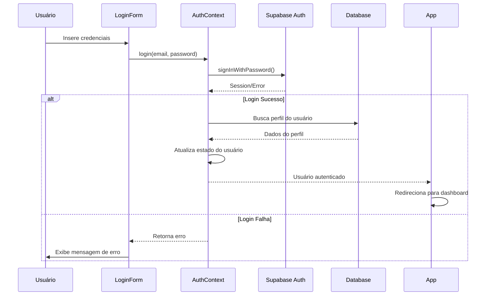

# Documento de Design - Sistema de Autenticação

## Visão Geral

O sistema de autenticação do ClubManager Pro é construído sobre o Supabase Auth, fornecendo uma solução robusta e escalável para gerenciamento de usuários, sessões e permissões. O design segue o padrão de Context API do React para gerenciamento de estado global da autenticação, com integração em tempo real e políticas de segurança RLS (Row Level Security).

## Arquitetura

### Componentes Principais

1. **AuthContext**: Provedor de contexto React que gerencia o estado global de autenticação
2. **Supabase Auth**: Serviço de autenticação backend
3. **Profiles Table**: Tabela que estende os dados do usuário com informações específicas da aplicação
4. **RLS Policies**: Políticas de segurança em nível de linha no banco de dados
5. **Route Guards**: Componentes que protegem rotas baseado no estado de autenticação

### Fluxo de Autenticação



## Componentes e Interfaces

### AuthContext Interface

```typescript
interface AuthContextType {
  user: User | null;
  login: (email: string, password: string) => Promise<{ success: boolean; error: string | null }>;
  loginAsDemo: () => Promise<{ success: boolean; error: string | null }>;
  logout: () => void;
  isLoading: boolean;
}
```

### User Interface

```typescript
interface User {
  id: string;
  name: string;
  email: string;
  role: 'admin' | 'manager' | 'employee' | 'member';
  avatar?: string;
  department?: string;
}
```

### Componentes de Proteção de Rota

- **ProtectedRoutesWrapper**: Verifica autenticação antes de renderizar rotas protegidas
- **LoginPageWrapper**: Redireciona usuários já autenticados para o dashboard

## Modelos de Dados

### Tabela Profiles

```sql
CREATE TABLE public.profiles (
  id UUID PRIMARY KEY REFERENCES auth.users(id),
  name TEXT,
  avatar_url TEXT,
  role TEXT NOT NULL DEFAULT 'employee',
  updated_at TIMESTAMPTZ DEFAULT NOW()
);
```

### Trigger de Criação Automática

```sql
CREATE OR REPLACE FUNCTION public.handle_new_user()
RETURNS TRIGGER AS $$
BEGIN
  INSERT INTO public.profiles (id, name, avatar_url, role)
  VALUES (
    new.id,
    new.raw_user_meta_data->>'name',
    new.raw_user_meta_data->>'avatar_url',
    'employee'
  );
  RETURN new;
END;
$$ LANGUAGE plpgsql SECURITY DEFINER;
```

## Tratamento de Erros

### Estratégias de Erro

1. **Credenciais Inválidas**: Exibição de mensagem de erro clara na interface
2. **Perfil Não Encontrado**: Logout automático e redirecionamento para login
3. **Erro de Rede**: Retry automático com feedback visual
4. **Sessão Expirada**: Logout automático e preservação da URL de destino

### Estados de Carregamento

- **isLoading**: Indica carregamento inicial da sessão
- **Loading Screen**: Tela de carregamento durante verificação de autenticação
- **Skeleton Loading**: Para componentes que dependem dos dados do usuário

## Estratégia de Testes

### Testes Unitários

1. **AuthContext**: Testar todas as funções de autenticação
2. **Login Form**: Testar validação e submissão de formulário
3. **Route Guards**: Testar redirecionamentos baseados em autenticação

### Testes de Integração

1. **Fluxo de Login Completo**: Da submissão até o redirecionamento
2. **Persistência de Sessão**: Verificar manutenção de sessão após refresh
3. **Logout**: Verificar limpeza completa do estado

### Testes E2E

1. **Cenário de Login Sucesso**: Login → Dashboard → Logout
2. **Cenário de Login Demo**: Botão demo → Dashboard com indicadores
3. **Cenário de Acesso Negado**: URL protegida → Redirecionamento para login

## Segurança

### Row Level Security (RLS)

```sql
-- Política para visualização de perfis
CREATE POLICY "Users can view all profiles" 
ON public.profiles FOR SELECT 
USING (auth.role() = 'authenticated');

-- Política para atualização do próprio perfil
CREATE POLICY "Users can update their own profile" 
ON public.profiles FOR UPDATE 
USING (auth.uid() = id);
```

### Função de Verificação de Role

```sql
CREATE OR REPLACE FUNCTION public.get_my_role()
RETURNS TEXT AS $$
BEGIN
  RETURN (
    SELECT role FROM public.profiles WHERE id = auth.uid()
  );
END;
$$ LANGUAGE plpgsql SECURITY DEFINER;
```

### Considerações de Segurança

1. **Tokens JWT**: Gerenciados automaticamente pelo Supabase
2. **HTTPS**: Obrigatório para todas as comunicações
3. **Sanitização**: Validação de entrada em todos os formulários
4. **Rate Limiting**: Implementado pelo Supabase Auth
5. **Password Policy**: Configurável no painel do Supabase

## Performance

### Otimizações Implementadas

1. **Lazy Loading**: Carregamento do perfil apenas após autenticação
2. **Memoização**: Context values memoizados para evitar re-renders
3. **Debounce**: Em futuras implementações de busca de usuários
4. **Cache**: Dados do usuário mantidos em memória durante a sessão

### Métricas de Performance

- **Tempo de Login**: < 2 segundos em condições normais
- **Tempo de Carregamento Inicial**: < 1 segundo para verificação de sessão
- **Memory Usage**: Mínimo, apenas dados essenciais do usuário em memória