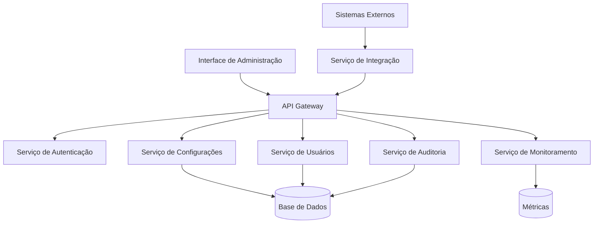

# Documento de Design - Sistema de Configurações e Administração

## Visão Geral

O Sistema de Configurações e Administração é o módulo central de controle do ClubManager Pro, fornecendo uma interface unificada para gerenciar todos os aspectos administrativos do sistema. O design segue uma arquitetura modular com separação clara de responsabilidades, permitindo escalabilidade e manutenibilidade.

## Arquitetura

### Arquitetura Geral


### Camadas da Aplicação
1. **Camada de Apresentação**: Interface React com componentes reutilizáveis
2. **Camada de API**: Endpoints RESTful com validação e autorização
3. **Camada de Negócio**: Lógica de domínio e regras de negócio
4. **Camada de Dados**: Repositórios e modelos de dados
5. **Camada de Infraestrutura**: Serviços externos e utilitários

## Componentes e Interfaces

### 1. Gerenciamento de Usuários e Permissões

#### Componentes Principais
- `UserManagementPanel`: Interface principal para gestão de usuários
- `PermissionMatrix`: Matriz visual de permissões por módulo
- `RoleEditor`: Editor de funções e perfis
- `AccessLogViewer`: Visualizador de logs de acesso

#### Interfaces de Dados
```typescript
interface User {
  id: string;
  name: string;
  email: string;
  role: Role;
  department: string;
  permissions: Permission[];
  lastLogin: Date;
  isActive: boolean;
}

interface Permission {
  module: string;
  actions: string[];
  restrictions?: Record<string, any>;
}

interface Role {
  id: string;
  name: string;
  description: string;
  defaultPermissions: Permission[];
}
```

### 2. Configurações Gerais do Clube

#### Componentes Principais
- `ClubSettingsForm`: Formulário de configurações básicas
- `ScheduleManager`: Gerenciador de horários de funcionamento
- `PolicyEditor`: Editor de políticas e regras
- `TaxConfiguration`: Configuração de impostos e taxas

#### Interfaces de Dados
```typescript
interface ClubSettings {
  basicInfo: {
    name: string;
    logo: string;
    address: Address;
    contacts: Contact[];
  };
  schedule: OperatingHours[];
  policies: Policy[];
  taxes: TaxConfiguration[];
}
```

### 3. Integrações Externas

#### Componentes Principais
- `IntegrationDashboard`: Dashboard de integrações
- `APIConfigForm`: Formulário de configuração de APIs
- `ConnectionTester`: Testador de conexões
- `DataMappingEditor`: Editor de mapeamento de dados

#### Interfaces de Dados
```typescript
interface Integration {
  id: string;
  name: string;
  type: IntegrationType;
  config: IntegrationConfig;
  status: ConnectionStatus;
  lastSync: Date;
  errorLog: IntegrationError[];
}
```

### 4. Sistema de Notificações

#### Componentes Principais
- `NotificationCenter`: Centro de controle de notificações
- `AlertRuleEditor`: Editor de regras de alerta
- `NotificationHistory`: Histórico de notificações
- `ChannelManager`: Gerenciador de canais de comunicação

### 5. Backup e Segurança

#### Componentes Principais
- `BackupManager`: Gerenciador de backups
- `SecuritySettings`: Configurações de segurança
- `RestoreWizard`: Assistente de restauração
- `SecurityAudit`: Auditoria de segurança

### 6. Relatórios Personalizados

#### Componentes Principais
- `ReportBuilder`: Construtor visual de relatórios
- `ReportScheduler`: Agendador de relatórios
- `ReportViewer`: Visualizador de relatórios
- `DataExporter`: Exportador de dados

### 7. Monitoramento de Performance

#### Componentes Principais
- `SystemDashboard`: Dashboard de sistema
- `PerformanceMetrics`: Métricas de performance
- `LogAnalyzer`: Analisador de logs
- `AlertManager`: Gerenciador de alertas

## Modelos de Dados

### Estrutura Principal
```sql
-- Configurações do sistema
CREATE TABLE system_settings (
  id UUID PRIMARY KEY,
  category VARCHAR(50) NOT NULL,
  key VARCHAR(100) NOT NULL,
  value JSONB NOT NULL,
  description TEXT,
  created_at TIMESTAMP DEFAULT NOW(),
  updated_at TIMESTAMP DEFAULT NOW(),
  updated_by UUID REFERENCES users(id)
);

-- Usuários e permissões
CREATE TABLE users (
  id UUID PRIMARY KEY,
  email VARCHAR(255) UNIQUE NOT NULL,
  name VARCHAR(255) NOT NULL,
  role_id UUID REFERENCES roles(id),
  department VARCHAR(100),
  is_active BOOLEAN DEFAULT true,
  last_login TIMESTAMP,
  created_at TIMESTAMP DEFAULT NOW()
);

CREATE TABLE roles (
  id UUID PRIMARY KEY,
  name VARCHAR(100) UNIQUE NOT NULL,
  description TEXT,
  permissions JSONB NOT NULL,
  created_at TIMESTAMP DEFAULT NOW()
);

-- Auditoria
CREATE TABLE audit_log (
  id UUID PRIMARY KEY,
  user_id UUID REFERENCES users(id),
  action VARCHAR(100) NOT NULL,
  resource_type VARCHAR(50) NOT NULL,
  resource_id VARCHAR(255),
  old_values JSONB,
  new_values JSONB,
  ip_address INET,
  user_agent TEXT,
  created_at TIMESTAMP DEFAULT NOW()
);

-- Integrações
CREATE TABLE integrations (
  id UUID PRIMARY KEY,
  name VARCHAR(255) NOT NULL,
  type VARCHAR(50) NOT NULL,
  config JSONB NOT NULL,
  status VARCHAR(20) DEFAULT 'inactive',
  last_sync TIMESTAMP,
  created_at TIMESTAMP DEFAULT NOW()
);

-- Notificações
CREATE TABLE notification_rules (
  id UUID PRIMARY KEY,
  name VARCHAR(255) NOT NULL,
  conditions JSONB NOT NULL,
  actions JSONB NOT NULL,
  is_active BOOLEAN DEFAULT true,
  created_at TIMESTAMP DEFAULT NOW()
);
```

## Tratamento de Erros

### Estratégia de Tratamento
1. **Validação de Entrada**: Validação rigorosa em todas as camadas
2. **Logs Estruturados**: Logs detalhados para debugging
3. **Fallbacks Graceful**: Degradação elegante em caso de falhas
4. **Notificação de Erros**: Alertas automáticos para erros críticos

### Códigos de Erro Padronizados
```typescript
enum ErrorCodes {
  VALIDATION_ERROR = 'VALIDATION_ERROR',
  PERMISSION_DENIED = 'PERMISSION_DENIED',
  RESOURCE_NOT_FOUND = 'RESOURCE_NOT_FOUND',
  INTEGRATION_FAILURE = 'INTEGRATION_FAILURE',
  SYSTEM_ERROR = 'SYSTEM_ERROR'
}
```

## Estratégia de Testes

### Tipos de Teste
1. **Testes Unitários**: Cobertura de 90%+ para lógica de negócio
2. **Testes de Integração**: Validação de APIs e integrações
3. **Testes E2E**: Fluxos críticos de administração
4. **Testes de Performance**: Carga e stress testing
5. **Testes de Segurança**: Validação de permissões e auditoria

### Estrutura de Testes
```
src/
├── components/
│   └── __tests__/
├── services/
│   └── __tests__/
├── utils/
│   └── __tests__/
└── __tests__/
    ├── integration/
    ├── e2e/
    └── performance/
```

### Ferramentas de Teste
- **Jest**: Testes unitários e de integração
- **React Testing Library**: Testes de componentes
- **Cypress**: Testes E2E
- **Artillery**: Testes de performance
- **OWASP ZAP**: Testes de segurança

## Considerações de Segurança

### Autenticação e Autorização
- Autenticação multi-fator obrigatória para administradores
- Tokens JWT com expiração curta
- Refresh tokens seguros
- Controle de acesso baseado em funções (RBAC)

### Proteção de Dados
- Criptografia de dados sensíveis em repouso
- Comunicação HTTPS obrigatória
- Sanitização de inputs
- Proteção contra CSRF e XSS

### Auditoria e Compliance
- Log de todas as ações administrativas
- Retenção de logs conforme LGPD
- Relatórios de compliance automáticos
- Backup seguro e criptografado

## Performance e Escalabilidade

### Otimizações
- Cache Redis para configurações frequentes
- Lazy loading de componentes
- Paginação em listagens grandes
- Compressão de assets
- CDN para recursos estáticos

### Monitoramento
- Métricas de performance em tempo real
- Alertas automáticos para degradação
- Dashboards de saúde do sistema
- Análise de tendências de uso

## Considerações de UX/UI

### Princípios de Design
- Interface intuitiva e consistente
- Feedback visual imediato
- Confirmações para ações críticas
- Tooltips e ajuda contextual
- Responsividade para diferentes dispositivos

### Acessibilidade
- Conformidade com WCAG 2.1 AA
- Navegação por teclado
- Leitores de tela compatíveis
- Contraste adequado
- Textos alternativos para imagens