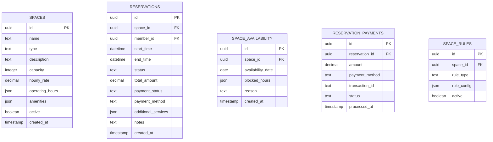
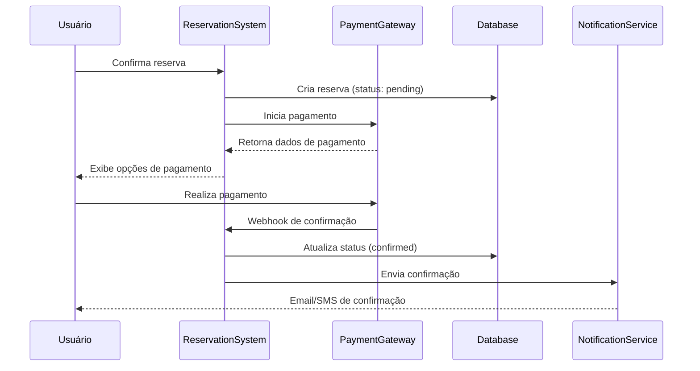

# Documento de Design - Sistema de Reservas

## Visão Geral

O sistema de reservas é projetado como um módulo integrado ao ClubManager Pro, oferecendo uma experiência completa de reserva de espaços com interface moderna, pagamentos integrados e gestão em tempo real. O design foca em usabilidade, performance e escalabilidade, utilizando componentes de calendário interativo e integração com gateways de pagamento.

## Arquitetura

### Componentes Principais

1. **ReservationCalendar**: Calendário interativo para visualização e seleção
2. **SpaceManagement**: Gestão de espaços e recursos
3. **BookingFlow**: Fluxo completo de reserva
4. **PaymentIntegration**: Integração com gateways de pagamento
5. **NotificationService**: Sistema de notificações
6. **ReportsModule**: Relatórios de ocupação e receita
7. **ReservationContext**: Contexto para gerenciamento de estado

### Arquitetura de Dados



## Componentes e Interfaces

### ReservationContext Interface

```typescript
interface ReservationContextType {
  // Espaços
  spaces: Space[];
  addSpace: (space: Omit<Space, 'id' | 'createdAt'>) => Promise<void>;
  updateSpace: (space: Space) => Promise<void>;
  
  // Reservas
  reservations: Reservation[];
  createReservation: (reservation: CreateReservationData) => Promise<Reservation>;
  updateReservation: (id: string, updates: Partial<Reservation>) => Promise<void>;
  cancelReservation: (id: string, reason: string) => Promise<void>;
  
  // Disponibilidade
  getAvailability: (spaceId: string, date: Date) => Promise<TimeSlot[]>;
  blockAvailability: (spaceId: string, dateRange: DateRange, reason: string) => Promise<void>;
  
  // Pagamentos
  processPayment: (reservationId: string, paymentData: PaymentData) => Promise<PaymentResult>;
  
  // Relatórios
  getOccupancyReport: (period: DateRange) => Promise<OccupancyReport>;
  getRevenueReport: (period: DateRange) => Promise<RevenueReport>;
  
  // Estado
  isLoading: boolean;
  selectedDate: Date;
  setSelectedDate: (date: Date) => void;
}
```

### Interfaces de Dados

```typescript
interface Space {
  id: string;
  name: string;
  type: 'quadra_tenis' | 'quadra_futebol' | 'salao_festa' | 'quiosque' | 'piscina';
  description: string;
  capacity: number;
  hourlyRate: number;
  operatingHours: {
    [key: string]: { start: string; end: string; } | null; // Segunda: {start: "08:00", end: "22:00"}
  };
  amenities: string[];
  images: string[];
  active: boolean;
  createdAt: Date;
}

interface Reservation {
  id: string;
  spaceId: string;
  memberId: string;
  memberName: string;
  startTime: Date;
  endTime: Date;
  status: 'pending' | 'confirmed' | 'cancelled' | 'completed' | 'no_show';
  totalAmount: number;
  paymentStatus: 'pending' | 'paid' | 'refunded' | 'failed';
  paymentMethod?: 'pix' | 'credit_card' | 'club_credit' | 'cash';
  additionalServices: AdditionalService[];
  notes?: string;
  createdAt: Date;
}

interface TimeSlot {
  start: Date;
  end: Date;
  available: boolean;
  reservationId?: string;
  price: number;
}

interface AdditionalService {
  id: string;
  name: string;
  price: number;
  quantity: number;
}
```

## Modelos de Dados

### Tabela Spaces

```sql
CREATE TABLE public.spaces (
  id UUID PRIMARY KEY DEFAULT gen_random_uuid(),
  name TEXT NOT NULL,
  type TEXT NOT NULL CHECK (type IN ('quadra_tenis', 'quadra_futebol', 'salao_festa', 'quiosque', 'piscina')),
  description TEXT,
  capacity INTEGER NOT NULL DEFAULT 1,
  hourly_rate DECIMAL(10, 2) NOT NULL,
  operating_hours JSONB NOT NULL DEFAULT '{}',
  amenities JSONB DEFAULT '[]',
  images JSONB DEFAULT '[]',
  active BOOLEAN NOT NULL DEFAULT true,
  created_at TIMESTAMPTZ NOT NULL DEFAULT NOW()
);
```

### Tabela Reservations

```sql
CREATE TABLE public.reservations (
  id UUID PRIMARY KEY DEFAULT gen_random_uuid(),
  space_id UUID NOT NULL REFERENCES public.spaces(id),
  member_id UUID NOT NULL REFERENCES public.members(id),
  start_time TIMESTAMPTZ NOT NULL,
  end_time TIMESTAMPTZ NOT NULL,
  status TEXT NOT NULL DEFAULT 'pending' CHECK (status IN ('pending', 'confirmed', 'cancelled', 'completed', 'no_show')),
  total_amount DECIMAL(10, 2) NOT NULL,
  payment_status TEXT NOT NULL DEFAULT 'pending' CHECK (payment_status IN ('pending', 'paid', 'refunded', 'failed')),
  payment_method TEXT CHECK (payment_method IN ('pix', 'credit_card', 'club_credit', 'cash')),
  additional_services JSONB DEFAULT '[]',
  notes TEXT,
  created_at TIMESTAMPTZ NOT NULL DEFAULT NOW(),
  
  -- Constraint para evitar sobreposição de reservas
  CONSTRAINT no_overlapping_reservations EXCLUDE USING gist (
    space_id WITH =,
    tstzrange(start_time, end_time) WITH &&
  ) WHERE (status IN ('pending', 'confirmed'))
);
```

### Tabela Space Rules

```sql
CREATE TABLE public.space_rules (
  id UUID PRIMARY KEY DEFAULT gen_random_uuid(),
  space_id UUID NOT NULL REFERENCES public.spaces(id),
  rule_type TEXT NOT NULL CHECK (rule_type IN ('min_advance_hours', 'max_advance_days', 'min_duration_hours', 'max_duration_hours', 'cancellation_hours')),
  rule_value INTEGER NOT NULL,
  active BOOLEAN NOT NULL DEFAULT true,
  created_at TIMESTAMPTZ NOT NULL DEFAULT NOW()
);
```

## Interface do Usuário

### Calendário de Reservas

1. **Vista Mensal**: Visão geral de disponibilidade
2. **Vista Semanal**: Detalhes por dia da semana
3. **Vista Diária**: Horários específicos por espaço
4. **Filtros**: Por tipo de espaço, capacidade, preço
5. **Legenda**: Cores para disponível, ocupado, manutenção

### Fluxo de Reserva

1. **Seleção de Espaço e Horário**
   - Calendário interativo
   - Informações do espaço (fotos, amenidades, preço)
   - Verificação de disponibilidade em tempo real

2. **Dados da Reserva**
   - Informações do solicitante
   - Serviços adicionais
   - Observações especiais

3. **Pagamento**
   - Resumo da reserva
   - Opções de pagamento
   - Processamento seguro

4. **Confirmação**
   - Código da reserva
   - Instruções de acesso
   - Opções de compartilhamento

### Dashboard Administrativo

1. **Visão Geral**: KPIs de ocupação e receita
2. **Gestão de Espaços**: CRUD completo de espaços
3. **Reservas do Dia**: Lista de reservas com check-in/out
4. **Relatórios**: Análises de performance e uso

## Integração com Pagamentos

### Gateways Suportados

1. **PIX**: Integração com API do Banco Central
2. **Cartão de Crédito**: Stripe ou Mercado Pago
3. **Crédito do Clube**: Sistema interno de créditos
4. **Dinheiro**: Para pagamentos presenciais

### Fluxo de Pagamento



## Sistema de Notificações

### Tipos de Notificação

1. **Confirmação de Reserva**: Imediata após pagamento
2. **Lembrete**: 24h e 2h antes da reserva
3. **Cancelamento**: Quando reserva é cancelada
4. **Promoções**: Ofertas personalizadas baseadas no histórico

### Canais de Comunicação

1. **Email**: Para confirmações e relatórios
2. **SMS**: Para lembretes urgentes
3. **Push Notifications**: Para app mobile (futuro)
4. **WhatsApp**: Integração com API Business (futuro)

## Tratamento de Erros

### Cenários de Erro

1. **Conflito de Reserva**: Verificação em tempo real antes da confirmação
2. **Falha no Pagamento**: Manter reserva por tempo limitado para retry
3. **Indisponibilidade do Espaço**: Sugerir alternativas automaticamente
4. **Erro de Sistema**: Fallback para reserva manual

### Estratégias de Recuperação

1. **Retry Automático**: Para falhas temporárias de rede
2. **Queue de Processamento**: Para operações críticas
3. **Backup Manual**: Interface para resolução manual de conflitos
4. **Logs Detalhados**: Para auditoria e debugging

## Estratégia de Testes

### Testes Unitários

1. **Validação de Disponibilidade**: Testar lógica de conflitos
2. **Cálculo de Preços**: Validar preços com serviços adicionais
3. **Regras de Negócio**: Testar todas as regras de reserva
4. **Formatação de Dados**: Validar datas e horários

### Testes de Integração

1. **Fluxo Completo**: Reserva → Pagamento → Confirmação
2. **Integração com Pagamentos**: Testar todos os gateways
3. **Notificações**: Verificar envio correto de mensagens
4. **Sincronização**: Testar atualizações em tempo real

### Testes E2E

1. **Jornada do Usuário**: Busca → Reserva → Pagamento → Uso
2. **Cenários de Conflito**: Múltiplos usuários reservando simultaneamente
3. **Cancelamentos**: Testar políticas e reembolsos
4. **Administração**: Gestão completa de espaços e reservas

## Performance e Escalabilidade

### Otimizações

1. **Cache de Disponibilidade**: Redis para consultas frequentes
2. **Índices Compostos**: Para queries de disponibilidade
3. **Paginação**: Para listas grandes de reservas
4. **Lazy Loading**: Carregar dados sob demanda

### Escalabilidade

1. **Particionamento**: Por data para tabela de reservas
2. **Read Replicas**: Para consultas de disponibilidade
3. **CDN**: Para imagens de espaços
4. **Queue System**: Para processamento assíncrono

## Segurança

### Controle de Acesso

```sql
-- Membros podem ver apenas suas próprias reservas
CREATE POLICY "Members can view own reservations" ON reservations
FOR SELECT USING (member_id = auth.uid());

-- Administradores têm acesso total
CREATE POLICY "Admins have full access" ON reservations
FOR ALL USING (public.get_my_role() = 'admin');
```

### Auditoria

1. **Log de Reservas**: Registrar todas as operações
2. **Trilha de Pagamentos**: Auditoria completa de transações
3. **Alterações de Preço**: Histórico de mudanças de valores
4. **Acesso a Dados**: Log de consultas sensíveis