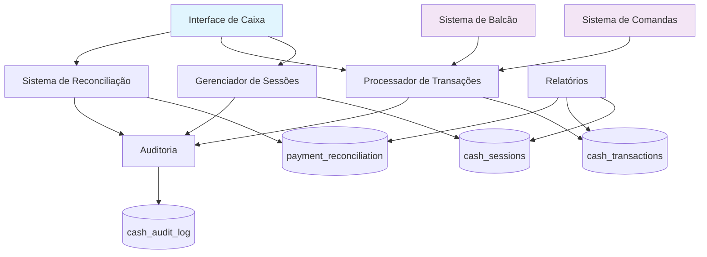
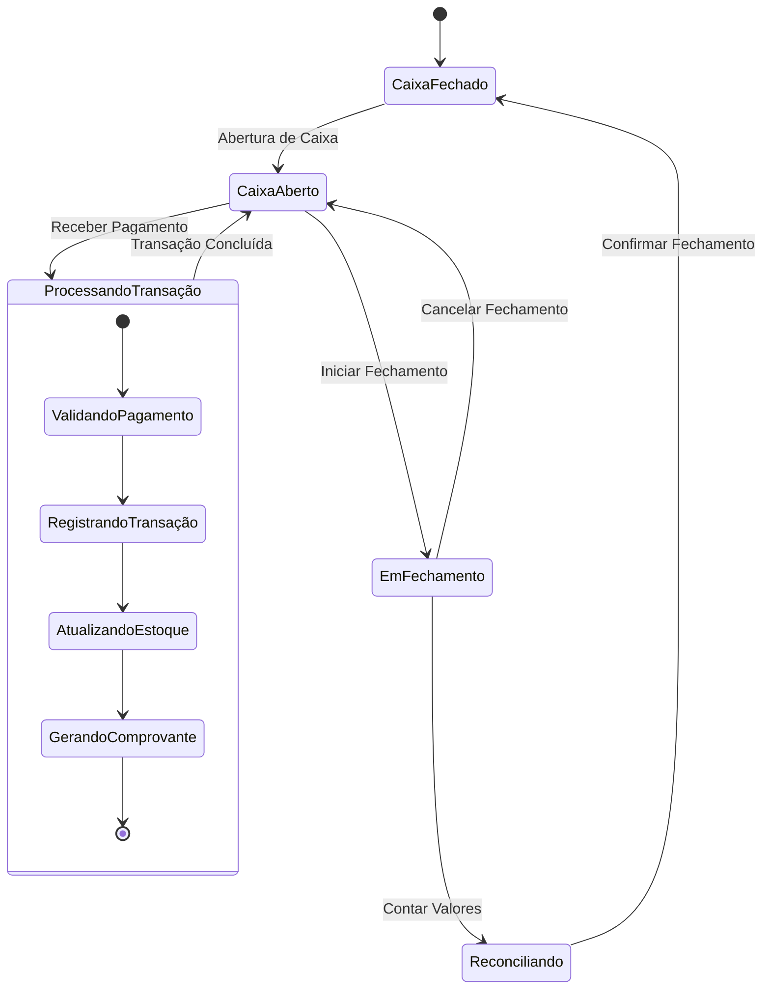
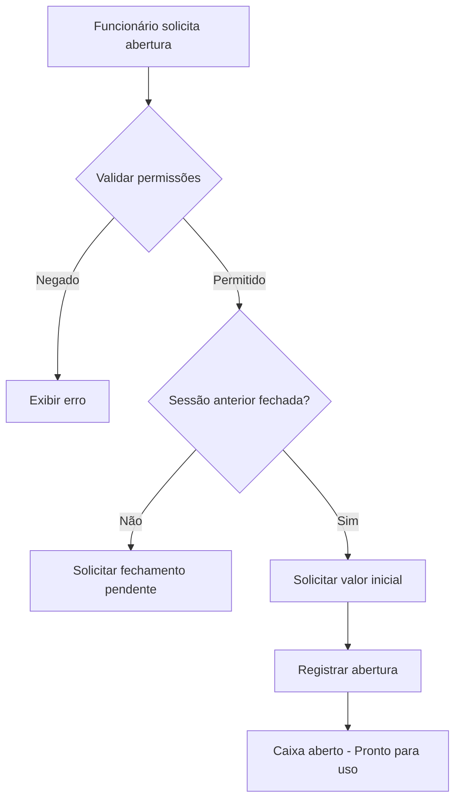
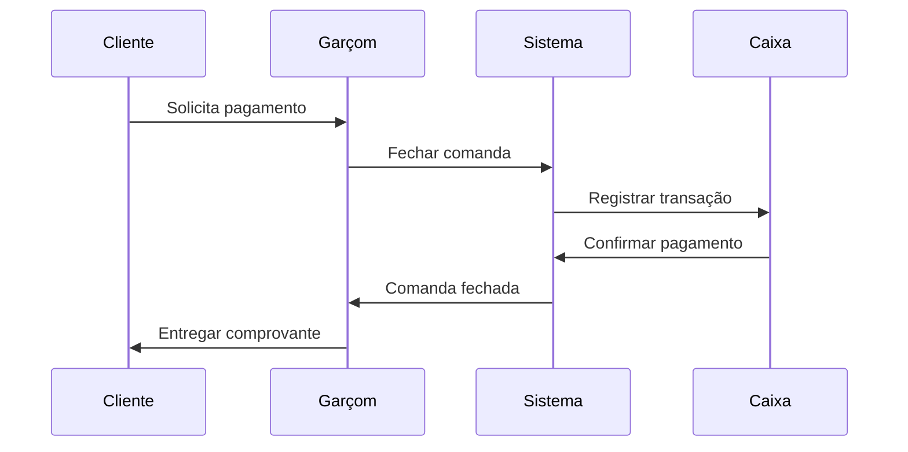
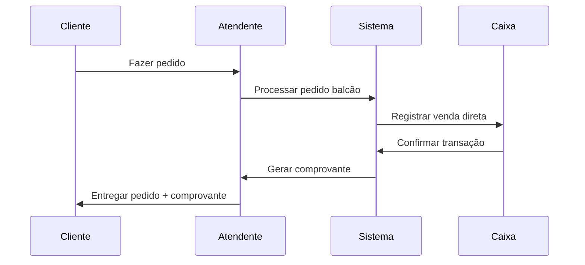
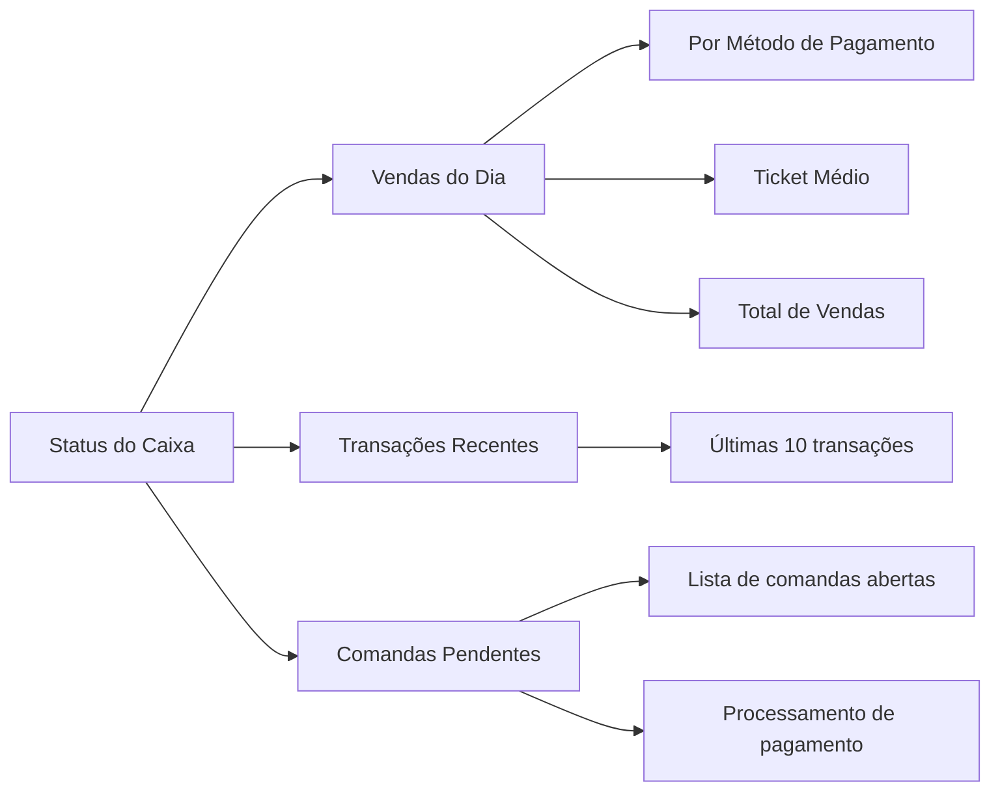
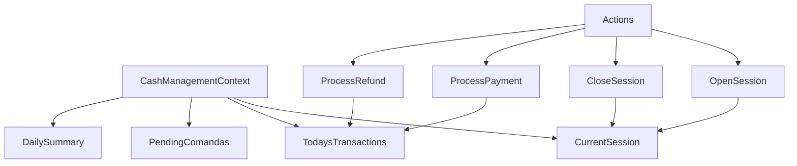
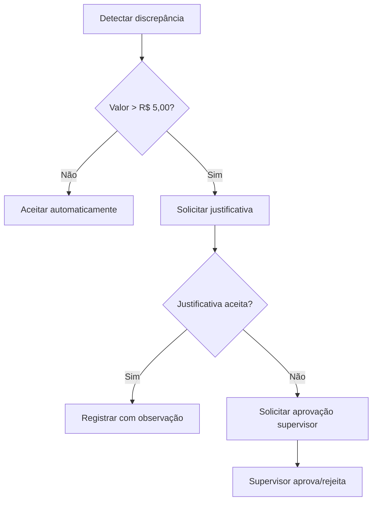
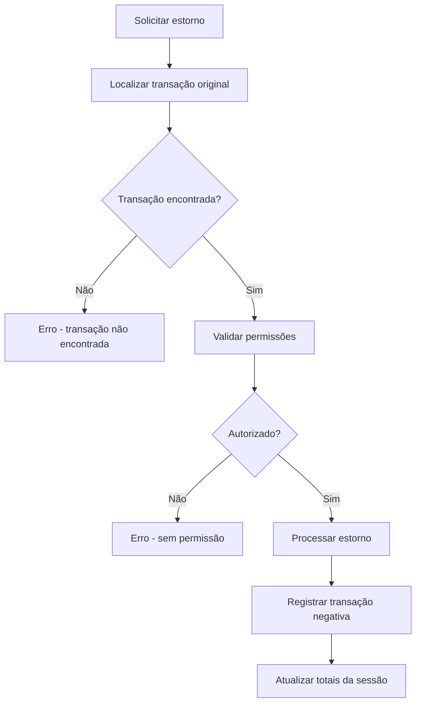

# Sistema de Gestão de Caixa - Planejamento Técnico

## Visão Geral

O Sistema de Gestão de Caixa é um módulo integrado do AABB-system que oferece controle completo e automático de todas as operações financeiras do bar, incluindo entradas e saídas de caixa, com integração perfeita entre pedidos de comandas e balcão. O sistema garante rastreabilidade total das transações, reconciliação automática e relatórios detalhados para uma gestão financeira eficiente.

## Arquitetura do Sistema

### Componentes Principais



### Fluxo de Operações



## Modelo de Dados

### Sessões de Caixa (cash_sessions)

| Campo | Tipo | Descrição |
|-------|------|-----------|
| id | UUID | Identificador único da sessão |
| employee_id | UUID | Funcionário responsável |
| session_date | DATE | Data da sessão |
| opened_at | TIMESTAMPTZ | Momento da abertura |
| closed_at | TIMESTAMPTZ | Momento do fechamento |
| opening_amount | DECIMAL(10,2) | Valor inicial em dinheiro |
| closing_amount | DECIMAL(10,2) | Valor final contado |
| expected_amount | DECIMAL(10,2) | Valor esperado calculado |
| cash_discrepancy | DECIMAL(10,2) | Diferença encontrada |
| status | VARCHAR(20) | open, closed, reconciled |

### Transações (cash_transactions)

| Campo | Tipo | Descrição |
|-------|------|-----------|
| id | UUID | Identificador único |
| cash_session_id | UUID | Sessão de caixa associada |
| comanda_id | UUID | Comanda relacionada (opcional) |
| transaction_type | VARCHAR(20) | sale, refund, adjustment, tip |
| payment_method | VARCHAR(30) | Método de pagamento |
| amount | DECIMAL(10,2) | Valor da transação |
| processed_by | UUID | Funcionário que processou |
| reference_number | VARCHAR(100) | Número de referência |
| customer_name | VARCHAR(255) | Nome do cliente |

### Reconciliação (payment_reconciliation)

| Campo | Tipo | Descrição |
|-------|------|-----------|
| id | UUID | Identificador único |
| cash_session_id | UUID | Sessão relacionada |
| payment_method | VARCHAR(30) | Método de pagamento |
| expected_amount | DECIMAL(10,2) | Valor esperado |
| actual_amount | DECIMAL(10,2) | Valor real informado |
| discrepancy | DECIMAL(10,2) | Diferença calculada |
| transaction_count | INTEGER | Número de transações |

## Funcionalidades Principais

### 1. Gestão de Sessões de Caixa

#### Abertura de Caixa
- **Requisitos de Abertura:**
  - Funcionário autenticado
  - Valor inicial em dinheiro (obrigatório)
  - Notas de abertura (opcional)
  - Aprovação de supervisor (configurável)

- **Processo de Abertura:**
  1. Validação de permissões
  2. Verificação de sessão anterior fechada
  3. Registro da nova sessão
  4. Inicialização dos contadores



#### Fechamento de Caixa
- **Requisitos de Fechamento:**
  - Todas as comandas processadas
  - Contagem física dos valores
  - Reconciliação por método de pagamento
  - Justificativa para discrepâncias

- **Processo de Fechamento:**
  1. Validação de comandas pendentes
  2. Cálculo automático de valores esperados
  3. Entrada manual de valores contados
  4. Identificação e justificativa de discrepâncias
  5. Finalização da sessão

### 2. Processamento de Transações

#### Integração com Comandas


#### Integração com Balcão


### 3. Métodos de Pagamento Suportados

| Método | Código | Características |
|--------|--------|-----------------|
| Dinheiro | dinheiro | Afeta valor físico do caixa |
| Cartão Débito | cartao_debito | Registro eletrônico |
| Cartão Crédito | cartao_credito | Registro eletrônico |
| PIX | pix | Confirmação imediata |
| Transferência | transferencia | Verificação manual |

### 4. Sistema de Reconciliação

#### Processo Automático
- Cálculo automático de valores esperados por método
- Comparação com valores informados
- Identificação de discrepâncias
- Geração de relatórios de diferenças

#### Tolerâncias Configuráveis
- Discrepância máxima aceitável: R$ 5,00
- Percentual de tolerância: 2%
- Alertas para valores acima do limite
- Requerimento de aprovação de supervisor

### 5. Auditoria e Controles

#### Log de Auditoria (cash_audit_log)
- Registro de todas as ações críticas
- Rastreamento de alterações
- Identificação de usuário e timestamp
- Armazenamento de valores antes/depois

#### Controles de Segurança
- Row Level Security (RLS) no banco
- Permissões baseadas em papel do usuário
- Segregação de dados por funcionário
- Trilha de auditoria completa

## Interface do Usuário

### Dashboard Principal



### Componentes de Interface

#### 1. DashboardOverview
- **Responsabilidade:** Exibição do status geral do caixa
- **Funcionalidades:**
  - Status da sessão atual
  - Resumo de vendas do dia
  - Comandas pendentes de pagamento
  - Pedidos de balcão aguardando

#### 2. OpenCashModal
- **Responsabilidade:** Abertura de nova sessão
- **Campos:**
  - Valor inicial em dinheiro
  - Notas de abertura
  - Aprovação de supervisor (se necessária)

#### 3. CloseCashModal
- **Responsabilidade:** Fechamento da sessão
- **Funcionalidades:**
  - Contagem por método de pagamento
  - Cálculo automático de discrepâncias
  - Campos para justificativas
  - Confirmação final

#### 4. PaymentModal
- **Responsabilidade:** Processamento de pagamentos
- **Funcionalidades:**
  - Seleção de método de pagamento
  - Entrada de valores
  - Número de referência (quando aplicável)
  - Geração de comprovante

### 6. Relatórios e Analytics

#### Relatórios Diários
- Resumo de vendas por método
- Performance por funcionário
- Discrepâncias identificadas
- Horários de pico

#### Relatórios Mensais
- Tendências de vendas
- Comparativo entre períodos
- Análise de discrepâncias
- Eficiência operacional

#### Views de Banco de Dados

```sql
-- Resumo diário
CREATE VIEW daily_cash_summary AS
SELECT 
  session_date,
  employee_name,
  opening_amount,
  total_sales,
  cash_discrepancy,
  -- vendas por método
FROM cash_sessions cs
JOIN cash_transactions ct ON cs.id = ct.cash_session_id;

-- Métricas de performance
CREATE VIEW cash_performance_metrics AS
SELECT 
  month,
  sessions_count,
  avg_discrepancy,
  total_sales,
  avg_ticket
FROM cash_sessions cs
LEFT JOIN cash_transactions ct ON cs.id = ct.cash_session_id;
```

## Hooks e Estado de Aplicação

### useCashManagement Hook

```typescript
interface UseCashManagementReturn {
  // Estado
  currentSession: CashSessionWithEmployee | null;
  pendingComandas: ComandaWithItems[];
  todaysTransactions: CashTransactionWithDetails[];
  todaysSummary: DailySummary;
  loading: boolean;
  error: string | null;

  // Funções de sessão
  openCashSession: (data: OpenCashSessionData) => Promise<void>;
  closeCashSession: (data: CloseCashSessionData) => Promise<void>;
  getCurrentSession: () => CashSessionWithEmployee | null;

  // Funções de transação
  processComandaPayment: (data: ProcessComandaPaymentData) => Promise<void>;
  processRefund: (data: ProcessRefundData) => Promise<void>;
  processAdjustment: (data: ProcessAdjustmentData) => Promise<void>;

  // Funções de relatório
  getDailySummary: (date?: Date) => Promise<DailySummary>;
  validateCashCount: (amount: number) => Promise<CashValidationResult>;
}
```

### Gerenciamento de Estado



## Integração com Sistemas Existentes

### Sistema de Comandas
- **Integração:** Automática via `processComandaPayment`
- **Fluxo:** Fechamento de comanda → Registro de transação → Atualização de métricas
- **Validações:** Sessão aberta, valor válido, método de pagamento

### Sistema de Balcão
- **Integração:** Direta via `processarPedidoBalcao`
- **Fluxo:** Pedido balcão → Pagamento imediato → Registro de transação
- **Características:** Transação instantânea, comanda fechada automaticamente

### Sistema de Estoque
- **Integração:** Automática via triggers
- **Momento:** Confirmação de pagamento
- **Ação:** Baixa automática dos itens vendidos

## Segurança e Controles

### Row Level Security (RLS)

```sql
-- Funcionários veem apenas suas sessões
CREATE POLICY "employee_own_sessions" ON cash_sessions
FOR SELECT USING (employee_id = auth.uid());

-- Transações visíveis por sessão
CREATE POLICY "transactions_by_session" ON cash_transactions
FOR SELECT USING (
  cash_session_id IN (
    SELECT id FROM cash_sessions WHERE employee_id = auth.uid()
  )
);
```

### Validações de Negócio

#### Abertura de Caixa
- Uma sessão ativa por funcionário por dia
- Valor inicial obrigatório
- Aprovação de supervisor (configurável)

#### Fechamento de Caixa
- Todas as comandas processadas
- Reconciliação obrigatória
- Justificativa para discrepâncias > R$ 5,00

#### Processamento de Pagamentos
- Sessão de caixa ativa
- Valor positivo
- Método de pagamento válido
- Funcionário autorizado

## Casos de Uso Especiais

### 1. Discrepâncias de Caixa



### 2. Estornos



### 3. Ajustes Manuais

- **Sangria:** Retirada de dinheiro do caixa
- **Reforço:** Adição de dinheiro ao caixa
- **Correções:** Ajustes por erros de operação
- **Troco:** Separação de valores para troco

## Monitoramento e Alertas

### Alertas Automáticos
- Discrepância alta (> R$ 10,00)
- Sessão aberta há mais de 12 horas
- Muitas transações sem reconciliação
- Padrões anômalos de vendas

### Métricas de Performance
- Tempo médio por transação
- Precisão de fechamento (% de discrepâncias)
- Volume de vendas por funcionário
- Distribuição por método de pagamento

### Dashboard de Gestão
- KPIs em tempo real
- Comparativo de períodos
- Análise de tendências
- Identificação de oportunidades

## Considerações de Performance

### Otimizações de Banco
- Índices em campos frequentemente consultados
- Views materializadas para relatórios
- Particionamento por data (para histórico)
- Procedures para cálculos complexos

### Cache e Estado
- Cache de sessão atual no contexto React
- Invalidação automática em mudanças
- Otimização de re-renders
- Lazy loading de histórico

### Escalabilidade
- Suporte a múltiplos caixas simultâneos
- Arquitetura preparada para crescimento
- Separação de responsabilidades
- APIs modulares e extensíveis