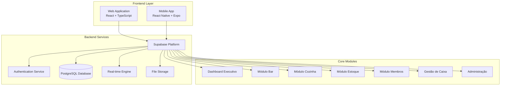
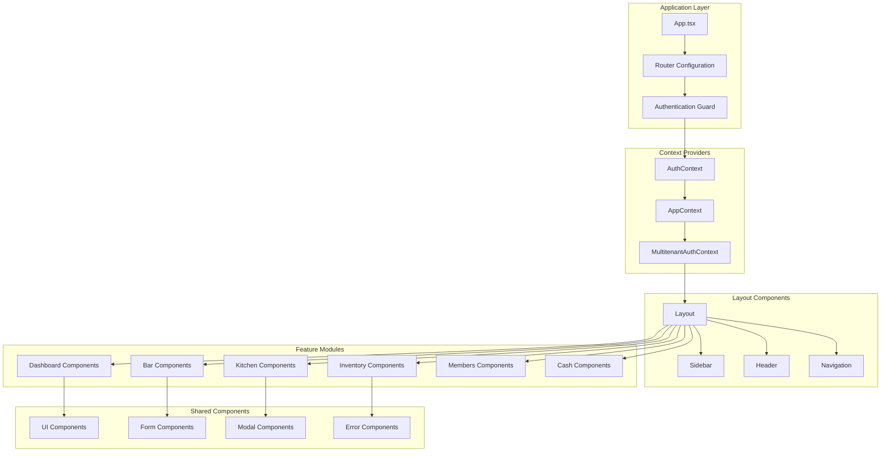
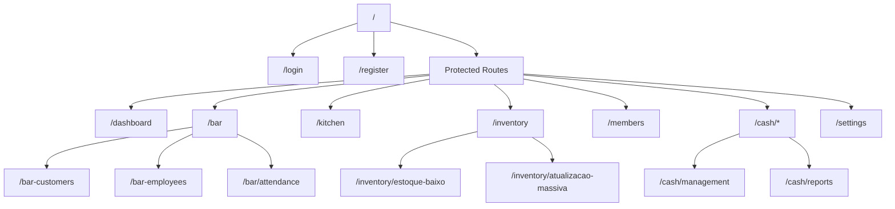
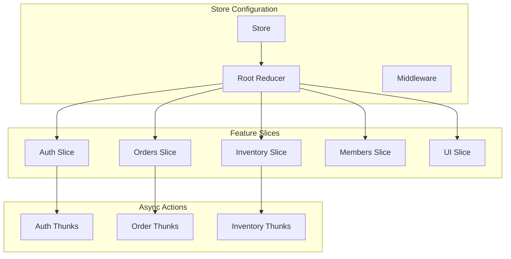
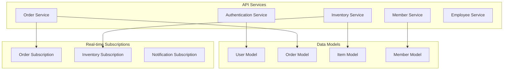
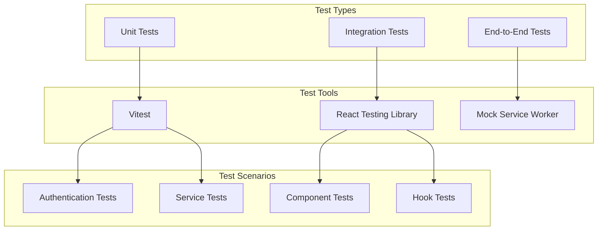

# ClubManager Pro - Sistema de Gerenciamento de Clubes

## Overview

ClubManager Pro é um sistema modular e escalável de gestão empresarial desenvolvido especificamente para clubes recreativos e esportivos (AABB - Associação Atlética Banco do Brasil). O sistema oferece uma solução completa para modernizar e otimizar operações diárias, desde o atendimento no bar até o controle financeiro e gestão de membros.

### Propósito Central
Transformar a gestão tradicional de clubes através de uma plataforma tecnológica integrada que proporciona:
- Operações em tempo real com sincronização automática
- Controle granular de permissões e segurança
- Interface multi-dispositivo (web e mobile)
- Arquitetura preparada para múltiplas unidades (multitenant)

### Contexto de Negócio
O sistema atende às necessidades específicas de clubes que possuem:
- Múltiplos pontos de atendimento (bar, cozinha, balcão)
- Gestão de funcionários com diferentes níveis de acesso
- Controle de estoque e inventário
- Sistema de comandas e pedidos
- Gestão de membros/sócios
- Controle de caixa e fluxo financeiro

## Architecture

### Arquitetura Geral do Sistema



### Tecnologias Principais

| Camada | Tecnologia | Justificativa |
|--------|------------|---------------|
| Frontend Web | React 19 + TypeScript | Componentização, type safety, performance |
| Frontend Mobile | React Native + Expo | Desenvolvimento cross-platform unificado |
| Backend | Supabase | BaaS completo com real-time, auth e storage |
| Banco de Dados | PostgreSQL | Robustez, ACID compliance, escalabilidade |
| Estado Global | Redux Toolkit | Gerenciamento previsível do estado |
| UI Framework | Tailwind CSS | Desenvolvimento rápido e consistente |
| Forms | React Hook Form + Zod | Validação type-safe e performance |

### Padrões Arquiteturais

#### Multi-tenant Architecture
O sistema suporta múltiplas unidades/clubes através de:
- Isolamento de dados por empresa/clube
- Configurações específicas por tenant
- Políticas de segurança RLS (Row Level Security)

#### Real-time Synchronization
Atualizações instantâneas entre dispositivos através de:
- WebSockets para comunicação bidirecional
- Event-driven updates para mudanças de estado
- Sincronização automática de pedidos, estoque e caixa

#### Component-based Design
Arquitetura modular baseada em:
- Componentes reutilizáveis e composáveis
- Contextos específicos por funcionalidade
- Hooks customizados para lógica de negócio

## Technology Stack & Dependencies

### Frontend Web Dependencies

#### Core Framework
- **React 19.1.0**: Framework principal com concurrent features
- **TypeScript 5.8.3**: Type safety e developer experience
- **Vite 6.3.5**: Build tool moderno e rápido

#### State Management & Data Fetching
- **Redux Toolkit**: Estado global da aplicação
- **React Hook Form 7.62.0**: Gerenciamento de formulários
- **Zod 4.1.9**: Validação de schemas

#### UI & Styling
- **Tailwind CSS 3.4.1**: Framework CSS utility-first
- **Lucide React 0.511.0**: Biblioteca de ícones
- **Framer Motion 12.23.12**: Animações e transições
- **Heroicons**: Ícones complementares

#### Backend Integration
- **Supabase JS 2.56.1**: Cliente para integração com backend
- **Axios 1.9.0**: Cliente HTTP adicional

### Mobile App Dependencies

#### Core Framework
- **React Native 0.81.4**: Framework mobile nativo
- **Expo 54.0.7**: Plataforma de desenvolvimento

#### Navigation & State
- **React Navigation 7.x**: Navegação entre telas
- **Redux Toolkit 2.9.0**: Estado global
- **Redux Persist 6.0.0**: Persistência do estado

#### Authentication & Security
- **Expo Local Authentication 17.0.7**: Biometria
- **Expo Secure Store 15.0.7**: Armazenamento seguro

### Development & Testing Tools

#### Testing Framework
- **Vitest 3.2.4**: Framework de testes moderno
- **Testing Library**: Testes centrados no usuário
- **JSDOM**: Ambiente de DOM para testes

#### Code Quality
- **ESLint 9.27.0**: Linting de código
- **TypeScript ESLint**: Rules específicas para TS
- **Prettier**: Formatação de código

## Component Architecture

### Estrutura de Componentes



### Component Hierarchy

#### Authentication Layer
- **AuthProvider**: Gerenciamento global de autenticação
- **MultitenantAuthProvider**: Contexto multi-tenant
- **ProtectedRoute**: Proteção de rotas autenticadas

#### Layout Components
- **Layout**: Container principal com sidebar e outlet
- **Sidebar**: Navegação lateral com módulos
- **Header**: Barra superior com informações do usuário

#### Feature-Specific Components

##### Dashboard Module
- **Dashboard**: Visão geral executiva
- **KPICard**: Cartões de indicadores
- **RecentOrders**: Lista de pedidos recentes
- **StockAlerts**: Alertas de estoque baixo

##### Bar Module
- **BarModule**: Interface principal do bar
- **OrderModal**: Modal de criação de pedidos
- **CommandCard**: Cartão de comanda
- **StatusUpdater**: Atualizador de status

##### Kitchen Module
- **KitchenModule**: Interface da cozinha
- **OrderQueue**: Fila de pedidos
- **PreparationTimer**: Timer de preparo
- **MenuManager**: Gestão do cardápio

##### Inventory Module
- **InventoryModule**: Gestão de estoque
- **ItemList**: Lista de itens
- **StockForm**: Formulário de estoque
- **BulkUpdate**: Atualização em massa

### Props/State Management

#### Context Structure
```typescript
interface AuthContextType {
  user: User | null
  loading: boolean
  signIn: (credentials: LoginCredentials) => Promise<void>
  signOut: () => Promise<void>
  signUp: (userData: RegisterData) => Promise<void>
}

interface AppContextType {
  currentTenant: Tenant | null
  permissions: UserPermissions
  notifications: Notification[]
  updateNotifications: (notifications: Notification[]) => void
}
```

#### Component Props Patterns
- **Compound Components**: Para componentes complexos
- **Render Props**: Para lógica reutilizável
- **Custom Hooks**: Para estado e efeitos compartilhados

### Lifecycle Methods/Hooks

#### Custom Hooks Principais

##### Authentication Hooks
- **useAuth**: Acesso ao contexto de autenticação
- **usePermissions**: Verificação de permissões
- **useProfile**: Dados do perfil do usuário

##### Data Hooks
- **useOrders**: Gestão de pedidos
- **useInventory**: Gestão de estoque
- **useMembers**: Gestão de membros
- **useRealtime**: Atualizações em tempo real

##### Utility Hooks
- **useLocalStorage**: Persistência local
- **useDebounce**: Debounce de inputs
- **useErrorHandler**: Tratamento de erros

### Example Component Usage

#### Creating a New Order
```typescript
// Uso do componente OrderModal
<OrderModal
  isOpen={isModalOpen}
  onClose={() => setIsModalOpen(false)}
  onSubmit={handleOrderSubmit}
  tableNumber={selectedTable}
  menuItems={availableItems}
/>
```

#### Displaying Order Cards
```typescript
// Uso do componente CommandCard
{orders.map(order => (
  <CommandCard
    key={order.id}
    order={order}
    onStatusChange={handleStatusChange}
    showActions={user.permissions.includes('UPDATE_ORDERS')}
  />
))}
```

## Routing & Navigation

### Route Structure



### Navigation Guard System

#### Route Protection
- **AuthGuard**: Verifica autenticação
- **PermissionGuard**: Verifica permissões específicas
- **TenantGuard**: Valida acesso ao tenant

#### Navigation Flow
1. **Unauthenticated**: Redirecionamento para `/login`
2. **Authenticated**: Acesso às rotas protegidas
3. **Insufficient Permissions**: Exibição de mensagem de erro
4. **Invalid Tenant**: Redirecionamento para seleção

## Styling Strategy

### Tailwind CSS Configuration

#### Design System
```javascript
// Configuração do tema
module.exports = {
  theme: {
    extend: {
      colors: {
        primary: {
          50: '#eff6ff',
          500: '#3b82f6',
          900: '#1e3a8a'
        },
        brand: {
          blue: '#1e40af',
          green: '#059669',
          red: '#dc2626'
        }
      },
      spacing: {
        '18': '4.5rem',
        '88': '22rem'
      }
    }
  }
}
```

#### Component Classes
- **Layout**: Classes para estrutura geral
- **Typography**: Escalas tipográficas consistentes
- **Colors**: Paleta de cores do sistema
- **Spacing**: Sistema de espaçamento harmonioso

### Responsive Design Strategy
- **Mobile First**: Design começando pelo mobile
- **Breakpoints**: sm (640px), md (768px), lg (1024px), xl (1280px)
- **Adaptive Components**: Componentes que se adaptam ao tamanho

## State Management

### Redux Toolkit Structure



### State Architecture

#### Auth State
```typescript
interface AuthState {
  user: User | null
  loading: boolean
  error: string | null
  permissions: Permission[]
  currentTenant: Tenant | null
}
```

#### Orders State
```typescript
interface OrdersState {
  orders: Order[]
  currentOrder: Order | null
  filters: OrderFilters
  loading: boolean
  realtimeUpdates: boolean
}
```

#### Global UI State
```typescript
interface UIState {
  sidebarOpen: boolean
  notifications: Notification[]
  modals: ModalState
  theme: 'light' | 'dark'
}
```

### State Synchronization
- **Real-time Updates**: Via Supabase subscriptions
- **Optimistic Updates**: Para melhor UX
- **Error Recovery**: Rollback em caso de falha
- **Persistence**: Estado crítico persistido localmente

## API Integration Layer

### Supabase Integration

#### Client Configuration
```typescript
const supabaseConfig = {
  url: process.env.VITE_SUPABASE_URL,
  anonKey: process.env.VITE_SUPABASE_ANON_KEY,
  options: {
    auth: {
      persistSession: true,
      autoRefreshToken: true
    },
    realtime: {
      params: {
        eventsPerSecond: 10
      }
    }
  }
}
```

#### Service Layer Architecture



### API Methods

#### CRUD Operations
- **Create**: Criação de registros com validação
- **Read**: Busca com filtros e paginação
- **Update**: Atualização com merge de dados
- **Delete**: Exclusão com soft delete quando aplicável

#### Real-time Features
- **Subscriptions**: Escuta de mudanças específicas
- **Broadcasts**: Envio de mensagens entre clientes
- **Presence**: Rastreamento de usuários online

### Error Handling Strategy
- **Network Errors**: Retry automático com backoff
- **Validation Errors**: Exibição para o usuário
- **Server Errors**: Log e fallback gracioso
- **Auth Errors**: Redirecionamento para login

## Testing Strategy

### Testing Architecture



### Test Categories

#### Unit Tests
- **Components**: Renderização e props
- **Hooks**: Lógica de estado e efeitos
- **Utils**: Funções utilitárias
- **Services**: Métodos de API

#### Integration Tests
- **Authentication Flow**: Login/logout completo
- **Order Management**: Criação e atualização de pedidos
- **Real-time Updates**: Sincronização entre componentes

#### Test Configuration
```typescript
// Configuração do Vitest
export default defineConfig({
  test: {
    environment: 'jsdom',
    setupFiles: ['./src/__tests__/setup.ts'],
    coverage: {
      provider: 'v8',
      reporter: ['text', 'html', 'json']
    }
  }
})
```

### Testing Best Practices
- **AAA Pattern**: Arrange, Act, Assert
- **User-Centric**: Testes focados no comportamento do usuário
- **Mock External Dependencies**: Isolamento de dependências externas
- **Performance Testing**: Scripts para teste de performance