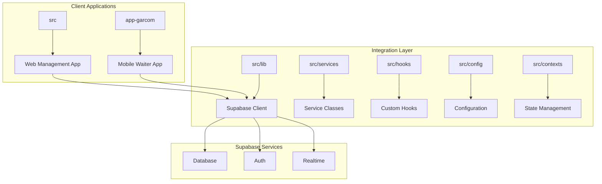
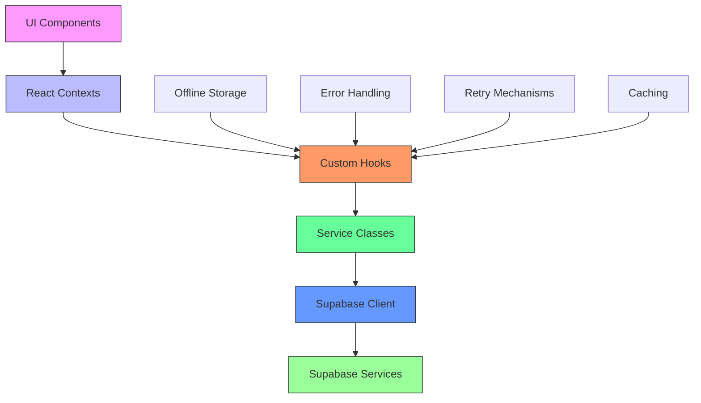
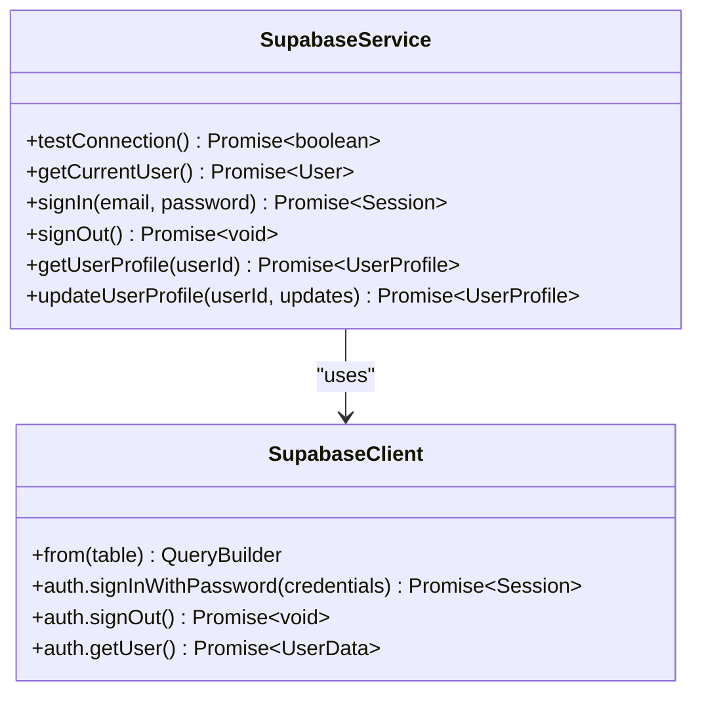
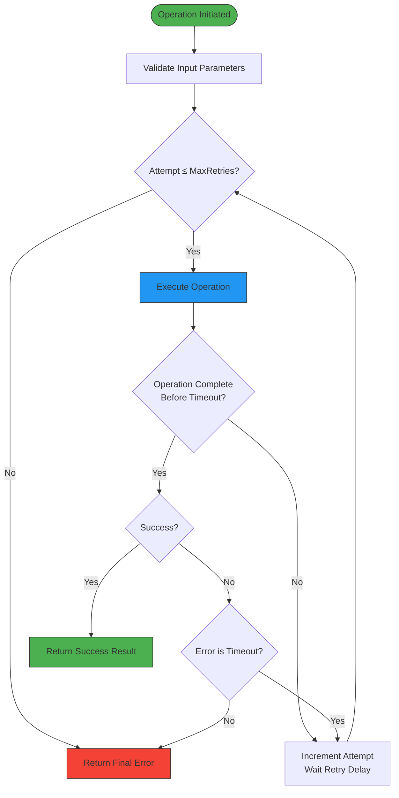
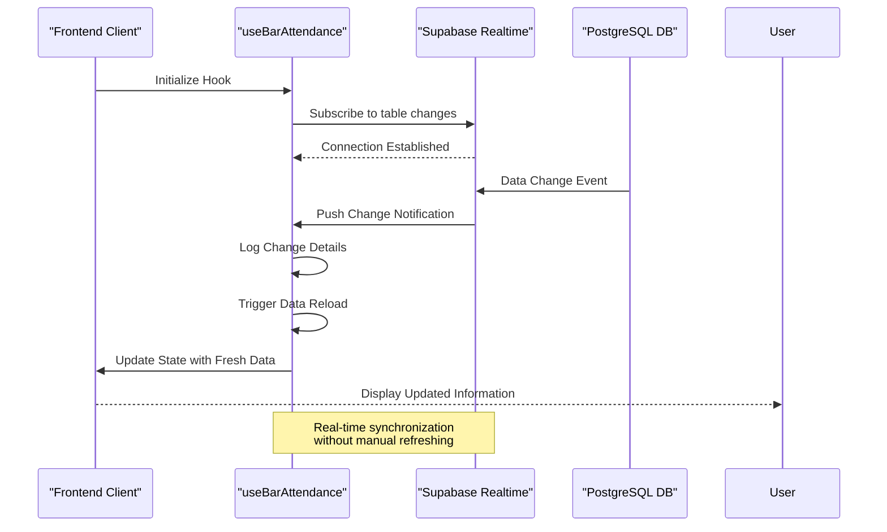
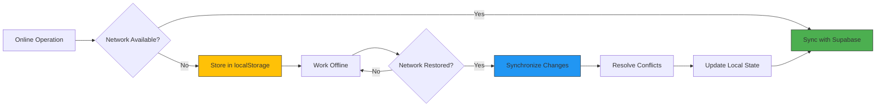
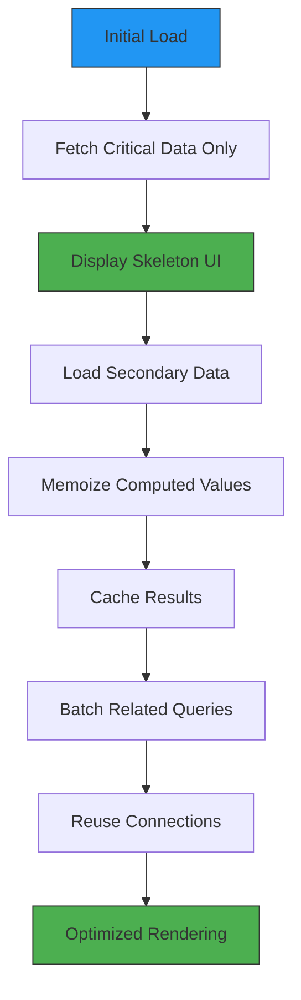
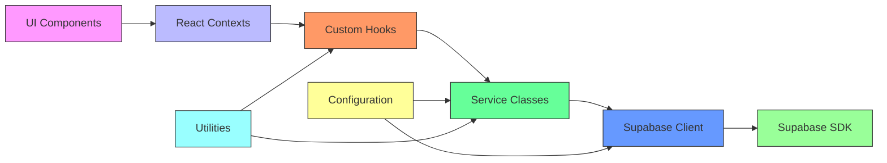

# API Integration Layer

<cite>
**Referenced Files in This Document**   
- [SupabaseService.ts](file://app-garcom/src/services/SupabaseService.ts)
- [supabase.ts](file://src/lib/supabase.ts)
- [supabase.ts](file://src/config/supabase.ts)
- [useRetryOperation.ts](file://src/hooks/useRetryOperation.ts)
- [useOfflineStorage.ts](file://src/hooks/useOfflineStorage.ts)
- [AppContextOptimized.tsx](file://src/contexts/AppContextOptimized.tsx)
- [useBarAttendance.ts](file://src/hooks/useBarAttendance.ts)
</cite>

## Table of Contents
1. [Introduction](#introduction)
2. [Project Structure](#project-structure)
3. [Core Components](#core-components)
4. [Architecture Overview](#architecture-overview)
5. [Detailed Component Analysis](#detailed-component-analysis)
6. [Dependency Analysis](#dependency-analysis)
7. [Performance Considerations](#performance-considerations)
8. [Troubleshooting Guide](#troubleshooting-guide)
9. [Conclusion](#conclusion)

## Introduction
This document provides comprehensive architectural documentation for the API integration layer of the AABB-system, focusing on client-side integration with Supabase services. The system leverages Supabase for database operations, authentication, and real-time data synchronization across multiple domains including bar attendance, inventory management, and employee operations. The architecture implements service-oriented patterns with dedicated classes and hooks for different functional areas, robust error handling mechanisms, and strategies for maintaining functionality under unreliable network conditions.

## Project Structure
The project is organized into two main application directories: `app-garcom` for mobile/tablet waiter interfaces and the main web application in the root `src` directory. The API integration layer is primarily located in the `src/lib`, `src/services`, and `src/hooks` directories. Configuration files are centralized in `src/config`, while context providers in `src/contexts` manage global state and Supabase connections. The structure follows a feature-based organization with components, hooks, and types separated by domain, enabling maintainability and scalability of the integration layer.



**Diagram sources**
- [supabase.ts](file://src/lib/supabase.ts)
- [SupabaseService.ts](file://app-garcom/src/services/SupabaseService.ts)

**Section sources**
- [app-garcom](file://app-garcom)
- [src](file://src)

## Core Components
The API integration layer consists of several core components that facilitate communication between the client applications and Supabase services. These include the Supabase client configuration, service classes for specific domains, custom React hooks for data fetching and state management, and context providers for global state. The layer implements a service-oriented architecture where each major domain has dedicated service classes or hooks that encapsulate the business logic and API interactions, promoting separation of concerns and code reusability across the application.

**Section sources**
- [supabase.ts](file://src/lib/supabase.ts)
- [SupabaseService.ts](file://app-garcom/src/services/SupabaseService.ts)
- [useBarAttendance.ts](file://src/hooks/useBarAttendance.ts)

## Architecture Overview
The API integration architecture follows a layered pattern with clear separation between service clients, business logic, and UI components. At the foundation is the Supabase client configured with proper authentication and connection settings. Above this layer, service classes and custom hooks provide domain-specific functionality, implementing patterns such as service locator and dependency injection. Context providers manage global state and real-time subscriptions, while error handling and retry mechanisms ensure reliability. The architecture supports both online and offline operation through local storage and synchronization strategies.



**Diagram sources**
- [supabase.ts](file://src/lib/supabase.ts)
- [AppContextOptimized.tsx](file://src/contexts/AppContextOptimized.tsx)
- [useBarAttendance.ts](file://src/hooks/useBarAttendance.ts)

## Detailed Component Analysis

### Service Layer Implementation
The service layer implements a pattern of dedicated service classes for different domains, providing a clean abstraction over direct Supabase API calls. In the mobile application, the `SupabaseService` class provides static methods for authentication and user profile management, encapsulating the underlying Supabase SDK calls. This service-oriented approach allows for easier testing, better code organization, and simplified maintenance of API integration logic across the application.



**Diagram sources**
- [SupabaseService.ts](file://app-garcom/src/services/SupabaseService.ts)

**Section sources**
- [SupabaseService.ts](file://app-garcom/src/services/SupabaseService.ts)

### Error Handling and Retry Mechanisms
The integration layer implements comprehensive error handling and retry mechanisms to ensure reliability under unstable network conditions. The `useRetryOperation` hook provides a configurable retry strategy with exponential backoff, timeout protection, and intelligent retry logic that distinguishes between transient network errors and permanent failures. This mechanism prevents unnecessary retries for non-transient errors while ensuring robust recovery from temporary connectivity issues.



**Diagram sources**
- [useRetryOperation.ts](file://src/hooks/useRetryOperation.ts)

**Section sources**
- [useRetryOperation.ts](file://src/hooks/useRetryOperation.ts)

### Real-time Subscription Patterns
The system implements real-time subscription patterns using Supabase's PostgreSQL change notifications to provide live updates across the application. The `useBarAttendance` hook establishes subscriptions to relevant database tables (bar_tables, comandas, comanda_items) and automatically refreshes the local state when changes occur. This push-based architecture ensures all clients have up-to-date information without requiring constant polling, improving both performance and user experience.



**Diagram sources**
- [useBarAttendance.ts](file://src/hooks/useBarAttendance.ts)

**Section sources**
- [useBarAttendance.ts](file://src/hooks/useBarAttendance.ts)

### Caching and Offline Persistence
The integration layer implements sophisticated caching and offline persistence strategies to maintain functionality during network outages. The `useOfflineStorage` hook manages local storage of employee data, allowing users to continue working when disconnected. When connectivity is restored, the hook automatically synchronizes offline changes with the remote database. This hybrid approach combines local storage for immediate access with cloud synchronization for data consistency across devices.



**Diagram sources**
- [useOfflineStorage.ts](file://src/hooks/useOfflineStorage.ts)

**Section sources**
- [useOfflineStorage.ts](file://src/hooks/useOfflineStorage.ts)

### Performance Optimization Techniques
The architecture incorporates several performance optimization techniques to enhance responsiveness and reduce server load. These include query batching, connection pooling through the shared Supabase client instance, selective data loading, and memoization of computed values. The `AppContextOptimized` implementation demonstrates these principles by loading only essential data initially and fetching additional information on-demand, significantly reducing initial load times and bandwidth usage.



**Diagram sources**
- [AppContextOptimized.tsx](file://src/contexts/AppContextOptimized.tsx)

**Section sources**
- [AppContextOptimized.tsx](file://src/contexts/AppContextOptimized.tsx)

### Configuration Management
Configuration management for API endpoints and credentials is implemented through environment-based settings with fallback mechanisms. The `supabase.ts` configuration file validates credentials at runtime and provides mock clients when proper credentials are not available, enabling development without requiring a full Supabase setup. This approach ensures security by preventing accidental exposure of production credentials while maintaining flexibility for different deployment environments.

```mermaid
classDiagram
class SUPABASE_CONFIG {
+url : string
+anonKey : string
+serviceRoleKey : string
}
class supabase {
+isSupabaseConfigured : boolean
+isAdminConfigured : boolean
+isValidCredentials : boolean
+hasServiceRoleKey : boolean
}
class mockClient {
+url : string
+key : string
}
SUPABASE_CONFIG --> supabase : "provides"
supabase --> mockClient : "fallback when invalid"
note right of supabase : Runtime validation and<br/>conditional client creation
```

**Diagram sources**
- [supabase.ts](file://src/lib/supabase.ts)
- [supabase.ts](file://src/config/supabase.ts)

**Section sources**
- [supabase.ts](file://src/lib/supabase.ts)
- [supabase.ts](file://src/config/supabase.ts)

## Dependency Analysis
The API integration layer has well-defined dependencies that follow a unidirectional flow from UI components through service layers to the Supabase client. The architecture minimizes circular dependencies by organizing code into distinct layers with clear responsibilities. External dependencies are limited to the Supabase SDK and standard React libraries, reducing the attack surface and simplifying maintenance. The use of TypeScript interfaces ensures type safety across component boundaries while allowing for flexible implementation details within each layer.



**Diagram sources**
- [package.json](file://package.json)
- [tsconfig.json](file://tsconfig.json)

**Section sources**
- [package.json](file://package.json)
- [tsconfig.json](file://tsconfig.json)

## Performance Considerations
The integration layer incorporates several performance optimizations to ensure responsive user experiences even with large datasets. These include lazy loading of non-critical data, memoization of expensive computations, efficient real-time subscription management, and strategic data fetching patterns. The architecture balances the need for real-time updates with bandwidth conservation by subscribing only to essential tables and using debounce mechanisms for rapid-fire events. Additionally, the use of connection pooling through a singleton Supabase client instance reduces connection overhead and improves overall system efficiency.

**Section sources**
- [AppContextOptimized.tsx](file://src/contexts/AppContextOptimized.tsx)
- [useBarAttendance.ts](file://src/hooks/useBarAttendance.ts)

## Troubleshooting Guide
When encountering issues with the API integration layer, consider the following diagnostic steps:
1. Verify Supabase credentials are properly configured in environment variables
2. Check network connectivity and firewall settings
3. Examine browser console and server logs for error messages
4. Validate that Supabase realtime channels are properly subscribed and unsubscribed
5. Test the connection using the built-in `testConnection` method
6. Clear corrupted authentication tokens using the provided utility
7. Verify that database schema matches expected structure
8. Check rate limiting and quota usage in the Supabase dashboard

Common issues often stem from misconfigured credentials, network interruptions, or schema mismatches between client expectations and database structure. The layered architecture facilitates isolation of problems to specific components, enabling targeted troubleshooting.

**Section sources**
- [SupabaseService.ts](file://app-garcom/src/services/SupabaseService.ts)
- [clearTokens.ts](file://src/utils/clearTokens.ts)

## Conclusion
The API integration layer of the AABB-system demonstrates a robust, scalable architecture for client-side integration with Supabase services. By implementing service-oriented patterns, comprehensive error handling, real-time synchronization, and offline capabilities, the system provides a reliable user experience across varying network conditions. The layered architecture promotes maintainability and extensibility, making it straightforward to add support for additional external services or third-party APIs. Future enhancements could include more sophisticated conflict resolution for offline edits, enhanced monitoring of API usage, and improved developer tooling for debugging integration issues.