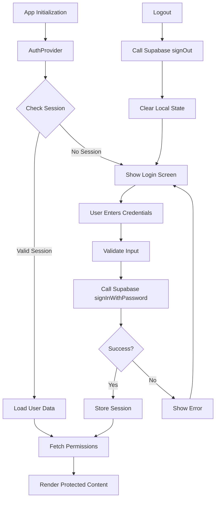
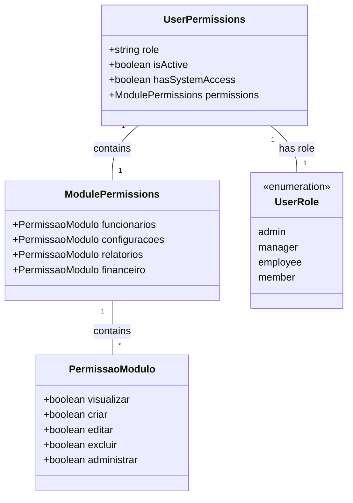
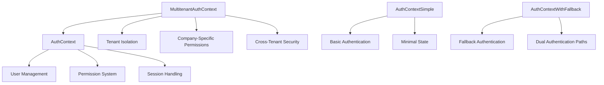
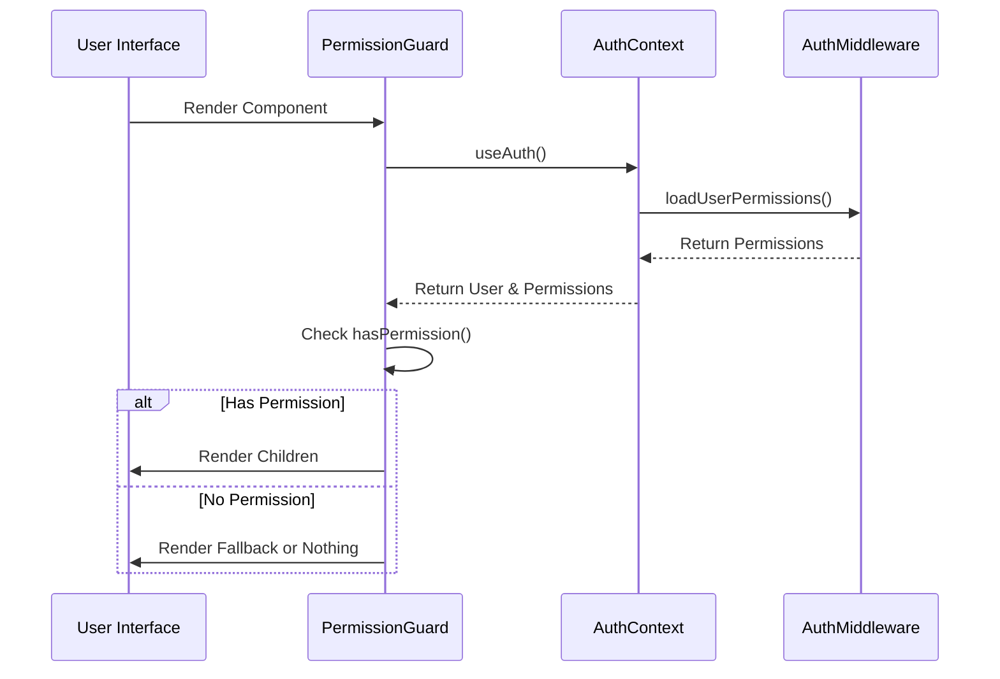

# Authentication & Authorization

<cite>
**Referenced Files in This Document**   
- [AuthContext.tsx](file://src/contexts/AuthContext.tsx)
- [MultitenantAuthContext.tsx](file://src/contexts/MultitenantAuthContext.tsx)
- [ProtectedRoute.tsx](file://src/components/Auth/ProtectedRoute.tsx)
- [PermissionGuard.tsx](file://src/components/Auth/PermissionGuard.tsx)
- [supabase.ts](file://src/lib/supabase.ts)
- [authMiddleware.ts](file://src/middleware/authMiddleware.ts)
- [SupabaseService.ts](file://app-garcom/src/services/SupabaseService.ts)
- [AUTHENTICATION_SETUP.md](file://app-garcom/AUTHENTICATION_SETUP.md)
</cite>

## Table of Contents
1. [Introduction](#introduction)
2. [Supabase-Based Authentication Flow](#supabase-based-authentication-flow)
3. [Role-Based Access Control with Hierarchical Privileges](#role-based-access-control-with-hierarchical-privileges)
4. [Authentication Contexts](#authentication-contexts)
5. [Permission Checking Mechanisms](#permission-checking-mechanisms)
6. [Demo Mode and Fallback Authentication](#demo-mode-and-fallback-authentication)
7. [Security Considerations](#security-considerations)
8. [Custom Authentication Flows and External Identity Providers](#custom-authentication-flows-and-external-identity-providers)

## Introduction
The AABB-system implements a comprehensive authentication and authorization framework built on Supabase Auth, providing secure user management, role-based access control, and multitenant capabilities. This document details the system's architecture, components, and security mechanisms that govern user access and permissions across the application.

## Supabase-Based Authentication Flow

The authentication system leverages Supabase Auth for secure user management, implementing standard flows for login, registration, password reset, and session management. The primary implementation is found in the `AuthContext` provider which manages the global authentication state.

**Diagram sources**
- [AuthContext.tsx](file://src/contexts/AuthContext.tsx#L1-L362)
- [SupabaseService.ts](file://app-garcom/src/services/SupabaseService.ts#L15-L80)

**Section sources**
- [AuthContext.tsx](file://src/contexts/AuthContext.tsx#L1-L362)
- [SupabaseService.ts](file://app-garcom/src/services/SupabaseService.ts#L15-L80)
- [AUTHENTICATION_SETUP.md](file://app-garcom/AUTHENTICATION_SETUP.md#L1-L190)

## Role-Based Access Control with Hierarchical Privileges

The system implements a sophisticated role-based access control (RBAC) system with support for hierarchical privileges. Users are assigned roles that determine their access level, with administrative privileges cascading through the hierarchy.

The permission model is defined by the `UserPermissions` interface, which includes role information and granular module-level permissions. The system supports multiple privilege levels including 'visualizar' (view), 'criar' (create), 'editar' (edit), 'excluir' (delete), and 'administrar' (administer).

**Diagram sources**
- [AuthContext.tsx](file://src/contexts/AuthContext.tsx#L1-L362)
- [types/multitenant.ts](file://src/types/multitenant.ts#L1-L100)

**Section sources**
- [AuthContext.tsx](file://src/contexts/AuthContext.tsx#L1-L362)
- [authMiddleware.ts](file://src/middleware/authMiddleware.ts#L1-L300)

## Authentication Contexts

The system provides multiple authentication contexts to support different use cases and complexity levels:

### AuthContext
The primary authentication context that provides full functionality including user data, permissions, and utility methods for checking access rights. It uses Supabase's real-time authentication state changes to keep the application state synchronized.

### MultitenantAuthContext
Designed for multi-tenant scenarios where users belong to specific organizations or companies. This context extends the basic authentication model by including company information and tenant-specific permissions.

**Diagram sources**
- [AuthContext.tsx](file://src/contexts/AuthContext.tsx#L1-L362)
- [MultitenantAuthContext.tsx](file://src/contexts/MultitenantAuthContext.tsx#L1-L318)

**Section sources**
- [AuthContext.tsx](file://src/contexts/AuthContext.tsx#L1-L362)
- [MultitenantAuthContext.tsx](file://src/contexts/MultitenantAuthContext.tsx#L1-L318)
- [AuthContextSimple.tsx](file://src/contexts/AuthContextSimple.tsx#L1-L100)
- [AuthContextWithFallback.tsx](file://src/contexts/AuthContextWithFallback.tsx#L1-L100)

## Permission Checking Mechanisms

The system provides several components and utilities for enforcing permission checks throughout the application:

### PermissionGuard
A React component that conditionally renders children based on user permissions. It can check for specific permissions, roles, or administrative status.

### ProtectedRoute
A higher-order component that protects entire routes based on authentication and authorization requirements. It handles loading states and provides fallback UI for unauthorized access attempts.

**Diagram sources**
- [ProtectedRoute.tsx](file://src/components/Auth/ProtectedRoute.tsx#L1-L273)
- [PermissionGuard.tsx](file://src/components/Auth/PermissionGuard.tsx#L1-L147)

**Section sources**
- [ProtectedRoute.tsx](file://src/components/Auth/ProtectedRoute.tsx#L1-L273)
- [PermissionGuard.tsx](file://src/components/Auth/PermissionGuard.tsx#L1-L147)
- [auth.ts](file://src/utils/auth.ts#L1-L54)

## Demo Mode and Fallback Authentication Paths

The system includes support for demo mode and fallback authentication paths to facilitate testing and emergency access scenarios. The demo mode allows users to experience the application without requiring account creation, while fallback paths provide alternative authentication methods when primary systems are unavailable.

The `AuthContextWithFallback` implementation provides a mechanism for gracefully handling authentication failures by offering alternative login methods or temporary access credentials.

**Section sources**
- [AuthContextWithFallback.tsx](file://src/contexts/AuthContextWithFallback.tsx#L1-L100)
- [DemoIndicator.tsx](file://src/components/Auth/DemoIndicator.tsx#L1-L50)
- [DemoWelcome.tsx](file://src/components/Auth/DemoWelcome.tsx#L1-L50)

## Security Considerations

The authentication system incorporates multiple security measures to protect user credentials and prevent common vulnerabilities:

- Credential storage using encrypted storage mechanisms
- Token expiration and automatic session refresh
- Protection against brute force attacks through rate limiting
- Secure password policies and validation
- Comprehensive audit logging of authentication events
- Cross-tenant data isolation in multi-tenant scenarios

The system also implements defense-in-depth strategies including input validation, error handling that doesn't leak sensitive information, and secure communication protocols.

**Section sources**
- [authMiddleware.ts](file://src/middleware/authMiddleware.ts#L1-L300)
- [authErrors.ts](file://src/utils/authErrors.ts#L1-L206)
- [auditLogger.ts](file://src/utils/auditLogger.ts#L1-L100)

## Custom Authentication Flows and External Identity Providers

The modular architecture allows for the implementation of custom authentication flows and integration with external identity providers. Developers can extend the base authentication context to support additional identity sources such as social logins, enterprise SSO systems, or biometric authentication.

The `SupabaseService` class provides a clean abstraction layer for authentication operations, making it easier to integrate alternative identity providers while maintaining a consistent interface for the rest of the application.

**Section sources**
- [SupabaseService.ts](file://app-garcom/src/services/SupabaseService.ts#L15-L80)
- [authMiddleware.ts](file://src/middleware/authMiddleware.ts#L1-L300)
- [auth.ts](file://src/utils/auth.ts#L1-L54)