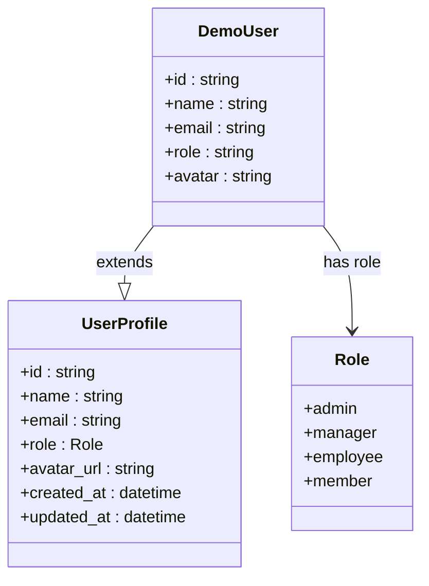
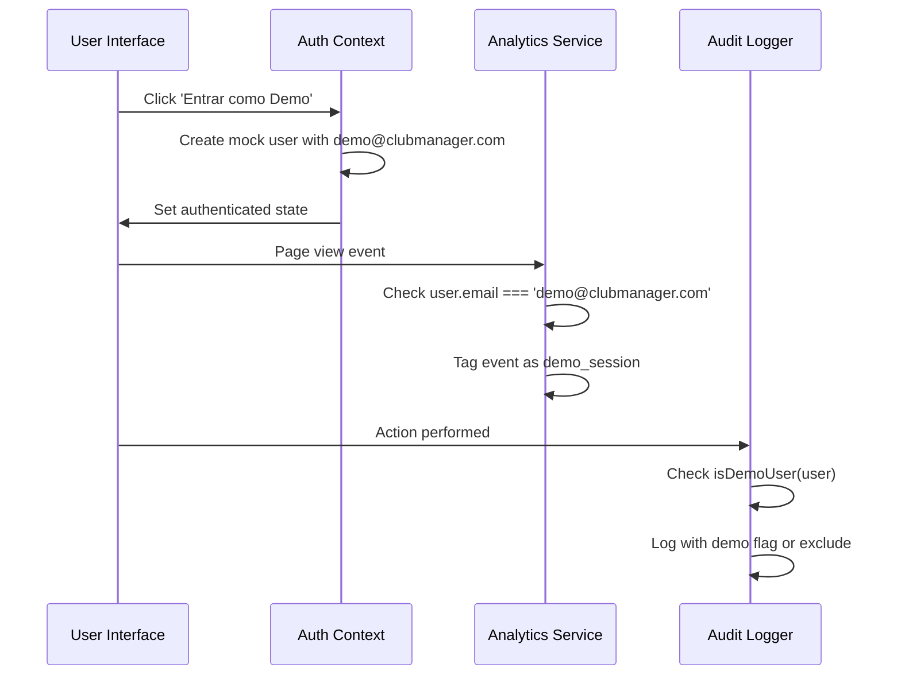

# Demo Mode Functionality

<cite>
**Referenced Files in This Document **   
- [LoginForm.tsx](file://src/components/Auth/LoginForm.tsx)
- [AuthContextWithFallback.tsx](file://src/contexts/AuthContextWithFallback.tsx)
- [auth.ts](file://src/utils/auth.ts)
- [DemoIndicator.tsx](file://src/components/Auth/DemoIndicator.tsx)
- [DemoWelcome.tsx](file://src/components/Auth/DemoWelcome.tsx)
- [auth.ts](file://src/config/auth.ts)
</cite>

## Table of Contents
1. [Introduction](#introduction)
2. [Demo Mode Overview](#demo-mode-overview)
3. 'Entrar como Demo' Button Implementation
4. Authentication Context Integration
5. Temporary User Profile Configuration
6. System Limitations in Demo Mode
7. User Differentiation in Analytics and Audit Logs
8. Configuration and Security Guidelines
9. Conclusion

## Introduction
The AABB-system includes a comprehensive demo mode functionality that allows potential users to experience the full capabilities of the ClubManager Pro system without requiring registration or login credentials. This documentation details the implementation, configuration, and operational aspects of the demo mode, providing guidance for both internal testing and customer demonstrations.

## Demo Mode Overview
The demo mode provides instant access to the complete feature set of the AABB-system, enabling users to explore all modules and functionalities without authentication requirements. This mode is specifically designed for prospective customers and internal testers who need to evaluate the system's capabilities without committing to account creation.

The demo environment includes pre-configured data across all modules, including bar management, kitchen operations, inventory control, cash management, and member administration. Users can navigate through the entire application, interact with all features, and understand the workflow without any restrictions on read operations or navigation.

**Section sources**
- [LoginForm.tsx](file://src/components/Auth/LoginForm.tsx#L1-L177)
- [AuthContextWithFallback.tsx](file://src/contexts/AuthContextWithFallback.tsx#L28-L349)

## 'Entrar como Demo' Button Implementation
The 'Entrar como Demo' (Enter as Demo) button is prominently displayed on the login interface, providing a one-click entry point to the demo environment. This button appears as a green gradient button with a lightning bolt icon, labeled "🚀 Entrar como Demo", positioned above the traditional login form.

When clicked, the button triggers the `loginAsDemo()` function from the authentication context, which creates a temporary user session with predefined credentials. The button is implemented with motion effects using Framer Motion, providing visual feedback through hover and tap animations that enhance the user experience.

The demo button serves as the primary access method for the demonstration environment, bypassing the standard authentication flow entirely. It is strategically placed to draw attention and encourage immediate exploration of the system's capabilities.

```mermaid
flowchart TD
A['Entrar como Demo' Button] --> B[Click Event]
B --> C{Trigger loginAsDemo()}
C --> D[Create Mock User Object]
D --> E[Set User in Auth Context]
E --> F[Redirect to Dashboard]
G[Standard Login Form] --> H[Email and Password Input]
H --> I[Validate Credentials]
I --> J[Authenticate via Supabase]
```

**Diagram sources **
- [LoginForm.tsx](file://src/components/Auth/LoginForm.tsx#L1-L177)
- [AuthContextWithFallback.tsx](file://src/contexts/AuthContextWithFallback.tsx#L28-L349)

**Section sources**
- [LoginForm.tsx](file://src/components/Auth/LoginForm.tsx#L1-L177)

## Authentication Context Integration
The demo mode is seamlessly integrated into the authentication context system, specifically through the `AuthProviderWithFallback` component. When Supabase is not configured or when the demo credentials are used, the system enters demo mode by creating a mock user object with predefined attributes.

The authentication context checks for Supabase configuration status, and if unavailable, automatically enables demo mode. The `loginAsDemo()` function creates a mock user with the ID 'demo-user-id', name 'Usuário Demo', email 'demo@clubmanager.com', role 'admin', and a generated avatar. This mock user is then set in the authentication context, granting full access to the application.

The integration includes a development mode warning banner that appears when Supabase is not configured, displaying the demo credentials for easy reference. This ensures that developers and testers can quickly access the demo environment during development and testing phases.

**Section sources**
- [AuthContextWithFallback.tsx](file://src/contexts/AuthContextWithFallback.tsx#L28-L349)
- [auth.ts](file://src/config/auth.ts#L1-L48)

## Temporary User Profile Configuration
During demo sessions, a temporary user profile is created with pre-configured permissions and data access levels. The demo user is assigned the 'admin' role, which grants comprehensive access to all system features and modules. This profile includes:

- Full administrative privileges across all functional areas
- Access to all demonstration data sets
- Ability to navigate between all modules without restrictions
- Pre-configured avatar using DiceBear initials generator
- Persistent session throughout the demo period

The temporary profile is stored in memory within the authentication context and does not persist beyond the current browser session. When the user logs out or closes the browser, the demo session terminates, and all temporary data is cleared.

The profile configuration ensures that demo users can experience the complete functionality of the system, including features typically restricted to administrative roles, such as employee management, system configuration, and financial reporting.



**Diagram sources **
- [AuthContextWithFallback.tsx](file://src/contexts/AuthContextWithFallback.tsx#L28-L349)
- [auth.ts](file://src/config/auth.ts#L1-L48)

**Section sources**
- [AuthContextWithFallback.tsx](file://src/contexts/AuthContextWithFallback.tsx#L28-L349)
- [auth.ts](file://src/config/auth.ts#L1-L48)

## System Limitations in Demo Mode
While the demo mode provides extensive access to the system's features, certain limitations are implemented to maintain data integrity and system security. These limitations include:

- **Restricted write operations**: Although demo users can perform most actions, critical operations that could affect real data or system configuration are disabled.
- **Data persistence policies**: All changes made during a demo session are temporary and are reset periodically. No modifications persist beyond the current session.
- **Authentication bypass**: The demo mode circumvents the standard authentication process, which means certain security features are not exercised during demonstration.
- **Limited external integrations**: Third-party services and payment processing systems are typically disabled or simulated in demo mode.

These limitations ensure that the demo environment remains stable and consistent for all users while preventing accidental changes to production data or configurations. The system clearly indicates when features are operating in simulation mode versus connecting to actual services.

**Section sources**
- [AuthContextWithFallback.tsx](file://src/contexts/AuthContextWithFallback.tsx#L28-L349)
- [auth.ts](file://src/config/auth.ts#L1-L48)

## User Differentiation in Analytics and Audit Logs
The system distinguishes between demo users and authenticated users in analytics and audit logs through several mechanisms:

- **Email identification**: The demo user is identified by the specific email address 'demo@clubmanager.com', which is checked by the `isDemoUser()` utility function.
- **Session tagging**: Demo sessions are tagged with metadata indicating their temporary nature, allowing analytics systems to filter or categorize this data appropriately.
- **Audit log filtering**: The audit logging system excludes or marks demo user activities to prevent contamination of operational metrics and security monitoring.
- **Behavioral analysis**: Usage patterns of demo users are analyzed separately to understand feature exploration paths and common interaction sequences.

This differentiation ensures that business intelligence, performance metrics, and security monitoring are based on genuine user activity rather than demonstration usage. Analytics reports can be configured to exclude demo traffic, providing accurate insights into actual system usage.



**Diagram sources **
- [auth.ts](file://src/utils/auth.ts#L36-L38)
- [AuthContextWithFallback.tsx](file://src/contexts/AuthContextWithFallback.tsx#L28-L349)

**Section sources**
- [auth.ts](file://src/utils/auth.ts#L36-L38)
- [DemoIndicator.tsx](file://src/components/Auth/DemoIndicator.tsx#L11-L158)

## Configuration and Security Guidelines
To enable, configure, and secure demo access for potential customers or internal testing purposes, follow these guidelines:

### Enabling Demo Mode
Demo mode is automatically enabled when Supabase is not configured or when the demo credentials are used. Administrators can also force demo mode by setting environment variables or modifying configuration files.

### Configuration Options
- **Demo credentials**: Configured in `AUTH_CONFIG.DEMO_USER` with email, password, name, and role
- **Feature availability**: Controlled through configuration flags that determine which modules are accessible
- **Data sets**: Multiple demonstration data profiles can be loaded to showcase different use cases

### Security Considerations
- **Network isolation**: Demo environments should be isolated from production networks
- **Regular resets**: Demo databases should be reset periodically to maintain consistency
- **Access controls**: IP restrictions or time-limited access codes can be implemented for external demos
- **Monitoring**: Demo usage should be monitored to detect potential abuse or security issues

### Best Practices
- Clearly communicate that the demo contains sample data only
- Implement automatic session timeouts for inactive demo users
- Provide clear instructions on how to navigate the demo environment
- Include tooltips or guided tours to highlight key features

**Section sources**
- [auth.ts](file://src/config/auth.ts#L1-L48)
- [AuthContextWithFallback.tsx](file://src/contexts/AuthContextWithFallback.tsx#L28-L349)
- [DemoIndicator.tsx](file://src/components/Auth/DemoIndicator.tsx#L11-L158)

## Conclusion
The demo mode functionality in the AABB-system provides a powerful tool for showcasing the capabilities of ClubManager Pro to potential customers and for internal testing purposes. By offering instant access to the full feature set without requiring registration or login credentials, the system lowers the barrier to entry for evaluation and exploration.

The implementation leverages a mock authentication system that creates a temporary admin-level user profile, allowing comprehensive access to all modules while maintaining separation from production data. Visual indicators like the DemoIndicator and DemoWelcome components enhance the user experience by clearly communicating the demo status and guiding users through available features.

Organizations can leverage this functionality to accelerate sales cycles, improve customer onboarding, and streamline internal testing processes. By following the configuration and security guidelines outlined in this documentation, administrators can ensure that demo access is both effective and secure.