# Login Process

<cite>
**Referenced Files in This Document**   
- [LoginForm.tsx](file://src/components/Auth/LoginForm.tsx)
- [AuthContextSimple.tsx](file://src/contexts/AuthContextSimple.tsx)
- [auth.ts](file://src/config/auth.ts)
- [supabase.ts](file://src/config/supabase.ts)
- [AuthErrorDisplay.tsx](file://src/components/Auth/AuthErrorDisplay.tsx)
</cite>

## Table of Contents
1. [Introduction](#introduction)
2. [LoginForm Component Structure](#loginform-component-structure)
3. [State Management](#state-management)
4. [Authentication Flow](#authentication-flow)
5. [Demo Mode Access](#demo-mode-access)
6. [Error Handling and Recovery](#error-handling-and-recovery)
7. [Security Considerations](#security-considerations)
8. [Supabase Integration](#supabase-integration)
9. [Session Persistence](#session-persistence)
10. [Customization and Extension](#customization-and-extension)

## Introduction

The login process in the AABB-system is a critical entry point that enables users to access the ClubManager Pro application. This document provides a comprehensive analysis of the login implementation, focusing on the LoginForm component and its integration with the authentication system. The process supports both regular authentication through Supabase backend and demo mode access for quick evaluation of the system's features.

The login interface is designed with user experience in mind, featuring a clean, modern layout with gradient backgrounds and smooth animations powered by Framer Motion. It includes both traditional email/password authentication and a one-click demo access option that allows users to explore the system without creating an account.

**Section sources**
- [LoginForm.tsx](file://src/components/Auth/LoginForm.tsx#L7-L174)

## LoginForm Component Structure

The LoginForm component is implemented as a React functional component that manages the UI elements for user authentication. It follows a structured approach to form handling, state management, and error display.

**Diagram sources**
- [LoginForm.tsx](file://src/components/Auth/LoginForm.tsx#L7-L174)

**Section sources**
- [LoginForm.tsx](file://src/components/Auth/LoginForm.tsx#L7-L174)

## State Management

The LoginForm component utilizes React's useState hook to manage several pieces of state that control the form's behavior and appearance:

**Diagram sources**
- [LoginForm.tsx](file://src/components/Auth/LoginForm.tsx#L10-L14)
- [AuthContextSimple.tsx](file://src/contexts/AuthContextSimple.tsx#L100-L142)

The component maintains the following state variables:
- **email**: Stores the user's email input with validation
- **password**: Stores the user's password input with masking capability
- **showPassword**: Controls whether the password is displayed in plain text or masked
- **error**: Manages error messages to be displayed to the user
- **isLoading**: Tracks the loading state during authentication requests

These states are updated through event handlers attached to the form elements, ensuring real-time feedback to the user as they interact with the login interface.

**Section sources**
- [LoginForm.tsx](file://src/components/Auth/LoginForm.tsx#L10-L14)

## Authentication Flow

The authentication flow from form submission to token storage follows a well-defined sequence of operations that ensures secure and reliable user authentication.

**Diagram sources**
- [LoginForm.tsx](file://src/components/Auth/LoginForm.tsx#L20-L38)
- [AuthContextSimple.tsx](file://src/contexts/AuthContextSimple.tsx#L100-L142)

When a user submits the login form, the handleSubmit function is triggered, which first validates that both email and password fields are filled. If validation passes, it calls the login function from the authentication context, passing the credentials. The authentication context then communicates with the Supabase authentication backend to verify the credentials and establish a session.

Upon successful authentication, Supabase returns a session object containing the user data and authentication tokens, which are automatically stored in the browser's local storage by the Supabase client library. The application then updates its internal state to reflect the authenticated user and redirects to the appropriate destination.

**Section sources**
- [LoginForm.tsx](file://src/components/Auth/LoginForm.tsx#L20-L38)
- [AuthContextSimple.tsx](file://src/contexts/AuthContextSimple.tsx#L100-L142)

## Demo Mode Access

The system provides a convenient demo mode that allows users to quickly access the application without creating an account or remembering credentials. This feature is particularly useful for showcasing the system's capabilities to potential users or for testing purposes.

```mermaid
flowchart TD
A[Demo Login Button] --> B[Click Event]
B --> C[handleDemoLogin Function]
C --> D[loginAsDemo Context Method]
D --> E[Create Mock User]
E --> F[Set User State]
F --> G[Redirect to Dashboard]
subgraph Mock User Data
H[User ID: demo-user-id]
I[Name: Usuário Demo]
J[Email: demo@clubmanager.com]
K[Role: admin]
L[Avatar: DiceBear URL]
end
D --> H
D --> I
D --> J
D --> K
D --> L
```

**Diagram sources**
- [LoginForm.tsx](file://src/components/Auth/LoginForm.tsx#L40-L44)
- [AuthContextSimple.tsx](file://src/contexts/AuthContextSimple.tsx#L250-L260)

The demo mode is implemented through the handleDemoLogin function, which calls the loginAsDemo method from the authentication context. This method creates a mock user object with predefined credentials that match the demo configuration specified in the auth.ts file. The mock user is then set as the current user in the application state, granting immediate access to the system with administrative privileges.

This approach allows for instant access to all system features without requiring network connectivity to the authentication backend, making it ideal for demonstrations in environments with limited internet access.

**Section sources**
- [LoginForm.tsx](file://src/components/Auth/LoginForm.tsx#L40-L44)
- [AuthContextSimple.tsx](file://src/contexts/AuthContextSimple.tsx#L250-L260)

## Error Handling and Recovery

The login process includes comprehensive error handling mechanisms to provide clear feedback to users when authentication issues occur, along with recovery options to help them resolve these issues.

**Diagram sources**
- [LoginForm.tsx](file://src/components/Auth/LoginForm.tsx#L30-L36)
- [AuthErrorDisplay.tsx](file://src/components/Auth/AuthErrorDisplay.tsx#L12-L143)

The system handles various types of errors that may occur during the login process:
- **Input validation errors**: When required fields are empty
- **Authentication errors**: When credentials are invalid
- **Network errors**: When there is no connection to the authentication server
- **Rate limiting**: When too many login attempts have been made

For each error type, the system displays an appropriate message through the AuthErrorDisplay component, which provides visual indicators and actionable buttons to help users recover from the error state. The error recovery mechanism includes a retry function that allows users to attempt login again without having to re-enter their credentials.

**Section sources**
- [LoginForm.tsx](file://src/components/Auth/LoginForm.tsx#L30-L36)
- [AuthErrorDisplay.tsx](file://src/components/Auth/AuthErrorDisplay.tsx#L12-L143)

## Security Considerations

The login implementation incorporates several security measures to protect user credentials and prevent common attack vectors.

**Diagram sources**
- [LoginForm.tsx](file://src/components/Auth/LoginForm.tsx#L11-L12)
- [AuthContextSimple.tsx](file://src/contexts/AuthContextSimple.tsx#L100-L142)

Key security features include:
- **Password masking**: Passwords are hidden by default using the password input type, with an optional show/hide toggle for user convenience
- **Input validation**: Client-side validation ensures required fields are completed before submission
- **Secure transmission**: All authentication requests are sent over HTTPS to prevent credential interception
- **Token protection**: Authentication tokens are stored securely by the Supabase client library using HTTP-only cookies where possible
- **Configuration security**: Environment variables are used to store sensitive Supabase configuration details

The system also implements rate limiting at the Supabase backend level to prevent brute force attacks, although this is not directly visible in the frontend code.

**Section sources**
- [LoginForm.tsx](file://src/components/Auth/LoginForm.tsx#L11-L12)
- [AuthContextSimple.tsx](file://src/contexts/AuthContextSimple.tsx#L100-L142)

## Supabase Integration

The login process integrates with the Supabase authentication backend to handle user identity management, session creation, and token generation.

**Diagram sources**
- [AuthContextSimple.tsx](file://src/contexts/AuthContextSimple.tsx#L100-L142)
- [supabase.ts](file://src/config/supabase.ts#L1-L30)

The integration is configured through environment variables that specify the Supabase project URL and API keys. The system checks for proper configuration and can operate in a demo mode when Supabase is not fully configured, providing a fallback mechanism for development and testing environments.

The Supabase client library handles the complexities of authentication, including token refresh, session persistence, and secure storage, allowing the application to focus on the user interface and business logic.

**Section sources**
- [AuthContextSimple.tsx](file://src/contexts/AuthContextSimple.tsx#L100-L142)
- [supabase.ts](file://src/config/supabase.ts#L1-L30)

## Session Persistence

The system implements session persistence to maintain user authentication across browser sessions and page refreshes.

**Diagram sources**
- [AuthContextSimple.tsx](file://src/contexts/AuthContextSimple.tsx#L50-L90)

Session persistence is handled automatically by the Supabase client library, which stores authentication tokens in the browser's local storage. When the application initializes, the AuthProvider checks for an existing session and restores the user state if a valid session is found. This creates a seamless experience where users remain logged in between visits to the application.

The system also includes a safety timeout mechanism that prevents indefinite loading states during initialization, ensuring the application remains responsive even if there are issues with session restoration.

**Section sources**
- [AuthContextSimple.tsx](file://src/contexts/AuthContextSimple.tsx#L50-L90)

## Customization and Extension

The login process is designed to be customizable and extensible, allowing developers to modify the interface and authentication flow to meet specific requirements.

**Diagram sources**
- [LoginForm.tsx](file://src/components/Auth/LoginForm.tsx#L7-L174)
- [auth.ts](file://src/config/auth.ts#L1-L48)

Key customization points include:
- **UI styling**: The component uses Tailwind CSS classes that can be easily modified
- **Field validation**: Additional validation rules can be added to the form submission handler
- **Authentication logic**: The login method in the authentication context can be extended with additional steps
- **Error messages**: Error texts can be customized or translated
- **Demo configuration**: The demo user credentials and permissions can be adjusted in the auth configuration

Developers can extend the authentication flow by adding pre-login hooks (such as multi-factor authentication) or post-login actions (like welcome tours or onboarding sequences) without modifying the core login component.

**Section sources**
- [LoginForm.tsx](file://src/components/Auth/LoginForm.tsx#L7-L174)
- [auth.ts](file://src/config/auth.ts#L1-L48)