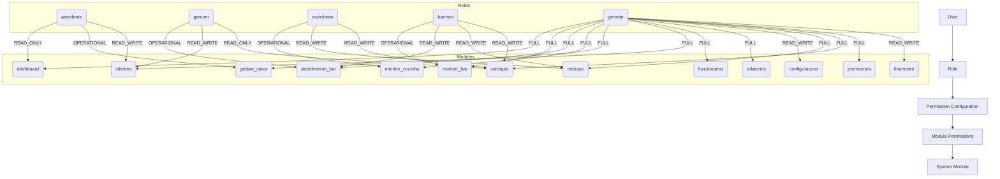
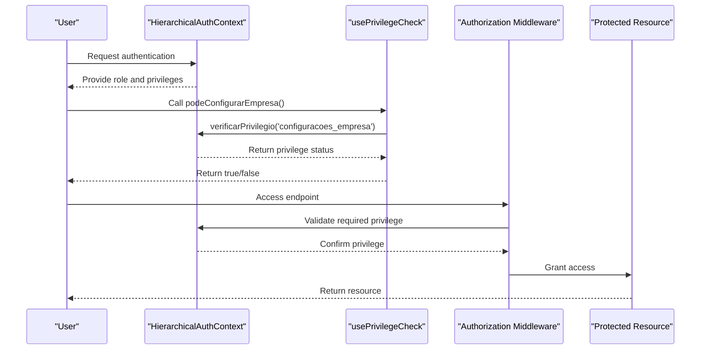
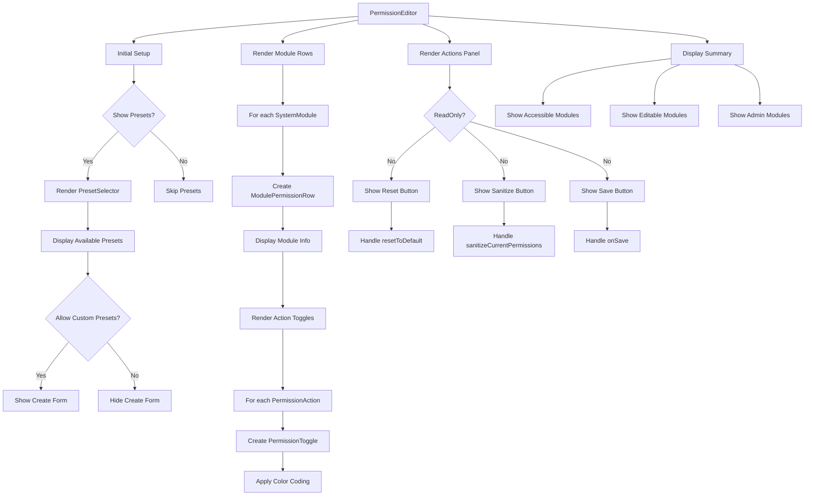
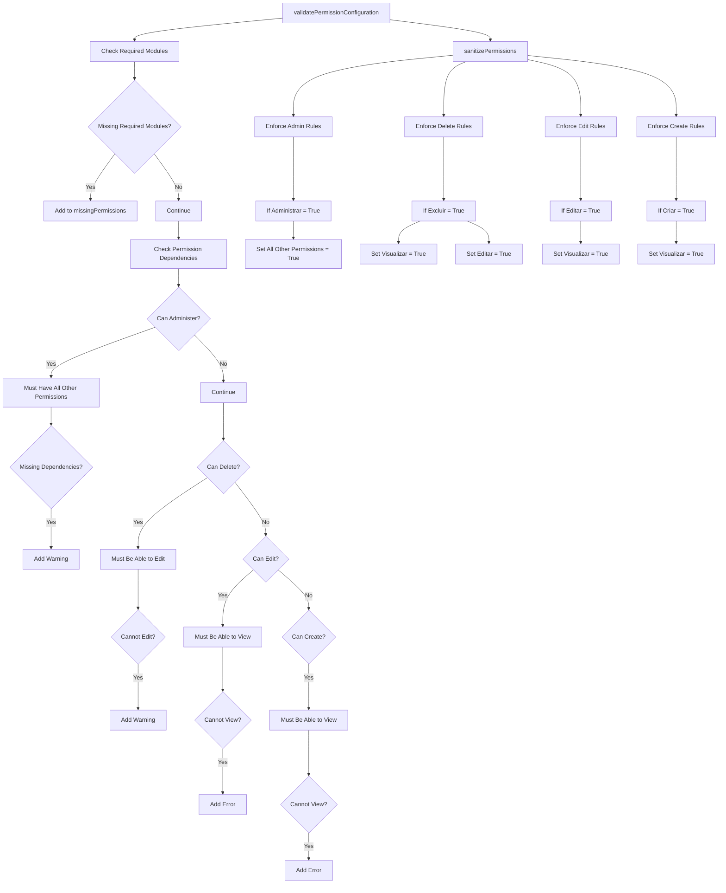
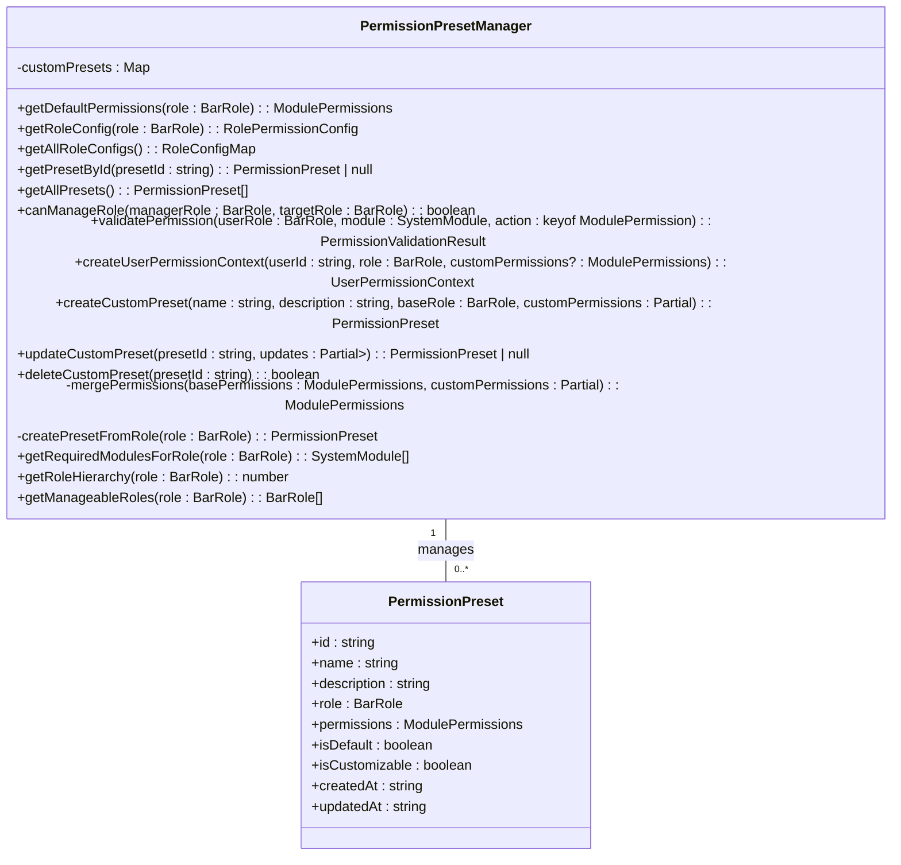
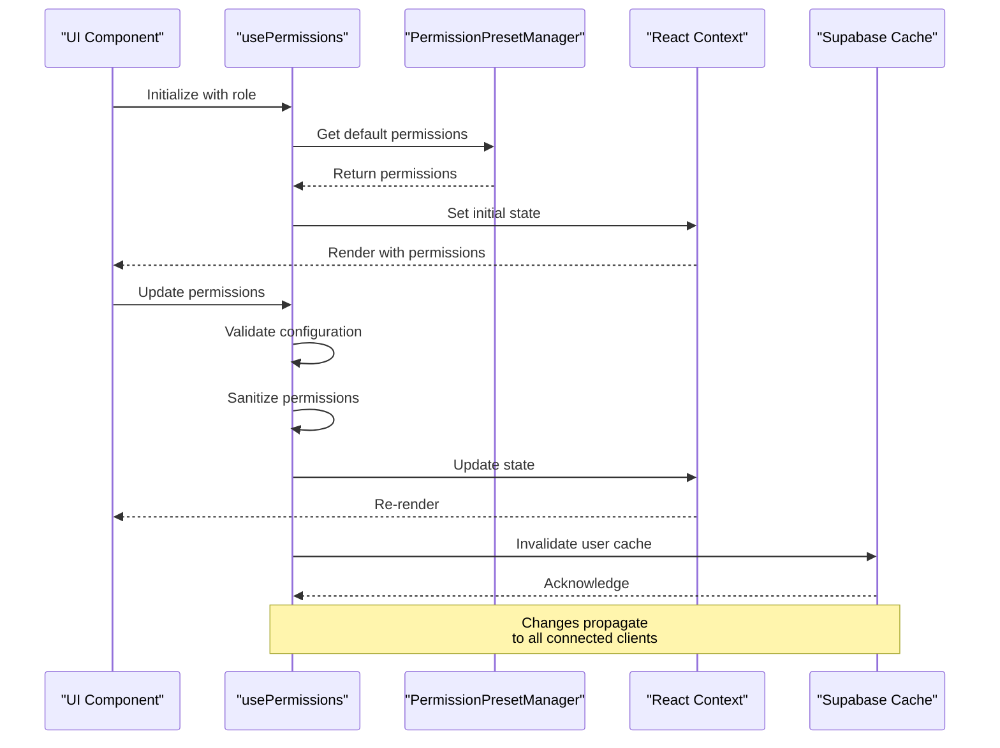
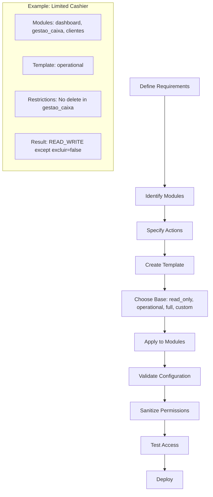
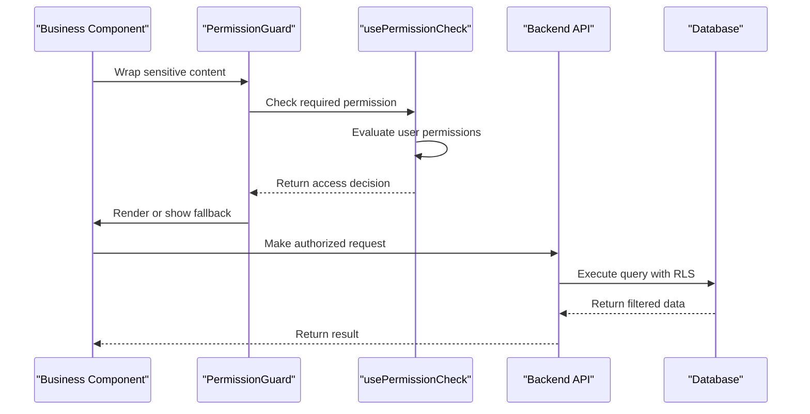
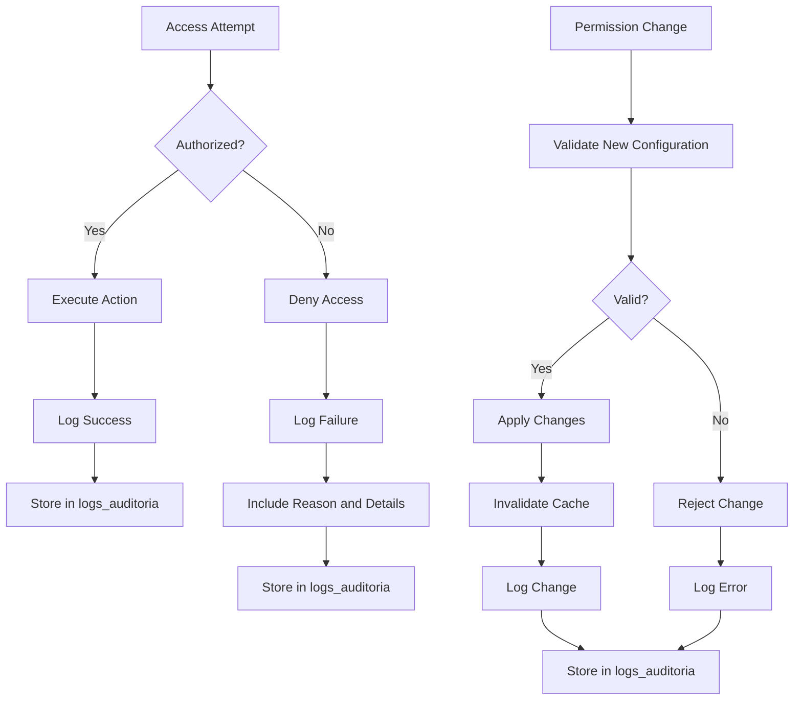

# Permission System

<cite>
**Referenced Files in This Document**   
- [PermissionEditor.tsx](file://src/components/permissions/PermissionEditor.tsx)
- [permission-presets.ts](file://src/services/permission-presets.ts)
- [usePermissions.ts](file://src/hooks/usePermissions.ts)
- [permission-utils.ts](file://src/utils/permission-utils.ts)
- [authorizationMiddleware.ts](file://src/middleware/authorizationMiddleware.ts)
- [PermissionGuard.tsx](file://src/components/Auth/PermissionGuard.tsx)
- [usePrivilegeCheck.ts](file://src/hooks/usePrivilegeCheck.ts)
- [permissions.ts](file://src/types/permissions.ts)
</cite>

## Table of Contents
1. [Introduction](#introduction)
2. [Core Architecture](#core-architecture)
3. [Role-Based vs Privilege-Based Access Control](#role-based-vs-privilege-based-access-control)
4. [Permission Editor Component](#permission-editor-component)
5. [Permission Validation and Sanitization](#permission-validation-and-sanitization)
6. [Permission Presets Management](#permission-presets-management)
7. [Real-Time Permission Updates](#real-time-permission-updates)
8. [Performance Considerations and Caching](#performance-considerations-and-caching)
9. [Implementation Examples](#implementation-examples)
10. [Auditing and Security](#auditing-and-security)

## Introduction

The permission system in the AABB-system provides a comprehensive framework for managing user access controls with granular precision. It combines role-based access control (RBAC) with privilege-based mechanisms to ensure secure, flexible, and scalable authorization across the application. The system supports hierarchical roles, customizable permission presets, real-time updates, and robust validation to maintain data integrity and security.

This documentation details the architecture, implementation, and usage patterns of the permission system, focusing on how permissions are defined, stored, validated, and enforced throughout the application lifecycle.

## Core Architecture

The permission system is built around a modular architecture that separates concerns between permission definition, storage, validation, and enforcement. At its core, the system uses TypeScript interfaces and classes to define structured permission models that can be easily consumed by various components.

```mermaid
classDiagram
class BarRole {
<<enumeration>>
atendente
garcom
cozinheiro
barman
gerente
}
class SystemModule {
<<enumeration>>
dashboard
monitor_bar
atendimento_bar
monitor_cozinha
gestao_caixa
clientes
funcionarios
relatorios
configuracoes
estoque
cardapio
promocoes
financeiro
}
class PermissionAction {
<<enumeration>>
visualizar
criar
editar
excluir
administrar
}
class ModulePermission {
+visualizar : boolean
+criar : boolean
+editar : boolean
+excluir : boolean
+administrar : boolean
}
class ModulePermissions {
+[module : SystemModule] : ModulePermission
}
class RolePermissionConfig {
+role : BarRole
+displayName : string
+description : string
+accessLevel : AccessLevel
+userType : UserType
+hierarchy : number
+canManageRoles? : BarRole[]
+permissions : ModulePermissions
}
class PermissionPreset {
+id : string
+name : string
+description : string
+role : BarRole
+permissions : ModulePermissions
+isDefault : boolean
+isCustomizable : boolean
+createdAt : string
+updatedAt : string
}
class UserPermissionContext {
+userId : string
+role : BarRole
+permissions : ModulePermissions
+effectivePermissions : ModulePermissions
+canAccess(module : SystemModule, action : PermissionAction) : boolean
+canManage(targetRole : BarRole) : boolean
}
class PermissionValidationResult {
+isValid : boolean
+hasAccess : boolean
+missingPermissions : Array<{ module : SystemModule; action : PermissionAction; required : boolean; current : boolean }>
+warnings : string[]
+errors : string[]
}
ModulePermissions "1" -- "*" ModulePermission : contains
RolePermissionConfig "1" -- "1" ModulePermissions : defines
PermissionPreset "1" -- "1" ModulePermissions : contains
UserPermissionContext "1" -- "1" ModulePermissions : references
```

**Diagram sources**
- [permissions.ts](file://src/types/permissions.ts#L1-L245)

**Section sources**
- [permissions.ts](file://src/types/permissions.ts#L1-L245)

## Role-Based vs Privilege-Based Access Control

The system implements both role-based and privilege-based access control mechanisms, each serving different use cases within the application.

### Role-Based Access Control (RBAC)

Role-based access control assigns permissions based on predefined roles such as "atendente", "garcom", "cozinheiro", "barman", and "gerente". Each role has a specific set of permissions that determine what actions the user can perform within different modules of the system.



**Diagram sources**
- [permission-presets.ts](file://src/services/permission-presets.ts#L1-L564)

**Section sources**
- [permission-presets.ts](file://src/services/permission-presets.ts#L1-L564)

### Privilege-Based Access Control

Privilege-based access control operates at a higher level than RBAC, focusing on administrative capabilities and system-wide privileges. These privileges are typically associated with user roles but can be independently managed.



**Diagram sources**
- [usePrivilegeCheck.ts](file://src/hooks/usePrivilegeCheck.ts#L6-L54)
- [authorizationMiddleware.ts](file://src/middleware/authorizationMiddleware.ts#L1-L27)

**Section sources**
- [usePrivilegeCheck.ts](file://src/hooks/usePrivilegeCheck.ts#L6-L54)
- [authorizationMiddleware.ts](file://src/middleware/authorizationMiddleware.ts#L1-L27)

## Permission Editor Component

The PermissionEditor component provides a visual interface for managing user permissions with real-time validation and feedback.



**Diagram sources**
- [PermissionEditor.tsx](file://src/components/permissions/PermissionEditor.tsx#L374-L578)

**Section sources**
- [PermissionEditor.tsx](file://src/components/permissions/PermissionEditor.tsx#L374-L578)

## Permission Validation and Sanitization

The system includes comprehensive validation and sanitization mechanisms to ensure permission configurations are consistent and secure.



**Diagram sources**
- [permission-utils.ts](file://src/utils/permission-utils.ts#L27-L146)
- [permission-utils.ts](file://src/utils/permission-utils.ts#L378-L456)

**Section sources**
- [permission-utils.ts](file://src/utils/permission-utils.ts#L27-L146)
- [permission-utils.ts](file://src/utils/permission-utils.ts#L378-L456)

## Permission Presets Management

The permission preset system allows administrators to create, manage, and apply standardized permission configurations.



**Diagram sources**
- [permission-presets.ts](file://src/services/permission-presets.ts#L1-L564)

**Section sources**
- [permission-presets.ts](file://src/services/permission-presets.ts#L1-L564)

## Real-Time Permission Updates

The system handles permission changes in real-time through a combination of React hooks and context providers.



**Diagram sources**
- [usePermissions.ts](file://src/hooks/usePermissions.ts#L1-L485)
- [authorizationMiddleware.ts](file://src/middleware/authorizationMiddleware.ts#L1-L27)

**Section sources**
- [usePermissions.ts](file://src/hooks/usePermissions.ts#L1-L485)
- [authorizationMiddleware.ts](file://src/middleware/authorizationMiddleware.ts#L1-L27)

## Performance Considerations and Caching

The permission system incorporates several performance optimizations to ensure efficient operation at scale.

```mermaid
flowchart TD
A[Request] --> B{Authenticated?}
B --> |No| C[Return 401]
B --> |Yes| D[Check Cache]
D --> E{Cached?}
E --> |Yes| F{Expired?}
F --> |No| G[Use Cached Data]
F --> |Yes| H[Fetch Fresh Data]
E --> |No| H
H --> I[Query Supabase]
I --> J[Store in Cache]
J --> K[Return Data]
G --> K
subgraph Cache
direction LR
L[TTL: 5 minutes]
M[Key: user_{id}]
N[Eviction: Every minute]
end
subgraph RateLimiting
O[Rate Limit Map]
P[Key: {userId}_{method}_{path}]
Q[Limits by Role]
R[SUPER_ADMIN: 1000/min]
S[ADMIN: 500/min]
T[MANAGER: 200/min]
U[USER: 100/min]
end
```

**Diagram sources**
- [authorizationMiddleware.ts](file://src/middleware/authorizationMiddleware.ts#L1-L27)

**Section sources**
- [authorizationMiddleware.ts](file://src/middleware/authorizationMiddleware.ts#L1-L27)

## Implementation Examples

### Creating Custom Permission Schemes



**Section sources**
- [permission-utils.ts](file://src/utils/permission-utils.ts#L348-L376)

### Integrating with Business Logic



**Diagram sources**
- [PermissionGuard.tsx](file://src/components/Auth/PermissionGuard.tsx#L1-L146)

**Section sources**
- [PermissionGuard.tsx](file://src/components/Auth/PermissionGuard.tsx#L1-L146)

## Auditing and Security

The system includes comprehensive auditing capabilities to track permission changes and access attempts.



**Section sources**
- [authorizationMiddleware.ts](file://src/middleware/authorizationMiddleware.ts#L1-L27)