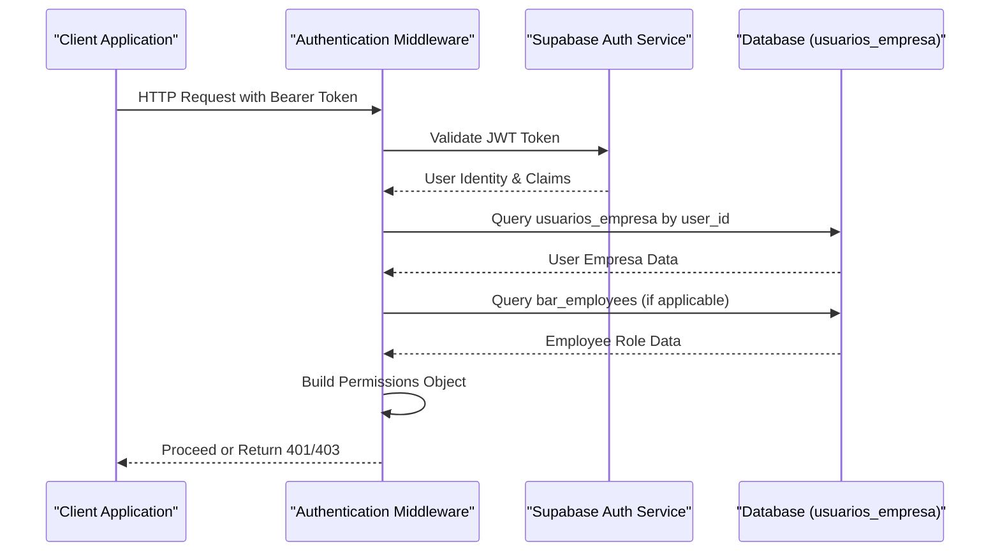
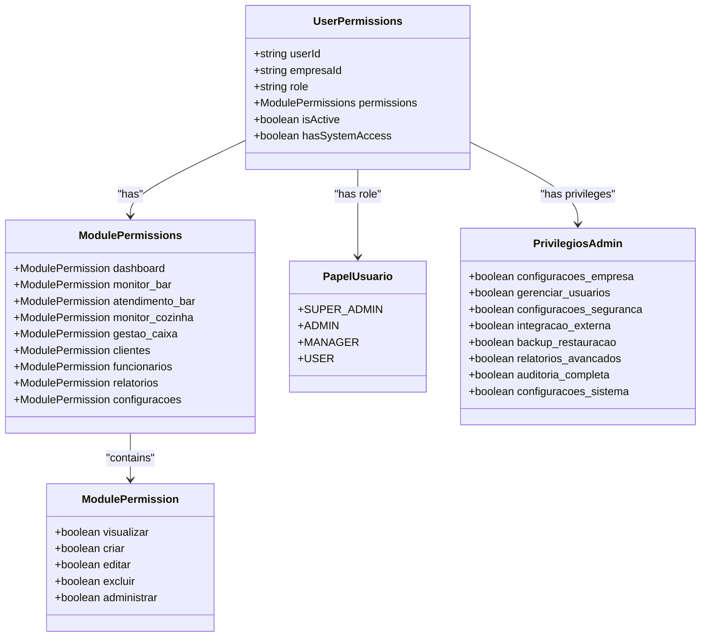
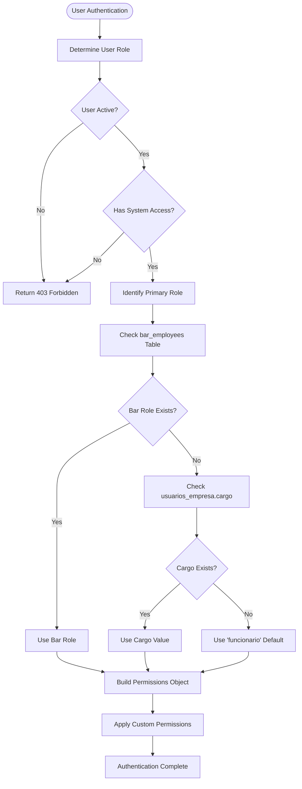
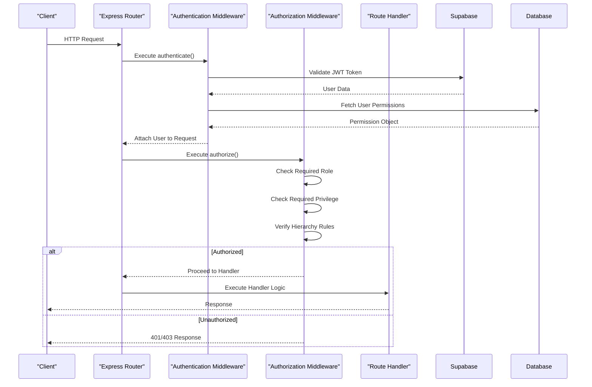
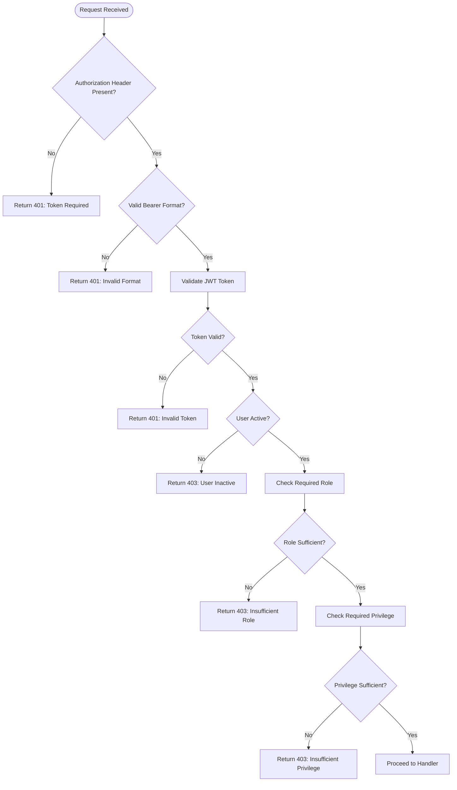

# Middleware Enforcement

<cite>
**Referenced Files in This Document**   
- [authMiddleware.ts](file://src/middleware/authMiddleware.ts)
- [authorizationMiddleware.ts](file://src/middleware/authorizationMiddleware.ts)
- [supabase.ts](file://src/config/supabase.ts)
- [auth-helper.ts](file://src/utils/auth-helper.ts)
- [multitenant.ts](file://src/types/multitenant.ts)
- [privilegeUtils.ts](file://src/utils/privilegeUtils.ts)
</cite>

## Table of Contents
1. [Introduction](#introduction)
2. [Core Authentication Flow](#core-authentication-flow)
3. [Authorization Architecture](#authorization-architecture)
4. [Role-Based Access Control](#role-based-access-control)
5. [Request Lifecycle Integration](#request-lifecycle-integration)
6. [Security Considerations](#security-considerations)
7. [Error Handling and Unauthorized Responses](#error-handling-and-unauthorized-responses)
8. [Performance Optimization](#performance-optimization)
9. [Troubleshooting Guide](#troubleshooting-guide)

## Introduction

The middleware enforcement layer in the AABB-system provides a comprehensive security framework for protecting application endpoints through authentication and authorization mechanisms. This document details how the system intercepts HTTP requests, validates user credentials, and enforces role-based access controls before allowing access to protected resources.

The middleware system is built around two primary components: `authMiddleware` for basic authentication and session validation, and `authorizationMiddleware` for fine-grained permission checks based on user roles and privileges. These components work in conjunction with Supabase authentication to provide a robust security layer that ensures only authorized users can access specific functionality within the application.

The system implements a multi-tenant architecture with hierarchical role management, allowing different levels of access based on user responsibilities within an organization. This approach enables granular control over who can perform specific actions within various modules of the application, from basic viewing permissions to administrative capabilities.

## Core Authentication Flow

The authentication process begins when a client makes a request to a protected endpoint, initiating a series of validation steps that verify the user's identity and session status. The middleware intercepts these requests and performs comprehensive authentication checks before allowing access to protected resources.



**Diagram sources**
- [authMiddleware.ts](file://src/middleware/authMiddleware.ts#L111-L166)
- [authorizationMiddleware.ts](file://src/middleware/authorizationMiddleware.ts#L50-L80)

**Section sources**
- [authMiddleware.ts](file://src/middleware/authMiddleware.ts#L111-L166)
- [authorizationMiddleware.ts](file://src/middleware/authorizationMiddleware.ts#L50-L80)

The authentication flow follows these key steps:
1. **Token Extraction**: The middleware extracts the JWT token from the Authorization header
2. **JWT Validation**: The token is validated using Supabase's authentication service to verify its authenticity and extract user claims
3. **User Data Retrieval**: The system queries the `usuarios_empresa` table to retrieve the user's enterprise-specific data, including their role and active status
4. **Employee Role Verification**: For employees, additional verification is performed against the `bar_employees` table to determine their specific role within the bar operations
5. **Permission Construction**: Based on the user's role and any custom permissions, a comprehensive permissions object is constructed that defines what actions the user can perform across different modules

This multi-step verification process ensures that only authenticated users with valid sessions can proceed further in the request lifecycle, providing a strong foundation for the subsequent authorization checks.

## Authorization Architecture

The authorization system implements a sophisticated permission model that combines role-based access control with customizable permissions, enabling fine-grained control over user capabilities within the application. The architecture is designed to support both predefined role hierarchies and custom permission configurations.



**Diagram sources**
- [authMiddleware.ts](file://src/middleware/authMiddleware.ts#L10-L40)
- [multitenant.ts](file://src/types/multitenant.ts#L10-L50)

**Section sources**
- [authMiddleware.ts](file://src/middleware/authMiddleware.ts#L10-L100)
- [multitenant.ts](file://src/types/multitenant.ts#L10-L100)

The authorization architecture consists of several key components:

- **UserPermissions**: The central interface that aggregates all permission-related information for a user, including their ID, enterprise association, role, module-specific permissions, and overall status indicators
- **ModulePermissions**: A structured representation of permissions across different application modules, allowing for consistent permission checking regardless of the specific functionality being accessed
- **ModulePermission**: The granular permission structure that defines five distinct actions (visualize, create, edit, delete, administer) that can be independently controlled for each module
- **PapelUsuario**: The enumeration of user roles within the system, establishing a clear hierarchy from SUPER_ADMIN with full privileges down to USER with limited access
- **PrivilegiosAdmin**: Administrative privileges that extend beyond module-specific permissions, covering critical system functions like user management, security configuration, and audit logging

This layered approach allows for flexible permission management where default role-based permissions can be overridden with custom settings, providing organizations with the ability to tailor access controls to their specific operational needs.

## Role-Based Access Control

The role-based access control system implements a hierarchical model where higher-level roles inherit the permissions of lower-level roles while adding additional capabilities. This approach ensures that users have appropriate access based on their responsibilities within the organization, following the principle of least privilege.



**Diagram sources**
- [authMiddleware.ts](file://src/middleware/authMiddleware.ts#L140-L160)
- [authMiddleware.ts](file://src/middleware/authMiddleware.ts#L170-L200)

**Section sources**
- [authMiddleware.ts](file://src/middleware/authMiddleware.ts#L140-L200)

The role determination process follows a priority hierarchy:
1. **Bar Employee Role**: If the user exists in the `bar_employees` table with an active status, their `bar_role` takes precedence
2. **Enterprise Cargo**: If no bar role is found, the system checks the `cargo` field in the `usuarios_empresa` record
3. **Default Role**: If neither of the above is available, the user is assigned the default 'funcionario' role

Each role has predefined permissions that establish baseline access levels across all modules:

- **Gerente (Manager)**: Full access to all modules with complete CRUD (Create, Read, Update, Delete) operations and administrative capabilities
- **Atendente (Attendant)**: Access to dashboard, bar monitoring, bar service, and customer management modules with create and edit capabilities but limited deletion rights
- **Garçom (Waiter)**: Focused access to bar service and related modules with transaction creation capabilities but restricted modification and deletion rights
- **Cozinheiro (Cook)**: Specialized access to kitchen monitoring with order processing capabilities but limited access to other operational areas
- **Barman**: Similar to waiter but with enhanced bar-specific capabilities including drink preparation and inventory management

These role-based permissions serve as the foundation for access control, which can then be customized through the permission system to accommodate specific organizational requirements or exceptional cases.

## Request Lifecycle Integration

The middleware integrates seamlessly into the application's request lifecycle, acting as a gatekeeper that evaluates authentication and authorization requirements before allowing requests to reach their intended handlers. This integration occurs at multiple levels, from individual route protection to global application security policies.



**Diagram sources**
- [authorizationMiddleware.ts](file://src/middleware/authorizationMiddleware.ts#L50-L200)
- [authMiddleware.ts](file://src/middleware/authMiddleware.ts#L250-L300)

**Section sources**
- [authorizationMiddleware.ts](file://src/middleware/authorizationMiddleware.ts#L50-L200)

The integration points within the request lifecycle include:

### Route-Level Protection
Individual routes can be protected using middleware functions that enforce specific authentication and authorization requirements:

```typescript
// Example of route protection
app.get('/api/funcionarios', 
  authenticate, 
  authorize({ requiredRole: PapelUsuario.ADMIN }), 
  funcionariosController.listar
);
```

This pattern applies the `authenticate` middleware first to verify the user's identity, followed by the `authorize` middleware to ensure they have the required role (in this case, ADMIN) to access the employee management functionality.

### Module-Specific Authorization
For more granular control, the system provides specialized middleware functions for common authorization patterns:

```typescript
// Pre-configured middleware for common scenarios
export const requireSuperAdmin = authorize({ requiredRole: PapelUsuario.SUPER_ADMIN });
export const requireAdmin = authorize({ requiredRole: [PapelUsuario.SUPER_ADMIN, PapelUsuario.ADMIN] });
export const requireManagerOrAbove = authorize({ 
  requiredRole: [PapelUsuario.SUPER_ADMIN, PapelUsuario.ADMIN, PapelUsuario.MANAGER] 
});

// Privilege-based middleware
export const requireUserManagement = authorize({ requiredPrivilege: 'gerenciar_usuarios' });
export const requireCompanyConfig = authorize({ requiredPrivilege: 'configuracoes_empresa' });
```

These pre-defined middleware functions simplify route configuration by encapsulating common authorization requirements, reducing code duplication and ensuring consistency across the application.

### Hierarchical Access Control
The system implements sophisticated hierarchical rules that prevent users from managing accounts with equal or higher privileges:

```typescript
export const canManageUser = (req: Request, res: Response, next: NextFunction) => {
  // ... check if target user exists
  const canManage = PrivilegeUtils.podeGerenciarPapel(
    req.user!.papel,
    targetUser.papel as PapelUsuario
  );
  
  if (!canManage) {
    return res.status(403).json({ 
      error: 'Não é possível gerenciar usuário com papel igual ou superior' 
    });
  }
  next();
};
```

This ensures that only users with sufficient hierarchical authority can modify accounts of others, preventing privilege escalation and maintaining the integrity of the role hierarchy.

## Security Considerations

The middleware enforcement layer incorporates multiple security measures to protect against common threats and vulnerabilities, ensuring the integrity and confidentiality of the application and its data. These considerations address both technical security aspects and operational best practices.

### JWT Validation and Token Management
The system leverages Supabase's JWT-based authentication, which provides several security benefits:

- **Stateless Authentication**: Tokens contain all necessary user information, eliminating the need for server-side session storage
- **Cryptographic Signing**: Tokens are signed using industry-standard algorithms, preventing tampering and forgery
- **Expiration Mechanisms**: Tokens have defined lifespans, limiting the window of opportunity for compromised tokens

The middleware properly validates tokens by verifying their signature, expiration time, and issuer, rejecting any tokens that fail these checks.

### Rate Limiting and Abuse Prevention
To protect against brute force attacks and denial-of-service attempts, the system implements role-based rate limiting:

```typescript
export const roleBasedRateLimit = (req: Request, res: Response, next: NextFunction) => {
  const limits = {
    [PapelUsuario.SUPER_ADMIN]: 1000,
    [PapelUsuario.ADMIN]: 500,
    [PapelUsuario.MANAGER]: 200,
    [PapelUsuario.USER]: 100
  };
  
  // Implementation prevents excessive requests from overwhelming the system
};
```

This approach recognizes that different roles may have legitimate reasons for making more frequent requests while still protecting the system from abuse.

### Secure Header Management
The middleware properly handles authentication headers to prevent information leakage:

- **Bearer Token Validation**: Ensures the Authorization header follows the correct format (`Bearer <token>`)
- **Header Sanitization**: Prevents injection attacks by properly validating and sanitizing header content
- **Secure Transmission**: Relies on HTTPS to encrypt authentication tokens in transit

### Cache Security
The system implements secure caching mechanisms for user privileges with appropriate TTL (Time To Live) values:

```typescript
// Cache for privilégios (5 minutos)
const privilegeCache = new Map<string, { data: any; timestamp: number }>();
const CACHE_TTL = 5 * 60 * 1000; // 5 minutos
```

This balances performance optimization with security by ensuring cached data is refreshed regularly and automatically expires after a reasonable period.

### Audit Logging
All authorization decisions, particularly denied access attempts, are logged for security auditing:

```typescript
const logAccessDenied = async (req: Request, reason: string, details: any) => {
  await supabase.from('logs_auditoria').insert({
    empresa_id: req.user?.empresa_id,
    user_id: req.user?.id,
    acao: 'access_denied',
    tabela: 'authorization',
    detalhes: {
      reason,
      path: req.path,
      method: req.method,
      ip: req.ip,
      userAgent: req.get('User-Agent'),
      ...details
    }
  });
};
```

These logs provide valuable forensic information for investigating security incidents and identifying potential attack patterns.

## Error Handling and Unauthorized Responses

The middleware system implements comprehensive error handling to provide meaningful feedback when authentication or authorization fails, while avoiding the disclosure of sensitive information that could aid attackers.

### Standardized Error Responses
The system returns consistent HTTP status codes and error messages for different failure scenarios:

| Status Code | Scenario | Response Structure |
|-----------|---------|-------------------|
| 401 Unauthorized | Missing or invalid authentication token | `{ error: 'Token de acesso requerido' }` |
| 401 Unauthorized | Invalid JWT token | `{ error: 'Token inválido' }` |
| 403 Forbidden | User lacks required role | `{ error: 'Papel insuficiente', required: role, current: user.papel }` |
| 403 Forbidden | User lacks required privilege | `{ error: 'Privilégios insuficientes', required: privilege }` |
| 403 Forbidden | User cannot manage target user | `{ error: 'Não é possível gerenciar usuário com papel igual ou superior' }` |
| 429 Too Many Requests | Rate limit exceeded | `{ error: 'Limite de requisições excedido', limit, resetTime }` |



**Diagram sources**
- [authorizationMiddleware.ts](file://src/middleware/authorizationMiddleware.ts#L50-L200)

**Section sources**
- [authorizationMiddleware.ts](file://src/middleware/authorizationMiddleware.ts#L50-L200)

### Contextual Error Information
While providing detailed error information for debugging purposes, the system carefully controls what information is exposed to clients:

- **Development Mode**: More detailed error messages including stack traces and specific validation failures
- **Production Mode**: Generic error messages that don't reveal implementation details

For example, when a user lacks sufficient privileges, the response includes the required privilege but not a complete list of the user's actual privileges, preventing information disclosure.

### Graceful Degradation
The system implements fallback mechanisms to handle edge cases and unexpected conditions:

- **Network Failures**: When unable to validate tokens due to network issues, the system returns appropriate 500 errors rather than allowing unauthenticated access
- **Database Errors**: If permission data cannot be retrieved, access is denied by default (fail-safe principle)
- **Cache Invalidation**: When user permissions change, the cache is invalidated to ensure immediate enforcement of new access rules

These error handling strategies ensure that security is maintained even when components fail, adhering to the principle of least privilege by denying access when uncertainty exists.

## Performance Optimization

The middleware system incorporates several performance optimizations to minimize the impact on request processing time while maintaining robust security controls. These optimizations balance security requirements with application responsiveness.

### Caching Strategy
The system implements a multi-layered caching approach to reduce database queries and improve response times:

```typescript
// Cache for privilégios (5 minutos)
const privilegeCache = new Map<string, { data: any; timestamp: number }>();
const CACHE_TTL = 5 * 60 * 1000; // 5 minutos

// Função para limpar cache expirado
setInterval(() => {
  const now = Date.now();
  for (const [key, entry] of privilegeCache.entries()) {
    if (now - entry.timestamp > CACHE_TTL) {
      privilegeCache.delete(key);
    }
  }
}, 60000); // Verificar a cada minuto
```

This caching strategy provides several benefits:
- **Reduced Database Load**: Frequently accessed user permission data is served from memory
- **Improved Response Times**: Subsequent requests for the same user complete faster
- **Controlled Freshness**: Cache entries expire after 5 minutes, ensuring permissions changes are reflected in a timely manner

### Efficient Database Queries
The middleware optimizes database interactions through careful query design:

- **Single Query for User Data**: The `loadUserPermissions` function retrieves both user and permission data in a single query using Supabase's relational querying capabilities
- **Selective Field Retrieval**: Only necessary fields are selected, reducing data transfer overhead
- **Proper Indexing**: Critical fields used in WHERE clauses (user_id, empresa_id, ativo) are indexed for fast lookups

### Rate Limiting with Memory Efficiency
The rate limiting implementation uses a memory-efficient approach to track request counts:

```typescript
const rateLimitMap = new Map<string, { count: number; resetTime: number }>();
```

This approach:
- Uses minimal memory per tracked endpoint
- Automatically expires old entries through periodic cleanup
- Provides O(1) lookup and update operations

### Connection Pooling
By leveraging Supabase's connection pooling, the middleware avoids the overhead of establishing new database connections for each request, significantly improving performance under load.

These optimizations ensure that the security middleware adds minimal latency to request processing while maintaining the integrity of the authorization system.

## Troubleshooting Guide

This section addresses common issues encountered with the middleware enforcement layer and provides guidance for diagnosis and resolution.

### Middleware Bypass Issues
When users appear to bypass authentication or authorization checks:

1. **Verify Middleware Attachment**: Ensure the middleware functions are properly attached to routes
   ```typescript
   // Correct usage
   app.get('/protected', authenticate, authorize(options), handler);
   ```

2. **Check Execution Order**: Middleware functions execute in the order they are specified; ensure authentication precedes authorization

3. **Validate Token Handling**: Confirm that clients are properly including the Authorization header with a valid Bearer token

### Incorrect Permission Evaluation
When users experience unexpected access denials or unauthorized access:

1. **Verify Role Assignment**: Check the `usuarios_empresa` table to confirm the user's `papel` field has the expected value
   ```sql
   SELECT papel FROM usuarios_empresa WHERE user_id = 'user-id';
   ```

2. **Check Custom Permissions**: Verify if custom permissions in the `permissoes_usuario` table are overriding role-based defaults

3. **Inspect Cache State**: If using cached permissions, clear the cache or wait for expiration to ensure the latest permissions are applied
   ```typescript
   invalidateUserCache(userId);
   ```

### Performance Bottlenecks
When middleware introduces unacceptable latency:

1. **Monitor Database Queries**: Use Supabase's query analytics to identify slow permission queries
2. **Adjust Cache TTL**: Consider increasing the cache duration for environments where permission changes are infrequent
3. **Review Rate Limiting Configuration**: Ensure rate limits are appropriately set for different roles and endpoints

### Common Error Scenarios and Solutions

| Symptom | Likely Cause | Solution |
|-------|------------|----------|
| 401 errors despite valid login | Token not included in request | Ensure client sends Authorization header with Bearer token |
| 403 errors for admin users | Role hierarchy violation | Verify target user's role is lower in hierarchy |
| Slow API responses | Database query performance | Optimize indexes on frequently queried fields |
| Intermittent access issues | Cache inconsistency | Implement proper cache invalidation on permission changes |
| Rate limiting too restrictive | Inappropriate limits for role | Adjust rateLimitMap values for specific roles |

**Section sources**
- [authorizationMiddleware.ts](file://src/middleware/authorizationMiddleware.ts#L200-L300)
- [authMiddleware.ts](file://src/middleware/authMiddleware.ts#L250-L300)