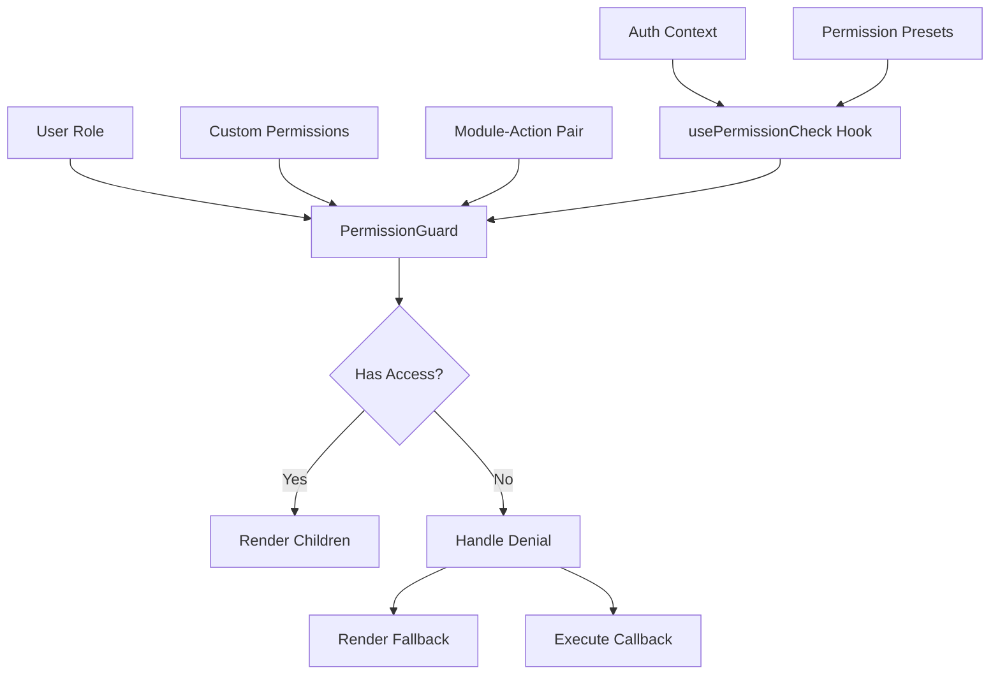
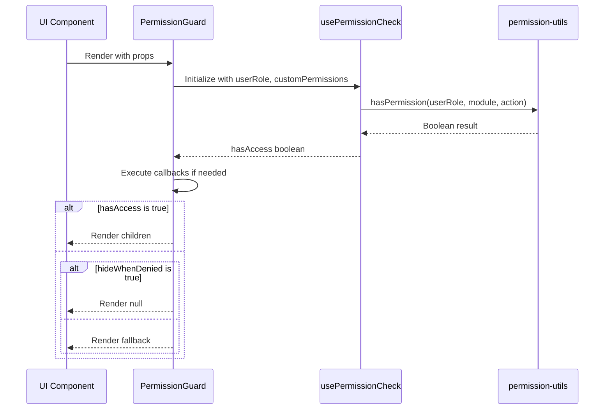
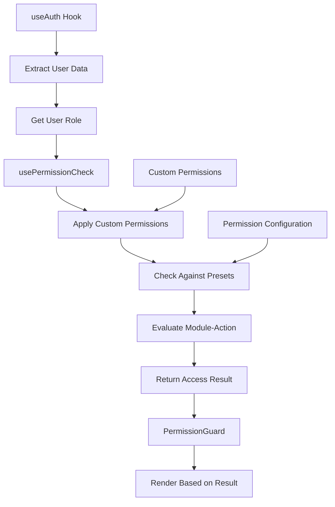

# Permission Checking Components

<cite>
**Referenced Files in This Document**   
- [PermissionGuard.tsx](file://src/components/permissions/PermissionGuard.tsx)
- [PermissionGuard.tsx](file://src/components/Auth/PermissionGuard.tsx)
- [usePermissions.ts](file://src/hooks/usePermissions.ts)
- [permission-utils.ts](file://src/utils/permission-utils.ts)
- [PermissionBasedRender.tsx](file://src/components/Auth/PermissionBasedRender.tsx)
</cite>

## Table of Contents
1. [Introduction](#introduction)
2. [Architecture Overview](#architecture-overview)
3. [Core Components Analysis](#core-components-analysis)
4. [Permission Guard Implementation](#permission-guard-implementation)
5. [Hook Integration and Context Consumption](#hook-integration-and-context-consumption)
6. [UI-Level Access Control Patterns](#ui-level-access-control-patterns)
7. [Performance Considerations](#performance-considerations)

## Introduction
The AABB-system implements a comprehensive permission checking framework designed to provide granular access control across different application contexts. This documentation details the implementation and usage of PermissionGuard components, focusing on their role in UI-level access control, variations between authentication and permissions directories, and integration with context hooks for real-time permission evaluation.

## Architecture Overview



**Diagram sources**
- [PermissionGuard.tsx](file://src/components/permissions/PermissionGuard.tsx)
- [usePermissions.ts](file://src/hooks/usePermissions.ts)

## Core Components Analysis

The permission checking system in AABB-system consists of two primary implementations located in separate directories: `src/components/Auth` and `src/components/permissions`. These implementations serve different purposes and exhibit distinct functionality patterns.

The `Auth` directory contains a simpler permission guard focused on basic role-based checks and admin requirements, while the `permissions` directory houses a more sophisticated system supporting module-action permissions, callback support, and hierarchical access control.

```mermaid
classDiagram
class PermissionGuard {
+userRole : BarRole
+customPermissions? : ModulePermissions
+module : SystemModule
+action : PermissionAction
+children : ReactNode
+fallback? : ReactNode
+hideWhenDenied? : boolean
+onAccessDenied? : (module, action) => void
+onAccessGranted? : (module, action) => void
}
class MultiplePermissionGuard {
+userRole : BarRole
+customPermissions? : ModulePermissions
+permissions : Array<{module, action, required}>
+mode? : 'all' | 'any'
+children : ReactNode
+fallback? : ReactNode
+hideWhenDenied? : boolean
}
class RoleGuard {
+userRole : BarRole
+allowedRoles : BarRole[]
+children : ReactNode
+fallback? : ReactNode
+hideWhenDenied? : boolean
}
class ManagementGuard {
+managerRole : BarRole
+targetRole : BarRole
+children : ReactNode
+fallback? : ReactNode
+hideWhenDenied? : boolean
}
PermissionGuard --> usePermissionCheck : "uses"
MultiplePermissionGuard --> usePermissionCheck : "uses"
RoleGuard --> usePermissionCheck : "uses"
ManagementGuard --> usePermissionCheck : "uses"
```

**Diagram sources**
- [PermissionGuard.tsx](file://src/components/permissions/PermissionGuard.tsx)
- [usePermissions.ts](file://src/hooks/usePermissions.ts)

**Section sources**
- [PermissionGuard.tsx](file://src/components/permissions/PermissionGuard.tsx)
- [usePermissions.ts](file://src/hooks/usePermissions.ts)

## Permission Guard Implementation

The PermissionGuard component in the `permissions` directory provides a robust mechanism for protecting UI elements based on user roles and specific permissions. It accepts a user role, module-action pair, and optional custom permissions to determine access rights.

Key features include:
- Support for module-action based permission checks
- Optional fallback rendering when access is denied
- Callback execution on access grant or denial
- Configurable behavior for hiding denied content

The component leverages the `usePermissionCheck` hook to evaluate permissions against predefined rules and role configurations. This allows for dynamic permission evaluation that can adapt to changing user roles or permission settings.



**Diagram sources**
- [PermissionGuard.tsx](file://src/components/permissions/PermissionGuard.tsx)
- [usePermissions.ts](file://src/hooks/usePermissions.ts)
- [permission-utils.ts](file://src/utils/permission-utils.ts)

**Section sources**
- [PermissionGuard.tsx](file://src/components/permissions/PermissionGuard.tsx)
- [permission-utils.ts](file://src/utils/permission-utils.ts)

## Hook Integration and Context Consumption

The permission checking components consume context through specialized hooks that provide access to user authentication data and permission configurations. The primary hook, `usePermissionCheck`, serves as the interface between the UI components and the underlying permission logic.

This hook evaluates permissions by combining the user's role with any custom permissions provided, then checking against the module-action pair specified in the guard component. The system supports both default permission presets and customized permission sets, allowing for flexible access control configurations.

The `usePermissions` hook provides additional functionality including permission validation, configuration management, and preset application, enabling administrators to manage complex permission scenarios programmatically.



**Diagram sources**
- [usePermissions.ts](file://src/hooks/usePermissions.ts)
- [permission-utils.ts](file://src/utils/permission-utils.ts)
- [PermissionGuard.tsx](file://src/components/permissions/PermissionGuard.tsx)

**Section sources**
- [usePermissions.ts](file://src/hooks/usePermissions.ts)
- [permission-utils.ts](file://src/utils/permission-utils.ts)

## UI-Level Access Control Patterns

Permission guards are designed to be wrapped around various UI elements to enforce access control at the component level. Common usage patterns include:

### Button Protection
Wrapping action buttons with permission guards ensures users can only perform actions they're authorized for. The guard can either hide the button entirely or disable it with an appropriate tooltip.

### Form Access Control
Entire forms or form sections can be protected based on create/edit permissions, preventing unauthorized data modification.

### Data Display Filtering
Permission guards can control the visibility of sensitive data displays, ensuring users only see information within their access scope.

### Navigation Protection
Route-level guards prevent navigation to unauthorized pages, while component-level guards handle partial access within pages.

The system supports convenience components like `ViewGuard`, `CreateGuard`, `EditGuard`, and `DeleteGuard` that pre-configure the PermissionGuard for common actions, reducing boilerplate code and improving readability.

**Section sources**
- [PermissionGuard.tsx](file://src/components/permissions/PermissionGuard.tsx)
- [PermissionBasedRender.tsx](file://src/components/Auth/PermissionBasedRender.tsx)

## Performance Considerations

When using multiple permission guards, performance optimization is crucial to prevent unnecessary re-renders. The implementation addresses this through several strategies:

- **Memoization**: The `hasPermission` function results are memoized based on input parameters, preventing redundant calculations.
- **Callback Optimization**: Event callbacks are wrapped in `useCallback` to maintain referential equality and prevent child component re-renders.
- **Conditional Rendering**: The `hideWhenDenied` flag allows for efficient null rendering when access is denied, minimizing DOM operations.

For complex permission scenarios involving multiple checks, the `MultiplePermissionGuard` component should be used instead of nesting multiple individual guards, as it consolidates permission evaluations into a single operation with appropriate memoization.

Additional performance benefits come from the centralized permission management via the `usePermissions` hook, which maintains permission state and provides optimized access methods throughout the component tree.

**Section sources**
- [PermissionGuard.tsx](file://src/components/permissions/PermissionGuard.tsx)
- [usePermissions.ts](file://src/hooks/usePermissions.ts)
- [permission-utils.ts](file://src/utils/permission-utils.ts)