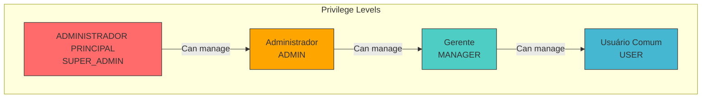
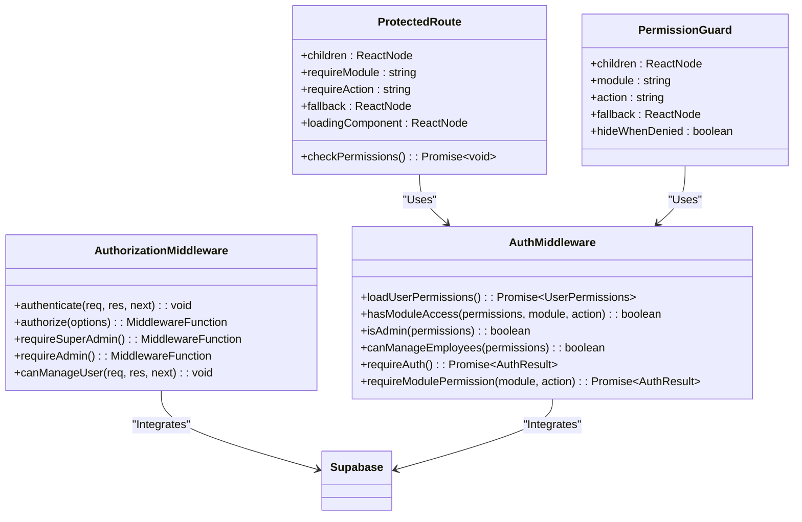
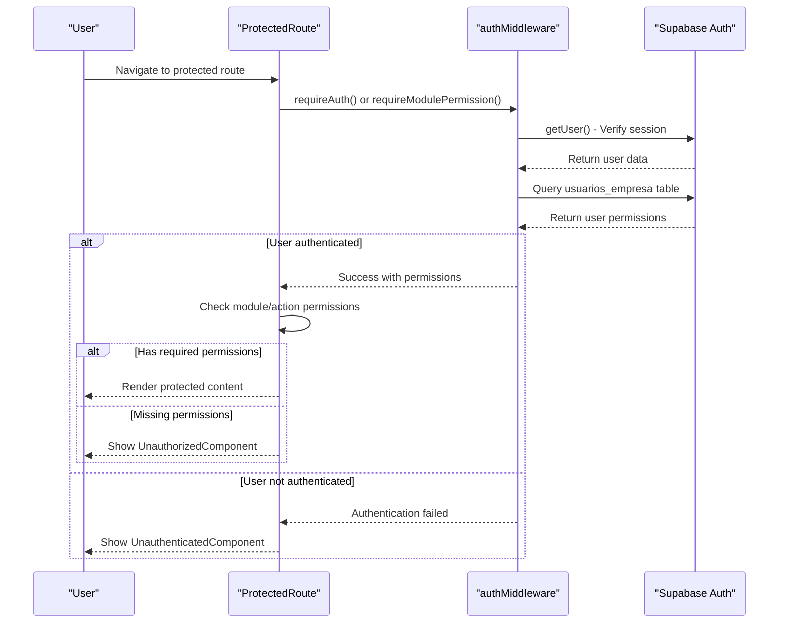
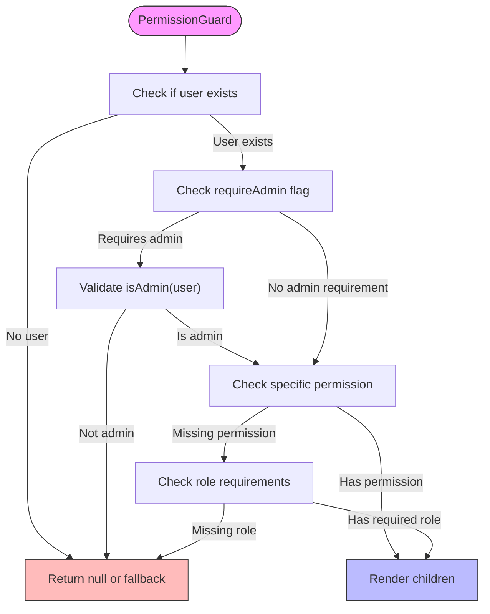
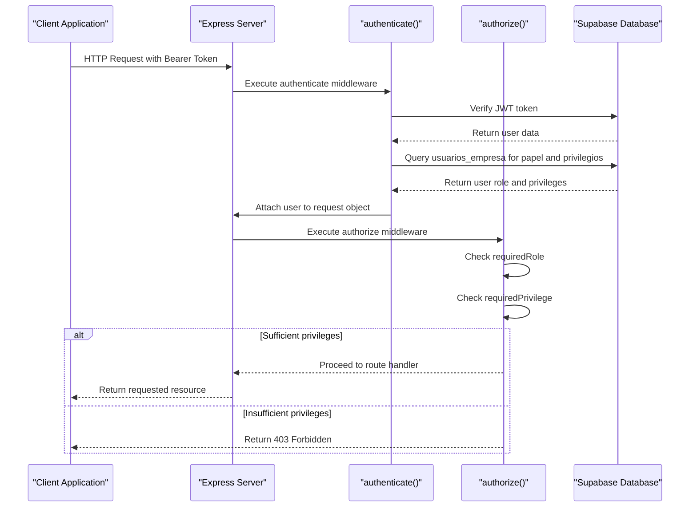
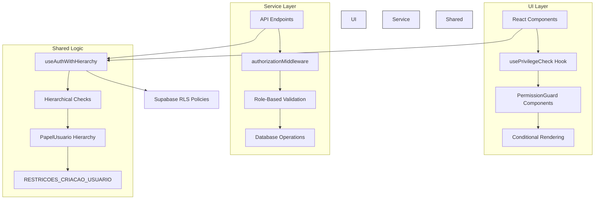
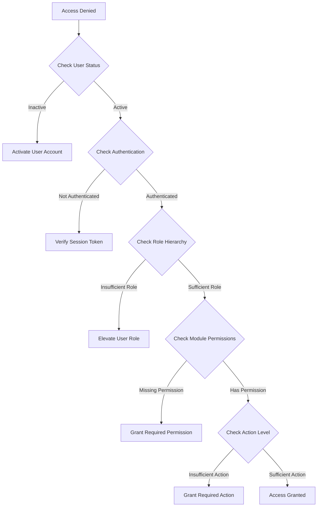

# Role-Based Access Control

<cite>
**Referenced Files in This Document**   
- [ProtectedRoute.tsx](file://src/components/Auth/ProtectedRoute.tsx)
- [PermissionGuard.tsx](file://src/components/Auth/PermissionGuard.tsx)
- [authMiddleware.ts](file://src/middleware/authMiddleware.ts)
- [authorizationMiddleware.ts](file://src/middleware/authorizationMiddleware.ts)
- [permissions.ts](file://src/types/permissions.ts)
- [multitenant.ts](file://src/types/multitenant.ts)
- [useAuthWithHierarchy.ts](file://src/hooks/useAuthWithHierarchy.ts)
- [usePrivilegeCheck.ts](file://src/hooks/usePrivilegeCheck.ts)
</cite>

## Table of Contents
1. [Introduction](#introduction)
2. [Hierarchical Permission Model](#hierarchical-permission-model)
3. [Core Components Overview](#core-components-overview)
4. [ProtectedRoute Implementation](#protectedroute-implementation)
5. [PermissionGuard Components](#permissionguard-components)
6. [Middleware Authorization System](#middleware-authorization-system)
7. [Role Definitions and Inheritance](#role-definitions-and-inheritance)
8. [Custom Role Management](#custom-role-management)
9. [Permission Checking in UI and Services](#permission-checking-in-ui-and-services)
10. [Common Issues and Debugging](#common-issues-and-debugging)
11. [Best Practices for Securing Resources](#best-practices-for-securing-resources)

## Introduction
The AABB-system implements a comprehensive role-based access control (RBAC) system that governs access to application resources based on user roles and privileges. This documentation details the hierarchical permission model, protection components, middleware implementation, and best practices for managing access control within the system. The RBAC framework supports multiple administrative levels including ADMINISTRADOR PRINCIPAL (SUPER_ADMIN), manager, and staff members, with granular permissions across various system modules.

## Hierarchical Permission Model
The system implements a multi-level hierarchical permission model that defines access rights based on user roles and administrative levels. The hierarchy establishes clear boundaries between different privilege tiers, ensuring that higher-level administrators can manage lower-level users while preventing privilege escalation by unauthorized personnel.



**Diagram sources**
- [multitenant.ts](file://src/types/multitenant.ts#L3-L8)

**Section sources**
- [multitenant.ts](file://src/types/multitenant.ts#L3-L8)
- [admin-hierarchy.ts](file://src/types/admin-hierarchy.ts)

## Core Components Overview
The RBAC system consists of several core components that work together to enforce access restrictions throughout the application. These components include ProtectedRoute for route-level protection, PermissionGuard for component-level protection, and middleware functions for server-side authorization.



**Diagram sources**
- [ProtectedRoute.tsx](file://src/components/Auth/ProtectedRoute.tsx)
- [PermissionGuard.tsx](file://src/components/Auth/PermissionGuard.tsx)
- [authMiddleware.ts](file://src/middleware/authMiddleware.ts)
- [authorizationMiddleware.ts](file://src/middleware/authorizationMiddleware.ts)

**Section sources**
- [ProtectedRoute.tsx](file://src/components/Auth/ProtectedRoute.tsx)
- [PermissionGuard.tsx](file://src/components/Auth/PermissionGuard.tsx)
- [authMiddleware.ts](file://src/middleware/authMiddleware.ts)
- [authorizationMiddleware.ts](file://src/middleware/authorizationMiddleware.ts)

## ProtectedRoute Implementation
The ProtectedRoute component serves as the primary mechanism for protecting routes based on user authentication and authorization requirements. It intercepts navigation requests and validates whether the current user has sufficient permissions to access the requested resource.



**Diagram sources**
- [ProtectedRoute.tsx](file://src/components/Auth/ProtectedRoute.tsx#L91-L175)
- [authMiddleware.ts](file://src/middleware/authMiddleware.ts)

**Section sources**
- [ProtectedRoute.tsx](file://src/components/Auth/ProtectedRoute.tsx#L91-L175)
- [authMiddleware.ts](file://src/middleware/authMiddleware.ts)

## PermissionGuard Components
The system implements multiple PermissionGuard components for fine-grained access control at the component level. These guards allow conditional rendering of UI elements based on user permissions, providing a flexible way to show or hide functionality according to the user's role and privileges.



**Diagram sources**
- [PermissionGuard.tsx](file://src/components/Auth/PermissionGuard.tsx#L24-L55)
- [permissions/PermissionGuard.tsx](file://src/components/permissions/PermissionGuard.tsx#L120-L153)

**Section sources**
- [PermissionGuard.tsx](file://src/components/Auth/PermissionGuard.tsx#L24-L55)
- [permissions/PermissionGuard.tsx](file://src/components/permissions/PermissionGuard.tsx#L120-L153)
- [utils/auth.ts](file://src/utils/auth.ts#L6-L16)

## Middleware Authorization System
The middleware layer implements server-side authorization that intercepts HTTP requests and validates user permissions before allowing access to protected resources. This two-tiered approach combines client-side protection with robust server-side validation to ensure security even if client-side checks are bypassed.



**Diagram sources**
- [authorizationMiddleware.ts](file://src/middleware/authorizationMiddleware.ts)
- [authMiddleware.ts](file://src/middleware/authMiddleware.ts)

**Section sources**
- [authorizationMiddleware.ts](file://src/middleware/authorizationMiddleware.ts)
- [authMiddleware.ts](file://src/middleware/authMiddleware.ts)

## Role Definitions and Inheritance
The system defines a clear hierarchy of roles with specific permissions and inheritance rules. Each role has defined capabilities and limitations, with higher-level roles inheriting the permissions of lower-level roles while adding additional administrative capabilities.

```mermaid
erDiagram
ROLE ||--o{ PERMISSION : has
ROLE {
string id PK
string name
string description
number hierarchy
boolean isDefault
}
PERMISSION ||--o{ MODULE : applies_to
PERMISSION {
uuid id PK
string action
boolean value
}
MODULE {
string id PK
string name
string category
}
USER ||--o{ ROLE : assigned
USER {
uuid id PK
string email
string status
}
USER ||--o{ CUSTOM_PERMISSION : overrides
CUSTOM_PERMISSION {
uuid id PK
string module
string action
boolean value
}
class ROLE {
SUPER_ADMIN
ADMIN
MANAGER
USER
}
class MODULE {
dashboard
monitor_bar
atendimento_bar
monitor_cozinha
gestao_caixa
clientes
funcionarios
relatorios
configuracoes
}
```

**Diagram sources**
- [permissions.ts](file://src/types/permissions.ts)
- [multitenant.ts](file://src/types/multitenant.ts)
- [admin-hierarchy.ts](file://src/types/admin-hierarchy.ts)

**Section sources**
- [permissions.ts](file://src/types/permissions.ts)
- [multitenant.ts](file://src/types/multitenant.ts#L72-L81)
- [admin-hierarchy.ts](file://src/types/admin-hierarchy.ts)

## Custom Role Management
The system allows for custom role configuration through the RoleEditor component and associated services. Administrators can define custom permission sets for specific roles, modify existing permissions, and assign these configurations to users within their management hierarchy.

```mermaid
flowchart LR
A[Role Editor Interface] --> B[Load Default Permissions]
B --> C[Modify Module Permissions]
C --> D[Set Action Rights<br>(visualizar, criar, editar, excluir, administrar)]
D --> E[Save Custom Permissions]
E --> F[Store in permissoes_usuario Table]
F --> G[Apply During Session Loading]
G --> H[Enforce via authMiddleware]
subgraph "Database Storage"
I[usuarios_empresa] < --> J[permissoes_usuario]
J --> K[ModuloSistema]
J --> L[PermissaoModulo]
end
A --> I
H --> I
```

**Diagram sources**
- [RoleEditor.tsx](file://src/components/Admin/RoleEditor.tsx)
- [authMiddleware.ts](file://src/middleware/authMiddleware.ts#L215-L250)
- [types/permissions.ts](file://src/types/permissions.ts)

**Section sources**
- [RoleEditor.tsx](file://src/components/Admin/RoleEditor.tsx)
- [authMiddleware.ts](file://src/middleware/authMiddleware.ts#L215-L250)
- [types/permissions.ts](file://src/types/permissions.ts)

## Permission Checking in UI and Services
Permission checks are implemented consistently across both UI components and service layers, ensuring uniform access control throughout the application. The system provides hooks and utility functions that simplify permission verification in various contexts.



**Diagram sources**
- [usePrivilegeCheck.ts](file://src/hooks/usePrivilegeCheck.ts)
- [useAuthWithHierarchy.ts](file://src/hooks/useAuthWithHierarchy.ts)
- [authorizationMiddleware.ts](file://src/middleware/authorizationMiddleware.ts)

**Section sources**
- [usePrivilegeCheck.ts](file://src/hooks/usePrivilegeCheck.ts)
- [useAuthWithHierarchy.ts](file://src/hooks/useAuthWithHierarchy.ts#L29-L157)
- [authorizationMiddleware.ts](file://src/middleware/authorizationMiddleware.ts)

## Common Issues and Debugging
Several common issues may arise when working with the RBAC system, particularly around permission inheritance, role conflicts, and access denials. Understanding these patterns helps in troubleshooting and maintaining proper access control.

### Permission Inheritance Challenges
When implementing hierarchical permissions, ensure that:
- Higher-level roles properly inherit permissions from lower levels
- Custom permissions correctly override default role permissions
- The hierarchy prevents privilege escalation attempts

### Role Conflict Resolution
The system handles role conflicts through:
- Clear precedence rules (SUPER_ADMIN > ADMIN > MANAGER > USER)
- Validation during user creation and role assignment
- Real-time permission recalculation when roles change

### Debugging Access Denials
To diagnose access denial issues:
1. Check the user's current role and permissions
2. Verify the required module and action permissions
3. Examine middleware logs for authentication flow
4. Use the PermissionDebug component in development mode



**Section sources**
- [authMiddleware.ts](file://src/middleware/authMiddleware.ts)
- [authorizationMiddleware.ts](file://src/middleware/authorizationMiddleware.ts)
- [useAuthWithHierarchy.ts](file://src/hooks/useAuthWithHierarchy.ts)

## Best Practices for Securing Resources
Implementing effective role-based access control requires adherence to security best practices to protect sensitive routes and data within the application.

### Secure Sensitive Routes
- Always use ProtectedRoute for administrative endpoints
- Implement server-side validation even when client-side checks exist
- Use specific permission requirements rather than broad role checks
- Log all access attempts to sensitive resources

### Protect Data Access
- Implement Row Level Security (RLS) policies in Supabase
- Validate user permissions before returning data
- Use parameterized queries to prevent injection attacks
- Limit data exposure to only what's necessary for the user's role

### Manage Role Transitions
- Implement approval workflows for role elevation
- Maintain audit logs of all role changes
- Enforce mandatory re-authentication for privilege escalation
- Implement time-limited elevated privileges when appropriate

### Performance Considerations
- Cache permission checks when possible
- Use efficient database queries for permission lookup
- Minimize redundant permission validation
- Implement lazy loading for complex permission hierarchies

**Section sources**
- [authorizationMiddleware.ts](file://src/middleware/authorizationMiddleware.ts)
- [authMiddleware.ts](file://src/middleware/authMiddleware.ts)
- [supabase/migrations](file://supabase/migrations)
- [services/authorization-middleware.ts](file://src/services/authorization-middleware.ts)