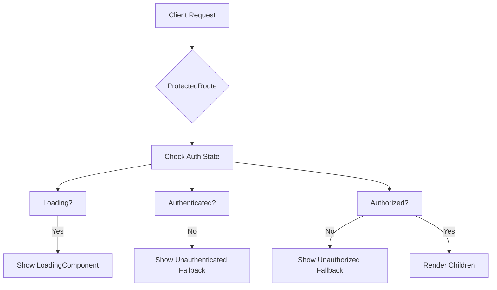
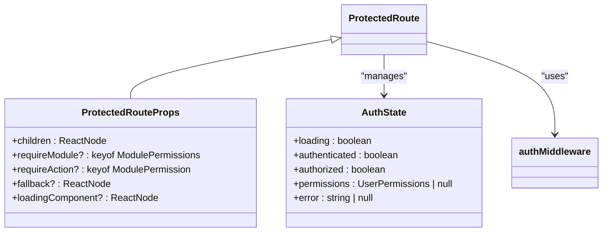
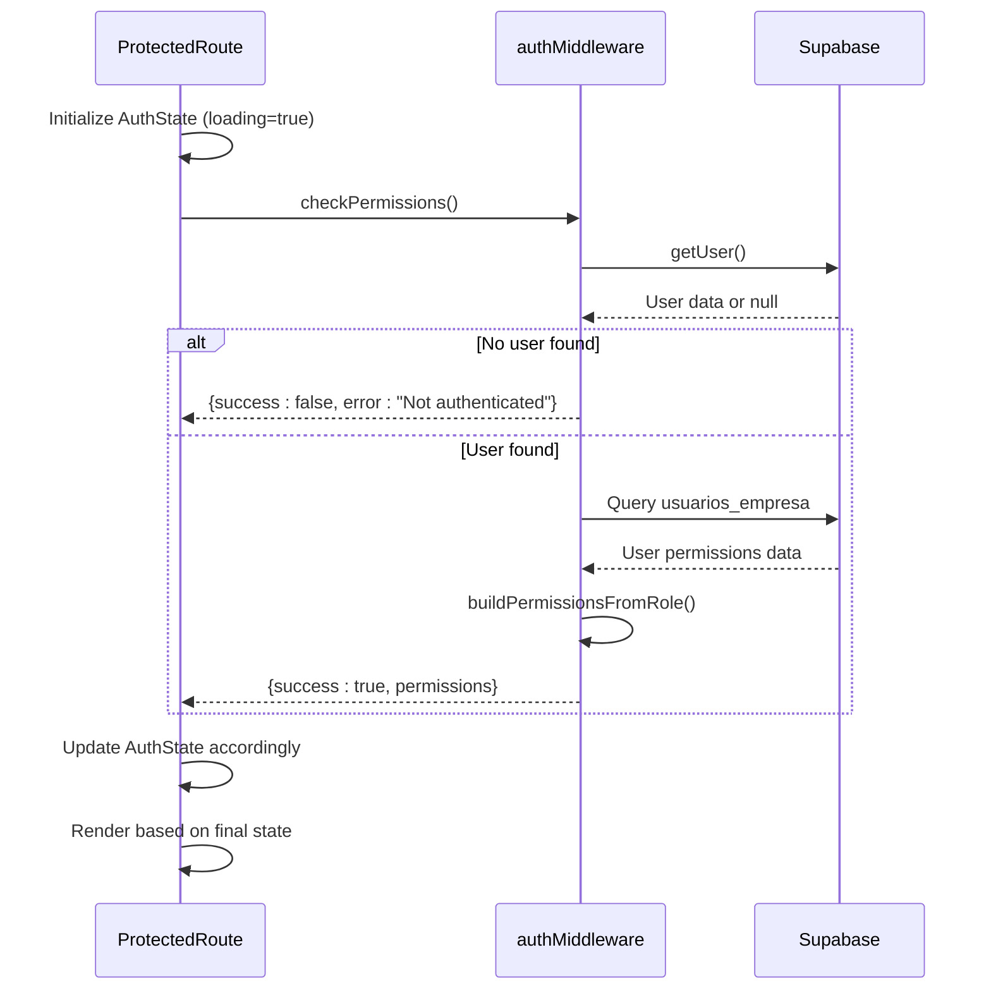
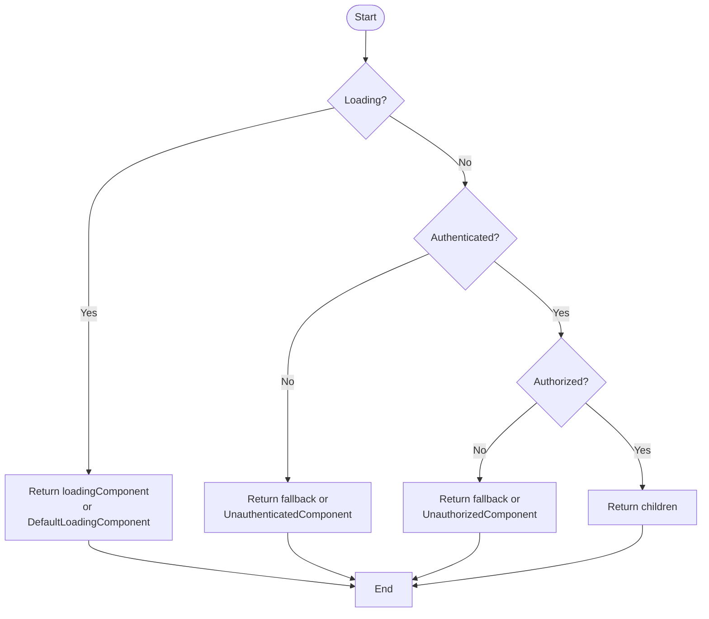

# Route Protection

<cite>
**Referenced Files in This Document**   
- [ProtectedRoute.tsx](file://src/components/Auth/ProtectedRoute.tsx)
- [authMiddleware.ts](file://src/middleware/authMiddleware.ts)
- [ProtectedRouteWithHierarchy.tsx](file://src/components/Auth/ProtectedRouteWithHierarchy.tsx)
- [PermissionGuard.tsx](file://src/components/permissions/PermissionGuard.tsx)
</cite>

## Table of Contents
1. [Introduction](#introduction)
2. [Core Components](#core-components)
3. [ProtectedRoute Component Analysis](#protectedroute-component-analysis)
4. [State Management and Authentication Flow](#state-management-and-authentication-flow)
5. [Implementation Examples by Module](#implementation-examples-by-module)
6. [Error Handling and Loading States](#error-handling-and-loading-states)
7. [Common Issues and Debugging](#common-issues-and-debugging)
8. [Integration with React Router](#integration-with-react-router)
9. [Best Practices for Layout Nesting](#best-practices-for-layout-nesting)

## Introduction
The route protection mechanism in the AABB-system ensures secure access to application routes based on user authentication and authorization status. This document details how the `ProtectedRoute` component functions as a wrapper to conditionally render content, manage access control, and handle various security states across different modules such as admin, bar, kitchen, and inventory.

**Section sources**
- [ProtectedRoute.tsx](file://src/components/Auth/ProtectedRoute.tsx#L1-L272)

## Core Components
The route protection system is built around several key components that work together to enforce access policies:
- `ProtectedRoute`: Main wrapper for securing routes
- `requireAuth` and `requireModulePermission`: Middleware functions for authentication and authorization checks
- `AuthState`: Internal state object tracking loading, authentication, and authorization status
- `PermissionGuard`: Secondary component for granular UI-level permission control

These components integrate with Supabase for identity management and use role-based permissions stored in the database to determine access rights.



**Diagram sources**
- [ProtectedRoute.tsx](file://src/components/Auth/ProtectedRoute.tsx#L91-L175)
- [authMiddleware.ts](file://src/middleware/authMiddleware.ts#L253-L301)

## ProtectedRoute Component Analysis
The `ProtectedRoute` component accepts several props to customize its behavior:
- `requireModule`: Specifies which module's permissions to check (e.g., "admin", "bar")
- `requireAction`: Defines the required action ("visualizar", "criar", "editar", etc.), defaulting to "visualizar"
- `fallback`: Custom content to display when access is denied
- `loadingComponent`: Alternative loading indicator during permission verification

When `requireModule` is provided, the component uses `requireModulePermission()` to verify both authentication and specific module access. Otherwise, it only checks basic authentication via `requireAuth()`.



**Diagram sources**
- [ProtectedRoute.tsx](file://src/components/Auth/ProtectedRoute.tsx#L28-L34)
- [ProtectedRoute.tsx](file://src/components/Auth/ProtectedRoute.tsx#L28-L34)

**Section sources**
- [ProtectedRoute.tsx](file://src/components/Auth/ProtectedRoute.tsx#L28-L34)

## State Management and Authentication Flow
Internal state is managed using React's `useState` hook with an `AuthState` interface that tracks five key properties: loading, authenticated, authorized, permissions, and error. The authentication flow follows this sequence:

1. Initialize state with `loading: true`
2. Call `checkPermissions()` on mount or when requirements change
3. Set loading state and clear previous errors
4. Execute appropriate middleware check (`requireAuth` or `requireModulePermission`)
5. Update state based on result
6. Render appropriate view based on final state

The `useEffect` dependency array includes `requireModule` and `requireAction`, ensuring re-evaluation when these props change.



**Diagram sources**
- [ProtectedRoute.tsx](file://src/components/Auth/ProtectedRoute.tsx#L91-L175)
- [authMiddleware.ts](file://src/middleware/authMiddleware.ts#L253-L301)

## Implementation Examples by Module
### Admin Module Protection
```tsx
<ProtectedRoute requireModule="configuracoes" requireAction="administrar">
  <AdminDashboard />
</ProtectedRoute>
```

### Bar Module Protection
```tsx
<ProtectedRoute requireModule="atendimento_bar" requireAction="criar">
  <BarOrders />
</ProtectedRoute>
```

### Kitchen Module Protection
```tsx
<ProtectedRoute requireModule="monitor_cozinha" requireAction="visualizar">
  <KitchenOrders />
</KitchenOrders>
```

### Inventory Module Protection
```tsx
<ProtectedRoute requireModule="relatorios" requireAction="visualizar">
  <InventoryReport />
</ProtectedRoute>
```

Each implementation leverages the same core `ProtectedRoute` component but specifies different modules and actions according to the sensitivity and functionality of the target route.

**Section sources**
- [ProtectedRoute.tsx](file://src/components/Auth/ProtectedRoute.tsx#L91-L175)

## Error Handling and Loading States
The component handles three primary states:
- **Loading**: Displays either `loadingComponent` or a default spinner while verifying credentials
- **Unauthenticated**: Shows login prompt when no valid session exists
- **Unauthorized**: Displays access denied message with optional custom fallback

Error messages are derived from the middleware results and include descriptive text about missing authentication or insufficient permissions. The fallback mechanism allows applications to provide context-specific alternatives rather than generic error pages.



**Diagram sources**
- [ProtectedRoute.tsx](file://src/components/Auth/ProtectedRoute.tsx#L140-L175)

## Common Issues and Debugging
### Infinite Redirects
Occurs when protected routes redirect back to themselves without proper authentication handling. Prevented by ensuring `/login` routes are not wrapped with `ProtectedRoute`.

### Permission Race Conditions
Happen when permissions haven't loaded but components assume availability. Mitigated through proper loading state management and conditional rendering.

### Debugging Unauthorized Access
Use browser developer tools to inspect:
- Current user role and permissions
- Network requests to Supabase
- Console logs from `loadUserPermissions()`
- Final `AuthState` values

The system provides multiple fallback options and error visibility to aid troubleshooting unauthorized access scenarios.

**Section sources**
- [ProtectedRoute.tsx](file://src/components/Auth/ProtectedRoute.tsx#L91-L175)
- [authMiddleware.ts](file://src/middleware/authMiddleware.ts#L253-L301)

## Integration with React Router
The `ProtectedRoute` integrates seamlessly with React Router by wrapping route elements:

```tsx
<Route path="/admin" element={
  <ProtectedRoute requireModule="configuracoes">
    <AdminLayout />
  </ProtectedRoute>
} />
```

It works with both static and dynamic routing patterns, maintaining compatibility with navigation guards and route parameters. The component does not interfere with URL state or history management, focusing solely on access control.

**Section sources**
- [ProtectedRoute.tsx](file://src/components/Auth/ProtectedRoute.tsx#L91-L175)

## Best Practices for Layout Nesting
When nesting protected routes within layout components:
1. Apply highest-level protection at the layout level
2. Use more granular protections for specific features inside layouts
3. Leverage `fallback` prop to maintain consistent UX
4. Consider using `ProtectedRouteWithHierarchy` for multi-tier permission systems

Example:
```tsx
<ProtectedRoute requireModule="dashboard">
  <MainLayout>
    <ProtectedRoute requireModule="funcionarios">
      <EmployeeManagementPanel />
    </ProtectedRoute>
  </MainLayout>
</ProtectedRoute>
```

This approach minimizes redundant permission checks while maintaining clear separation of concerns.

**Section sources**
- [ProtectedRoute.tsx](file://src/components/Auth/ProtectedRoute.tsx#L91-L175)
- [ProtectedRouteWithHierarchy.tsx](file://src/components/Auth/ProtectedRouteWithHierarchy.tsx#L14-L92)