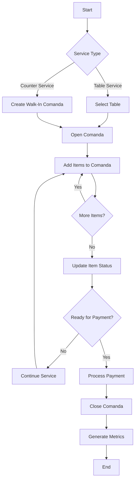
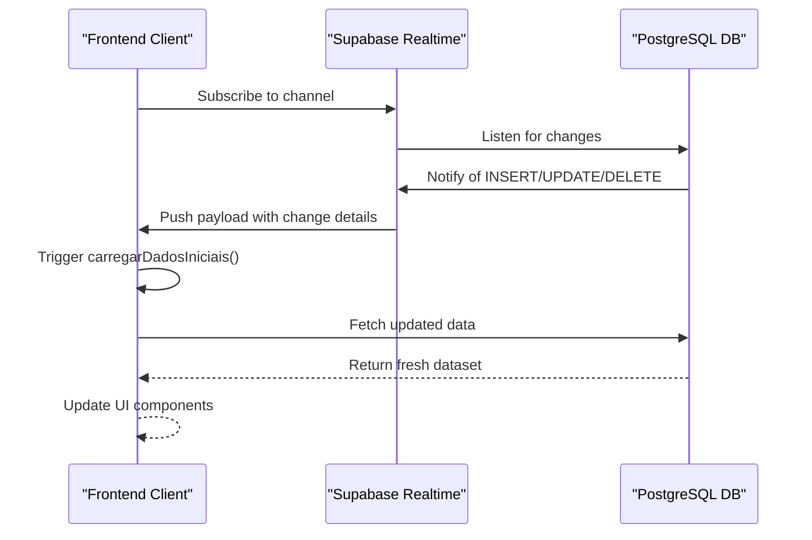
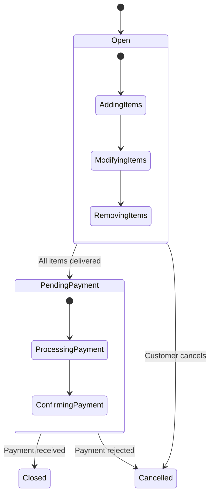
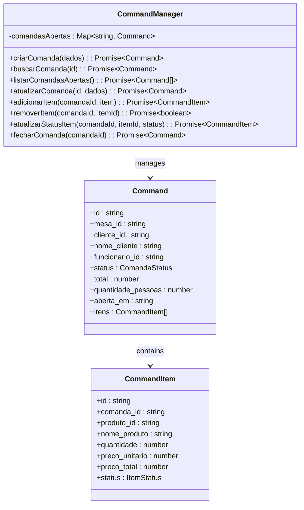

# Bar Module

<cite>
**Referenced Files in This Document**   
- [useBarAttendance.ts](file://src/hooks/useBarAttendance.ts)
- [MesaCard.tsx](file://src/pages/BarAttendance/components/MesaCard.tsx)
- [ComandaDetailsModal.tsx](file://src/pages/BarAttendance/components/ComandaDetailsModal.tsx)
- [OrderQueue.tsx](file://src/pages/BarAttendance/components/OrderQueue.tsx)
- [command-manager.ts](file://src/services/command-manager.ts)
- [bar-attendance.ts](file://src/types/bar-attendance.ts)
</cite>

## Table of Contents
1. [Introduction](#introduction)
2. [Core Functionality Overview](#core-functionality-overview)
3. [UI Components for Service Management](#ui-components-for-service-management)
4. [Frontend-Backend Real-Time Integration](#frontend-backend-real-time-integration)
5. [Business Rules and Order Status Transitions](#business-rules-and-order-status-transitions)
6. [Customer Registration and Item Modification](#customer-registration-and-item-modification)
7. [Code Examples from useBarAttendance Hook](#code-examples-from-usebarattendance-hook)
8. [Command Manager Service Implementation](#command-manager-service-implementation)
9. [Common Issues and Offline Solutions](#common-issues-and-offline-solutions)
10. [Conclusion](#conclusion)

## Introduction

The Bar Module is a comprehensive system designed to manage order creation, comanda (tab) management, and customer service workflows in restaurant environments. It supports both table and counter services through an intuitive interface that enables staff to efficiently handle orders, track customer information, and process payments. The module integrates real-time data synchronization via Supabase Realtime to ensure all devices reflect the most current state of operations.

This documentation provides detailed insights into the module's architecture, focusing on key components such as MesaCard, ComandaDetailsModal, and OrderQueue. It explains how these elements interact with backend services to deliver seamless functionality across various operational scenarios including order placement, status updates, and payment processing.

**Section sources**
- [useBarAttendance.ts](file://src/hooks/useBarAttendance.ts#L62-L842)
- [MesaCard.tsx](file://src/pages/BarAttendance/components/MesaCard.tsx#L18-L196)
- [ComandaDetailsModal.tsx](file://src/pages/BarAttendance/components/ComandaDetailsModal.tsx#L14-L396)
- [OrderQueue.tsx](file://src/pages/BarAttendance/components/OrderQueue.tsx#L23-L425)

## Core Functionality Overview

The Bar Module orchestrates multiple aspects of bar and restaurant operations by providing tools for managing tables, creating and modifying comandas, processing orders, and handling customer interactions. At its core lies the concept of "comanda," which represents an open tab associated with either a specific table or a walk-in customer at the counter.

Key functionalities include:
- **Order Creation**: Staff can initiate new comandas linked to tables or customers.
- **Comanda Management**: Ongoing tabs are tracked with real-time updates on items added, modified, or removed.
- **Customer Service Workflows**: Supports quick registration of customers, division of bills, and special requests.
- **Real-Time Updates**: Utilizes Supabase Realtime subscriptions to propagate changes instantly across connected clients.
- **Metrics Tracking**: Captures performance metrics for employees based on sales volume and service efficiency.

These capabilities enable efficient coordination between front-of-house staff and kitchen teams while maintaining accurate financial records.



**Diagram sources**
- [useBarAttendance.ts](file://src/hooks/useBarAttendance.ts#L62-L842)
- [command-manager.ts](file://src/services/command-manager.ts#L0-L619)

## UI Components for Service Management

### MesaCard Component

The `MesaCard` component visually represents individual tables within the establishment, displaying their current status (available, occupied, reserved, cleaning). Each card shows essential details such as table number, capacity, occupancy time, and total amount spent when applicable.

Users can perform actions directly from this component:
- **Quick Actions**: Hovering over a card reveals buttons to occupy, release, clean, or reserve the table.
- **Status Indicators**: Color-coded backgrounds indicate table status—green for available, red for occupied, yellow for reserved, and gray for cleaning.
- **Occupancy Details**: For occupied tables, it displays the number of people, time since occupation, and current comanda value.

This design facilitates rapid decision-making during busy periods by presenting critical information at a glance.

**Section sources**
- [MesaCard.tsx](file://src/pages/BarAttendance/components/MesaCard.tsx#L18-L196)

### ComandaDetailsModal Component

The `ComandaDetailsModal` provides an interactive interface for managing active comandas. When opened, it displays comprehensive details about the selected comanda, including:
- **Header Information**: Comanda ID, duration open, customer name, and table number.
- **Menu Browsing**: Searchable and filterable list of menu items categorized by type.
- **Cart System**: Allows adding multiple items to a temporary cart before committing them to the comanda.
- **Item Management**: Enables removal of items and updating their status (pending, preparing, ready, delivered).

Staff members use this modal to add new items, modify existing ones with notes, and monitor preparation progress—all within a single cohesive view.

**Section sources**
- [ComandaDetailsModal.tsx](file://src/pages/BarAttendance/components/ComandaDetailsModal.tsx#L14-L396)

### OrderQueue Component

The `OrderQueue` component serves as a centralized dashboard for tracking pending orders. It organizes items by priority level and includes visual indicators for urgency and estimated completion times.

Features include:
- **Priority Levels**: Orders marked as urgent appear highlighted with star icons.
- **Timer Integration**: Displays countdown timers indicating expected readiness based on preparation complexity.
- **Alert System**: Notifies staff of overdue or high-priority items requiring immediate attention.
- **Multiple Order Detection**: Highlights tables with more than one outstanding order to prevent confusion.

This component ensures timely delivery of food and beverages by keeping kitchen staff informed of workflow demands.

**Section sources**
- [OrderQueue.tsx](file://src/pages/BarAttendance/components/OrderQueue.tsx#L23-L425)

## Frontend-Backend Real-Time Integration

The Bar Module leverages Supabase Realtime technology to maintain synchronized states across all client applications. This integration occurs through PostgreSQL change notifications that trigger automatic UI updates without manual refreshes.

### Real-Time Subscriptions

Three primary subscription channels monitor database changes:
- **bar-tables-changes**: Tracks modifications to table statuses (e.g., from available to occupied).
- **comandas-changes**: Observes updates to comanda records, including openings, closings, and payments.
- **comanda-items-changes**: Watches for alterations in individual order items like additions, deletions, or status transitions.

Whenever a relevant event occurs, the system invokes `carregarDadosIniciais()` to refresh local state with the latest data from the server.



**Diagram sources**
- [useBarAttendance.ts](file://src/hooks/useBarAttendance.ts#L62-L842)

### Data Flow Architecture

Data flows bidirectionally between frontend and backend:
1. **Read Operations**: Initial load retrieves complete datasets using complex SELECT queries with joins.
2. **Write Operations**: Mutations occur via Supabase client methods (`insert`, `update`, `delete`).
3. **Synchronization**: After each mutation, subscribed clients receive notification and reload affected data.

This pattern minimizes direct manipulation of local state, reducing inconsistencies and ensuring reliability.

**Section sources**
- [useBarAttendance.ts](file://src/hooks/useBarAttendance.ts#L62-L842)

## Business Rules and Order Status Transitions

The Bar Module enforces strict business rules governing order lifecycle management. These rules define valid status transitions and associated constraints to maintain data integrity.

### Order Status Lifecycle

An order progresses through several defined states:
- **Open**: Initial state after creation; items can be added or removed.
- **Pending Payment**: All items have been served; awaiting final payment.
- **Closed**: Payment processed; comanda finalized.
- **Cancelled**: Aborted due to error or customer request.

Transitions follow a unidirectional path where reversal beyond certain points is prohibited.

### Transition Constraints

Specific conditions must be met before advancing an order’s status:
- **Closing Requirement**: No pending or preparing items may remain on the comanda.
- **Item Removal Restriction**: Cannot remove items once they reach "delivered" status.
- **Payment Validation**: Requires specification of payment method and optional notes.

These safeguards prevent premature closures and ensure accountability throughout the service process.



**Diagram sources**
- [useBarAttendance.ts](file://src/hooks/useBarAttendance.ts#L62-L842)
- [bar-attendance.ts](file://src/types/bar-attendance.ts#L0-L192)

## Customer Registration and Item Modification

### Customer Quick Registration

For non-regular patrons, the system offers streamlined registration directly within the comanda workflow. Users input basic details such as name and phone number, which are temporarily stored until formal enrollment. This feature accelerates service initiation without compromising data collection requirements.

Registered customers benefit from personalized experiences, including preference tracking and loyalty program participation.

### Item Modifications

Each item on a comanda supports customization through optional fields:
- **Quantity Adjustment**: Increase or decrease count per item.
- **Special Instructions**: Add preparation notes (e.g., "no onions").
- **Status Tracking**: Monitor progression from pending to delivered.

Modifications take effect immediately upon submission, triggering real-time updates visible to all stakeholders.

**Section sources**
- [ComandaDetailsModal.tsx](file://src/pages/BarAttendance/components/ComandaDetailsModal.tsx#L14-L396)

## Code Examples from useBarAttendance Hook

The `useBarAttendance` custom hook encapsulates much of the module's logic, exposing functions for common operations.

### Creating a New Comanda

```typescript
const criarComanda = useCallback(async (
  mesaId?: string, 
  nomeCliente?: string, 
  numeroPessoas?: number
): Promise<string> => {
  // Implementation details omitted
}, [user, atualizarEstado, tratarErro, carregarDadosIniciais]);
```

This function creates a new comanda record, optionally linking it to a table and setting initial parameters like customer name and party size.

[SPEC SYMBOL](file://src/hooks/useBarAttendance.ts#L200-L240)

### Updating Item Status

```typescript
const atualizarStatusItem = useCallback(async (
  itemId: string, 
  status: ComandaItemStatus
): Promise<void> => {
  // Implementation details omitted
}, [tratarErro, carregarDadosIniciais]);
```

Changes the status of a specific item, applying appropriate timestamps depending on the target state (e.g., `prepared_at` for "ready").

[SPEC SYMBOL](file://src/hooks/useBarAttendance.ts#L480-L510)

### Closing a Comanda

```typescript
const fecharComanda = useCallback(async (
  comandaId: string, 
  metodoPagamento: string, 
  observacoes?: string
): Promise<void> => {
  // Implementation details omitted
}, [atualizarEstado, tratarErro, carregarDadosIniciais, liberarMesa, atualizarMetricasVenda]);
```

Finalizes a comanda by recording payment details, releasing the associated table, and updating employee metrics.

[SPEC SYMBOL](file://src/hooks/useBarAttendance.ts#L380-L420)

**Section sources**
- [useBarAttendance.ts](file://src/hooks/useBarAttendance.ts#L62-L842)

## Command Manager Service Implementation

The `CommandManager` class in `command-manager.ts` provides server-side logic for handling comanda operations. It acts as an intermediary layer between the application and database, enforcing business rules and optimizing performance through caching.

### Key Responsibilities

- **State Management**: Maintains in-memory cache of open comandas to reduce database queries.
- **Validation**: Enforces constraints on status transitions and item modifications.
- **Persistence**: Coordinates with Supabase integration layer for durable storage.

### Method Signatures

| Method | Parameters | Description |
|--------|------------|-------------|
| `criarComanda` | dados: object | Creates new comanda with specified attributes |
| `buscarComanda` | comandaId: string | Retrieves comanda by ID from cache or database |
| `adicionarItem` | comandaId, item | Adds product to existing comanda |
| `removerItem` | comandaId, itemId | Removes item if not already prepared/delivered |
| `fecharComanda` | comandaId | Finalizes comanda after validating no pending items |

This service ensures consistency and scalability by abstracting complex operations behind simple interfaces.



**Diagram sources**
- [command-manager.ts](file://src/services/command-manager.ts#L0-L619)

## Common Issues and Offline Solutions

### Synchronization Delays

Occasionally, network latency may cause brief delays in propagating real-time updates. To mitigate this:
- Implement optimistic UI updates that assume success before confirmation.
- Use exponential backoff strategies for retrying failed operations.
- Display loading indicators during prolonged waits.

### Handling Offline Scenarios

When connectivity is lost, the system should:
- Queue outgoing requests locally using persistent storage.
- Allow continued operation with cached data.
- Automatically sync queued actions upon reconnection.

These measures ensure uninterrupted service even under adverse network conditions.

**Section sources**
- [useBarAttendance.ts](file://src/hooks/useBarAttendance.ts#L62-L842)

## Conclusion

The Bar Module delivers robust functionality for managing restaurant operations through integrated tools for order creation, comanda management, and customer service. Its reliance on real-time data synchronization via Supabase ensures consistent experiences across devices while supporting flexible workflows for both table and counter services.

By adhering to well-defined business rules and leveraging modern frontend patterns, the module enhances operational efficiency and improves overall customer satisfaction. Future enhancements could explore advanced analytics, predictive ordering, and deeper integrations with inventory systems.