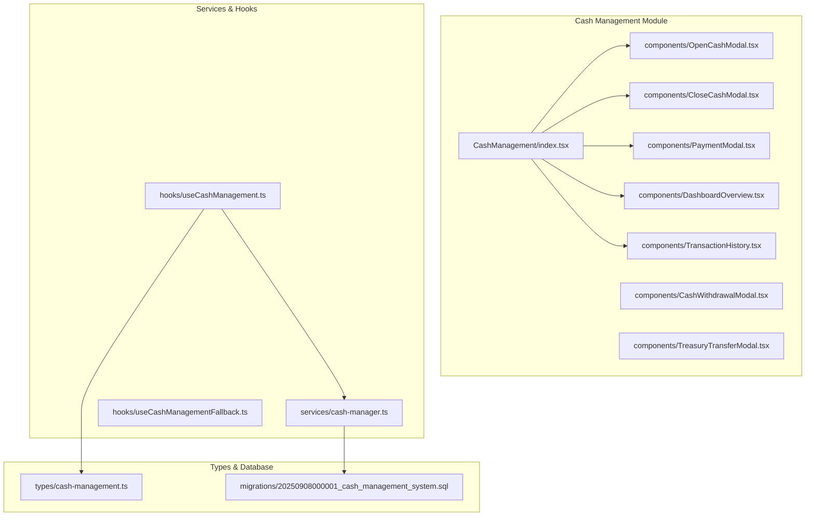
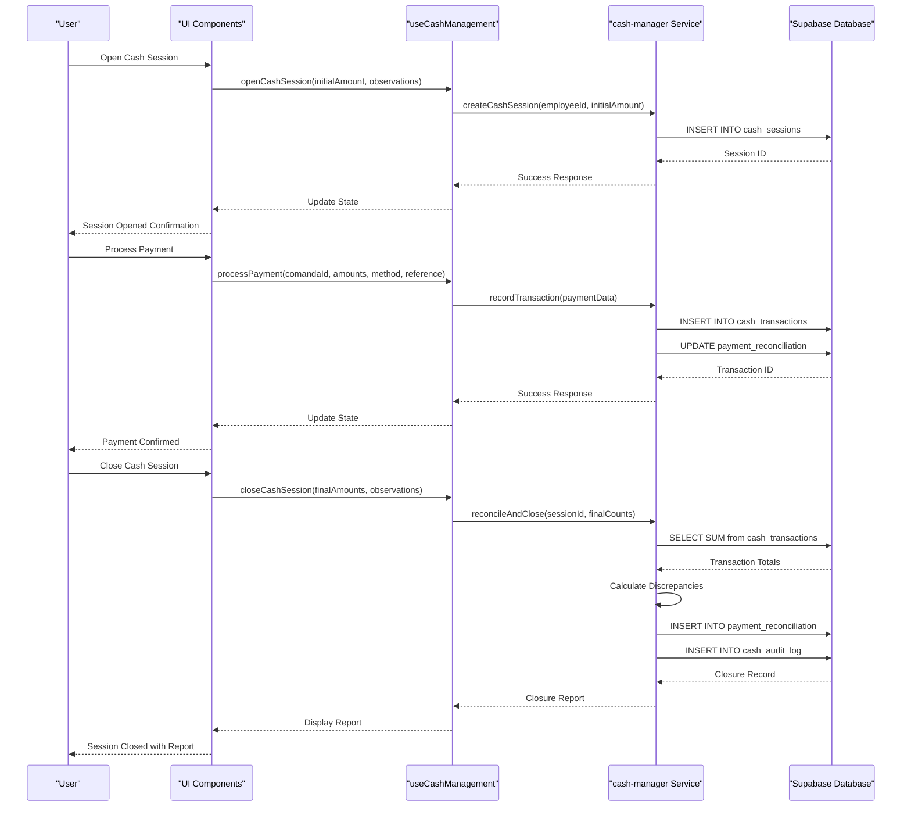
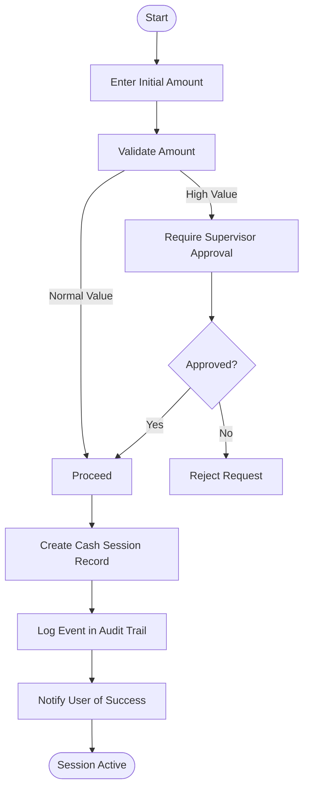
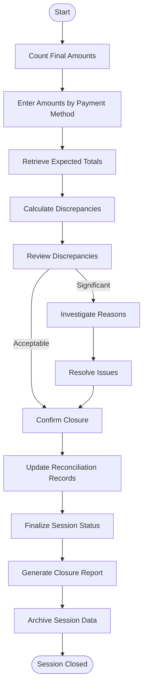
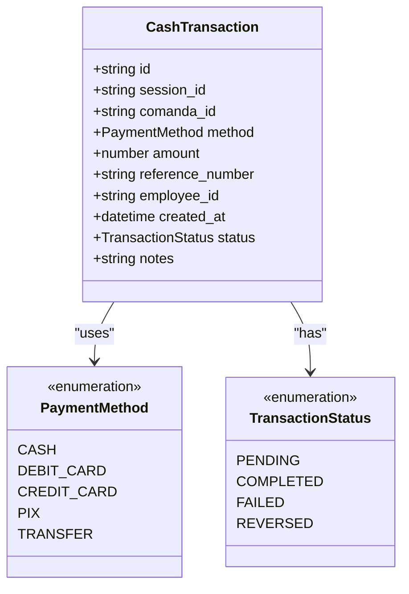
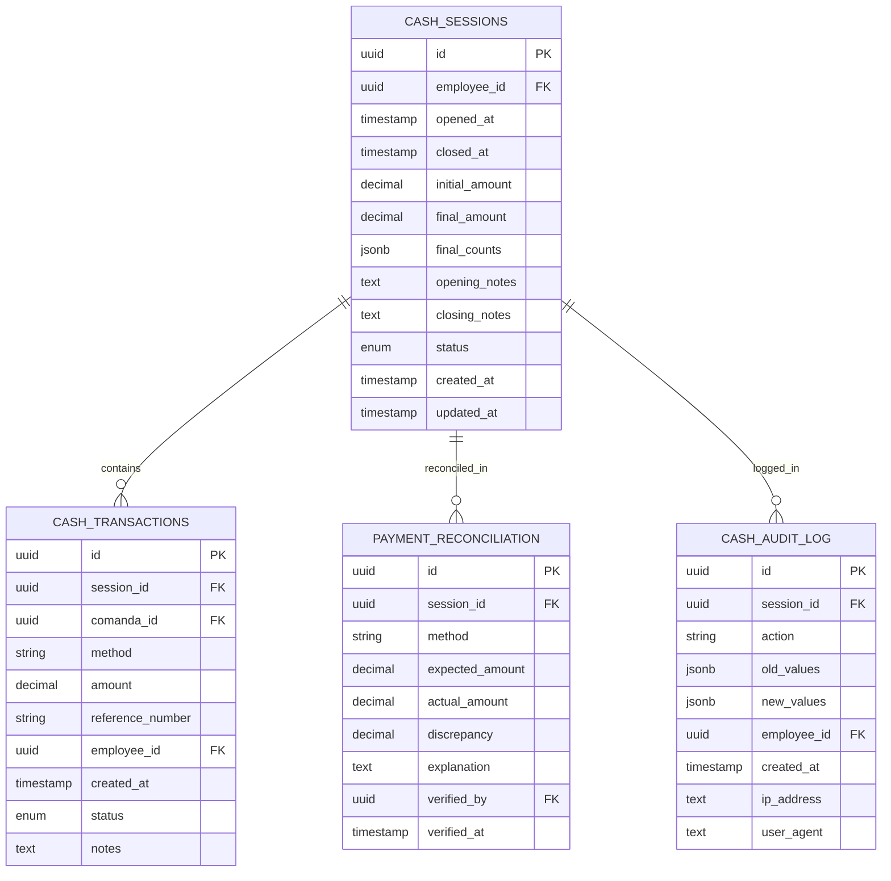
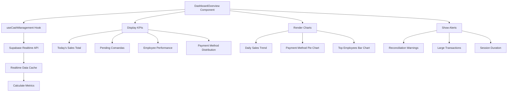
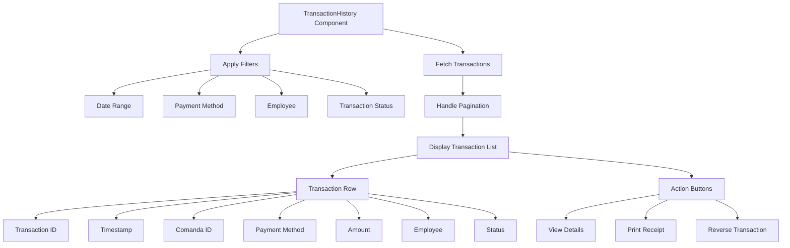
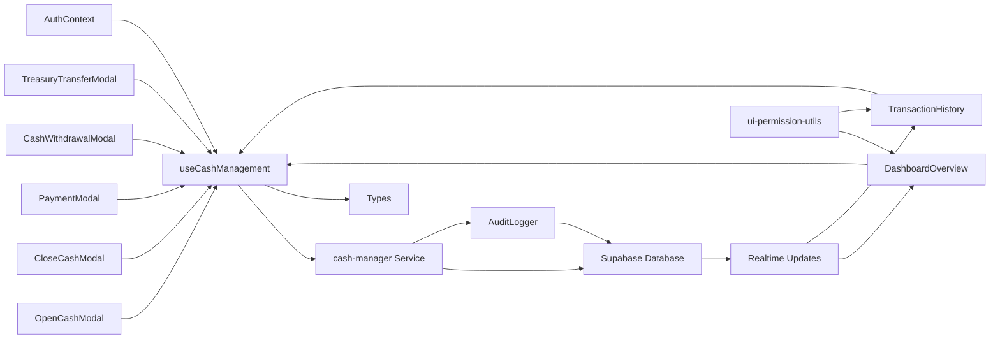

# Cash Management Module

<cite>
**Referenced Files in This Document**   
- [OpenCashModal.tsx](file://src/pages/CashManagement/components/OpenCashModal.tsx)
- [CloseCashModal.tsx](file://src/pages/CashManagement/components/CloseCashModal.tsx)
- [cash-manager.ts](file://src/services/cash-manager.ts)
- [DashboardOverview.tsx](file://src/pages/CashManagement/components/DashboardOverview.tsx)
- [TransactionHistory.tsx](file://src/pages/CashManagement/components/TransactionHistory.tsx)
- [useCashManagement.ts](file://src/hooks/useCashManagement.ts)
- [cash-management.ts](file://src/types/cash-management.ts)
- [20250908000001_cash_management_system.sql](file://supabase/migrations/20250908000001_cash_management_system.sql)
</cite>

## Table of Contents
1. [Introduction](#introduction)
2. [Project Structure](#project-structure)
3. [Core Components](#core-components)
4. [Architecture Overview](#architecture-overview)
5. [Detailed Component Analysis](#detailed-component-analysis)
6. [Dependency Analysis](#dependency-analysis)
7. [Performance Considerations](#performance-considerations)
8. [Troubleshooting Guide](#troubleshooting-guide)
9. [Conclusion](#conclusion)

## Introduction
The Cash Management Module provides a comprehensive solution for managing cash sessions, processing transactions, and performing financial reconciliation within the AABB System. This document details the complete lifecycle of cash operations from opening to closing sessions, including intermediate actions such as withdrawals and transfers. The module integrates with various components to ensure accurate financial tracking, audit compliance, and real-time reporting.

## Project Structure

**Diagram sources**
- [index.tsx](file://src/pages/CashManagement/index.tsx)
- [OpenCashModal.tsx](file://src/pages/CashManagement/components/OpenCashModal.tsx)
- [CloseCashModal.tsx](file://src/pages/CashManagement/components/CloseCashModal.tsx)
- [cash-manager.ts](file://src/services/cash-manager.ts)
- [useCashManagement.ts](file://src/hooks/useCashManagement.ts)
- [cash-management.ts](file://src/types/cash-management.ts)
- [20250908000001_cash_management_system.sql](file://supabase/migrations/20250908000001_cash_management_system.sql)

**Section sources**
- [index.tsx](file://src/pages/CashManagement/index.tsx#L1-L22)
- [CASH_MANAGEMENT_README.md](file://CASH_MANAGEMENT_README.md#L0-L188)

## Core Components

The Cash Management Module consists of several key components that handle different aspects of cash operations:

- **OpenCashModal**: Manages the cash session opening process, including initial cash amount entry and supervisor validation for high values.
- **CloseCashModal**: Handles cash session closure with final count input, payment method reconciliation, discrepancy calculation, and closure reporting.
- **PaymentModal**: Processes payments for bar orders (comandas) with support for multiple payment methods including cash, debit, credit, PIX, and transfer.
- **CashWithdrawalModal**: Facilitates cash withdrawals during active sessions with proper authorization and audit logging.
- **TreasuryTransferModal**: Manages transfers between cashiers and main treasury with appropriate security controls.

These components are integrated through the `useCashManagement` hook which provides the business logic layer connecting the UI components with the backend services.

**Section sources**
- [OpenCashModal.tsx](file://src/pages/CashManagement/components/OpenCashModal.tsx)
- [CloseCashModal.tsx](file://src/pages/CashManagement/components/CloseCashModal.tsx)
- [PaymentModal.tsx](file://src/pages/CashManagement/components/PaymentModal.tsx)
- [CashWithdrawalModal.tsx](file://src/pages/CashManagement/components/CashWithdrawalModal.tsx)
- [TreasuryTransferModal.tsx](file://src/pages/CashManagement/components/TreasuryTransferModal.tsx)

## Architecture Overview

**Diagram sources**
- [useCashManagement.ts](file://src/hooks/useCashManagement.ts#L1-L50)
- [cash-manager.ts](file://src/services/cash-manager.ts#L1-L100)
- [OpenCashModal.tsx](file://src/pages/CashManagement/components/OpenCashModal.tsx#L1-L30)
- [CloseCashModal.tsx](file://src/pages/CashManagement/components/CloseCashModal.tsx#L1-L30)
- [PaymentModal.tsx](file://src/pages/CashManagement/components/PaymentModal.tsx#L1-L30)

## Detailed Component Analysis

### Cash Session Lifecycle Management

#### Opening a Cash Session
The cash session lifecycle begins with the `OpenCashModal` component, which collects the initial cash amount and optional observations. The system validates the entered amount, requiring supervisor approval for values exceeding predefined thresholds. Upon submission, the `useCashManagement` hook invokes the `openCashSession` method, which creates a new record in the `cash_sessions` table with the employee ID, opening timestamp, initial amount, and status set to 'active'.

**Diagram sources**
- [OpenCashModal.tsx](file://src/pages/CashManagement/components/OpenCashModal.tsx#L15-L80)
- [useCashManagement.ts](file://src/hooks/useCashManagement.ts#L25-L60)

#### Closing a Cash Session
The `CloseCashModal` component manages the cash session closure process. It requires the user to input the final cash amounts for each payment method. The system automatically calculates expected totals based on transaction records and computes discrepancies. The closure process includes reconciliation across all payment methods (cash, debit, credit, PIX, transfer), generation of a closure report, and finalization of the session with status update to 'closed'.

**Diagram sources**
- [CloseCashModal.tsx](file://src/pages/CashManagement/components/CloseCashModal.tsx#L20-L90)
- [cash-manager.ts](file://src/services/cash-manager.ts#L80-L150)

### Transaction Processing

#### Payment Methods Support
The Cash Management Module supports five payment methods:
- Cash
- Debit Card
- Credit Card  
- PIX (Instant Payment)
- Bank Transfer

Each transaction is recorded with detailed information including comanda ID, amounts, payment method, transaction timestamp, employee ID, and optional reference numbers for electronic payments.

**Diagram sources**
- [cash-management.ts](file://src/types/cash-management.ts#L10-L50)
- [PaymentModal.tsx](file://src/pages/CashManagement/components/PaymentModal.tsx#L15-L40)

### Financial Reconciliation

#### Data Model for Cash Movements
The system maintains a comprehensive data model for tracking all cash movements throughout the session lifecycle. The primary entities include:

**Diagram sources**
- [20250908000001_cash_management_system.sql](file://supabase/migrations/20250908000001_cash_management_system.sql#L1-L200)
- [cash-management.ts](file://src/types/cash-management.ts#L5-L100)

### Reporting Features

#### Dashboard Overview Component
The `DashboardOverview` component provides real-time insights into cash operations with key metrics displayed in an intuitive interface. It leverages the `useCashManagement` hook to retrieve current session data and performance metrics.

**Diagram sources**
- [DashboardOverview.tsx](file://src/pages/CashManagement/components/DashboardOverview.tsx#L10-L75)
- [useCashManagement.ts](file://src/hooks/useCashManagement.ts#L5-L20)

#### Transaction History Component
The `TransactionHistory` component provides a detailed view of all transactions within the current or selected period. Users can filter by date range, payment method, employee, or transaction status.

**Diagram sources**
- [TransactionHistory.tsx](file://src/pages/CashManagement/components/TransactionHistory.tsx#L15-L60)
- [useCashManagement.ts](file://src/hooks/useCashManagement.ts#L30-L45)

## Dependency Analysis

**Diagram sources**
- [OpenCashModal.tsx](file://src/pages/CashManagement/components/OpenCashModal.tsx)
- [CloseCashModal.tsx](file://src/pages/CashManagement/components/CloseCashModal.tsx)
- [PaymentModal.tsx](file://src/pages/CashManagement/components/PaymentModal.tsx)
- [CashWithdrawalModal.tsx](file://src/pages/CashManagement/components/CashWithdrawalModal.tsx)
- [TreasuryTransferModal.tsx](file://src/pages/CashManagement/components/TreasuryTransferModal.tsx)
- [DashboardOverview.tsx](file://src/pages/CashManagement/components/DashboardOverview.tsx)
- [TransactionHistory.tsx](file://src/pages/CashManagement/components/TransactionHistory.tsx)
- [useCashManagement.ts](file://src/hooks/useCashManagement.ts)
- [cash-manager.ts](file://src/services/cash-manager.ts)
- [ui-permission-utils.ts](file://src/utils/ui-permission-utils.ts)

**Section sources**
- [useCashManagement.ts](file://src/hooks/useCashManagement.ts#L1-L100)
- [cash-manager.ts](file://src/services/cash-manager.ts#L1-L200)

## Performance Considerations
The Cash Management Module is designed with performance optimization in mind. Key considerations include:

- **Realtime Updates**: Leveraging Supabase Realtime functionality to push updates to all connected clients without polling.
- **Efficient Queries**: Optimized database queries with appropriate indexing on frequently accessed fields like session_id, employee_id, and created_at.
- **Client-Side Caching**: The useCashManagement hook implements caching to minimize redundant API calls.
- **Lazy Loading**: Transaction history and reports load data incrementally using pagination.
- **Debounced Searches**: Search functionality in transaction history uses debouncing to reduce server load.

The system also includes fallback mechanisms during development or connectivity issues, ensuring usability even when the primary service is unavailable.

## Troubleshooting Guide

### Common Issues and Solutions

**Duplicate Transactions**
- **Symptoms**: Same transaction appears twice in history, reconciliation discrepancies
- **Causes**: Double-clicking submit button, network latency causing retry
- **Solutions**: 
  - Implement button disabling during submission
  - Use transaction IDs with unique constraints
  - Add client-side duplicate detection

**Failed Session Closures**
- **Symptoms**: Closure process fails, discrepancies cannot be resolved
- **Causes**: Large discrepancies exceeding tolerance, missing transactions, permission issues
- **Solutions**:
  - Verify all comandas are closed before closure
  - Check for pending transactions
  - Ensure supervisor privileges for large discrepancies
  - Review audit logs for anomalies

**Constraint Violations**
- **Symptoms**: Database errors during operations
- **Causes**: Invalid data types, missing required fields, foreign key violations
- **Solutions**:
  - Validate inputs before submission
  - Ensure all required fields are populated
  - Verify referenced entities exist

**Reconciliation Mismatches**
- **Symptoms**: Expected vs actual amounts don't match
- **Causes**: Unrecorded cash movements, incorrect counting, timing issues
- **Solutions**:
  - Conduct thorough cash counts
  - Review all transaction types (including withdrawals)
  - Verify timezone consistency in timestamps

**Section sources**
- [CORRECAO-CASH-CONSTRAINT.md](file://CORRECAO-CASH-CONSTRAINT.md)
- [DEBUG_TRANSACOES.md](file://DEBUG_TRANSACOES.md)
- [cash-manager.test.ts](file://src/services/__tests__/cash-manager.test.ts)

## Conclusion
The Cash Management Module provides a robust solution for handling cash operations in the AABB System. With comprehensive features for session management, transaction processing, and financial reconciliation, it ensures accurate financial tracking and audit compliance. The modular architecture with clear separation of concerns between UI components, business logic hooks, and backend services enables maintainability and scalability. Real-time capabilities and detailed reporting provide valuable insights for operational decision-making. Proper implementation of the database migrations and configuration will ensure the system functions as intended, providing a reliable foundation for cash management operations.