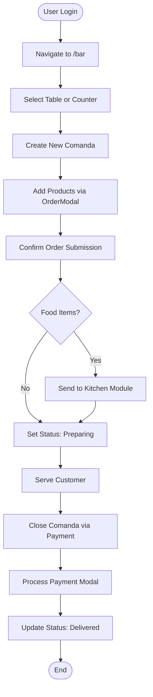
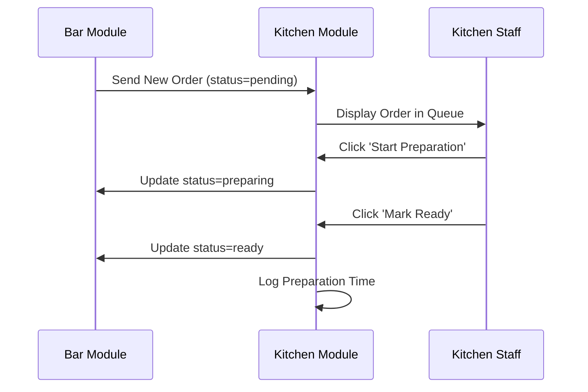
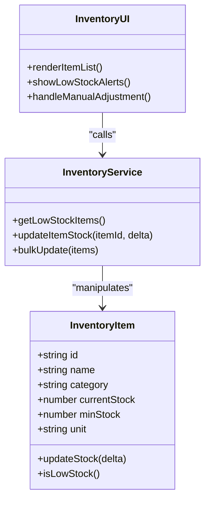
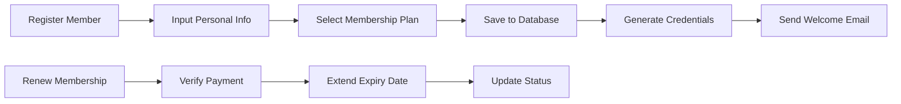
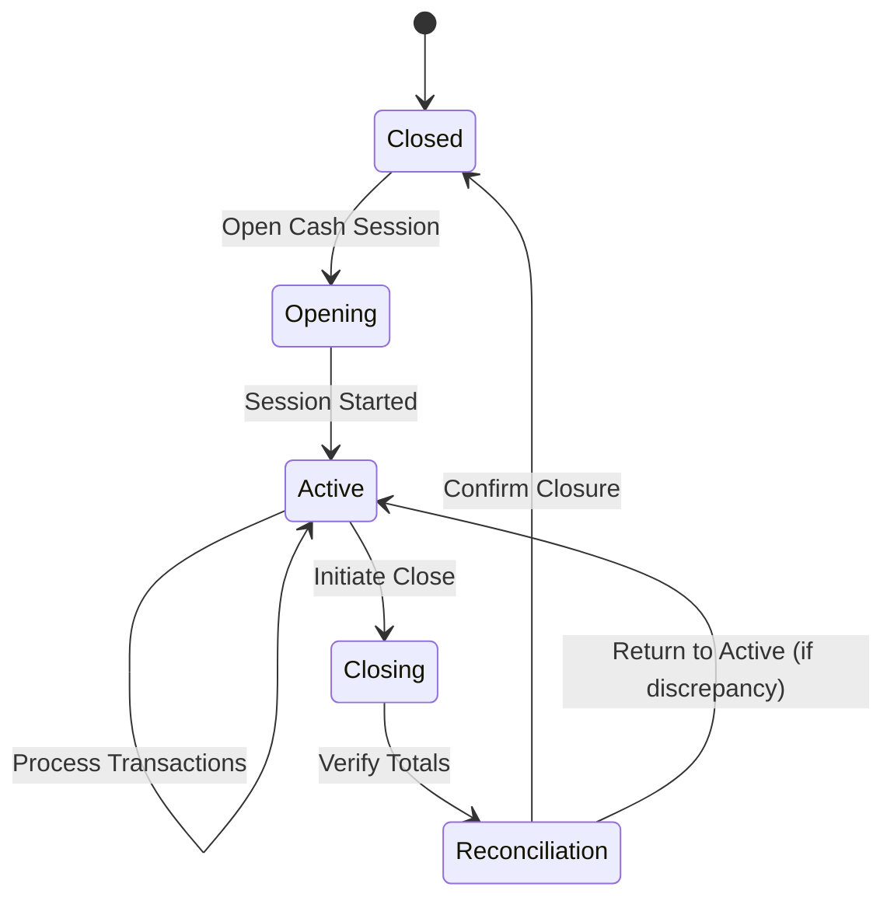

# Core Modules

<cite>
**Referenced Files in This Document**
- [Dashboard.tsx](file://src/pages/Dashboard.tsx)
- [CashManagement/index.tsx](file://src/pages/CashManagement/index.tsx)
- [Bar/index.tsx](file://src/pages/Bar/index.tsx)
- [Kitchen/index.tsx](file://src/pages/Kitchen/index.tsx)
- [Inventory/index.tsx](file://src/pages/Inventory/index.tsx)
- [Members/index.tsx](file://src/pages/Members/index.tsx)
</cite>

## Table of Contents
1. [Dashboard Module](#dashboard-module)
2. [Bar Module](#bar-module)
3. [Kitchen Module](#kitchen-module)
4. [Inventory Module](#inventory-module)
5. [Members Module](#members-module)
6. [Cash Management Module](#cash-management-module)

## Dashboard Module

The Dashboard module serves as the central hub for monitoring key performance indicators (KPIs) and navigating to other functional modules within the AABB-system. It provides an executive overview of club operations, displaying real-time metrics such as daily revenue, pending orders, today's sales volume, and low-stock inventory items.

User roles with access to the dashboard include administrators, managers, and supervisors who require a high-level view of system activity. The workflow begins upon login, redirecting users to the dashboard by default. From here, they can drill down into specific alerts—such as clicking on "Low Stock" to navigate directly to the Inventory module—or access primary modules via quick links displayed under "Available Modules."

Integration points include the Orders and Inventory systems, which supply data for KPI calculations. The UI structure features responsive cards with icons and color-coded statuses for intuitive interpretation. Data models used include `Order` and `InventoryItem`, both retrieved through context providers like `useApp()`.

A common use case involves a manager reviewing pending orders and low-stock alerts at the start of a shift to prioritize operational actions. Business rules dictate that only delivered orders from the current day contribute to revenue calculations, and stock levels below defined minimum thresholds trigger visible alerts.

Performance is optimized through motion animations and lazy loading of non-critical components, ensuring fast rendering even with large datasets. Scalability considerations include pagination for order lists and filtering mechanisms to prevent excessive memory usage.

Customization options allow demo mode activation based on user email (e.g., demo@clubmanager.com), enabling feature exploration without affecting live data.

**Section sources**
- [Dashboard.tsx](file://src/pages/Dashboard.tsx#L21-L300)

## Bar Module

The Bar module manages order creation, table assignments, and command tracking for bar service. It supports both table-based and counter (balcão) service workflows, allowing staff to register customers quickly and manage active comandas.

Primary users are bartenders and waitstaff who create and update orders. A typical workflow starts with selecting a table or initiating a counter order, followed by adding menu items to the comanda. Orders are then sent to the Kitchen module for preparation and tracked through status transitions: pending → preparing → ready → delivered.

UI components include `OrderCard`, `OrderModal`, and `MesasView`, organized under the `/bar` route. Integration occurs with the Kitchen module for food orders and the Cash Management module upon payment processing. The data model centers around the `Comanda` entity, linked to `Mesa` (table) and `Produto` (product).

An example use case involves splitting a single comanda across multiple payment methods, facilitated by the `DivisaoContaModal`. Business rules enforce that all items must be confirmed before sending to the kitchen and that closed comandas cannot be reopened without managerial override.

Performance optimizations include real-time updates using React hooks like `useBarTables` and `useComandas`, minimizing API calls through caching strategies. The module scales well due to modular component design and efficient state management via Redux-like patterns.

Configuration allows layout customization through `ConfigurarLayoutModal`, adapting the interface to different venue floor plans.

## Bar Module Analysis

**Diagram sources**
- [Bar/index.tsx](file://src/pages/Bar/index.tsx)
- [OrderModal.tsx](file://src/pages/Bar/OrderModal.tsx)

**Section sources**
- [Bar/index.tsx](file://src/pages/Bar/index.tsx)
- [OrderModal.tsx](file://src/pages/Bar/OrderModal.tsx)

## Kitchen Module

The Kitchen module handles order preparation, status tracking, and communication between kitchen staff and service teams. It displays incoming orders in a queue format, allowing chefs to mark them as being prepared or ready for pickup.

Users include kitchen personnel and supervisors. Upon receiving an order from the Bar module, it appears in the `KitchenOrders` list with preparation priority. Staff interact with `MenuItemModal` to view details and update order status. Integration with the Bar module ensures synchronized status changes visible to servers.

The UI emphasizes clarity and speed, using color-coded indicators and large touch-friendly buttons. Data flows from the `order-manager` service, which listens for new orders in real time. The core data model extends the `Order` type with preparation-specific fields like cook time and special instructions.

A practical scenario involves handling rush-hour orders where prioritization logic helps manage workload. Business rules prevent marking orders as ready unless all items are completed and restrict status reversals without audit logging.

Performance is maintained through virtualized lists and WebSocket-based updates, reducing latency. The system scales horizontally by supporting multiple kitchen stations with role-based access control.

Custom behavior can be configured via preparation time settings and notification preferences, adjustable through admin interfaces.

## Kitchen Module Analysis

**Diagram sources**
- [Kitchen/index.tsx](file://src/pages/Kitchen/index.tsx)
- [KitchenOrders.tsx](file://src/pages/Kitchen/KitchenOrders.tsx)

**Section sources**
- [Kitchen/index.tsx](file://src/pages/Kitchen/index.tsx)
- [KitchenOrders.tsx](file://src/pages/Kitchen/KitchenOrders.tsx)

## Inventory Module

The Inventory module tracks stock levels, monitors consumption patterns, and alerts users when supplies reach predefined minimum thresholds. It supports bulk updates and categorizes items by type (e.g., beverages, ingredients).

Main users are inventory managers and purchasing officers. Workflows involve conducting periodic stock counts, recording adjustments, and generating low-stock reports. The `ListaEstoqueBaixo` component highlights critical items needing immediate restocking.

UI elements include `InventoryItemCard` and `ItemModal` for editing product details. Integration with the Bar and Kitchen modules enables automatic deduction of item quantities upon order fulfillment. The data model uses `InventoryItem` with attributes like `currentStock`, `minStock`, and `unit`.

A common use case is triggering purchase orders when stock falls below threshold levels. Business rules enforce that negative stock values are not permitted and require justification notes for manual adjustments.

Performance considerations include debounce functions during search operations and batch processing for mass updates. The module scales effectively by leveraging indexed database queries and background synchronization.

Configuration options allow setting custom minimum stock levels per item and defining reordering policies.

## Inventory Module Analysis

**Diagram sources**
- [Inventory/index.tsx](file://src/pages/Inventory/index.tsx)
- [ItemAtualizacaoMassiva.tsx](file://src/pages/Inventory/AtualizacaoMassiva.tsx)

**Section sources**
- [Inventory/index.tsx](file://src/pages/Inventory/index.tsx)
- [ItemAtualizacaoMassiva.tsx](file://src/pages/Inventory/AtualizacaoMassiva.tsx)

## Members Module

The Members module manages sponsor and member information, including personal details, membership status, and associated privileges. It enables registration, profile updates, and status tracking.

Target users are administrative staff responsible for member relations. Typical workflows include registering new members, renewing subscriptions, and viewing member history. The `MemberCard` component displays summary information, while `MemberModal` facilitates detailed edits.

Integration with authentication systems ensures that member logins are properly validated. Data models extend the base `Usuario` type with membership-specific fields such as join date, plan type, and renewal status.

A representative use case involves verifying member eligibility for discounted services. Business rules enforce unique email addresses and validate subscription expiration dates before granting access.

Performance is enhanced through lazy loading of member records and client-side filtering. The module supports scalability via paginated API responses and efficient indexing on searchable fields.

Customization includes configurable membership tiers and automated email notifications for upcoming renewals.

## Members Module Analysis

**Diagram sources**
- [Members/index.tsx](file://src/pages/Members/index.tsx)
- [MemberModal.tsx](file://src/pages/Members/MemberModal.tsx)

**Section sources**
- [Members/index.tsx](file://src/pages/Members/index.tsx)
- [MemberModal.tsx](file://src/pages/Members/MemberModal.tsx)

## Cash Management Module

The Cash Management module oversees financial operations, including cash session management, transaction recording, withdrawals, and reporting. It supports opening and closing cash registers with reconciliation checks.

Primary users are cashiers and finance officers. Workflows begin with opening a cash session using `OpenCashModal`, followed by processing payments through various methods. At shift end, users close the session via `CloseCashModal`, reconciling actual vs. recorded amounts.

UI components include `CashReport`, `DailyCashMovement`, and `PendingComandas` panels. Integration with the Bar module captures all comanda payments, while backend services ensure atomic transaction logging. The data model revolves around `CashSession` and `CashTransaction` entities.

A frequent use case involves resolving discrepancies during cash-out by reviewing individual transactions. Business rules mandate that only one active session exists per cashier and that all pending comandas must be settled before closure.

Performance is ensured through indexed transaction tables and optimized query execution. The system scales to support multiple concurrent cashiers with isolated sessions.

Configuration allows defining default starting balances, withdrawal limits, and report formats.

## Cash Management Module Analysis

**Diagram sources**
- [CashManagement/index.tsx](file://src/pages/CashManagement/index.tsx)
- [CloseCashModal.tsx](file://src/pages/CashManagement/components/CloseCashModal.tsx)

**Section sources**
- [CashManagement/index.tsx](file://src/pages/CashManagement/index.tsx)
- [CloseCashModal.tsx](file://src/pages/CashManagement/components/CloseCashModal.tsx)