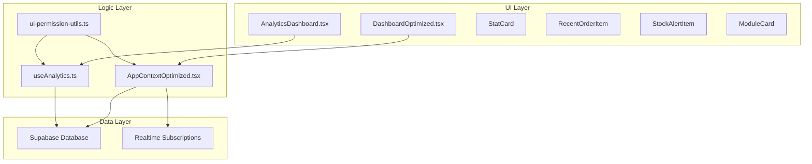
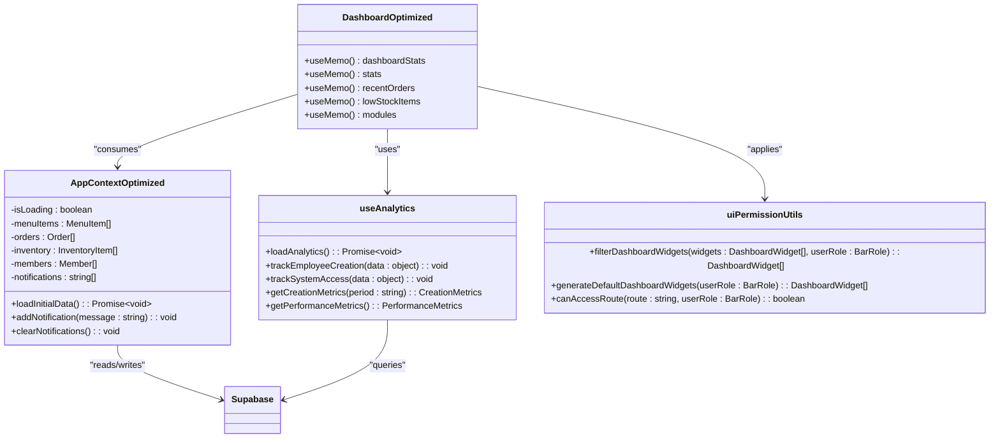
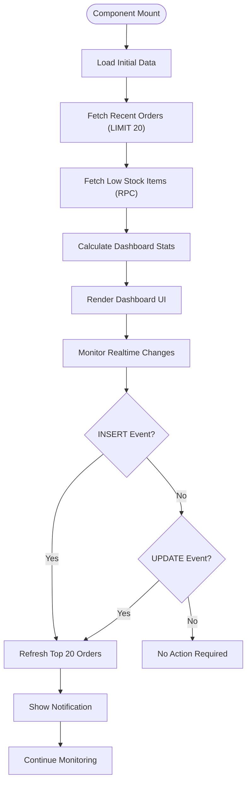
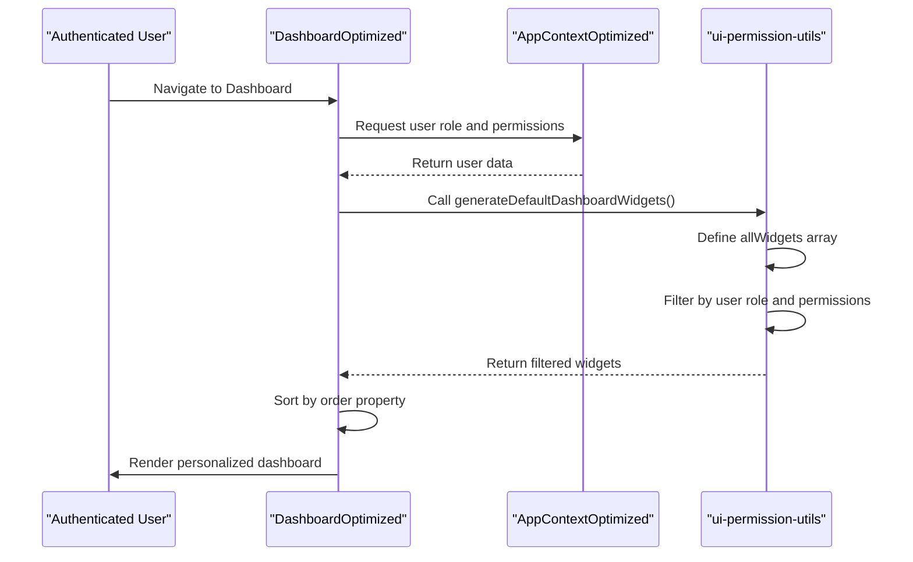
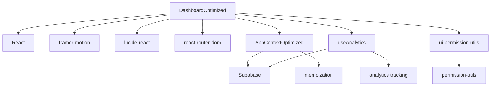

# Dashboard Module

<cite>
**Referenced Files in This Document**   
- [DashboardOptimized.tsx](file://src/pages/DashboardOptimized.tsx)
- [AppContextOptimized.tsx](file://src/contexts/AppContextOptimized.tsx)
- [ui-permission-utils.ts](file://src/utils/ui-permission-utils.ts)
- [useAnalytics.ts](file://src/hooks/useAnalytics.ts)
- [AnalyticsDashboard.tsx](file://src/components/Analytics/AnalyticsDashboard.tsx)
</cite>

## Table of Contents
1. [Introduction](#introduction)
2. [Project Structure](#project-structure)
3. [Core Components](#core-components)
4. [Architecture Overview](#architecture-overview)
5. [Detailed Component Analysis](#detailed-component-analysis)
6. [Dependency Analysis](#dependency-analysis)
7. [Performance Considerations](#performance-considerations)
8. [Troubleshooting Guide](#troubleshooting-guide)
9. [Conclusion](#conclusion)

## Introduction
The Dashboard Module serves as the central hub for system monitoring and navigation within the ClubManager application. It provides real-time visibility into key performance indicators (KPIs) such as revenue, sales, pending orders, and low-stock alerts. The module integrates with analytics services to deliver actionable insights through data visualization components built with Recharts. Designed with a responsive layout using Tailwind CSS, it ensures optimal user experience across devices. Dynamic routing via React Router enables seamless navigation between modules. The dashboard supports role-based access control, allowing different user roles—admin, manager, and staff—to interact with relevant widgets based on their permissions. Performance optimizations like lazy loading and data caching enhance responsiveness, while mechanisms are in place to address common issues such as stale data display and metric discrepancies.

## Project Structure
The Dashboard Module is organized under the `src/pages` directory with two primary implementations: `Dashboard.tsx` and `DashboardOptimized.tsx`. The optimized version leverages memoization and selective rendering to improve performance. Key supporting components reside in dedicated directories: analytics features in `src/components/Analytics`, context providers in `src/contexts`, permission utilities in `src/utils`, and hooks in `src/hooks`. The architecture follows a modular pattern where data flows from Supabase through context providers to UI components. Real-time updates are managed via subscriptions, and user interactions trigger state changes that propagate through the component tree. This structure promotes separation of concerns, maintainability, and scalability.



**Diagram sources**
- [DashboardOptimized.tsx](file://src/pages/DashboardOptimized.tsx)
- [AppContextOptimized.tsx](file://src/contexts/AppContextOptimized.tsx)
- [useAnalytics.ts](file://src/hooks/useAnalytics.ts)
- [ui-permission-utils.ts](file://src/utils/ui-permission-utils.ts)

**Section sources**
- [DashboardOptimized.tsx](file://src/pages/DashboardOptimized.tsx)
- [AppContextOptimized.tsx](file://src/contexts/AppContextOptimized.tsx)

## Core Components
The core components of the Dashboard Module include StatCard, RecentOrderItem, StockAlertItem, and ModuleCard, each optimized using React.memo to prevent unnecessary re-renders. These components consume data from the AppContextOptimized provider, which manages application state including orders, inventory, and notifications. The dashboard dynamically renders widgets based on user roles and permissions, ensuring that only authorized content is displayed. Integration with analytics services allows for comprehensive monitoring of system usage and performance metrics. Data visualization is achieved through Recharts components, presenting information in an intuitive format. The responsive design adapts to various screen sizes using Tailwind CSS utility classes, while dynamic routing enables smooth transitions between different sections of the application.

**Section sources**
- [DashboardOptimized.tsx](file://src/pages/DashboardOptimized.tsx#L0-L385)
- [AppContextOptimized.tsx](file://src/contexts/AppContextOptimized.tsx#L0-L554)

## Architecture Overview
The Dashboard Module employs a layered architecture consisting of presentation, logic, and data layers. At the presentation layer, functional components render UI elements using props derived from context providers. The logic layer contains hooks and utility functions that encapsulate business rules and data processing. The data layer interfaces with Supabase for persistent storage and real-time updates. State management is centralized through React Context, with AppContextOptimized providing optimized data access patterns. Memoization techniques minimize computational overhead by caching expensive calculations. Permission checks are performed at multiple levels—from route guards to individual widget rendering—ensuring secure access control. Analytics integration occurs through dedicated hooks that collect and expose usage metrics, enabling continuous monitoring of system health and user engagement.



**Diagram sources**
- [DashboardOptimized.tsx](file://src/pages/DashboardOptimized.tsx)
- [AppContextOptimized.tsx](file://src/contexts/AppContextOptimized.tsx)
- [useAnalytics.ts](file://src/hooks/useAnalytics.ts)
- [ui-permission-utils.ts](file://src/utils/ui-permission-utils.ts)

## Detailed Component Analysis

### Dashboard Optimization Strategy
The DashboardOptimized component implements several performance-enhancing techniques to ensure fast rendering and smooth user interaction. By leveraging useMemo for calculating dashboard statistics, recent orders, low-stock items, and available modules, it avoids redundant computations during re-renders. Each child component—StatCard, RecentOrderItem, StockAlertItem, and ModuleCard—is wrapped with React.memo, preventing unnecessary updates when parent props change without affecting their specific inputs. The initial data load is optimized to fetch only essential information required for dashboard display, reducing network payload and improving startup time. Real-time updates are handled efficiently through targeted subscriptions that focus on order changes rather than broad table watches.

#### For Complex Logic Components:


**Diagram sources**
- [DashboardOptimized.tsx](file://src/pages/DashboardOptimized.tsx#L0-L385)
- [AppContextOptimized.tsx](file://src/contexts/AppContextOptimized.tsx#L164-L205)

**Section sources**
- [DashboardOptimized.tsx](file://src/pages/DashboardOptimized.tsx#L0-L385)
- [AppContextOptimized.tsx](file://src/contexts/AppContextOptimized.tsx#L0-L554)

### Role-Based Widget Rendering
The dashboard dynamically adjusts its content based on user roles and permissions, ensuring that each user sees only relevant information. This functionality is implemented through the filterDashboardWidgets and generateDefaultDashboardWidgets functions in ui-permission-utils.ts. When a user accesses the dashboard, their role is checked against predefined permission requirements for each widget. Widgets requiring specific permissions are filtered out if the user lacks authorization. The remaining widgets are sorted by priority and rendered accordingly. For example, administrators see comprehensive analytics and configuration options, managers view operational metrics and team performance, while staff members receive task-specific information such as pending orders and service alerts.

#### For API/Service Components:


**Diagram sources**
- [DashboardOptimized.tsx](file://src/pages/DashboardOptimized.tsx)
- [ui-permission-utils.ts](file://src/utils/ui-permission-utils.ts#L482-L533)

**Section sources**
- [DashboardOptimized.tsx](file://src/pages/DashboardOptimized.tsx#L0-L385)
- [ui-permission-utils.ts](file://src/utils/ui-permission-utils.ts#L482-L533)

### Analytics Integration
The AnalyticsDashboard component provides deep insights into system usage and performance through integration with the useAnalytics hook. This hook collects data on employee creation, validation errors, system access patterns, and operational performance. Metrics are grouped into categories such as creation success rates, average response times, cache hit ratios, and module usage frequencies. The dashboard presents these metrics through visualizations including bar charts, pie charts, and trend indicators. Users can select different time periods (day, week, month) to analyze trends over time. Real-time metrics are updated every 30 seconds, providing near-instant feedback on system behavior. Export functionality allows downloading reports in JSON or CSV formats for further analysis.

#### For Object-Oriented Components:
```mermaid
classDiagram
class AnalyticsDashboard {
-period : 'day'|'week'|'month'
-activeTab : string
+setPeriod()
+setActiveTab()
+downloadReport()
}
class MetricCard {
+title : string
+value : string|number
+icon : ReactNode
+trend? : {value : number, isPositive : boolean}
+color : ColorScheme
}
class ChartCard {
+title : string
+children : ReactNode
+actions? : ReactNode
}
class useAnalytics {
+data : EmployeeAnalytics|null
+loading : boolean
+error : string|null
+lastUpdated : string|null
+refresh() : void
+trackEmployeeCreation(data : object) : void
+trackSystemAccess(data : object) : void
+getCreationMetrics(period : string) : CreationMetrics
+getPerformanceMetrics() : PerformanceMetrics
+getUsageMetrics() : UsageMetrics
}
AnalyticsDashboard --> MetricCard : "renders"
AnalyticsDashboard --> ChartCard : "renders"
AnalyticsDashboard --> useAnalytics : "consumes"
useAnalytics --> AnalyticsDashboard : "provides data"
```

**Diagram sources**
- [AnalyticsDashboard.tsx](file://src/components/Analytics/AnalyticsDashboard.tsx)
- [useAnalytics.ts](file://src/hooks/useAnalytics.ts)

**Section sources**
- [AnalyticsDashboard.tsx](file://src/components/Analytics/AnalyticsDashboard.tsx#L0-L486)
- [useAnalytics.ts](file://src/hooks/useAnalytics.ts#L0-L348)

## Dependency Analysis
The Dashboard Module depends on several internal and external libraries to function effectively. Internally, it relies heavily on React Context for state management, with AppContextOptimized serving as the primary data source. The useAnalytics hook provides access to system-wide metrics, while ui-permission-utils handles role-based access control. Externally, the module uses framer-motion for animations, lucide-react for icons, and react-router-dom for navigation. Data persistence and real-time capabilities are provided by Supabase. The component structure demonstrates loose coupling between presentation and logic layers, with clear interfaces defined through props and context APIs. Circular dependencies are avoided by organizing code into distinct feature areas and utility modules.



**Diagram sources**
- [DashboardOptimized.tsx](file://src/pages/DashboardOptimized.tsx)
- [AppContextOptimized.tsx](file://src/contexts/AppContextOptimized.tsx)
- [useAnalytics.ts](file://src/hooks/useAnalytics.ts)
- [ui-permission-utils.ts](file://src/utils/ui-permission-utils.ts)

**Section sources**
- [DashboardOptimized.tsx](file://src/pages/DashboardOptimized.tsx#L0-L385)
- [AppContextOptimized.tsx](file://src/contexts/AppContextOptimized.tsx#L0-L554)
- [useAnalytics.ts](file://src/hooks/useAnalytics.ts#L0-L348)
- [ui-permission-utils.ts](file://src/utils/ui-permission-utils.ts#L0-L651)

## Performance Considerations
The Dashboard Module incorporates multiple performance optimization strategies to ensure responsiveness and efficiency. Lazy loading is implemented for non-critical data such as menu items, inventory details, and member information, reducing initial page load time. Memoization through useMemo and React.memo prevents unnecessary recalculations and re-renders. Data fetching is optimized by limiting result sets and using database RPCs for complex queries like low-stock item retrieval. Real-time subscriptions are scoped narrowly to specific tables and events, minimizing network traffic. The dashboard calculates KPIs client-side using cached data rather than making additional server requests. Error boundaries protect against crashes due to faulty components, while loading states provide feedback during asynchronous operations. These optimizations collectively contribute to a smooth user experience even under heavy load conditions.

**Section sources**
- [DashboardOptimized.tsx](file://src/pages/DashboardOptimized.tsx#L0-L385)
- [AppContextOptimized.tsx](file://src/contexts/AppContextOptimized.tsx#L164-L205)

## Troubleshooting Guide
Common issues with the Dashboard Module typically involve stale data display, missing widgets, or incorrect metric values. Stale data problems often occur when real-time subscriptions fail to update due to network interruptions or authentication timeouts. To resolve this, users should refresh the page or check their internet connection. Missing widgets usually indicate permission mismatches; administrators should verify role assignments and permission configurations. Incorrect metrics may stem from incomplete data synchronization—running a manual refresh or checking backend logs can identify underlying issues. For development purposes, enabling debug mode reveals detailed console output about data loading sequences and error conditions. Regular monitoring of Supabase connection status and subscription health helps prevent many common problems before they affect end-users.

**Section sources**
- [DashboardOptimized.tsx](file://src/pages/DashboardOptimized.tsx#L0-L385)
- [AppContextOptimized.tsx](file://src/contexts/AppContextOptimized.tsx#L164-L205)
- [useAnalytics.ts](file://src/hooks/useAnalytics.ts#L117-L161)

## Conclusion
The Dashboard Module successfully serves as the central nervous system of the ClubManager application, providing comprehensive oversight of operations through real-time KPIs and analytics. Its architecture balances performance and functionality, employing optimization techniques like memoization, lazy loading, and efficient data fetching to deliver a responsive user experience. The integration of role-based access control ensures that sensitive information remains protected while still offering valuable insights to authorized personnel. Through careful component design and strategic use of modern web technologies, the dashboard achieves its goal of being both powerful and accessible. Future enhancements could include customizable widget layouts, advanced filtering options, and predictive analytics to further empower decision-making processes.