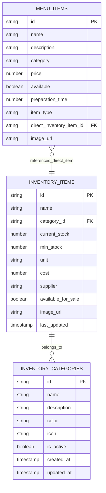
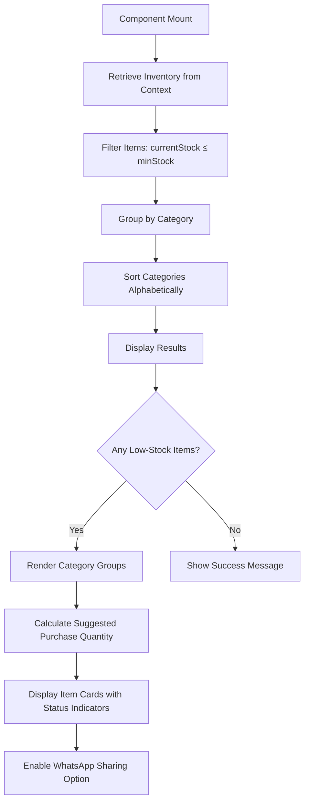
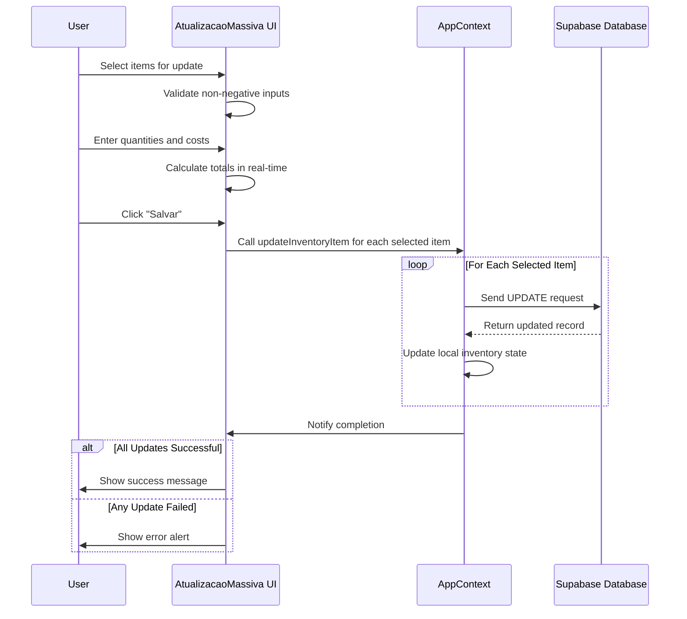
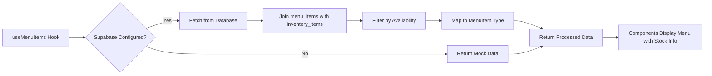

# Inventory Module

<cite>
**Referenced Files in This Document**   
- [ListaEstoqueBaixo.tsx](file://src/pages/Inventory/ListaEstoqueBaixo.tsx)
- [AtualizacaoMassiva.tsx](file://src/pages/Inventory/AtualizacaoMassiva.tsx)
- [AppContext.tsx](file://src/contexts/AppContext.tsx)
- [useMenuItems.ts](file://src/hooks/useMenuItems.ts)
- [database.ts](file://src/types/database.ts)
</cite>

## Table of Contents
1. [Introduction](#introduction)
2. [Data Model and Structure](#data-model-and-structure)
3. [Stock Level Monitoring and Low-Stock Alerts](#stock-level-monitoring-and-low-stock-alerts)
4. [CRUD Operations for Inventory Items](#crud-operations-for-inventory-items)
5. [ListaEstoqueBaixo Component Implementation](#listaestoquebaixo-component-implementation)
6. [AtuallizacaoMassiva Functionality and Validation Logic](#atuallizacaomassiva-functionality-and-validation-logic)
7. [Integration with Menu Offerings](#integration-with-menu-offerings)
8. [Restocking Workflows and Procurement Integration](#restocking-workflows-and-procurement-integration)
9. [Error Handling for Invalid Stock Changes](#error-handling-for-invalid-stock-changes)
10. [Common Issues: Phantom Stock Discrepancies and Reconciliation](#common-issues-phantom-stock-discrepancies-and-reconciliation)

## Introduction
The Inventory Module is a critical component of the system, responsible for managing stock levels, monitoring inventory health, and enabling efficient restocking operations. It provides tools for tracking inventory items, identifying low-stock situations, performing bulk updates, and maintaining synchronization between physical stock and menu offerings. This document details the implementation of key features including the ListaEstoqueBaixo component for highlighting critical inventory levels, the AtualizacaoMassiva functionality for bulk stock updates, data relationships with menu items, and procedures for handling common inventory issues such as phantom stock discrepancies.

## Data Model and Structure
The inventory data model is centered around the `InventoryItem` type, which defines the structure of each inventory entry. Key attributes include:
- **id**: Unique identifier for the item
- **name**: Name of the inventory item
- **categoryId**: Reference to the associated category
- **currentStock**: Current quantity available in stock
- **minStock**: Minimum threshold that triggers low-stock alerts
- **unit**: Unit of measurement (e.g., unidades, kg, litros)
- **cost**: Unit cost of the item
- **supplier**: Supplier information
- **availableForSale**: Boolean flag indicating if the item can be sold
- **image_url**: Optional image reference
- **lastUpdated**: Timestamp of last update

Inventory categories are managed separately through `InventoryCategory`, allowing organizational grouping of items. The relationship between inventory items and menu offerings is established via database joins, where menu items may reference direct inventory items when appropriate.

**Diagram sources**
- [database.ts](file://src/types/database.ts)

**Section sources**
- [database.ts](file://src/types/database.ts)

## Stock Level Monitoring and Low-Stock Alerts
The system continuously monitors stock levels by comparing the `currentStock` value against the `minStock` threshold for each inventory item. When an item's stock falls at or below its minimum level, it is flagged as requiring replenishment. This logic is implemented through filtering operations on the inventory array, specifically using the condition `item.currentStock <= item.minStock`.

Low-stock alerts are visually represented throughout the interface with color-coded indicators (orange for low stock, red for zero stock) and dedicated alert icons. The system also calculates suggested purchase quantities based on the formula `Math.max(item.minStock * 2 - item.currentStock, item.minStock)`, providing intelligent restocking recommendations.

## CRUD Operations for Inventory Items
The Inventory Module supports full CRUD (Create, Read, Update, Delete) operations for inventory items through the AppContext provider. These operations interact directly with the Supabase backend via API calls:

- **Create**: Adds new inventory items using `addInventoryItem`, which inserts records into the `inventory_items` table.
- **Read**: Retrieves inventory data through context state management, initially loading low-stock items and categories.
- **Update**: Modifies existing items via `updateInventoryItem`, which sends PATCH requests to update specific fields while preserving the record ID.
- **Delete**: Removes items using `removeInventoryItem`, executing DELETE operations on the database.

All operations are wrapped in error handling and provide user feedback through notifications. The context ensures real-time synchronization across components by updating the global state upon successful operations.

**Section sources**
- [AppContext.tsx](file://src/contexts/AppContext.tsx#L631-L647)

## ListaEstoqueBaixo Component Implementation
The `ListaEstoqueBaixo` component displays all inventory items that have fallen to or below their minimum stock levels. It retrieves the complete inventory list from the AppContext and filters it to show only those items meeting the low-stock criteria.

Key features of this component include:
- Dynamic categorization of low-stock items
- Visual distinction between out-of-stock (red) and low-stock (orange) items
- Suggested purchase quantities calculated automatically
- WhatsApp sharing capability for procurement teams
- Responsive grid layout that adapts to screen size

The component uses React hooks (`useMemo`) to optimize performance by memoizing filtered results and grouped categories, recalculating only when the underlying inventory data changes.

**Diagram sources**
- [ListaEstoqueBaixo.tsx](file://src/pages/Inventory/ListaEstoqueBaixo.tsx)

**Section sources**
- [ListaEstoqueBaixo.tsx](file://src/pages/Inventory/ListaEstoqueBaixo.tsx)

## AtuallizacaoMassiva Functionality and Validation Logic
The `AtualizacaoMassiva` component enables bulk updates to inventory levels after receiving new stock. Users can select multiple items, specify quantities purchased, and input unit costs, with changes applied simultaneously.

The validation logic includes:
- Prevention of negative values for quantities and prices
- Real-time calculation of total costs
- Automatic determination of new stock levels
- Confirmation before saving changes

When users click "Salvar", the system iterates through selected items, constructs updated inventory records, and performs individual update operations via `updateInventoryItem`. The process includes comprehensive error handling, with success messages displayed upon completion and error alerts shown if any update fails.

A key feature is the "Selecionar Estoque Baixo" button, which automatically populates the selection with all currently low-stock items, pre-filled with recommended purchase quantities based on minimum thresholds.

**Diagram sources**
- [AtualizacaoMassiva.tsx](file://src/pages/Inventory/AtualizacaoMassiva.tsx)
- [AppContext.tsx](file://src/contexts/AppContext.tsx#L631-L647)

**Section sources**
- [AtualizacaoMassiva.tsx](file://src/pages/Inventory/AtualizacaoMassiva.tsx)

## Integration with Menu Offerings
Inventory items are integrated with menu offerings through the `useMenuItems` hook, which fetches menu data along with associated inventory information. The relationship is established through a left join between `menu_items` and `inventory_items` tables, allowing menu items to display current stock availability.

For direct inventory items (where `item_type = 'direct'`), the system prioritizes inventory data for naming and imagery. The hook handles both real data retrieval and mock data generation when Supabase is not configured, ensuring graceful degradation during development or connectivity issues.

Menu items display stock status indicators when inventory tracking is enabled, helping staff make informed decisions about order fulfillment based on actual stock levels.

**Diagram sources**
- [useMenuItems.ts](file://src/hooks/useMenuItems.ts)

**Section sources**
- [useMenuItems.ts](file://src/hooks/useMenuItems.ts)

## Restocking Workflows and Procurement Integration
The restocking workflow begins with viewing low-stock items in `ListaEstoqueBaixo`, followed by initiating bulk updates in `AtualizacaoMassiva`. The system supports integration with procurement systems through the WhatsApp sharing feature, which allows managers to quickly communicate restocking needs to suppliers.

Recommended purchase quantities are calculated using a simple but effective formula that aims to bring stock levels to twice the minimum threshold, ensuring adequate buffer while avoiding overstocking. Cost tracking is maintained during restocking, with options to update unit costs based on new purchase prices.

The workflow is designed to be completed in minutes, minimizing disruption to ongoing operations while maintaining accurate inventory records.

## Error Handling for Invalid Stock Changes
The system implements robust error handling for invalid stock changes through multiple layers:
- Input validation prevents negative quantities and prices
- Try-catch blocks wrap all database operations
- User-friendly error messages are displayed using alert dialogs
- Console logging aids in debugging failed operations

When an update fails, the system maintains the previous state rather than applying partial updates, preserving data integrity. Network errors, authentication issues, and constraint violations are all handled gracefully, with appropriate feedback provided to users.

## Common Issues: Phantom Stock Discrepancies and Reconciliation
Phantom stock discrepancies—where system records don't match physical inventory—can occur due to unrecorded usage, spillage, or theft. The system addresses these through regular reconciliation processes:

1. **Physical Inventory Counts**: Periodic manual counts should be compared against system records.
2. **Adjustment Entries**: Use `AtualizacaoMassiva` to correct discrepancies by adjusting current stock levels.
3. **Audit Trail**: All changes are timestamped and associated with employee IDs, enabling traceability.
4. **Reconciliation Reports**: Generate reports comparing expected vs. actual consumption patterns.

Best practices include conducting reconciliations during off-hours, involving multiple staff members for verification, and documenting all adjustments with clear justifications. Regular reconciliation helps maintain inventory accuracy, reduces waste, and improves financial reporting.