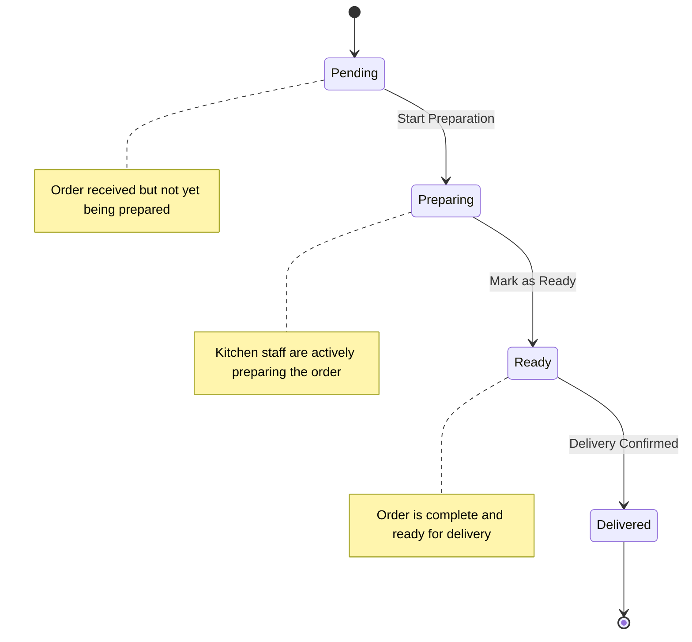
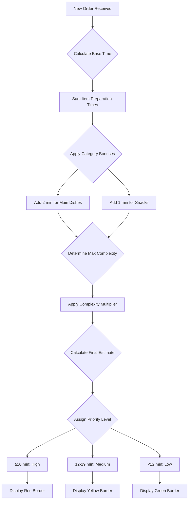

# Kitchen Module

<cite>
**Referenced Files in This Document**   
- [KitchenModule.tsx](file://src/pages/Kitchen/index.tsx)
- [KitchenOrders.tsx](file://src/pages/Kitchen/KitchenOrders.tsx)
- [MenuItemModal.tsx](file://src/pages/Kitchen/MenuItemModal.tsx)
- [useOrderPriority.ts](file://src/hooks/useOrderPriority.ts)
- [AppContext.tsx](file://src/contexts/AppContext.tsx)
</cite>

## Table of Contents
1. [Introduction](#introduction)
2. [Order Queue Management](#order-queue-management)
3. [Preparation Workflow and Status Tracking](#preparation-workflow-and-status-tracking)
4. [Prioritization Algorithms](#prioritization-algorithms)
5. [UI Components](#ui-components)
6. [Integration with Sales Interface and Real-Time Updates](#integration-with-sales-interface-and-real-time-updates)
7. [Performance Considerations](#performance-considerations)
8. [Troubleshooting Guide](#troubleshooting-guide)

## Introduction
The Kitchen Module is a comprehensive system designed for managing kitchen operations within a restaurant environment. It provides tools for order queue management, preparation workflow tracking, and real-time status updates. The module integrates seamlessly with the sales interface through Supabase subscriptions, ensuring that kitchen staff have up-to-date information on all incoming orders. Key features include automated prioritization based on order time and complexity, intuitive UI components for order management, and robust performance optimizations for high-volume environments.

**Section sources**
- [KitchenModule.tsx](file://src/pages/Kitchen/index.tsx#L0-L110)

## Order Queue Management
The Kitchen Module manages orders through a dynamic queue system that displays pending and preparing orders. Orders are filtered to show only those with "pending" or "preparing" statuses, providing kitchen staff with a clear view of current workload. The system groups orders by table number, allowing staff to identify multiple orders from the same table and coordinate delivery efficiently.

The module includes filtering capabilities that allow kitchen staff to focus on specific tables when needed. When multiple orders exist for a single table, the system highlights this with visual indicators and provides quick-filter buttons. This helps prevent confusion and ensures that all items for a table are prepared together when possible.

Orders are displayed in a grid layout with visual cues indicating priority levels, payment status, and preparation progress. Each order card shows essential information including table number, order ID, items with quantities, preparation times, customer notes, and estimated completion time.

**Section sources**
- [KitchenOrders.tsx](file://src/pages/Kitchen/KitchenOrders.tsx#L14-L321)
- [KitchenModule.tsx](file://src/pages/Kitchen/index.tsx#L0-L110)

## Preparation Workflow and Status Tracking
The preparation workflow in the Kitchen Module follows a three-stage process: pending, preparing, and ready. Kitchen staff can update the status of orders through intuitive button controls that provide visual feedback during state transitions.

When an order is first received, it appears in the "pending" state. Staff initiate preparation by clicking the "Iniciar Preparo" (Start Preparation) button, which changes the order status to "preparing". During this phase, the system tracks preparation progress and displays estimated completion time. Once preparation is complete, staff mark the order as "ready" using the "Marcar como Pronto" (Mark as Ready) button.

The UI provides clear visual indicators for each status:
- **Pending**: Blue "Start Preparation" button
- **Preparing**: Green "Mark as Ready" button with loading animation during state change
- **Ready**: Green pulsing banner with checkmark icon indicating readiness for delivery

For orders that are paid at the counter (balcão), additional visual indicators show payment confirmation with a pulsing green "PAGO" badge. For comanda (tab) orders, a yellow "AGUARDA PAGTO" badge indicates that payment is pending.

**Diagram sources**
- [KitchenOrders.tsx](file://src/pages/Kitchen/KitchenOrders.tsx#L14-L321)

**Section sources**
- [KitchenOrders.tsx](file://src/pages/Kitchen/KitchenOrders.tsx#L14-L321)

## Prioritization Algorithms
The Kitchen Module implements a sophisticated prioritization system that automatically assigns priority levels to orders based on both order age and complexity. The algorithm considers two primary factors: time since order placement and estimated preparation time.

### Time-Based Prioritization
Orders are assigned priority levels based on waiting time:
- **High Priority**: Orders waiting more than 20 minutes
- **Medium Priority**: Orders waiting between 10-20 minutes  
- **Low Priority**: Orders waiting less than 10 minutes

This ensures that older orders receive attention before newer ones, preventing customer dissatisfaction due to long wait times.

### Complexity-Based Prioritization
The system also evaluates order complexity by analyzing the menu items within each order. Different categories have predefined base preparation times and complexity levels:

| Category | Base Time (min) | Complexity |
|---------|----------------|------------|
| Drinks | 2 | Simple |
| Petiscos (Snacks) | 8 | Medium |
| Pratos (Main Dishes) | 15 | Complex |
| Sobremesas (Desserts) | 5 | Simple |
| Cafés (Coffees) | 3 | Simple |

The algorithm calculates total preparation time by summing individual item times, applying category bonuses (e.g., +2 minutes for main dishes, +1 minute for snacks), and applying complexity multipliers:
- Simple: 1.0x multiplier
- Medium: 1.3x multiplier  
- Complex: 1.8x multiplier

Final priority is determined by the estimated preparation time:
- ≥20 minutes: High priority
- 12-19 minutes: Medium priority
- <12 minutes: Low priority

The system allows manual prioritization override, enabling supervisors to mark specific orders as urgent when needed.

**Diagram sources**
- [useOrderPriority.ts](file://src/hooks/useOrderPriority.ts#L28-L579)

**Section sources**
- [useOrderPriority.ts](file://src/hooks/useOrderPriority.ts#L28-L579)

## UI Components
The Kitchen Module includes several key UI components that facilitate efficient kitchen operations.

### KitchenOrders Component
The `KitchenOrders` component displays the order queue with the following props:
- `orders`: Array of Order objects to display
- `menuItems`: Array of MenuItem objects for reference

Key features include:
- Table-based filtering with dynamic filter buttons
- Visual grouping of multiple orders from the same table
- Priority-based color coding (red for high, yellow for medium, green for low)
- Payment status indicators (green "PAGO" for paid orders, yellow "AGUARDA PAGTO" for tab orders)
- Order-specific action buttons that change based on current status
- Loading animations during state transitions

Event handling includes:
- `handleStatusUpdate`: Updates order status with visual feedback and error handling
- `setTableFilter`: Changes the table filter to focus on specific orders
- Click handlers for all interactive elements with appropriate disabled states during processing

### MenuItemModal Component
The `MenuItemModal` component provides an interface for adding and editing menu items with the following props:
- `isOpen`: Boolean controlling modal visibility
- `onClose`: Function to close the modal
- `item`: Optional MenuItem object for editing existing items

Form fields include:
- Name (required)
- Description (optional)
- Price (required, minimum 0.01)
- Category (drinks, food, snacks)
- Preparation time (optional)
- Availability toggle
- Image URL (optional)

The component uses React Hook Form for validation and handles both creation and editing modes. During submission, it provides loading feedback and error handling with detailed console logging for debugging.

**Section sources**
- [KitchenOrders.tsx](file://src/pages/Kitchen/KitchenOrders.tsx#L14-L321)
- [MenuItemModal.tsx](file://src/pages/Kitchen/MenuItemModal.tsx#L23-L288)

## Integration with Sales Interface and Real-Time Updates
The Kitchen Module maintains real-time synchronization with the sales interface through Supabase database subscriptions. This ensures that any order created or modified in the sales system immediately appears in the kitchen interface without requiring manual refresh.

The integration uses PostgreSQL's real-time capabilities through Supabase channels. The system subscribes to changes in relevant database tables:
- `comanda_items`: For orders placed on customer tabs
- `balcao_order_items`: For counter orders
- `orders`: For general order status changes

When a change is detected in any subscribed table, the system triggers a refresh of the kitchen orders data. This is implemented in the AppContext with specific event handlers for INSERT, UPDATE, and DELETE operations.

The subscription setup includes error handling and connection status monitoring:
- Logs subscription activation and status changes
- Automatically reconnects if the connection is lost
- Provides visual feedback when orders are created or updated
- Implements retry logic with exponential backoff for failed operations

To ensure data consistency, the system uses a combination of real-time updates and periodic polling. After receiving a real-time notification, it fetches the complete updated dataset rather than attempting to merge incremental changes, preventing potential data inconsistencies.

**Section sources**
- [AppContext.tsx](file://src/contexts/AppContext.tsx#L191-L231)
- [AppContext.tsx](file://src/contexts/AppContext.tsx#L997-L1038)

## Performance Considerations
The Kitchen Module is optimized for high-volume order environments with several performance-enhancing features:

### Data Loading Optimization
The system implements lazy loading for non-essential data, initially loading only critical information such as low-stock inventory items and active categories. Menu items, members, and full inventory data are loaded on-demand when needed, reducing initial load time and bandwidth usage.

### Efficient State Management
The module uses React's useCallback and useMemo hooks extensively to prevent unnecessary re-renders. Expensive calculations like order prioritization and timer status updates are memoized and only recalculated when dependencies change.

### Real-Time Update Efficiency
Rather than maintaining a persistent connection to all database tables, the system subscribes only to the specific tables relevant to kitchen operations. This reduces network overhead and processing requirements.

The real-time update handler is optimized to:
- Debounce rapid successive updates
- Batch process multiple changes when possible
- Minimize DOM updates by only re-rendering changed components

### User Interface Responsiveness
The UI provides immediate visual feedback during interactions:
- Button state changes during API calls
- Loading spinners during processing
- Success/error notifications
- Disabled states to prevent duplicate submissions

These features maintain perceived responsiveness even when backend operations take longer than expected.

### Memory Management
The system implements proper cleanup of subscriptions and timers:
- Removes Supabase channels when components unmount
- Clears interval timers when no longer needed
- Uses React's useEffect cleanup functions to prevent memory leaks

**Section sources**
- [AppContext.tsx](file://src/contexts/AppContext.tsx#L159-L195)
- [AppContext.tsx](file://src/contexts/AppContext.tsx#L278-L317)

## Troubleshooting Guide
This section addresses common issues related to display synchronization and provides solutions.

### Display Synchronization Issues
**Symptom**: Orders not appearing in the kitchen interface after being created in the sales system.

**Possible Causes and Solutions**:
1. **Subscription Connection Failure**
   - Check browser console for Supabase connection errors
   - Verify internet connectivity
   - Refresh the page to re-establish the connection
   - Check if the Supabase service is operational

2. **Database Permission Issues**
   - Verify that the kitchen user role has SELECT permissions on order tables
   - Check RLS (Row Level Security) policies in Supabase
   - Ensure the user belongs to the correct tenant organization

3. **Caching Problems**
   - Clear browser cache and reload the application
   - Check if stale data is being served from a CDN
   - Verify that the latest version of the application is deployed

**Symptom**: Order status changes not reflecting in the interface.

**Solutions**:
- Check the console for update errors
- Verify that the updateOrderStatus function is properly handling different order types (comanda vs. balcão)
- Ensure the CommandManager service is correctly updating both the business logic layer and the database
- Implement manual refresh as a temporary workaround

### Performance Degradation in High-Volume Environments
**Issue**: Slow response times when many orders are present.

**Optimization Strategies**:
1. **Implement Virtual Scrolling**
   - Only render visible orders in the DOM
   - Use libraries like react-window for large lists

2. **Optimize Database Queries**
   - Add appropriate indexes on frequently queried columns
   - Implement query pagination for very large datasets
   - Use database views for complex aggregations

3. **Reduce Update Frequency**
   - Increase the interval for timer updates from 1 minute to 2-5 minutes
   - Batch process multiple timer updates together

4. **Memory Leak Prevention**
   - Ensure all subscriptions are properly cleaned up
   - Monitor for detached DOM elements
   - Use React DevTools to identify component re-renders

### Debugging Tools
The system includes comprehensive logging for troubleshooting:
- Console logs for subscription events
- Detailed error messages with stack traces
- Network request monitoring
- Performance timing measurements

Developers can enable verbose logging by setting environment variables or using debug flags in the code.

**Section sources**
- [AppContext.tsx](file://src/contexts/AppContext.tsx#L1103-L1143)
- [useOrderPriority.ts](file://src/hooks/useOrderPriority.ts#L28-L579)