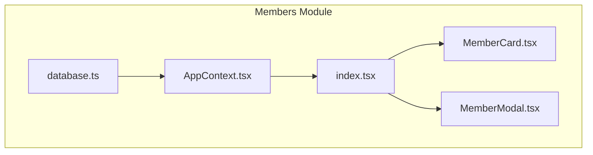
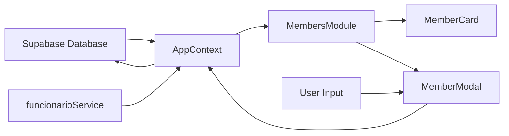
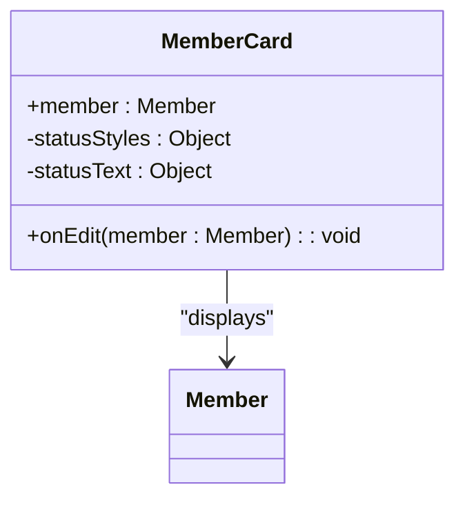
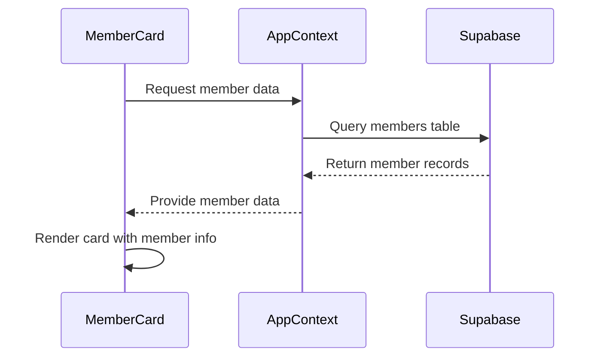
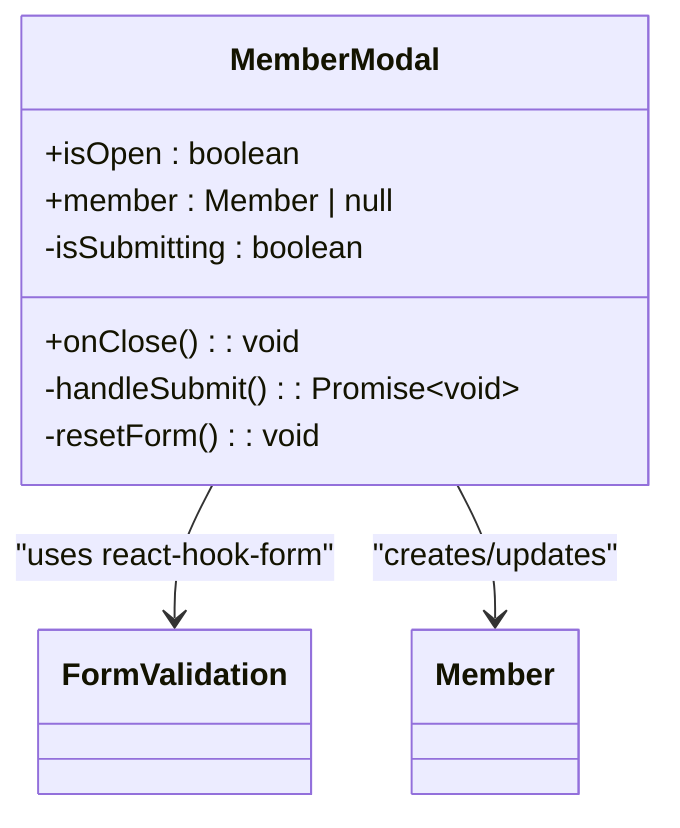
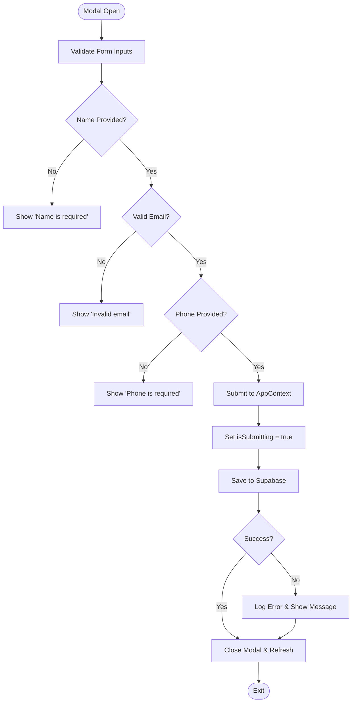
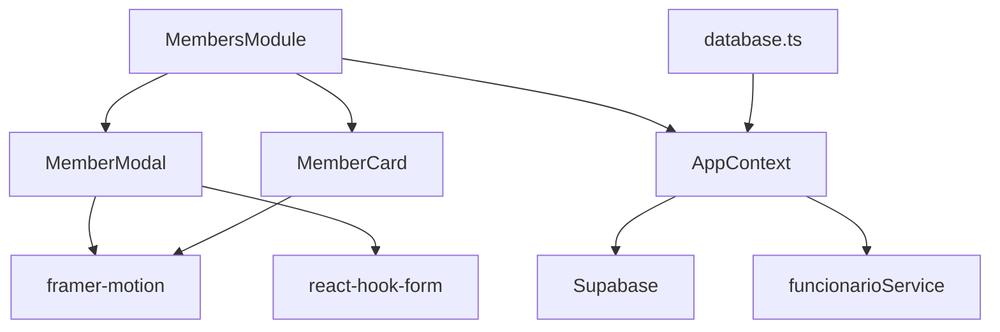

# Members Module

<cite>
**Referenced Files in This Document**   
- [MemberCard.tsx](file://src/pages/Members/MemberCard.tsx)
- [MemberModal.tsx](file://src/pages/Members/MemberModal.tsx)
- [index.tsx](file://src/pages/Members/index.tsx)
- [AppContext.tsx](file://src/contexts/AppContext.tsx)
- [database.ts](file://src/types/database.ts)
- [index.ts](file://src/types/index.ts)
</cite>

## Table of Contents
1. [Introduction](#introduction)
2. [Project Structure](#project-structure)
3. [Core Components](#core-components)
4. [Architecture Overview](#architecture-overview)
5. [Detailed Component Analysis](#detailed-component-analysis)
6. [Dependency Analysis](#dependency-analysis)
7. [Performance Considerations](#performance-considerations)
8. [Troubleshooting Guide](#troubleshooting-guide)
9. [Conclusion](#conclusion)

## Introduction
The Members Module provides comprehensive management for club members, including sponsor database administration, profile maintenance, and membership plan tracking. It enables administrators to manage member information such as contact details, membership tiers, and payment statuses through an intuitive interface. The module integrates with employee and user management systems via funcionarioService and supports search, filtering, reporting, and privacy compliance features essential for administrative operations.

## Project Structure
The Members Module is organized within the application's pages directory with dedicated components for display and interaction. The structure follows a modular approach with clear separation between UI presentation and data handling logic.

**Diagram sources**
- [index.tsx](file://src/pages/Members/index.tsx#L1-L152)
- [database.ts](file://src/types/database.ts#L0-L418)

**Section sources**
- [index.tsx](file://src/pages/Members/index.tsx#L1-L152)
- [database.ts](file://src/types/database.ts#L0-L418)

## Core Components
The Members Module consists of three primary components: MemberCard for displaying member information, MemberModal for creating and editing member profiles, and the main MembersModule container that orchestrates functionality. These components work together to provide a complete member management solution with proper form validation, data persistence, and user interface interactions.

**Section sources**
- [MemberCard.tsx](file://src/pages/Members/MemberCard.tsx#L1-L73)
- [MemberModal.tsx](file://src/pages/Members/MemberModal.tsx#L1-L128)
- [index.tsx](file://src/pages/Members/index.tsx#L1-L152)

## Architecture Overview
The Members Module follows a React component-based architecture with state management provided by AppContext. Data flows from the Supabase backend through context providers to the UI components, enabling real-time updates and consistent state across the application.

**Diagram sources**
- [AppContext.tsx](file://src/contexts/AppContext.tsx#L127-L133)
- [index.tsx](file://src/pages/Members/index.tsx#L1-L152)

## Detailed Component Analysis

### MemberCard Analysis
The MemberCard component displays member information in a visually appealing card format with status indicators and contact details.

**Diagram sources**
- [MemberCard.tsx](file://src/pages/Members/MemberCard.tsx#L1-L73)
- [index.ts](file://src/types/index.ts#L12-L23)

#### For API/Service Components:

**Diagram sources**
- [MemberCard.tsx](file://src/pages/Members/MemberCard.tsx#L1-L73)
- [AppContext.tsx](file://src/contexts/AppContext.tsx#L127-L133)

**Section sources**
- [MemberCard.tsx](file://src/pages/Members/MemberCard.tsx#L1-L73)
- [index.ts](file://src/types/index.ts#L12-L23)

### MemberModal Analysis
The MemberModal component handles form validation and member profile creation/editing with comprehensive input validation patterns.

**Diagram sources**
- [MemberModal.tsx](file://src/pages/Members/MemberModal.tsx#L1-L128)
- [index.ts](file://src/types/index.ts#L12-L23)

#### For Complex Logic Components:

**Diagram sources**
- [MemberModal.tsx](file://src/pages/Members/MemberModal.tsx#L40-L118)
- [AppContext.tsx](file://src/contexts/AppContext.tsx#L127-L133)

**Section sources**
- [MemberModal.tsx](file://src/pages/Members/MemberModal.tsx#L1-L128)
- [formValidation](file://src/utils/formValidation.ts)

## Dependency Analysis
The Members Module depends on several core services and components for its functionality, creating a well-defined dependency chain that ensures proper data flow and system integration.

**Diagram sources**
- [index.tsx](file://src/pages/Members/index.tsx#L1-L152)
- [AppContext.tsx](file://src/contexts/AppContext.tsx#L127-L133)
- [database.ts](file://src/types/database.ts#L0-L418)

**Section sources**
- [index.tsx](file://src/pages/Members/index.tsx#L1-L152)
- [AppContext.tsx](file://src/contexts/AppContext.tsx#L127-L133)

## Performance Considerations
The Members Module implements performance optimizations through memoization of filtered results and lazy loading of member data. The use of useMemo for filtering operations prevents unnecessary re-computations during search and filter interactions, while the integration with AppContext ensures efficient state management across the application.

## Troubleshooting Guide
When encountering issues with member data not appearing or forms not submitting, verify the connection to Supabase and check browser console logs for error messages. Ensure that the user has appropriate permissions through funcionarioService and that the member data schema in Supabase matches the expected structure defined in the types. For form validation issues, confirm that all required fields are populated with valid data according to the specified validation rules.

**Section sources**
- [MemberModal.tsx](file://src/pages/Members/MemberModal.tsx#L40-L118)
- [AppContext.tsx](file://src/contexts/AppContext.tsx#L127-L133)

## Conclusion
The Members Module provides a robust solution for managing club memberships with comprehensive features for profile maintenance, membership tracking, and administrative reporting. Its integration with employee management systems through funcionarioService ensures consistent user management across the platform, while the thoughtful implementation of privacy considerations and data export capabilities supports compliant administrative operations.