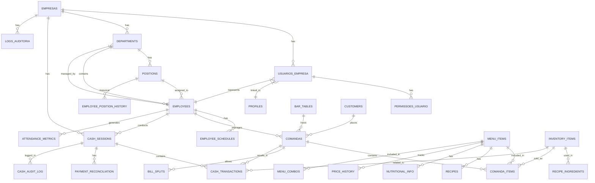

# Database Schema Design

<cite>
**Referenced Files in This Document**   
- [20250729000000_initial_schema.sql](file://supabase/migrations/20250729000000_initial_schema.sql)
- [20250102000001_employees_management_module.sql](file://supabase/migrations/20250102000001_employees_management_module.sql)
- [20250908000001_cash_management_system.sql](file://supabase/migrations/20250908000001_cash_management_system.sql)
- [20250901000002_bar_attendance_system.sql](file://supabase/migrations/20250901000002_bar_attendance_system.sql)
- [20250116000001_multitenant_auth_system.sql](file://supabase/migrations/20250116000001_multitenant_auth_system.sql)
- [20250831000001_menu_management_module.sql](file://supabase/migrations/20250831000001_menu_management_module.sql)
- [20250901000001_direct_inventory_items_support.sql](file://supabase/migrations/20250901000001_direct_inventory_items_support.sql)
- [20250902000001_inventory_available_for_sale.sql](file://supabase/migrations/20250902000001_inventory_available_for_sale.sql)
</cite>

## Table of Contents
1. [Introduction](#introduction)
2. [Core Entities and Relationships](#core-entities-and-relationships)
3. [Employee Management Module](#employee-management-module)
4. [Company and Multitenant System](#company-and-multitenant-system)
5. [Orders (Comandas) and Bar Attendance](#orders-comandas-and-bar-attendance)
6. [Inventory and Menu Items](#inventory-and-menu-items)
7. [Cash Transactions and Financial Management](#cash-transactions-and-financial-management)
8. [Permissions and Access Control](#permissions-and-access-control)
9. [Row Level Security (RLS) Policies](#row-level-security-rls-policies)
10. [Migration Strategy and Version Control](#migration-strategy-and-version-control)
11. [Business Rules and Data Integrity](#business-rules-and-data-integrity)
12. [Sample Queries and Performance Optimization](#sample-queries-and-performance-optimization)

## Introduction

The AABB-system database schema is designed to support a comprehensive club management solution with multitenant capabilities, employee management, bar attendance, inventory control, and financial operations. The system leverages Supabase as its backend platform, utilizing PostgreSQL's advanced features including Row Level Security (RLS), triggers, views, and JSONB data types for flexible data modeling.

This documentation provides a detailed overview of the database schema, focusing on major entities such as employees, companies, orders (comandas), inventory items, cash transactions, and permissions. It covers table relationships, constraints, indexes, RLS policies for security and data isolation, migration strategy using Supabase's migration system, business rules enforced at the database level, and performance optimization techniques.

The schema follows a modular design approach with migrations organized chronologically, allowing for incremental development and version control. Each module addresses specific business domains while maintaining referential integrity across the system.

**Section sources**
- [20250729000000_initial_schema.sql](file://supabase/migrations/20250729000000_initial_schema.sql)

## Core Entities and Relationships

The database schema consists of several interconnected modules that form the foundation of the AABB-system. The core entities include employees, companies, orders (comandas), inventory items, menu items, and financial transactions. These entities are connected through well-defined relationships that maintain data integrity and support complex business operations.

The system implements a multitenant architecture where each company operates in isolation from others, ensuring data privacy and security. Employees belong to specific departments and positions within a company, and can be assigned to manage tables and process orders. Orders (comandas) are linked to tables, customers, and employees, containing multiple items that reference menu items or direct inventory products.

Financial transactions are managed through a cash management system that tracks daily sessions, payments, and reconciliations. Inventory items can be used in recipes for menu items or sold directly through the point-of-sale system. Permissions and access control are implemented at both the application and database levels, with hierarchical roles determining what actions users can perform.



**Diagram sources**
- [20250729000000_initial_schema.sql](file://supabase/migrations/20250729000000_initial_schema.sql)
- [20250102000001_employees_management_module.sql](file://supabase/migrations/20250102000001_employees_management_module.sql)
- [20250908000001_cash_management_system.sql](file://supabase/migrations/20250908000001_cash_management_system.sql)
- [20250901000002_bar_attendance_system.sql](file://supabase/migrations/20250901000002_bar_attendance_system.sql)
- [20250116000001_multitenant_auth_system.sql](file://supabase/migrations/20250116000001_multitenant_auth_system.sql)

## Employee Management Module

The employee management module provides comprehensive functionality for managing staff members within the organization. It includes tables for departments, positions, employees, shifts, schedules, and position history, creating a complete human resources management system integrated with the operational aspects of the business.

The `departments` table stores information about organizational units such as Administration, Bar, Kitchen, Security, Cleaning, Events, Sports, and Maintenance. Each department has a manager who is also an employee, creating a hierarchical structure within the organization. The `positions` table defines available roles within each department, indicating whether the position requires system access.

The `employees` table contains detailed information about staff members, including personal details, employment information, and their relationship to user profiles for system access. Each employee is assigned to a position and department, and may have an associated user profile if they require system access. The system automatically tracks changes in position through the `employee_position_history` table, which records historical assignments.

Scheduling is managed through the `employee_shifts` and `employee_schedules` tables. Shifts define time periods like morning, afternoon, night, and commercial hours, while schedules assign specific shifts to employees on particular dates. This allows for efficient workforce planning and tracking of attendance.

```mermaid
erDiagram
DEPARTMENTS ||--o{ POSITIONS : "has"
DEPARTMENTS ||--o{ EMPLOYEES : "contains"
DEPARTMENTS }|--|| EMPLOYEES : "managed_by"
POSITIONS ||--o{ EMPLOYEES : "assigned_to"
POSITIONS ||--o{ EMPLOYEE_POSITION_HISTORY : "historical"
EMPLOYEES ||--o{ EMPLOYEE_SCHEDULES : "has"
EMPLOYEES ||--o{ EMPLOYEE_SHIFT : "works"
EMPLOYEES }|--|| PROFILES : "linked_to"
class DEPARTMENTS {
+UUID id
+TEXT name
+TEXT description
+UUID manager_id
+BOOLEAN is_active
+TIMESTAMPTZ created_at
+TIMESTAMPTZ updated_at
}
class POSITIONS {
+UUID id
+TEXT name
+UUID department_id
+TEXT description
+BOOLEAN requires_system_access
+DECIMAL base_salary
+BOOLEAN is_active
+TIMESTAMPTZ created_at
+TIMESTAMPTZ updated_at
}
class EMPLOYEES {
+UUID id
+TEXT employee_code
+TEXT name
+TEXT cpf
+TEXT email
+TEXT phone
+JSONB address
+DATE birth_date
+DATE hire_date
+DATE termination_date
+UUID position_id
+UUID department_id
+UUID profile_id
+DECIMAL salary
+TEXT status
+JSONB emergency_contact
+TEXT notes
+TIMESTAMPTZ created_at
+TIMESTAMPTZ updated_at
}
class EMPLOYEE_SHIFT {
+UUID id
+TEXT name
+TIME start_time
+TIME end_time
+TEXT description
+BOOLEAN is_active
+TIMESTAMPTZ created_at
}
class EMPLOYEE_SCHEDULES {
+UUID id
+UUID employee_id
+UUID shift_id
+DATE work_date
+TEXT status
+TIMESTAMPTZ check_in_time
+TIMESTAMPTZ check_out_time
+INTEGER break_duration
+TEXT notes
+TIMESTAMPTZ created_at
+TIMESTAMPTZ updated_at
}
class EMPLOYEE_POSITION_HISTORY {
+UUID id
+UUID employee_id
+UUID position_id
+UUID department_id
+DATE start_date
+DATE end_date
+DECIMAL salary
+TEXT reason
+TIMESTAMPTZ created_at
}
```

**Diagram sources**
- [20250102000001_employees_management_module.sql](file://supabase/migrations/20250102000001_employees_management_module.sql)

**Section sources**
- [20250102000001_employees_management_module.sql](file://supabase/migrations/20250102000001_employees_management_module.sql)

## Company and Multitenant System

The multitenant architecture is implemented through the `empresas` table, which represents distinct organizations within the system. Each company has its own set of users, configurations, and data, isolated from other companies through Row Level Security (RLS) policies. This design enables the system to serve multiple clients while maintaining strict data separation and security.

The `usuarios_empresa` table links authentication users to specific companies, establishing the multitenant relationship. Each user-company association includes role-based access control with different privilege levels. The system supports hierarchical administration through roles such as SUPER_ADMIN, ADMIN, MANAGER, and USER, allowing for granular control over operations and configuration.

Company-specific configurations are stored in the `configuracoes_empresa` table, which uses JSONB columns to provide flexibility in storing various settings. These configurations are categorized (e.g., general, security, system, notifications, integration) and have access controls based on user privileges. The `logs_auditoria` table maintains a comprehensive audit trail of all actions performed within each company, supporting compliance and security monitoring.

The multitenant design ensures that users can only access data belonging to their company, preventing cross-tenant data leakage. Administrative functions are scoped to the company level, meaning administrators can only manage users, configurations, and operations within their own organization. This architecture supports scalability, allowing new companies to be added without affecting existing tenants.

```mermaid
erDiagram
EMPRESAS ||--o{ USUARIOS_EMPRESA : "has"
EMPRESAS ||--o{ CONFIGURACOES_EMPRESA : "has"
EMPRESAS ||--o{ LOGS_AUDITORIA : "has"
USUARIOS_EMPRESA ||--o{ PERMISSOES_USUARIO : "has"
USUARIOS_EMPRESA }|--|| AUTH.USERS : "references"
class EMPRESAS {
+UUID id
+VARCHAR nome
+VARCHAR cnpj
+VARCHAR email_admin
+VARCHAR telefone
+JSONB endereco
+VARCHAR plano
+VARCHAR status
+JSONB configuracoes
+TIMESTAMPTZ created_at
+TIMESTAMPTZ updated_at
}
class USUARIOS_EMPRESA {
+UUID id
+UUID user_id
+UUID empresa_id
+VARCHAR nome_completo
+VARCHAR email
+VARCHAR telefone
+VARCHAR cargo
+VARCHAR tipo_usuario
+VARCHAR status
+BOOLEAN senha_provisoria
+TIMESTAMPTZ ultimo_login
+TIMESTAMPTZ created_at
+TIMESTAMPTZ updated_at
+VARCHAR papel
+BOOLEAN is_primeiro_usuario
}
class CONFIGURACOES_EMPRESA {
+UUID id
+UUID empresa_id
+VARCHAR categoria
+JSONB configuracoes
+TIMESTAMPTZ created_at
+TIMESTAMPTZ updated_at
}
class LOGS_AUDITORIA {
+UUID id
+UUID empresa_id
+UUID usuario_id
+VARCHAR acao
+VARCHAR recurso
+JSONB detalhes
+INET ip_address
+TEXT user_agent
+TIMESTAMPTZ created_at
}
class PERMISSOES_USUARIO {
+UUID id
+UUID usuario_empresa_id
+VARCHAR modulo
+JSONB permissoes
+TIMESTAMPTZ created_at
+TIMESTAMPTZ updated_at
}
```

**Diagram sources**
- [20250116000001_multitenant_auth_system.sql](file://supabase/migrations/20250116000001_multitenant_auth_system.sql)

**Section sources**
- [20250116000001_multitenant_auth_system.sql](file://supabase/migrations/20250116000001_multitenant_auth_system.sql)

## Orders (Comandas) and Bar Attendance

The bar attendance system manages customer service operations through a comprehensive order management system centered around "comandas" (tabs). The system tracks tables, customer orders, service metrics, and bill splitting functionality, providing a complete solution for restaurant and bar operations.

The `bar_tables` table manages physical tables in the establishment, tracking their number, capacity, position in the floor plan, and current status (available, occupied, reserved, cleaning, maintenance). This allows for visual representation of the dining area and efficient table management. The `comandas` table represents customer tabs, linking them to specific tables, customers, and serving employees. Each comanda tracks the total amount, number of people, opening and closing times, and payment method.

Order items are stored in the `comanda_items` table, which references menu items and tracks quantity, price at time of order, preparation status, and timestamps for different stages of service. This design preserves pricing history and enables accurate reporting. The system automatically updates the total amount on the comanda when items are added, modified, or canceled, maintaining real-time accuracy.

Service quality is monitored through the `attendance_metrics` table, which collects performance data for employees including order counts, sales totals, average service time, customer satisfaction ratings, and tips received. This enables data-driven management decisions and performance evaluations. For group billing, the `bill_splits` table supports various division methods (equal, by item, by person, custom) with detailed breakdowns stored in JSON format.

```mermaid
erDiagram
BAR_TABLES ||--o{ COMANDAS : "hosts"
CUSTOMERS ||--o{ COMANDAS : "places"
EMPLOYEES ||--o{ COMANDAS : "serves"
COMANDAS ||--o{ COMANDA_ITEMS : "contains"
COMANDAS ||--o{ BILL_SPLITS : "allows"
MENU_ITEMS ||--o{ COMANDA_ITEMS : "includes"
EMPLOYEES ||--o{ ATTENDANCE_METRICS : "generates"
class BAR_TABLES {
+UUID id
+VARCHAR number
+INTEGER capacity
+FLOAT position_x
+FLOAT position_y
+VARCHAR status
+TEXT notes
+TIMESTAMPTZ created_at
+TIMESTAMPTZ updated_at
}
class COMANDAS {
+UUID id
+UUID table_id
+UUID customer_id
+VARCHAR customer_name
+UUID employee_id
+VARCHAR status
+DECIMAL total
+INTEGER people_count
+TIMESTAMPTZ opened_at
+TIMESTAMPTZ closed_at
+VARCHAR payment_method
+TEXT notes
+TIMESTAMPTZ created_at
+TIMESTAMPTZ updated_at
}
class COMANDA_ITEMS {
+UUID id
+UUID comanda_id
+UUID menu_item_id
+INTEGER quantity
+DECIMAL price
+VARCHAR status
+TIMESTAMPTZ added_at
+TIMESTAMPTZ prepared_at
+TIMESTAMPTZ delivered_at
+TEXT notes
+TIMESTAMPTZ created_at
}
class BILL_SPLITS {
+UUID id
+UUID comanda_id
+VARCHAR split_type
+INTEGER person_count
+JSONB splits
+DECIMAL total_amount
+DECIMAL service_charge_percentage
+DECIMAL discount_amount
+UUID created_by
+TIMESTAMPTZ created_at
}
class ATTENDANCE_METRICS {
+UUID id
+UUID employee_id
+DATE date
+TIMESTAMPTZ shift_start
+TIMESTAMPTZ shift_end
+INTEGER orders_count
+INTEGER comandas_count
+INTERVAL avg_service_time
+DECIMAL total_sales
+DECIMAL customer_satisfaction
+DECIMAL tips_received
+INTEGER tables_served
+TIMESTAMPTZ created_at
+TIMESTAMPTZ updated_at
}
```

**Diagram sources**
- [20250901000002_bar_attendance_system.sql](file://supabase/migrations/20250901000002_bar_attendance_system.sql)

**Section sources**
- [20250901000002_bar_attendance_system.sql](file://supabase/migrations/20250901000002_bar_attendance_system.sql)

## Inventory and Menu Items

The inventory and menu management system provides comprehensive control over products, ingredients, and menu offerings. It integrates inventory tracking with recipe management, nutritional information, pricing strategies, and sales operations, creating a cohesive system for food and beverage operations.

The `inventory_items` table manages stock levels for all products and ingredients, tracking current stock, minimum stock thresholds, cost, supplier information, and whether items are available for direct sale. When inventory items are marked as available for sale, the system automatically creates corresponding menu items, synchronizing inventory with the point-of-sale system.

Menu items are defined in the `menu_items` table, which distinguishes between prepared dishes and direct inventory products. Prepared items are linked to recipes in the `recipes` table, which contains preparation instructions, cooking times, serving sizes, and difficulty levels. Recipes reference ingredients through the `recipe_ingredients` table, establishing the bill of materials for each dish.

Nutritional information is stored separately in the `nutritional_info` table, allowing for detailed tracking of calories, macronutrients, allergens, and dietary restrictions. Pricing is managed through the `price_history` table, which maintains a complete record of price changes, reasons for changes, and impacts on margins. This enables historical analysis and compliance with pricing regulations.

The system supports promotional pricing through the `menu_combos` table, which defines bundled offers with specific validity periods and conditions. Views like `menu_items_complete` and `active_combos` provide optimized access to current menu offerings with all relevant information consolidated.

```mermaid
erDiagram
INVENTORY_ITEMS ||--o{ RECIPE_INGREDIENTS : "used_in"
INVENTORY_ITEMS ||--o{ COMANDA_ITEMS : "sold_as"
INVENTORY_ITEMS ||--o{ MENU_ITEMS : "direct_sale"
MENU_ITEMS ||--o{ COMANDA_ITEMS : "included_in"
MENU_ITEMS ||--o{ RECIPES : "has"
MENU_ITEMS ||--o{ NUTRITIONAL_INFO : "has"
MENU_ITEMS ||--o{ PRICE_HISTORY : "tracks"
MENU_ITEMS ||--o{ MENU_COMBOS : "included_in"
RECIPES ||--o{ RECIPE_INGREDIENTS : "requires"
class INVENTORY_ITEMS {
+UUID id
+TEXT name
+TEXT category
+INTEGER current_stock
+INTEGER min_stock
+TEXT unit
+DECIMAL cost
+TEXT supplier
+TIMESTAMPTZ last_updated
+TIMESTAMPTZ created_at
+BOOLEAN available_for_sale
}
class MENU_ITEMS {
+UUID id
+TEXT name
+TEXT description
+DECIMAL price
+TEXT category
+BOOLEAN available
+INTEGER preparation_time
+TIMESTAMPTZ created_at
+TIMESTAMPTZ updated_at
+TEXT availability_status
+INTEGER seasonal_start_month
+INTEGER seasonal_end_month
+TEXT[] tags
+TEXT image_url
+UUID direct_inventory_item_id
+TEXT item_type
}
class RECIPES {
+UUID id
+UUID menu_item_id
+TEXT instructions
+INTEGER prep_time
+INTEGER cook_time
+INTEGER servings
+INTEGER difficulty_level
+DECIMAL cost_per_serving
+DECIMAL margin_percentage
+TIMESTAMPTZ created_at
+TIMESTAMPTZ updated_at
}
class RECIPE_INGREDIENTS {
+UUID id
+UUID recipe_id
+UUID inventory_item_id
+DECIMAL quantity
+TEXT unit
+BOOLEAN is_optional
+JSONB alternative_ingredients
+TIMESTAMPTZ created_at
}
class NUTRITIONAL_INFO {
+UUID id
+UUID menu_item_id
+DECIMAL calories_per_serving
+DECIMAL protein_g
+DECIMAL carbs_g
+DECIMAL fat_g
+DECIMAL fiber_g
+DECIMAL sodium_mg
+TEXT[] allergens
+TEXT[] dietary_restrictions
+TIMESTAMPTZ created_at
+TIMESTAMPTZ updated_at
}
class PRICE_HISTORY {
+UUID id
+UUID menu_item_id
+DECIMAL old_price
+DECIMAL new_price
+TEXT reason
+DECIMAL cost_change_percentage
+DECIMAL margin_impact
+UUID changed_by
+TIMESTAMPTZ changed_at
}
class MENU_COMBOS {
+UUID id
+TEXT name
+TEXT description
+JSONB combo_items
+DECIMAL original_price
+DECIMAL combo_price
+DECIMAL discount_percentage
+TIMESTAMPTZ valid_from
+TIMESTAMPTZ valid_until
+JSONB conditions
+BOOLEAN active
+TIMESTAMPTZ created_at
+TIMESTAMPTZ updated_at
}
```

**Diagram sources**
- [20250831000001_menu_management_module.sql](file://supabase/migrations/20250831000001_menu_management_module.sql)
- [20250901000001_direct_inventory_items_support.sql](file://supabase/migrations/20250901000001_direct_inventory_items_support.sql)
- [20250902000001_inventory_available_for_sale.sql](file://supabase/migrations/20250902000001_inventory_available_for_sale.sql)

**Section sources**
- [20250831000001_menu_management_module.sql](file://supabase/migrations/20250831000001_menu_management_module.sql)
- [20250901000001_direct_inventory_items_support.sql](file://supabase/migrations/20250901000001_direct_inventory_items_support.sql)
- [20250902000001_inventory_available_for_sale.sql](file://supabase/migrations/20250902000001_inventory_available_for_sale.sql)

## Cash Transactions and Financial Management

The cash management system provides comprehensive financial tracking for daily operations, including cash session management, transaction processing, reconciliation, and auditing. It ensures accurate financial records and supports accountability through detailed logging and verification processes.

The `cash_sessions` table manages daily cash handling by individual employees, tracking opening and closing times, initial and final amounts, expected amounts based on sales, and any discrepancies found during reconciliation. Each session is tied to a specific employee and date, with constraints preventing multiple open sessions for the same employee on the same day.

Financial transactions are recorded in the `cash_transactions` table, which captures all sales, refunds, adjustments, and tips processed through the system. Each transaction is linked to a cash session and optionally to a specific comanda, with details including payment method (cash, debit card, credit card, PIX, transfer), amount, processing timestamp, and processor. Reference numbers and receipt numbers are stored for audit purposes.

Reconciliation is formalized in the `payment_reconciliation` table, which compares expected versus actual amounts for each payment method at the end of a cash session. This table calculates discrepancies automatically and records who performed the reconciliation. The system includes triggers that update expected amounts in cash sessions whenever transactions are added, modified, or deleted, ensuring real-time accuracy.

Comprehensive auditing is provided by the `cash_audit_log` table, which records all significant actions related to cash management, including session openings and closings, payment processing, and supervisor overrides. This creates a complete chain of custody for all financial activities.

```mermaid
erDiagram
CASH_SESSIONS ||--o{ CASH_TRANSACTIONS : "contains"
CASH_SESSIONS ||--o{ PAYMENT_RECONCILIATION : "has"
CASH_SESSIONS ||--o{ CASH_AUDIT_LOG : "logged_in"
EMPLOYEES ||--o{ CASH_SESSIONS : "conducts"
COMANDAS ||--o{ CASH_TRANSACTIONS : "results_in"
PROFILES ||--o{ CASH_TRANSACTIONS : "processed_by"
PROFILES ||--o{ PAYMENT_RECONCILIATION : "reconciled_by"
class CASH_SESSIONS {
+UUID id
+UUID employee_id
+DATE session_date
+TIMESTAMPTZ opened_at
+TIMESTAMPTZ closed_at
+DECIMAL opening_amount
+DECIMAL closing_amount
+DECIMAL expected_amount
+DECIMAL cash_discrepancy
+VARCHAR status
+UUID supervisor_approval_id
+TEXT opening_notes
+TEXT closing_notes
+TIMESTAMPTZ created_at
+TIMESTAMPTZ updated_at
}
class CASH_TRANSACTIONS {
+UUID id
+UUID cash_session_id
+UUID comanda_id
+VARCHAR transaction_type
+VARCHAR payment_method
+DECIMAL amount
+TIMESTAMPTZ processed_at
+UUID processed_by
+VARCHAR reference_number
+VARCHAR receipt_number
+VARCHAR customer_name
+TEXT notes
+TIMESTAMPTZ created_at
}
class PAYMENT_RECONCILIATION {
+UUID id
+UUID cash_session_id
+VARCHAR payment_method
+DECIMAL expected_amount
+DECIMAL actual_amount
+DECIMAL discrepancy
+INTEGER transaction_count
+TIMESTAMPTZ reconciled_at
+UUID reconciled_by
+TEXT notes
+TIMESTAMPTZ created_at
}
class CASH_AUDIT_LOG {
+UUID id
+UUID cash_session_id
+VARCHAR action_type
+UUID performed_by
+JSONB old_values
+JSONB new_values
+TEXT reason
+INET ip_address
+TEXT user_agent
+TIMESTAMPTZ performed_at
}
```

**Diagram sources**
- [20250908000001_cash_management_system.sql](file://supabase/migrations/20250908000001_cash_management_system.sql)

**Section sources**
- [20250908000001_cash_management_system.sql](file://supabase/migrations/20250908000001_cash_management_system.sql)

## Permissions and Access Control

The permission system implements a sophisticated access control model that combines role-based access control (RBAC) with attribute-based access control (ABAC) principles. It supports hierarchical administration through multiple privilege levels and fine-grained module-specific permissions.

User roles are defined hierarchically with four levels: SUPER_ADMIN, ADMIN, MANAGER, and USER. SUPER_ADMIN has complete control over all aspects of the company, including security configurations and integrations. ADMIN has broad administrative privileges but is restricted from certain high-risk operations. MANAGER can manage users and view advanced reports but cannot modify system-wide settings. USER has basic operational privileges appropriate to their job function.

Permissions are stored in the `permissoes_usuario` table, which associates users with specific modules and permission sets. Each module (e.g., dashboard, bar monitoring, kitchen monitoring, cash management, customer management) has its own permission configuration with operations like view, create, edit, delete, and administer. This allows for precise control over what actions users can perform in different parts of the system.

The system includes special functions like `tem_privilegio_admin()` that evaluate whether a user has specific administrative privileges based on their role. These functions are used in RLS policies to enforce access control at the database level. The first user created for a company is automatically designated as SUPER_ADMIN and triggers automatic setup of default configurations and permissions.

Access control extends to field-level operations, where certain sensitive actions require additional verification or supervisor approval. For example, modifying security configurations or performing financial reconciliations may require higher privileges than routine operations.

**Section sources**
- [20250116000001_multitenant_auth_system.sql](file://supabase/migrations/20250116000001_multitenant_auth_system.sql)
- [20250119000001_add_admin_hierarchy.sql](file://supabase/migrations/20250119000001_add_admin_hierarchy.sql)

## Row Level Security (RLS) Policies

Row Level Security (RLS) is implemented throughout the database schema to enforce data isolation and access control. RLS policies ensure that users can only access data they are authorized to see, providing a critical security layer that complements application-level authorization.

In the multitenant system, RLS policies restrict access to company-specific data. Users can only view and modify data belonging to their company, as determined by the `get_user_empresa_id()` function. Administrators can only manage users and configurations within their own company, preventing cross-tenant access.

For employee management, RLS policies implement a hierarchical access model. Department managers can manage employees within their department, while regular employees can only view their own schedule and position history. This ensures that sensitive HR data is protected while still allowing necessary operational access.

The cash management system uses RLS to restrict financial data access. Employees can only view transactions from their own cash sessions, while supervisors and administrators have broader access for oversight and reconciliation purposes. Audit logs are restricted to administrators and supervisors, protecting the integrity of the auditing system.

Bar attendance data is protected so that employees can only view comandas they have served, while managers can view data across their team. Inventory and menu data generally allow read access to all authenticated users but restrict modifications to authorized personnel.

RLS policies are carefully designed to balance security with usability, ensuring that legitimate business operations can proceed smoothly while preventing unauthorized access. The policies are implemented using PostgreSQL's RLS feature, which evaluates access rules at query execution time, providing robust protection against both accidental and malicious data access.

**Section sources**
- [20250729000000_initial_schema.sql](file://supabase/migrations/20250729000000_initial_schema.sql)
- [20250102000001_employees_management_module.sql](file://supabase/migrations/20250102000001_employees_management_module.sql)
- [20250908000001_cash_management_system.sql](file://supabase/migrations/20250908000001_cash_management_system.sql)
- [20250901000002_bar_attendance_system.sql](file://supabase/migrations/20250901000002_bar_attendance_system.sql)
- [20250116000001_multitenant_auth_system.sql](file://supabase/migrations/20250116000001_multitenant_auth_system.sql)
- [20250831000001_menu_management_module.sql](file://supabase/migrations/20250831000001_menu_management_module.sql)

## Migration Strategy and Version Control

The database schema is managed using Supabase's migration system, which provides version control and deployment automation for database changes. Migrations are implemented as SQL scripts stored in the `supabase/migrations` directory, with filenames prefixed by timestamps to ensure chronological ordering.

Each migration script follows a structured format with comprehensive documentation headers that describe the purpose, tables affected, functional impact, security implications, and performance considerations. This documentation serves as an audit trail and helps developers understand the rationale behind schema changes.

The migration strategy emphasizes backward compatibility and data preservation. When modifying existing tables, ALTER statements are used rather than recreating tables, preserving data integrity. Default values and constraints are carefully considered to prevent breaking existing applications.

Complex changes are broken down into logical steps within a single migration file, with clear separation between DDL (data definition language), DML (data manipulation language), and security policies. This improves readability and makes it easier to verify the correctness of changes.

The system includes specialized migration scripts for fixing issues, such as `fix_audit_log_rls.sql` which corrects RLS policies that were preventing trigger operations. These fix migrations demonstrate the importance of testing RLS policies thoroughly, especially when triggers need to perform operations on behalf of users.

Version control is maintained through the sequential numbering of migration files, allowing the system to track which migrations have been applied to each environment. This enables consistent deployment across development, staging, and production environments.

The migration system supports both forward migrations (applying changes) and rollback operations, although rollbacks are not always fully automated and may require manual intervention for complex changes. Regular backups are recommended before applying migrations to production environments.

**Section sources**
- [20250729000000_initial_schema.sql](file://supabase/migrations/20250729000000_initial_schema.sql)
- [20250102000001_employees_management_module.sql](file://supabase/migrations/20250102000001_employees_management_module.sql)
- [20250908000001_cash_management_system.sql](file://supabase/migrations/20250908000001_cash_management_system.sql)
- [20250901000002_bar_attendance_system.sql](file://supabase/migrations/20250901000002_bar_attendance_system.sql)
- [20250116000001_multitenant_auth_system.sql](file://supabase/migrations/20250116000001_multitenant_auth_system.sql)
- [20250831000001_menu_management_module.sql](file://supabase/migrations/20250831000001_menu_management_module.sql)
- [20250901000001_direct_inventory_items_support.sql](file://supabase/migrations/20250901000001_direct_inventory_items_support.sql)
- [20250902000001_inventory_available_for_sale.sql](file://supabase/migrations/20250902000001_inventory_available_for_sale.sql)

## Business Rules and Data Integrity

The database schema enforces numerous business rules and data integrity constraints to ensure the reliability and consistency of the system. These rules are implemented through a combination of database constraints, triggers, and RLS policies.

Referential integrity is maintained through foreign key constraints that prevent orphaned records and ensure valid relationships between entities. For example, comandas must reference valid tables, employees, and customers, while order items must reference existing comandas and menu items.

Domain integrity is enforced through CHECK constraints that validate data values. Examples include status fields restricted to predefined values (e.g., 'active', 'inactive' for employees), positive quantities for inventory and order items, and valid ranges for percentages and ratings.

Uniqueness constraints prevent duplicate entries, such as unique employee codes, unique department names, and unique combinations of user-company associations. These constraints ensure data accuracy and prevent operational errors.

Triggers implement complex business logic that cannot be expressed through simple constraints. For example, triggers automatically update comanda totals when items are added or modified, adjust table statuses when comandas are opened or closed, and maintain position history when employee assignments change.

Calculated fields are used to store derived data, such as the discrepancy between expected and actual cash amounts, or the validity status of menu combos. These fields are automatically updated by triggers to ensure they remain consistent with underlying data.

The system includes validation functions that check data consistency before allowing inserts or updates. For example, menu items are validated to ensure that direct inventory items have proper references, and that prepared items do not have direct inventory links.

Data retention policies are implemented through appropriate timestamp fields and archiving strategies. While the current schema does not show explicit archiving, the use of status fields (e.g., 'terminated' for employees, 'closed' for comandas) suggests that data is preserved rather than deleted, supporting historical reporting and audit requirements.

**Section sources**
- [20250729000000_initial_schema.sql](file://supabase/migrations/20250729000000_initial_schema.sql)
- [20250102000001_employees_management_module.sql](file://supabase/migrations/20250102000001_employees_management_module.sql)
- [20250908000001_cash_management_system.sql](file://supabase/migrations/20250908000001_cash_management_system.sql)
- [20250901000002_bar_attendance_system.sql](file://supabase/migrations/20250901000002_bar_attendance_system.sql)
- [20250831000001_menu_management_module.sql](file://supabase/migrations/20250831000001_menu_management_module.sql)
- [20250901000001_direct_inventory_items_support.sql](file://supabase/migrations/20250901000001_direct_inventory_items_support.sql)

## Sample Queries and Performance Optimization

The database schema includes numerous optimizations to ensure efficient query performance, particularly for common operational scenarios. Indexes are strategically created on frequently queried columns, such as foreign keys, status fields, and date/time columns.

For retrieving open comandas with detailed information, the following query leverages the `get_open_comandas()` function:

```sql
SELECT * FROM get_open_comandas();
```

To analyze daily cash performance, the `daily_cash_summary` view provides comprehensive information:

```sql
SELECT * FROM daily_cash_summary 
WHERE session_date = CURRENT_DATE 
ORDER BY opened_at;
```

For generating monthly financial reports, the `cash_performance_metrics` view aggregates key metrics:

```sql
SELECT * FROM cash_performance_metrics 
WHERE month >= DATE_TRUNC('month', CURRENT_DATE - INTERVAL '3 months')
ORDER BY month DESC;
```

To find available menu items considering both availability status and inventory levels:

```sql
SELECT * FROM menu_items_complete 
WHERE is_currently_available = true 
ORDER BY category, name;
```

For employee scheduling, queries can leverage indexed fields:

```sql
SELECT * FROM employee_schedules 
WHERE employee_id = 'uuid_value' 
AND work_date = '2025-01-15';
```

Performance is further enhanced through materialized views for complex aggregations, appropriate indexing strategies including composite indexes and partial indexes, and careful consideration of query patterns in the schema design. The use of JSONB fields allows for flexible querying of semi-structured data while maintaining indexability through GIN indexes.

**Section sources**
- [20250908000001_cash_management_system.sql](file://supabase/migrations/20250908000001_cash_management_system.sql)
- [20250901000002_bar_attendance_system.sql](file://supabase/migrations/20250901000002_bar_attendance_system.sql)
- [20250831000001_menu_management_module.sql](file://supabase/migrations/20250831000001_menu_management_module.sql)