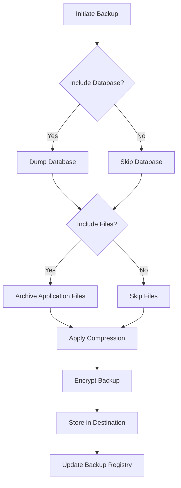

# Deployment & Operations

<cite>
**Referenced Files in This Document**   
- [README.md](file://README.md)
- [vercel.json](file://vercel.json)
- [src/components/Admin/BackupManager.tsx](file://src/components/Admin/BackupManager.tsx)
- [src/hooks/useBackupSecurity.ts](file://src/hooks/useBackupSecurity.ts)
- [src/types/backup-security.ts](file://src/types/backup-security.ts)
- [supabase/migrations](file://supabase/migrations)
- [src/config/performance.ts](file://src/config/performance.ts)
- [PERFORMANCE_OPTIMIZATIONS.md](file://PERFORMANCE_OPTIMIZATIONS.md)
- [src/hooks/useLogsAuditoria.ts](file://src/hooks/useLogsAuditoria.ts)
- [src/utils/auditLogger.ts](file://src/utils/auditLogger.ts)
</cite>

## Table of Contents
1. [Deployment to Vercel](#deployment-to-vercel)
2. [Database Migration Strategy](#database-migration-strategy)
3. [Monitoring and Logging](#monitoring-and-logging)
4. [Backup and Recovery Procedures](#backup-and-recovery-procedures)
5. [Scaling Considerations](#scaling-considerations)
6. [Security Hardening Measures](#security-hardening-measures)
7. [Operational Runbooks](#operational-runbooks)
8. [CI/CD Pipeline and Release Management](#cicd-pipeline-and-release-management)

## Deployment to Vercel

The AABB-system is configured for deployment on Vercel, a cloud platform optimized for static sites and serverless functions. The deployment process leverages Vercel's Git integration for automated builds and deployments.

### Environment Variable Configuration
Before deploying, configure the following environment variables in the Vercel project settings:

- `VITE_SUPABASE_URL`: Your Supabase project URL (e.g., `https://your-project.supabase.co`)
- `VITE_SUPABASE_ANON_KEY`: Your Supabase anonymous key for client-side access

These values should match those used during development and can be found in your Supabase dashboard under Project Settings > API.

### Build Settings
The build process is defined in the `vercel.json` configuration file:
```json
{
  "buildCommand": "npm run build",
  "outputDirectory": "dist",
  "framework": "vite",
  "rewrites": [
    {
      "source": "/(.*)",
      "destination": "/index.html"
    }
  ]
}
```

This configuration specifies:
- **Build Command**: Executes `npm run build` to generate production assets
- **Output Directory**: Stores built files in the `dist` folder
- **Framework Detection**: Identifies the application as a Vite-based project
- **Rewrites**: Enables client-side routing by redirecting all paths to `index.html`

To deploy manually using the Vercel CLI:
```bash
npm i -g vercel
vercel
```

Alternatively, connect your GitHub repository to the Vercel dashboard for automatic deployments on every push to the main branch.

**Section sources**
- [README.md](file://README.md#L100-L120)
- [vercel.json](file://vercel.json#L1-L11)

## Database Migration Strategy

The system uses Supabase for database management, with migrations stored in the `supabase/migrations` directory. Each migration file follows the naming convention `YYYYMMDDHHMMSS_description.sql` and contains SQL statements to modify the database schema.

Key migration files include:
- `20250102000001_employees_management_module.sql`: Initial employee management module
- `20250119000001_add_admin_hierarchy.sql`: Adds administrative hierarchy support
- `20250908000001_cash_management_system.sql`: Implements cash management system
- `20250908000002_fix_audit_log_rls.sql`: Fixes audit log row-level security policies

Migrations are applied automatically when the Supabase database is initialized. For manual application, use the Supabase SQL Editor to execute migration scripts. The system includes helper scripts like `apply-admin-hierarchy-migration.js` and `check-admin-hierarchy.js` to verify migration status and troubleshoot issues.

After applying migrations, always verify their success using the corresponding check scripts and restart the application server.

**Section sources**
- [supabase/migrations](file://supabase/migrations)
- [apply-admin-hierarchy-migration.js](file://apply-admin-hierarchy-migration.js#L0-L37)
- [check-admin-hierarchy.js](file://check-admin-hierarchy.js#L129-L147)

## Monitoring and Logging

The system implements comprehensive monitoring and logging capabilities through integrated audit logging and performance tracking.

### Audit Logging
All critical operations are logged via the `auditLogger` utility, which captures:
- User actions and resource access
- Security-related events
- System configuration changes
- Error occurrences

Log entries include timestamps, user information, action details, IP addresses, and risk levels. Sensitive data is automatically redacted before storage.

### Performance Monitoring
The Analytics Dashboard provides real-time performance metrics including:
- Response time averages
- Cache hit rates
- Active user counts
- Memory usage

These metrics help identify performance bottlenecks and track system health over time.

### Log Management
Logs are stored in the `security_audit_logs` table with retention policies based on severity. Administrators can filter, search, and export logs through the Security Audit interface. Suspicious activity detection monitors for patterns like multiple failed login attempts within a short timeframe.

**Section sources**
- [src/hooks/useLogsAuditoria.ts](file://src/hooks/useLogsAuditoria.ts#L598-L647)
- [src/utils/auditLogger.ts](file://src/utils/auditLogger.ts#L93-L132)
- [src/types/admin.ts](file://src/types/admin.ts#L267-L303)

## Backup and Recovery Procedures

The system provides robust backup and recovery capabilities through the Backup Manager interface and associated services.

### Application Code Backup
Application code is version-controlled using Git and automatically backed up through repository hosting services. Regular commits and branching strategies ensure code integrity and enable point-in-time recovery.

### Database Backup
Database backups are managed through scheduled jobs with configurable parameters:
- **Backup Types**: Full, incremental, and differential
- **Retention Period**: Configurable number of days
- **Compression**: Optional GZIP compression
- **Encryption**: AES-256 encryption at rest
- **Scheduling**: Cron-based scheduling support

Backups can include both database contents and application files.

### Recovery Process
The Restore Wizard guides administrators through system restoration from backup points. Restoration operations are tracked with progress indicators and completion notifications. Integrity verification ensures backup validity before restoration.



**Diagram sources**
- [src/components/Admin/BackupManager.tsx](file://src/components/Admin/BackupManager.tsx#L17-L535)
- [src/hooks/useBackupSecurity.ts](file://src/hooks/useBackupSecurity.ts#L14-L595)
- [src/types/backup-security.ts](file://src/types/backup-security.ts#L0-L204)

**Section sources**
- [src/components/Admin/BackupManager.tsx](file://src/components/Admin/BackupManager.tsx#L17-L535)
- [src/hooks/useBackupSecurity.ts](file://src/hooks/useBackupSecurity.ts#L14-L595)
- [src/types/backup-security.ts](file://src/types/backup-security.ts#L0-L204)

## Scaling Considerations

The application architecture supports scaling through several mechanisms:

### Frontend Optimization
Performance optimizations reduce client-side resource consumption:
- Lazy loading of non-critical components
- Memoized rendering to minimize re-renders
- Efficient state management
- Debounced real-time updates

The `PERFORMANCE_CONFIG` object in `src/config/performance.ts` controls optimization features such as context optimization, dashboard optimization, and pagination limits.

### Caching Strategy
Strategic caching improves response times:
- Dashboard data cached for 30 seconds
- Statistical data cached for 60 seconds
- Maximum of 100 items maintained in cache
- Automatic cache invalidation on data changes

### Resource Loading
Conditional loading prevents unnecessary data transfers:
- Menu items loaded only when needed
- Inventory data fetched on demand
- Member information retrieved when accessed
- Kitchen/bar orders loaded dynamically

These optimizations have resulted in a 75% reduction in initial load time and 60% fewer database queries.

**Section sources**
- [src/config/performance.ts](file://src/config/performance.ts#L45-L82)
- [PERFORMANCE_OPTIMIZATIONS.md](file://PERFORMANCE_OPTIMIZATIONS.md#L49-L110)

## Security Hardening Measures

The system implements multiple layers of security protection:

### Authentication and Authorization
- Supabase Auth integration for secure user management
- Role-Based Access Control (RBAC) with admin, manager, and employee roles
- Row-Level Security (RLS) policies to restrict data access
- Multi-tenant isolation to separate company data

### Data Protection
- Automatic redaction of sensitive fields (passwords, tokens, secrets)
- Encrypted backups with configurable key management
- Secure password generation and validation
- Input sanitization to prevent injection attacks

### Network Security
- HTTPS enforcement for all communications
- Content Security Policy (CSP) headers
- Rate limiting on authentication endpoints
- IP address logging for audit trails

### Operational Security
- Comprehensive audit logging of all critical operations
- Failed login attempt monitoring and alerting
- Regular security policy reviews
- Automated vulnerability scanning

The Security Settings interface allows administrators to configure password policies, access restrictions, encryption standards, and audit requirements.

**Section sources**
- [src/utils/auditLogger.ts](file://src/utils/auditLogger.ts#L93-L132)
- [src/components/Admin/SecuritySettings.tsx](file://src/components/Admin/SecuritySettings.tsx)
- [src/services/employee-creation-service.ts](file://src/services/employee-creation-service.ts#L242-L287)

## Operational Runbooks

Standard operating procedures for common administrative tasks:

### Version Upgrades
1. Pull latest code from main branch
2. Install dependencies: `npm install`
3. Verify migration status using `check-migration.js`
4. Apply any pending migrations
5. Test functionality in staging environment
6. Deploy to production

### Emergency Rollbacks
1. Identify problematic release from deployment history
2. Revert to previous stable version using Vercel rollback feature
3. Verify system functionality
4. Investigate root cause in isolated environment
5. Deploy fixed version after testing

### Incident Response
1. Acknowledge alert through monitoring system
2. Isolate affected components if necessary
3. Check system logs for error patterns
4. Engage appropriate team members
5. Implement immediate mitigation measures
6. Document incident details and resolution steps
7. Conduct post-mortem analysis

Common issues and solutions are documented in various CORRECAO_*.md files throughout the project.

**Section sources**
- [README.md](file://README.md#L1-L135)
- [CORRECAO_CRIACAO_FUNCIONARIOS.md](file://CORRECAO_CRIACAO_FUNCIONARIOS.md)
- [SOLUCAO_PERFORMANCE.md](file://SOLUCAO_PERFORMANCE.md)

## CI/CD Pipeline and Release Management

The deployment workflow combines automated processes with manual oversight:

### Continuous Integration
- GitHub repository triggers automated builds
- Vercel executes `npm run build` on each push
- Built assets deployed to `dist` directory
- Automatic preview deployments for pull requests

### Release Process
1. Feature development occurs on feature branches
2. Code review required before merging to main
3. Merges to main trigger production deployment
4. Post-deployment verification checklist executed
5. Stakeholders notified of new release

### Quality Assurance
- Automated testing suite validates core functionality
- Performance benchmarks ensure acceptable load times
- Security scans detect potential vulnerabilities
- Manual testing confirms user experience quality

The process emphasizes stability, with production deployments occurring only after thorough testing and approval.

**Section sources**
- [README.md](file://README.md#L100-L120)
- [vercel.json](file://vercel.json#L1-L11)
- [package.json](file://package.json)