# Employee Creation Workflow

<cite>
**Referenced Files in This Document**   
- [employee-creation-service.ts](file://src/services/employee-creation-service.ts)
- [useEmployeeCreation.ts](file://src/hooks/useEmployeeCreation.ts)
- [credentialsGenerator.ts](file://src/utils/credentialsGenerator.ts)
- [secure-password-generator.ts](file://src/utils/secure-password-generator.ts)
- [auditLogger.ts](file://src/utils/auditLogger.ts)
</cite>

## Table of Contents
1. [Introduction](#introduction)
2. [Core Components](#core-components)
3. [7-Step Employee Creation Process](#7-step-employee-creation-process)
4. [Temporary Password Generation and senha_provisoria Flag](#temporary-password-generation-and-senha_provisoria-flag)
5. [Stela Silva Case Study](#stela-silva-case-study)
6. [Error Handling and Rollback Strategy](#error-handling-and-rollback-strategy)
7. [Integration with useEmployeeCreation Hook](#integration-with-useemployeecreation-hook)
8. [Security Considerations](#security-considerations)
9. [Conclusion](#conclusion)

## Introduction
The employee creation workflow is a comprehensive system designed to onboard new employees into the organization's digital ecosystem. This document details the 7-step process for creating an employee, including email verification, credential generation, Supabase Auth creation, profile registration, bar employee registration, company linkage, and permission configuration. The workflow ensures secure and efficient onboarding while maintaining data integrity and access control.

**Section sources**
- [employee-creation-service.ts](file://src/services/employee-creation-service.ts#L517-L712)

## Core Components
The employee creation workflow relies on several core components that work together to ensure a seamless onboarding experience. These include the `EmployeeCreationService`, which orchestrates the entire process, the `useEmployeeCreation` hook for frontend integration, and various utility functions for credential generation and audit logging.

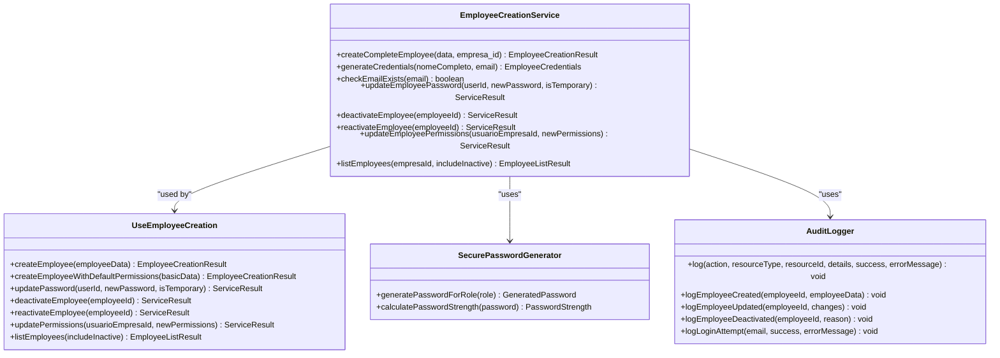

**Diagram sources**
- [employee-creation-service.ts](file://src/services/employee-creation-service.ts#L517-L712)
- [useEmployeeCreation.ts](file://src/hooks/useEmployeeCreation.ts#L0-L272)
- [secure-password-generator.ts](file://src/utils/secure-password-generator.ts#L185-L197)
- [auditLogger.ts](file://src/utils/auditLogger.ts#L0-L132)

**Section sources**
- [employee-creation-service.ts](file://src/services/employee-creation-service.ts#L517-L712)
- [useEmployeeCreation.ts](file://src/hooks/useEmployeeCreation.ts#L0-L272)
- [secure-password-generator.ts](file://src/utils/secure-password-generator.ts#L185-L197)
- [auditLogger.ts](file://src/utils/auditLogger.ts#L0-L132)

## 7-Step Employee Creation Process
The employee creation process consists of seven distinct steps, each critical to ensuring a successful onboarding. This section details each step, its purpose, and how it integrates with the overall workflow.

### Step 1: Email Verification
The first step in the employee creation process is verifying the uniqueness of the provided email address. This prevents duplicate accounts and maintains data integrity across the system.

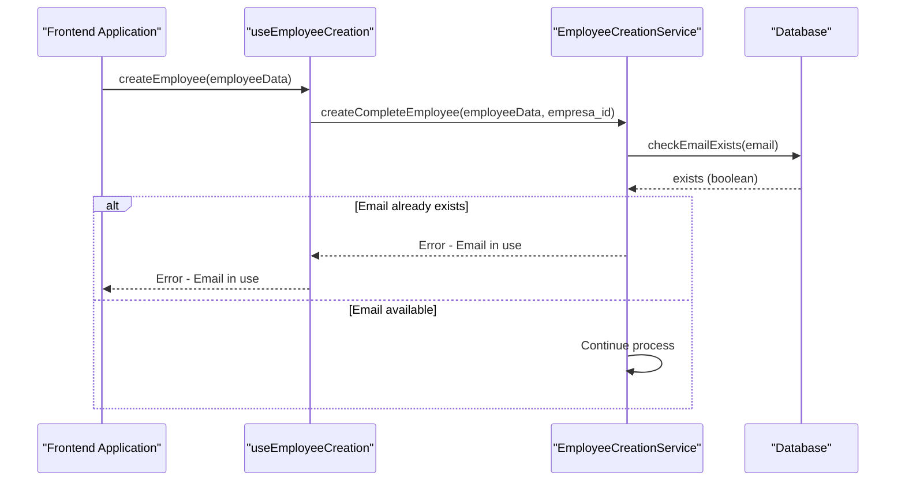

**Diagram sources**
- [employee-creation-service.ts](file://src/services/employee-creation-service.ts#L1598-L1632)

**Section sources**
- [employee-creation-service.ts](file://src/services/employee-creation-service.ts#L1598-L1632)

### Step 2: Credential Generation
Once the email is verified, the system generates secure credentials for the new employee. This includes creating a temporary password with special characters based on the employee's role and responsibilities.

```mermaid
flowchart TD
Start([Start]) --> GenerateCredentials["Generate Credentials"]
GenerateCredentials --> RoleCheck{"Role = 'gerente'?}
RoleCheck --> |Yes| ManagerPassword["Use manager preset (12 chars, symbols)"]
RoleCheck --> |No| EmployeePassword["Use employee preset (10 chars, no symbols)"]
ManagerPassword --> Shuffle["Shuffle password characters"]
EmployeePassword --> Shuffle
Shuffle --> Validate["Validate password strength"]
Validate --> End([End])
```

**Diagram sources**
- [secure-password-generator.ts](file://src/utils/secure-password-generator.ts#L185-L197)

**Section sources**
- [secure-password-generator.ts](file://src/utils/secure-password-generator.ts#L185-L197)

### Step 3: Supabase Auth Creation
The third step involves creating a user account in Supabase Auth, which serves as the primary authentication mechanism for the system. This step uses a fallback strategy to handle potential database trigger issues.

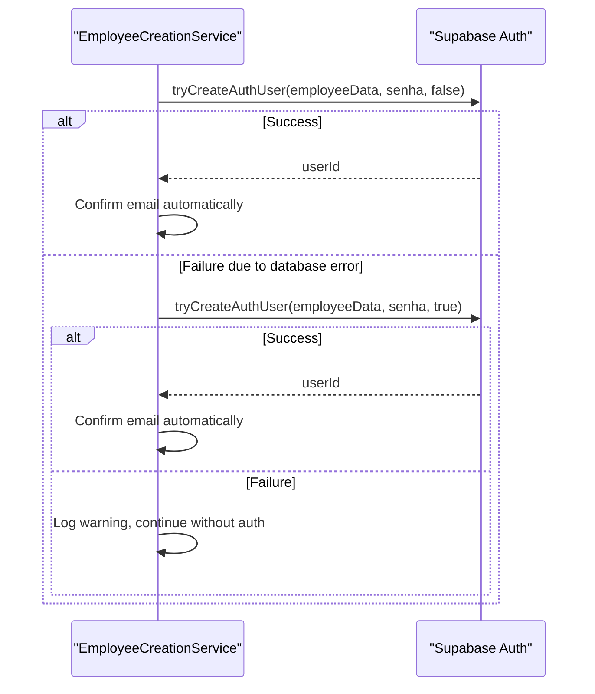

**Diagram sources**
- [employee-creation-service.ts](file://src/services/employee-creation-service.ts#L800-L950)

**Section sources**
- [employee-creation-service.ts](file://src/services/employee-creation-service.ts#L800-L950)

### Step 4: Profile Registration
After successful authentication setup, the system creates a user profile that contains additional information about the employee, such as their name, role, and avatar.

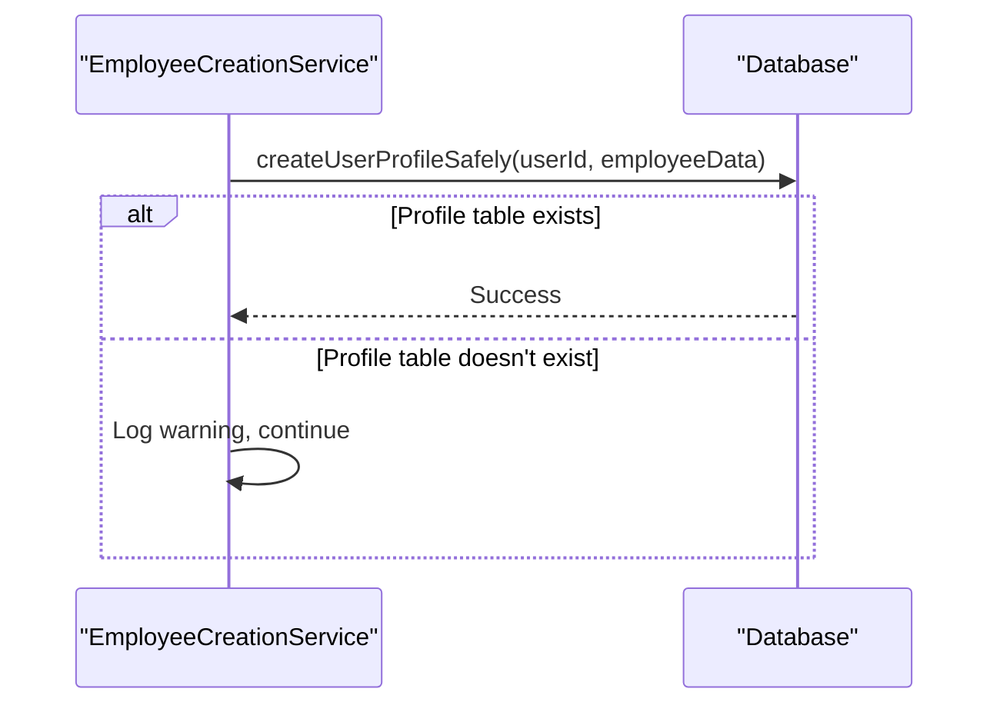

**Diagram sources**
- [employee-creation-service.ts](file://src/services/employee-creation-service.ts#L951-L1000)

**Section sources**
- [employee-creation-service.ts](file://src/services/employee-creation-service.ts#L951-L1000)

### Step 5: Bar Employee Registration
The fifth step registers the employee in the bar-specific employee system, capturing role-specific information such as shift preferences, specialties, and commission rates.

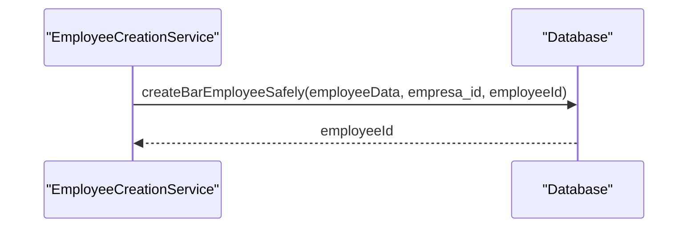

**Diagram sources**
- [employee-creation-service.ts](file://src/services/employee-creation-service.ts#L1101-L1150)

**Section sources**
- [employee-creation-service.ts](file://src/services/employee-creation-service.ts#L1101-L1150)

### Step 6: Company Linkage
This step establishes the relationship between the employee and their company by creating a record in the usuarios_empresa table, which links the user to a specific company.

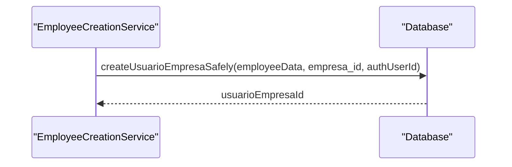

**Diagram sources**
- [employee-creation-service.ts](file://src/services/employee-creation-service.ts#L1151-L1200)

**Section sources**
- [employee-creation-service.ts](file://src/services/employee-creation-service.ts#L1151-L1200)

### Step 7: Permission Configuration
The final step configures the employee's permissions within the system, determining what actions they can perform and what data they can access.

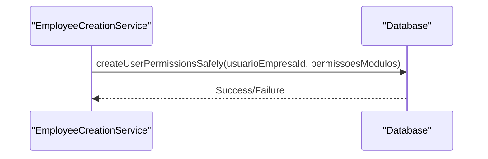

**Diagram sources**
- [employee-creation-service.ts](file://src/services/employee-creation-service.ts#L1201-L1250)

**Section sources**
- [employee-creation-service.ts](file://src/services/employee-creation-service.ts#L1201-L1250)

## Temporary Password Generation and senha_provisoria Flag
The system automatically generates temporary passwords with special characters based on the employee's role. The senha_provisoria flag mechanism ensures that employees are required to change their password upon first login.

### Password Generation Logic
The password generation system uses different presets based on the employee's role:

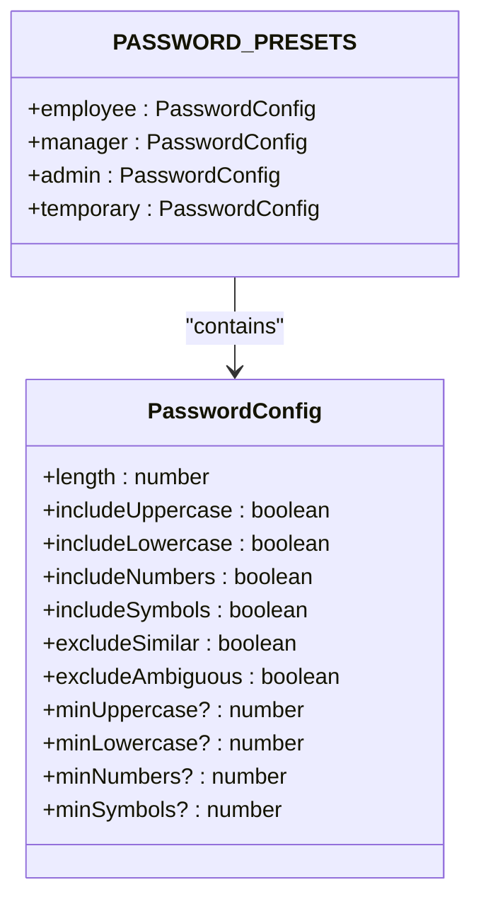

**Diagram sources**
- [secure-password-generator.ts](file://src/utils/secure-password-generator.ts#L20-L70)

**Section sources**
- [secure-password-generator.ts](file://src/utils/secure-password-generator.ts#L20-L70)

### senha_provisoria Flag Mechanism
The senha_provisoria flag is set to true when a new employee is created, indicating that they must change their password upon first login.

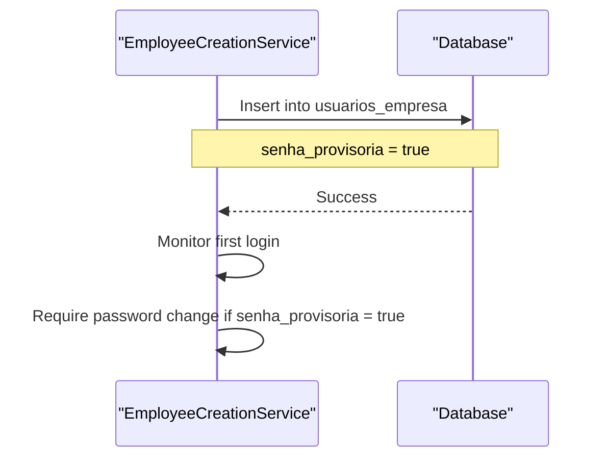

**Diagram sources**
- [employee-creation-service.ts](file://src/services/employee-creation-service.ts#L1151-L1200)

**Section sources**
- [employee-creation-service.ts](file://src/services/employee-creation-service.ts#L1151-L1200)

## Stela Silva Case Study
The Stela Silva case study demonstrates the complete employee creation workflow in action, showcasing how the system handles a real-world onboarding scenario.

### Scenario Overview
Stela Silva is being hired as a manager at a new location. Her onboarding requires full system access with elevated permissions.

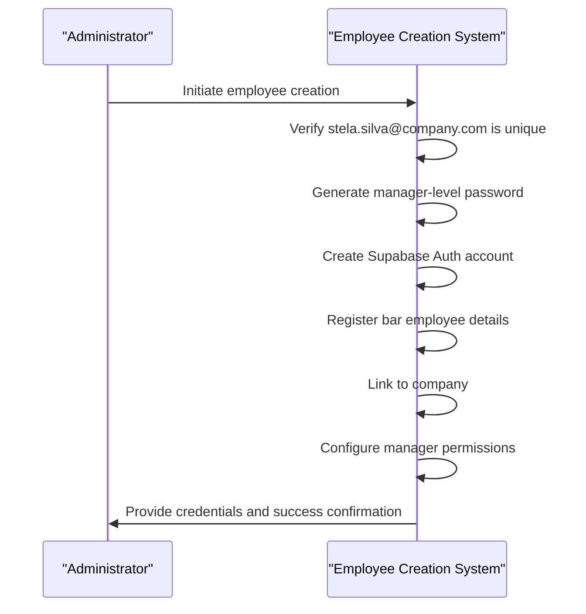

**Diagram sources**
- [employee-creation-service.ts](file://src/services/employee-creation-service.ts#L517-L712)

**Section sources**
- [employee-creation-service.ts](file://src/services/employee-creation-service.ts#L517-L712)

## Error Handling and Rollback Strategy
The employee creation system implements comprehensive error handling and rollback strategies to maintain data consistency in case of failures.

### Error Classification
The system categorizes errors into five types:
- VALIDATION_ERROR: Input data validation failures
- AUTH_ERROR: Authentication-related issues
- DATABASE_ERROR: Database operation failures
- PERMISSION_ERROR: Authorization problems
- NETWORK_ERROR: Connectivity issues

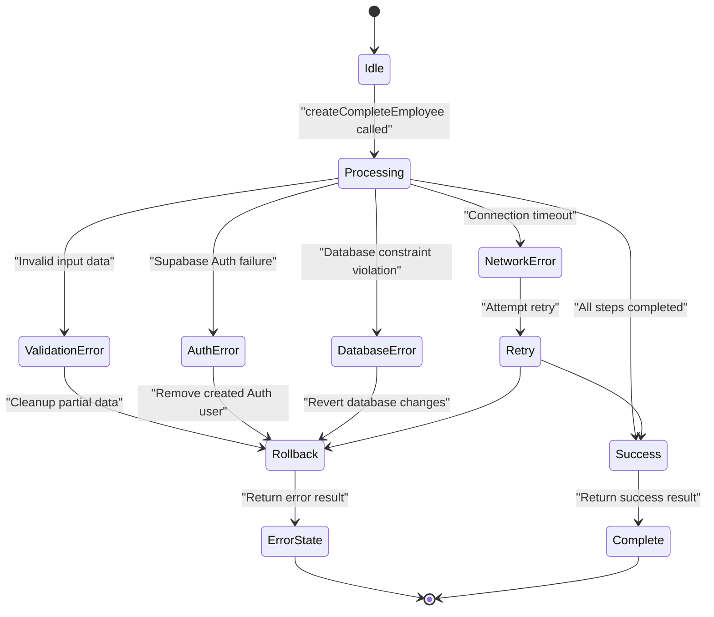

**Diagram sources**
- [employee-creation-service.ts](file://src/services/employee-creation-service.ts#L150-L200)

**Section sources**
- [employee-creation-service.ts](file://src/services/employee-creation-service.ts#L150-L200)

### Rollback Implementation
When a critical failure occurs, the system executes a cleanup process to remove partially created data:

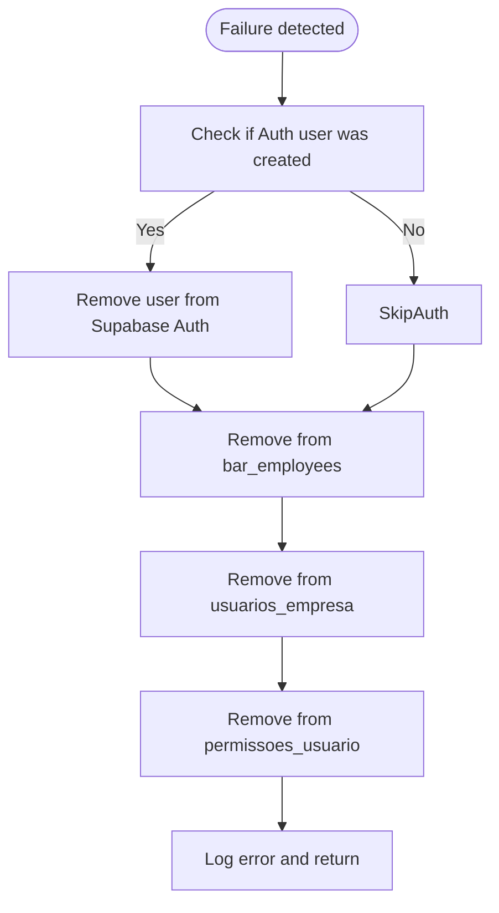

**Diagram sources**
- [employee-creation-service.ts](file://src/services/employee-creation-service.ts#L650-L660)

**Section sources**
- [employee-creation-service.ts](file://src/services/employee-creation-service.ts#L650-L660)

## Integration with useEmployeeCreation Hook
The useEmployeeCreation hook provides a clean interface for integrating the employee creation functionality into React components.

### Hook Usage Example
```typescript
const { createEmployeeWithDefaultPermissions } = useEmployeeCreation();

const handleCreateEmployee = async () => {
  const basicData = {
    nome_completo: "John Doe",
    email: "john.doe@company.com",
    bar_role: "atendente",
    tem_acesso_sistema: true,
  };

  const result = await createEmployeeWithDefaultPermissions(basicData);
  
  if (result.success) {
    // Handle success
  } else {
    // Handle error
  }
};
```

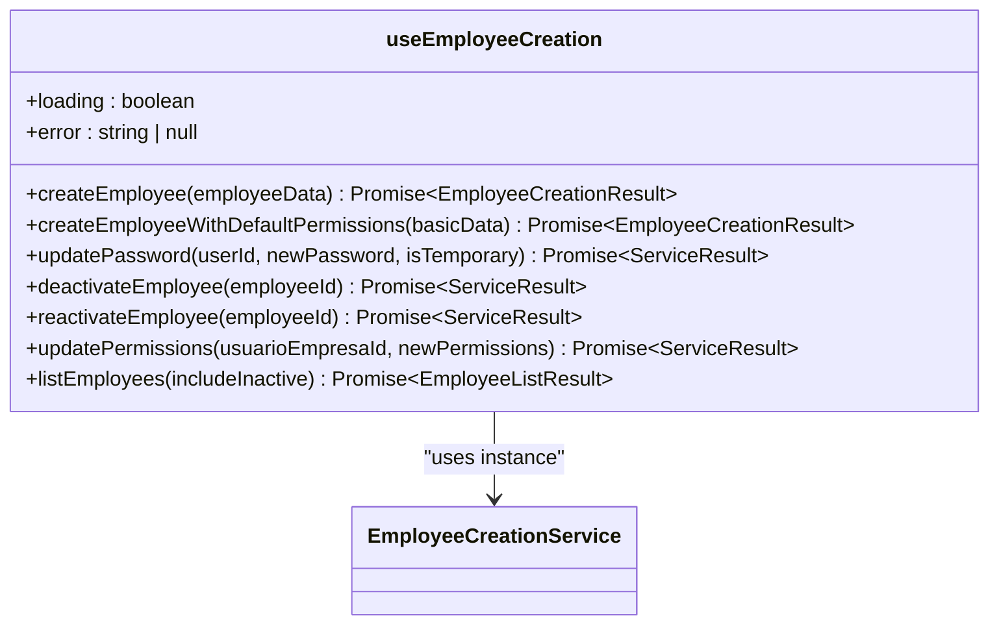

**Diagram sources**
- [useEmployeeCreation.ts](file://src/hooks/useEmployeeCreation.ts#L0-L272)

**Section sources**
- [useEmployeeCreation.ts](file://src/hooks/useEmployeeCreation.ts#L0-L272)

## Security Considerations
The employee creation workflow incorporates several security measures to protect sensitive data and prevent unauthorized access.

### Unique Email Enforcement
The system ensures email uniqueness through database constraints and application-level checks:

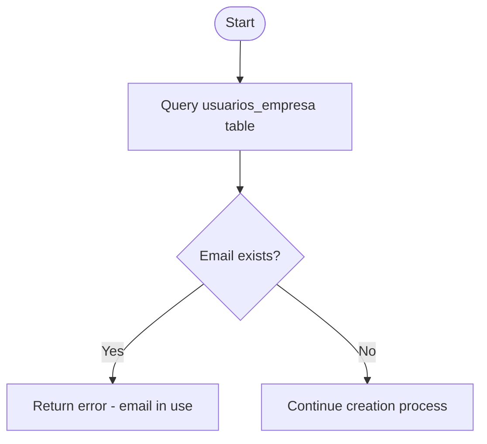

**Diagram sources**
- [employee-creation-service.ts](file://src/services/employee-creation-service.ts#L1598-L1632)

**Section sources**
- [employee-creation-service.ts](file://src/services/employee-creation-service.ts#L1598-L1632)

### Audit Logging
All employee creation activities are logged for security and compliance purposes:

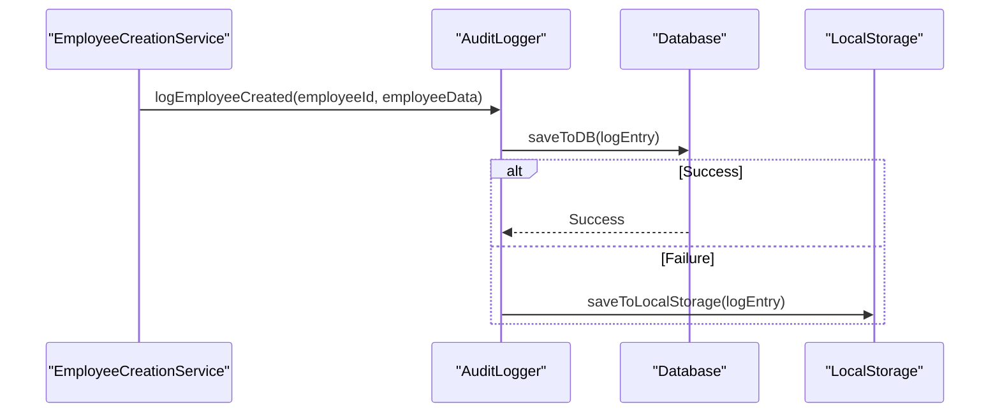

**Diagram sources**
- [auditLogger.ts](file://src/utils/auditLogger.ts#L0-L132)

**Section sources**
- [auditLogger.ts](file://src/utils/auditLogger.ts#L0-L132)

## Conclusion
The employee creation workflow is a robust and secure system that automates the onboarding process while maintaining data integrity and access control. By following the 7-step process, the system ensures that new employees are properly configured with appropriate credentials and permissions. The integration of error handling, rollback strategies, and audit logging provides a reliable foundation for managing employee accounts within the organization.