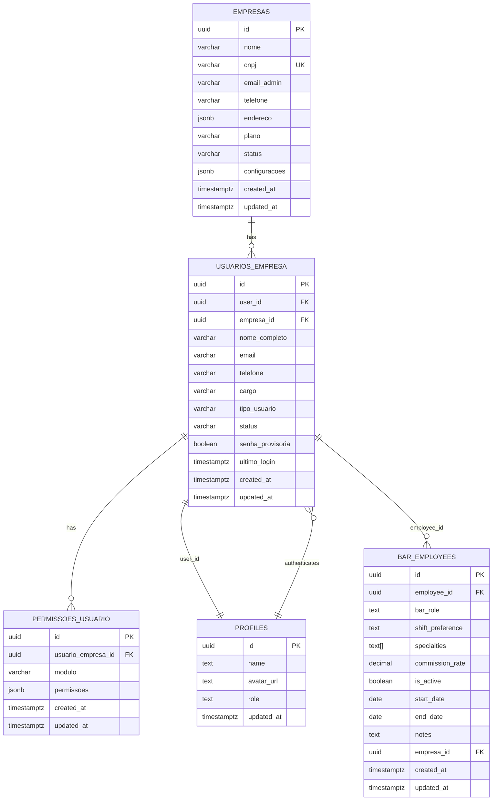
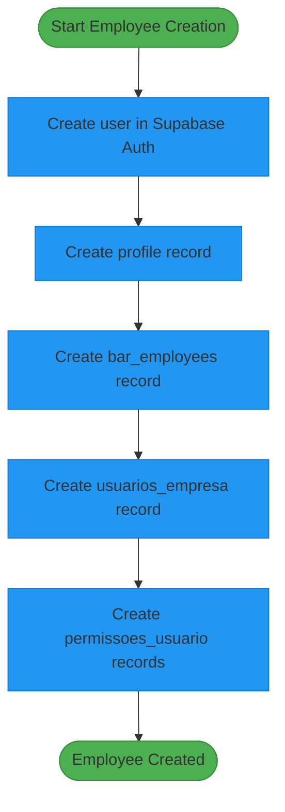

# Employee Data Model

<cite>
**Referenced Files in This Document**   
- [20250116000001_multitenant_auth_system.sql](file://supabase/migrations/20250116000001_multitenant_auth_system.sql)
- [20250729000000_initial_schema.sql](file://supabase/migrations/20250729000000_initial_schema.sql)
- [create-stela-complete-flow.html](file://create-stela-complete-flow.html)
- [employee-creation-service.ts](file://src/services/employee-creation-service.ts)
</cite>

## Table of Contents
1. [Introduction](#introduction)
2. [Core Entity Relationships](#core-entity-relationships)
3. [Table Field Definitions](#table-field-definitions)
4. [Primary and Foreign Key Relationships](#primary-and-foreign-key-relationships)
5. [Data Validation Rules and Business Logic](#data-validation-rules-and-business-logic)
6. [Sample Data Records](#sample-data-records)
7. [Data Access Patterns and Performance Considerations](#data-access-patterns-and-performance-considerations)

## Introduction
This document provides comprehensive documentation for the employee system data model, focusing on the relationships between key tables: bar_employees, usuarios_empresa, profiles, and permissoes_usuario. The system implements a multitenant architecture where employees are associated with specific companies (empresas) and have role-based access to different modules within the application. The data model supports critical business processes including employee creation, authentication, permission management, and tenant isolation.

The employee system follows a multi-step creation process that establishes records across multiple tables, ensuring proper authentication setup, company association, and permission configuration. A key feature is the temporary password mechanism that requires first-time users to change their credentials upon initial login, enhancing security while simplifying onboarding.

**Section sources**
- [20250116000001_multitenant_auth_system.sql](file://supabase/migrations/20250116000001_multitenant_auth_system.sql#L1-L218)
- [20250729000000_initial_schema.sql](file://supabase/migrations/20250729000000_initial_schema.sql#L1-L175)

## Core Entity Relationships
The employee system consists of four primary entities that work together to manage employee data, authentication, and permissions within a multitenant environment. These entities are interconnected through foreign key relationships that maintain data integrity and enable efficient querying across the employee lifecycle.



**Diagram sources**
- [20250116000001_multitenant_auth_system.sql](file://supabase/migrations/20250116000001_multitenant_auth_system.sql#L1-L218)

## Table Field Definitions
This section details the field definitions, data types, and constraints for each of the core tables in the employee system. The tables are designed to support multitenancy, role-based access control, and audit requirements while maintaining data integrity through appropriate constraints and indexes.

### bar_employees Table
The bar_employees table stores information about employees who work in the bar operations. This table contains role-specific attributes such as shift preferences, specialties, and commission rates.

| Field | Type | Constraints | Description |
|-------|------|-------------|-------------|
| id | UUID | PRIMARY KEY, DEFAULT gen_random_uuid() | Unique identifier for the bar employee record |
| employee_id | UUID | REFERENCES auth.users(id) ON DELETE CASCADE | Foreign key linking to the authentication system user |
| bar_role | TEXT | NOT NULL | Role within the bar (e.g., bartender, waiter, manager) |
| shift_preference | TEXT | | Preferred working shift (e.g., morning, afternoon, night) |
| specialties | TEXT[] | | Array of specialties or skills the employee possesses |
| commission_rate | DECIMAL(5,2) | DEFAULT 0.00 | Percentage commission rate for sales made by the employee |
| is_active | BOOLEAN | DEFAULT true | Indicates whether the employee is currently active |
| start_date | DATE | NOT NULL | Date when the employee started working |
| end_date | DATE | | Date when the employee stopped working (for terminated employees) |
| notes | TEXT | | Additional notes or comments about the employee |
| empresa_id | UUID | REFERENCES empresas(id) ON DELETE CASCADE | Tenant identifier linking the employee to a specific company |
| created_at | TIMESTAMPTZ | DEFAULT NOW() | Timestamp when the record was created |
| updated_at | TIMESTAMPTZ | DEFAULT NOW() | Timestamp when the record was last updated |

**Section sources**
- [20250116000001_multitenant_auth_system.sql](file://supabase/migrations/20250116000001_multitenant_auth_system.sql#L1-L218)

### usuarios_empresa Table
The usuarios_empresa table serves as the central entity that links authenticated users to specific companies (tenants) and stores essential employee information.

| Field | Type | Constraints | Description |
|-------|------|-------------|-------------|
| id | UUID | PRIMARY KEY, DEFAULT gen_random_uuid() | Unique identifier for the company user record |
| user_id | UUID | REFERENCES auth.users(id) ON DELETE CASCADE | Foreign key to the Supabase Auth user table |
| empresa_id | UUID | REFERENCES empresas(id) ON DELETE CASCADE | Foreign key to the empresa table establishing tenant context |
| nome_completo | VARCHAR(255) | NOT NULL | Full name of the employee |
| email | VARCHAR(255) | NOT NULL | Email address used for login and communication |
| telefone | VARCHAR(20) | | Contact phone number |
| cargo | VARCHAR(100) | | Job title or position within the company |
| tipo_usuario | VARCHAR(20) | DEFAULT 'funcionario', CHECK constraint | User type: 'administrador' or 'funcionario' |
| status | VARCHAR(20) | DEFAULT 'ativo', CHECK constraint | Employment status: 'ativo', 'inativo', or 'bloqueado' |
| senha_provisoria | BOOLEAN | DEFAULT FALSE | Flag indicating if the user has a temporary password requiring change |
| ultimo_login | TIMESTAMPTZ | | Timestamp of the user's last successful login |
| created_at | TIMESTAMPTZ | DEFAULT NOW() | Timestamp when the record was created |
| updated_at | TIMESTAMPTZ | DEFAULT NOW() | Timestamp when the record was last updated |
| UNIQUE(user_id, empresa_id) | | | Prevents duplicate user-company associations |

**Section sources**
- [20250116000001_multitenant_auth_system.sql](file://supabase/migrations/20250116000001_multitenant_auth_system.sql#L1-L218)

### profiles Table
The profiles table contains public user profile information linked to the authentication system, enabling personalized experiences and role-based access control.

| Field | Type | Constraints | Description |
|-------|------|-------------|-------------|
| id | UUID | PRIMARY KEY, REFERENCES auth.users(id) ON DELETE CASCADE | Primary key that references the authentication user ID |
| name | TEXT | | Display name for the user |
| avatar_url | TEXT | | URL pointing to the user's avatar image |
| role | TEXT | NOT NULL DEFAULT 'employee' | Application-level role determining base permissions |
| updated_at | TIMESTAMPTZ | DEFAULT NOW() | Timestamp when the profile was last updated |

**Section sources**
- [20250729000000_initial_schema.sql](file://supabase/migrations/20250729000000_initial_schema.sql#L1-L175)

### permissoes_usuario Table
The permissoes_usuario table manages granular permissions for users across different application modules, enabling fine-grained access control.

| Field | Type | Constraints | Description |
|-------|------|-------------|-------------|
| id | UUID | PRIMARY KEY, DEFAULT gen_random_uuid() | Unique identifier for the permission record |
| usuario_empresa_id | UUID | REFERENCES usuarios_empresa(id) ON DELETE CASCADE | Foreign key to the company user record |
| modulo | VARCHAR(50) | NOT NULL | Application module to which permissions apply |
| permissoes | JSONB | DEFAULT '{}' | JSON object containing specific permissions for the module |
| created_at | TIMESTAMPTZ | DEFAULT NOW() | Timestamp when the permission record was created |
| updated_at | TIMESTAMPTZ | DEFAULT NOW() | Timestamp when the permission record was last updated |
| UNIQUE(usuario_empresa_id, modulo) | | | Prevents duplicate permission entries for the same user and module |

**Section sources**
- [20250116000001_multitenant_auth_system.sql](file://supabase/migrations/20250116000001_multitenant_auth_system.sql#L1-L218)

## Primary and Foreign Key Relationships
The employee system employs a robust relational structure with well-defined primary and foreign key relationships that ensure data integrity and support the multitenant architecture. These relationships establish connections between authentication, tenant context, employee roles, and permission systems.

```mermaid
graph TD
subgraph "Authentication System"
Auth[auth.users]
Profiles[profiles]
end
subgraph "Tenant Context"
Empresas[empresas]
end
subgraph "Employee Management"
UsuariosEmpresa[usuarios_empresa]
BarEmployees[bar_employees]
PermissoesUsuario[permissoes_usuario]
end
Auth --> Profiles: "id → id"
Auth --> UsuariosEmpresa: "id → user_id"
Empresas --> UsuariosEmpresa: "id → empresa_id"
UsuariosEmpresa --> PermissoesUsuario: "id → usuario_empresa_id"
Profiles --> BarEmployees: "id → employee_id"
UsuariosEmpresa --> BarEmployees: "user_id → employee_id"
style Auth fill:#f9f,stroke:#333
style Profiles fill:#f9f,stroke:#333
style Empresas fill:#bbf,stroke:#333
style UsuariosEmpresa fill:#ffb,stroke:#333
style BarEmployees fill:#bfb,stroke:#333
style PermissoesUsuario fill:#fbb,stroke:#333
```

The primary key relationships establish unique identifiers for each record:
- **bar_employees.id**: UUID primary key generated with gen_random_uuid()
- **usuarios_empresa.id**: UUID primary key generated with gen_random_uuid()
- **profiles.id**: UUID primary key that references auth.users(id)
- **permissoes_usuario.id**: UUID primary key generated with gen_random_uuid()

Foreign key relationships create the following associations:
- **usuarios_empresa.user_id** references **auth.users.id**: Links the company user to the authentication system
- **usuarios_empresa.empresa_id** references **empresas.id**: Associates the user with a specific tenant/company
- **bar_employees.employee_id** references **profiles.id**: Connects bar employee records to user profiles
- **bar_employees.empresa_id** references **empresas.id**: Ensures bar employees are associated with the correct tenant
- **permissoes_usuario.usuario_empresa_id** references **usuarios_empresa.id**: Links permissions to specific user-company associations

These relationships enforce referential integrity through ON DELETE CASCADE constraints, ensuring that when a parent record is deleted, related child records are automatically removed. The multitenant design is reinforced by the empresa_id foreign key present in multiple tables, which enables Row Level Security (RLS) policies to restrict data access to the appropriate tenant context.

**Diagram sources**
- [20250116000001_multitenant_auth_system.sql](file://supabase/migrations/20250116000001_multitenant_auth_system.sql#L1-L218)
- [20250729000000_initial_schema.sql](file://supabase/migrations/20250729000000_initial_schema.sql#L1-L175)

**Section sources**
- [20250116000001_multitenant_auth_system.sql](file://supabase/migrations/20250116000001_multitenant_auth_system.sql#L1-L218)

## Data Validation Rules and Business Logic
The employee system implements several critical data validation rules and business logic patterns to ensure data integrity, security, and proper workflow execution. These rules govern everything from field constraints to complex business processes like employee creation and authentication.

### Critical Field Validation
The system enforces validation at both the database and application levels for key fields:

- **user_id**: Must reference a valid auth.users record, ensuring only authenticated users can be associated with companies
- **empresa_id**: Must reference a valid empresas record, maintaining tenant integrity
- **tipo_usuario**: Restricted to 'administrador' or 'funcionario' through a CHECK constraint
- **status**: Limited to 'ativo', 'inativo', or 'bloqueado' values for consistent state management
- **senha_provisoria**: Boolean flag that triggers the first-login password change workflow

### Temporary Password Business Logic
A key business rule in the system is the requirement for temporary password change on first login. When a new employee is created:
1. The **senha_provisoria** field is set to TRUE in the usuarios_empresa table
2. During the first login attempt, the authentication service detects this flag
3. The user is redirected to a password change screen before accessing the main application
4. Upon successful password update, the **senha_provisoria** field is set to FALSE
5. The **updated_at** timestamp is updated to reflect the change

This workflow ensures that all employees set their own secure passwords while allowing administrators to onboard users without knowing their permanent credentials.

### Employee Creation Workflow
The employee creation process follows a specific sequence to establish all necessary records:



Each step in this workflow is transactional and includes error handling to ensure data consistency. If any step fails, the system attempts to roll back previous operations to prevent orphaned records.

**Diagram sources**
- [create-stela-complete-flow.html](file://create-stela-complete-flow.html#L1-L666)

**Section sources**
- [employee-creation-service.ts](file://src/services/employee-creation-service.ts#L1-L2000)
- [create-stela-complete-flow.html](file://create-stela-complete-flow.html#L1-L666)

## Sample Data Records
This section provides sample data records based on the Stela Silva example, illustrating how data is structured across the various tables in the employee system.

### Stela Silva - usuarios_empresa Record
```json
{
  "id": "a1b2c3d4-e5f6-7890-g1h2-i3j4k5l6m7n8",
  "user_id": "u1v2w3x4-y5z6-7890-a1b2-c3d4e5f6g7h8",
  "empresa_id": "00000000-0000-0000-0000-000000000001",
  "nome_completo": "Stela Silva",
  "email": "stela@teste.com",
  "telefone": "(11) 99999-9999",
  "cargo": "Atendente de Caixa",
  "tipo_usuario": "funcionario",
  "status": "ativo",
  "senha_provisoria": true,
  "ultimo_login": null,
  "created_at": "2025-01-16T10:30:00Z",
  "updated_at": "2025-01-16T10:30:00Z"
}
```

### Stela Silva - bar_employees Record
```json
{
  "id": "b2c3d4e5-f6g7-8901-h2i3-j4k5l6m7n8o9",
  "employee_id": "u1v2w3x4-y5z6-7890-a1b2-c3d4e5f6g7h8",
  "bar_role": "atendente",
  "shift_preference": "manha",
  "specialties": ["atendimento", "caixa", "vendas"],
  "commission_rate": 2.5,
  "is_active": true,
  "start_date": "2025-01-16",
  "end_date": null,
  "notes": "Nome: Stela Silva, CPF: 123.456.789-00, Email: stela@teste.com, Telefone: (11) 99999-9999, Observações: Funcionária responsável pelo caixa matutino",
  "empresa_id": "00000000-0000-0000-0000-000000000001",
  "created_at": "2025-01-16T10:30:00Z",
  "updated_at": "2025-01-16T10:30:00Z"
}
```

### Stela Silva - permissoes_usuario Records
```json
[
  {
    "id": "c3d4e5f6-g7h8-9012-i3j4-k5l6m7n8o9p0",
    "usuario_empresa_id": "a1b2c3d4-e5f6-7890-g1h2-i3j4k5l6m7n8",
    "modulo": "dashboard",
    "permissoes": {
      "visualizar": true,
      "criar": false,
      "editar": false,
      "excluir": false,
      "administrar": false
    },
    "created_at": "2025-01-16T10:30:00Z",
    "updated_at": "2025-01-16T10:30:00Z"
  },
  {
    "id": "d4e5f6g7-h8i9-0123-j4k5-l6m7n8o9p0q1",
    "usuario_empresa_id": "a1b2c3d4-e5f6-7890-g1h2-i3j4k5l6m7n8",
    "modulo": "gestao_caixa",
    "permissoes": {
      "visualizar": true,
      "criar": true,
      "editar": true,
      "excluir": false,
      "administrar": true
    },
    "created_at": "2025-01-16T10:30:00Z",
    "updated_at": "2025-01-16T10:30:00Z"
  }
]
```

These sample records demonstrate the complete data model for an employee, showing how information is distributed across tables while maintaining referential integrity through foreign key relationships.

**Section sources**
- [create-stela-complete-flow.html](file://create-stela-complete-flow.html#L1-L666)

## Data Access Patterns and Performance Considerations
The employee system is designed with specific data access patterns and performance considerations to optimize query efficiency, especially in a multitenant environment where data isolation and scalability are critical.

### Common Query Patterns
The most frequent data access patterns include:

1. **Employee lookup by user ID**: Retrieving employee information for authenticated sessions
```sql
SELECT * FROM usuarios_empresa 
WHERE user_id = auth.uid() 
AND empresa_id = get_user_empresa_id();
```

2. **Employee search within a tenant**: Finding employees by name or role within a specific company
```sql
SELECT ue.nome_completo, ue.cargo, be.bar_role, be.specialties 
FROM usuarios_empresa ue 
JOIN bar_employees be ON ue.user_id = be.employee_id 
WHERE ue.empresa_id = 'tenant-id' 
AND ue.nome_completo ILIKE '%search-term%';
```

3. **Permission checking**: Verifying user permissions for specific modules
```sql
SELECT p.permissoes 
FROM permissoes_usuario p 
JOIN usuarios_empresa ue ON p.usuario_empresa_id = ue.id 
WHERE ue.user_id = auth.uid() 
AND p.modulo = 'specific-module';
```

### Indexing Strategy
The system employs strategic indexing to optimize these common queries:

- **idx_usuarios_empresa_user_id**: Index on user_id for fast authentication lookups
- **idx_usuarios_empresa_empresa_id**: Index on empresa_id for tenant-based queries
- **idx_permissoes_usuario_empresa_id**: Composite index for permission checks within tenants
- **Unique constraint on (user_id, empresa_id)**: Prevents duplicate associations and serves as an index

### Performance Optimization Recommendations
To maintain optimal performance as the system scales:

1. **Connection pooling**: Implement connection pooling to reduce database connection overhead
2. **Query batching**: Batch related queries to minimize round trips to the database
3. **Caching strategy**: Cache frequently accessed data like user profiles and permissions
4. **Index maintenance**: Regularly monitor and optimize indexes based on query patterns
5. **Partitioning**: Consider table partitioning by empresa_id for very large tenants

The multitenant architecture inherently improves performance by limiting the scope of most queries to a single tenant's data, reducing the overall dataset that needs to be scanned. Row Level Security (RLS) policies automatically enforce these tenant boundaries at the database level, preventing accidental cross-tenant data access while optimizing query performance.

**Section sources**
- [20250116000001_multitenant_auth_system.sql](file://supabase/migrations/20250116000001_multitenant_auth_system.sql#L1-L218)