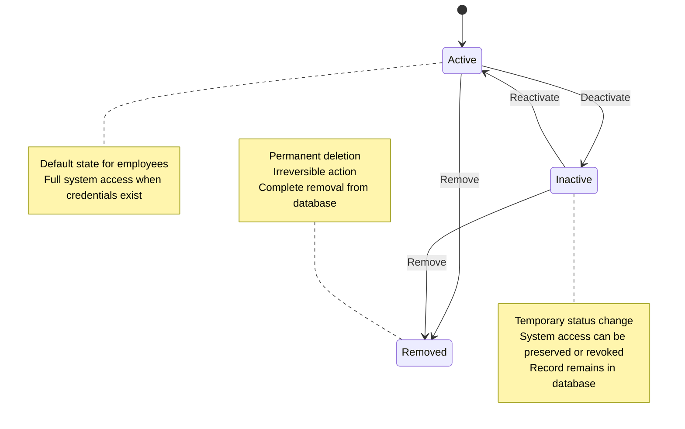
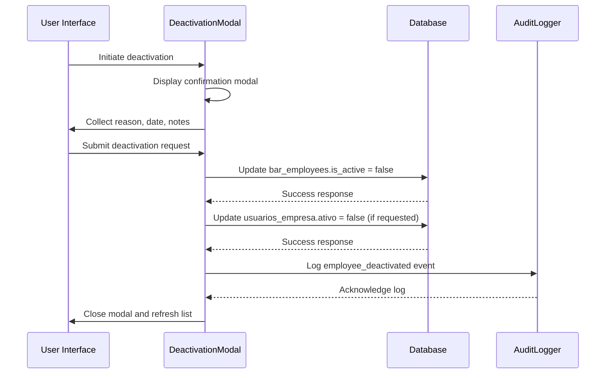
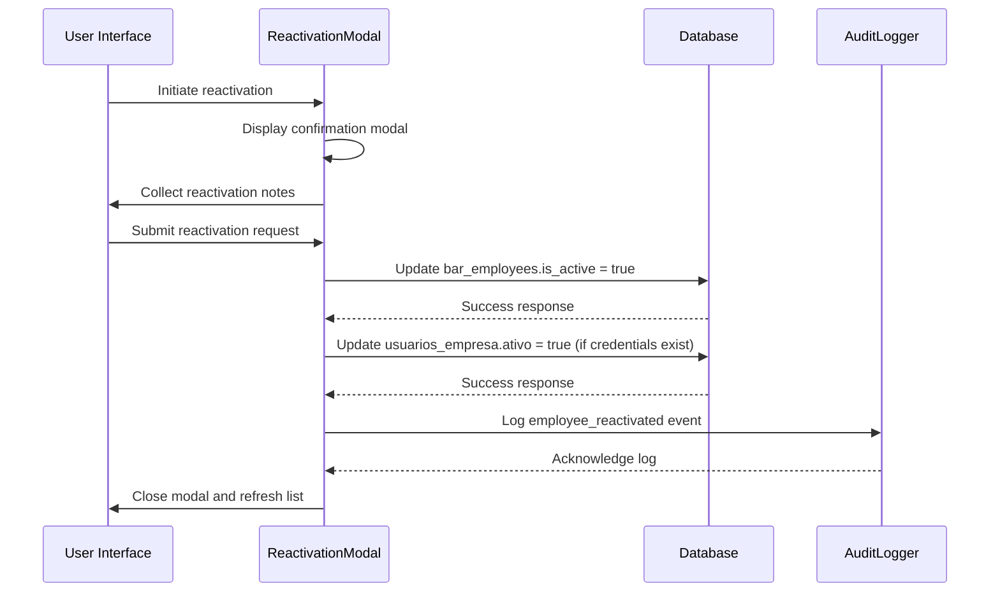
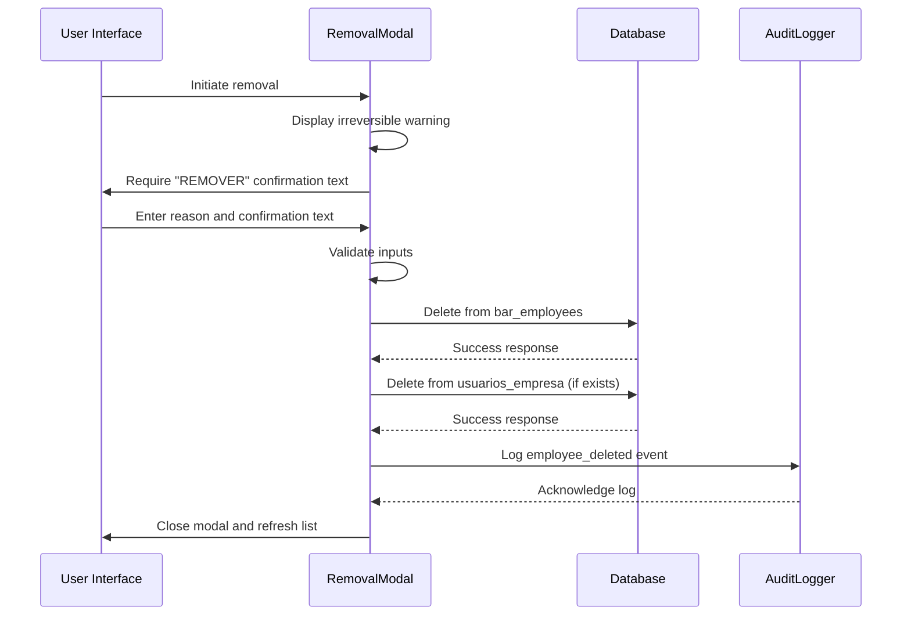
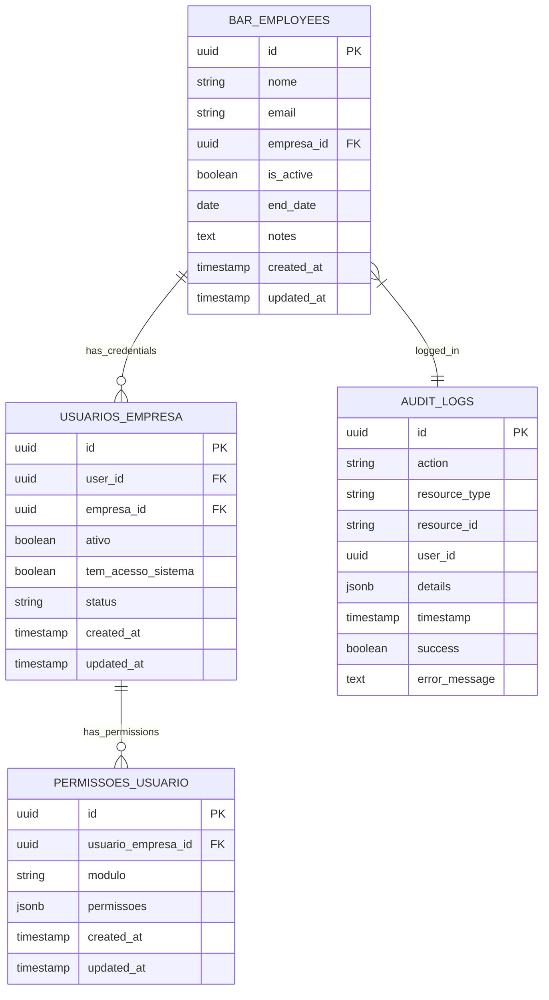

# Employee Lifecycle Management

<cite>
**Referenced Files in This Document**  
- [DeactivationModal.tsx](file://src/components/EmployeeLifecycle/DeactivationModal.tsx)
- [ReactivationModal.tsx](file://src/components/EmployeeLifecycle/ReactivationModal.tsx)
- [EmployeeRemovalModal.tsx](file://src/components/EmployeeLifecycle/EmployeeRemovalModal.tsx)
- [employee-basic-service.ts](file://src/services/employee-basic-service.ts)
- [20250102000001_employees_management_module.sql](file://supabase/migrations/20250102000001_employees_management_module.sql)
- [auditLogger.ts](file://src/utils/auditLogger.ts)
</cite>

## Table of Contents
1. [Introduction](#introduction)
2. [State Transition Overview](#state-transition-overview)
3. [Deactivation Workflow](#deactivation-workflow)
4. [Reactivation Workflow](#reactivation-workflow)
5. [Removal Workflow](#removal-workflow)
6. [Data Model Impact](#data-model-impact)
7. [Audit Logging and Compliance](#audit-logging-and-compliance)
8. [Safety Checks and Confirmation Modals](#safety-checks-and-confirmation-modals)

## Introduction

The Employee Lifecycle Management system provides comprehensive workflows for managing employee status throughout their employment journey. The system distinguishes between temporary status changes (deactivation/reactivation) and permanent actions (removal), with appropriate safeguards, audit trails, and data integrity measures. This documentation details the implementation of these workflows, focusing on the state transition logic, business implications, and technical considerations.

## State Transition Overview

The employee lifecycle supports three primary states: active, inactive (deactivated), and removed (permanently deleted). The system implements a clear distinction between deactivation (temporary status change) and removal (permanent deletion), each serving different business purposes.



**Diagram sources**
- [DeactivationModal.tsx](file://src/components/EmployeeLifecycle/DeactivationModal.tsx)
- [ReactivationModal.tsx](file://src/components/EmployeeLifecycle/ReactivationModal.tsx)
- [EmployeeRemovalModal.tsx](file://src/components/EmployeeLifecycle/EmployeeRemovalModal.tsx)

**Section sources**
- [DeactivationModal.tsx](file://src/components/EmployeeLifecycle/DeactivationModal.tsx)
- [ReactivationModal.tsx](file://src/components/EmployeeLifecycle/ReactivationModal.tsx)
- [EmployeeRemovalModal.tsx](file://src/components/EmployeeLifecycle/EmployeeRemovalModal.tsx)

## Deactivation Workflow

The deactivation workflow implements a soft delete mechanism that preserves employee records while changing their active status. This allows for future reactivation and maintains historical data integrity.

### Process Flow



**Diagram sources**
- [DeactivationModal.tsx](file://src/components/EmployeeLifecycle/DeactivationModal.tsx)
- [auditLogger.ts](file://src/utils/auditLogger.ts)

**Section sources**
- [DeactivationModal.tsx](file://src/components/EmployeeLifecycle/DeactivationModal.tsx#L32-L196)

### Business Logic

When an employee is deactivated:
- The `is_active` field in `bar_employees` table is set to `false`
- The `end_date` field is updated to the effective deactivation date
- A timestamped note is appended to the employee's notes field with the deactivation reason
- Credentials can optionally be disabled by setting `ativo` and `tem_acesso_sistema` fields to `false` in the `usuarios_empresa` table
- The operation triggers an audit log entry for compliance tracking

The deactivation process supports various business scenarios including termination, leave of absence, suspension, and contract expiration, with specific reasons documented for reporting and analysis.

## Reactivation Workflow

The reactivation workflow restores previously deactivated employees to active status, preserving their historical data and relationships within the system.

### Process Flow



**Diagram sources**
- [ReactivationModal.tsx](file://src/components/EmployeeLifecycle/ReactivationModal.tsx)
- [auditLogger.ts](file://src/utils/auditLogger.ts)

**Section sources**
- [ReactivationModal.tsx](file://src/components/EmployeeLifecycle/ReactivationModal.tsx#L15-L126)

### Business Logic

When an employee is reactivated:
- The `is_active` field in `bar_employees` table is restored to `true`
- The `end_date` field is cleared (set to null)
- A timestamped note is appended to the employee's notes field with reactivation details
- Credentials are automatically re-enabled by setting `ativo` and `tem_acesso_sistema` fields to `true` in the `usuarios_empresa` table
- The operation triggers an audit log entry for compliance tracking

Reactivation is typically used for employees returning from leave, reinstatement after suspension, or rehiring after a previous termination when historical data preservation is required.

## Removal Workflow

The removal workflow implements permanent deletion of employee records from the system. This irreversible action should be used only when absolutely necessary due to compliance requirements or data correction needs.

### Process Flow



**Diagram sources**
- [EmployeeRemovalModal.tsx](file://src/components/EmployeeLifecycle/EmployeeRemovalModal.tsx)
- [auditLogger.ts](file://src/utils/auditLogger.ts)

**Section sources**
- [EmployeeRemovalModal.tsx](file://src/components/EmployeeLifecycle/EmployeeRemovalModal.tsx#L32-L150)

### Business Logic

When an employee is removed:
- The record is permanently deleted from the `bar_employees` table
- Associated user credentials are removed from the `usuarios_empresa` table
- All related permissions in `permissoes_usuario` are cascaded and removed
- An audit log entry is created to document the permanent deletion
- The operation requires explicit confirmation by typing "REMOVER" to prevent accidental execution

Removal should only be performed in specific circumstances such as:
- Data entry errors requiring complete correction
- Legal requirements for data erasure
- Duplicate record cleanup
- Test data removal

## Data Model Impact

The employee lifecycle operations affect multiple tables in the database schema, maintaining referential integrity while supporting the business requirements for temporary and permanent status changes.

### Database Schema Relationships



**Diagram sources**
- [20250102000001_employees_management_module.sql](file://supabase/migrations/20250102000001_employees_management_module.sql)
- [DeactivationModal.tsx](file://src/components/EmployeeLifecycle/DeactivationModal.tsx)
- [ReactivationModal.tsx](file://src/components/EmployeeLifecycle/ReactivationModal.tsx)
- [EmployeeRemovalModal.tsx](file://src/components/EmployeeLifecycle/EmployeeRemovalModal.tsx)

**Section sources**
- [20250102000001_employees_management_module.sql](file://supabase/migrations/20250102000001_employees_management_module.sql#L3-L402)

### Table-Specific Operations

#### bar_employees Table
- **Deactivation**: Updates `is_active` to `false`, sets `end_date`, appends notes
- **Reactivation**: Updates `is_active` to `true`, clears `end_date`, appends notes
- **Removal**: Deletes the entire record

#### usuarios_empresa Table
- **Deactivation**: Updates `ativo` and `tem_acesso_sistema` to `false` (optional)
- **Reactivation**: Updates `ativo` and `tem_acesso_sistema` to `true`
- **Removal**: Deletes the associated record

#### permissoes_usuario Table
- **Deactivation/Reactivation**: No direct changes; access is controlled by `tem_acesso_sistema`
- **Removal**: Cascading delete removes all associated permissions

## Audit Logging and Compliance

The system implements comprehensive audit logging to ensure compliance with data governance requirements and provide traceability for all employee lifecycle operations.

### Audit Event Types

| Action | Resource Type | Details Captured | Business Purpose |
|--------|---------------|------------------|------------------|
| employee_created | employee | employee_name, employee_role, has_system_access | Track new hires and access provisioning |
| employee_updated | employee | fields_changed, changes | Monitor employee data modifications |
| employee_deactivated | employee | reason, deactivation_date | Document terminations and status changes |
| employee_reactivated | employee | n/a | Track employee returns |
| employee_deleted | employee | reason | Record permanent deletions for compliance |

### Audit Implementation

```mermaid
flowchart TD
A[Employee Action] --> B{Action Type}
B --> C[Deactivation]
B --> D[Reactivation]
B --> E[Removal]
C --> F[Call auditLogger.logEmployeeDeactivated()]
D --> G[Call auditLogger.logEmployeeReactivated()]
E --> H[Call auditLogger.logEmployeeDeleted()]
F --> I[Create AuditLogEntry]
G --> I
H --> I
I --> J{Online?}
J --> |Yes| K[Save to audit_logs DB]
J --> |No| L[Save to localStorage]
K --> M[Audit Complete]
L --> N[Sync when online]
N --> M
```

**Diagram sources**
- [auditLogger.ts](file://src/utils/auditLogger.ts)

**Section sources**
- [auditLogger.ts](file://src/utils/auditLogger.ts#L0-L132)

The audit system ensures that all employee lifecycle events are recorded with:
- Timestamp of the action
- User ID and email of the operator
- Specific action taken
- Resource affected (employee ID)
- Detailed context (reason, changes, etc.)
- Success/failure status

Offline-capable logging ensures audit trail continuity even during connectivity issues, with automatic synchronization when connectivity is restored.

## Safety Checks and Confirmation Modals

The system implements multiple safety checks and confirmation mechanisms to prevent accidental or unauthorized changes to employee records.

### Deactivation Safety Features

- **Mandatory Reason Selection**: Users must select a deactivation reason from predefined options
- **Optional Credential Management**: Clear checkbox to disable system access
- **Date Specification**: Ability to set future deactivation dates
- **Error Handling**: Clear error messages for failed operations
- **Processing States**: Visual feedback during operation execution

### Removal Safety Features

- **Irreversible Warning**: Prominent display of "Irreversible Action" warning
- **Text Confirmation**: Requirement to type "REMOVER" to confirm
- **Reason Selection**: Mandatory selection of removal reason
- **Input Validation**: Disabled action button until all requirements are met
- **Visual Design**: Red color scheme to emphasize destructive nature

These safety features balance operational efficiency with risk mitigation, ensuring that critical employee lifecycle operations require deliberate user actions while providing appropriate guidance and feedback.