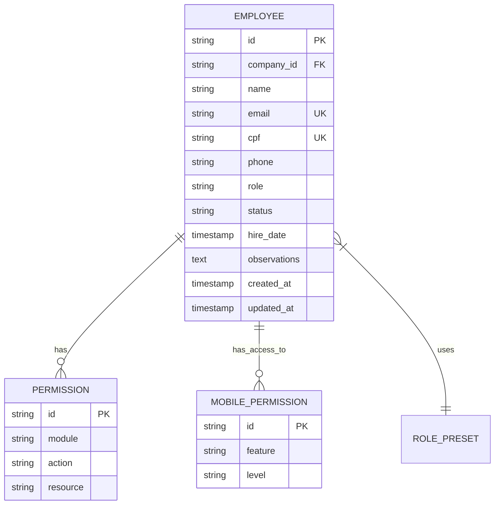
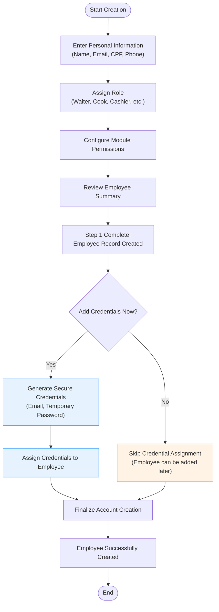
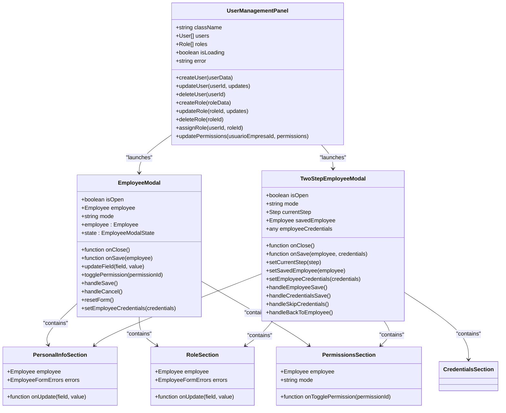
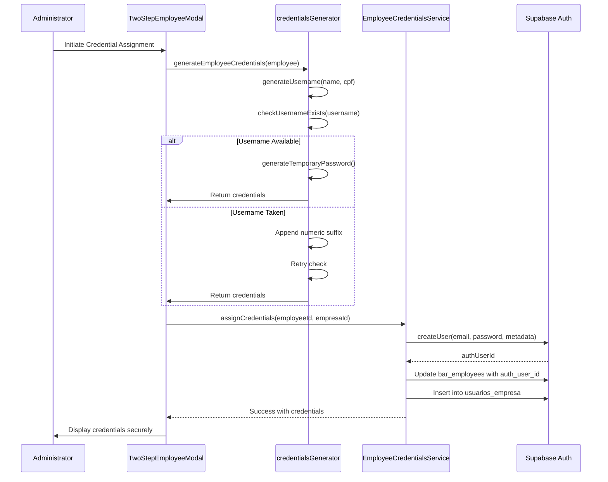
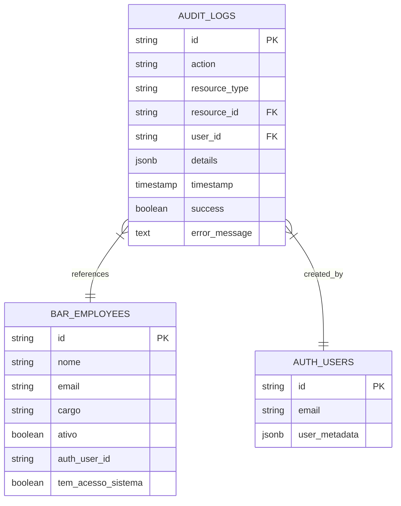

# Employee Management

<cite>
**Referenced Files in This Document**   
- [UserManagementPanel.tsx](file://src/components/Admin/UserManagementPanel.tsx)
- [EmployeeModal.tsx](file://src/components/EmployeeModal/EmployeeModal.tsx)
- [TwoStepEmployeeModal.tsx](file://src/components/EmployeeModal/TwoStepEmployeeModal.tsx)
- [employee-creation-service.ts](file://src/services/employee-creation-service.ts)
- [useEmployeeCreation.ts](file://src/hooks/useEmployeeCreation.ts)
- [employee.types.ts](file://src/types/employee.types.ts)
- [credentialsGenerator.ts](file://src/utils/credentialsGenerator.ts)
- [employee-credentials-service.ts](file://src/services/employee-credentials-service.ts)
- [AuditLogsViewer.tsx](file://src/components/AuditLogs/AuditLogsViewer.tsx)
</cite>

## Table of Contents
1. [Introduction](#introduction)
2. [Employee Lifecycle Overview](#employee-lifecycle-overview)
3. [Employee Data Model](#employee-data-model)
4. [Two-Step Creation Process](#two-step-creation-process)
5. [User Interface Components](#user-interface-components)
6. [Credential Generation and Provisioning](#credential-generation-and-provisioning)
7. [Status Transitions and Bulk Operations](#status-transitions-and-bulk-operations)
8. [Audit Logging](#audit-logging)
9. [Edge Cases and Error Handling](#edge-cases-and-error-handling)
10. [Best Practices](#best-practices)

## Introduction

The employee management system provides a comprehensive solution for managing employee accounts throughout their entire lifecycle, from creation to deactivation. The system supports multi-tenant architecture with robust security controls and real-time validation. It features a two-step employee creation process that separates employee data entry from credential provisioning, allowing for flexible onboarding workflows. The system maintains data consistency across tenants while providing administrators with tools for bulk operations, status management, and audit logging.

**Section sources**
- [UserManagementPanel.tsx](file://src/components/Admin/UserManagementPanel.tsx#L13-L339)
- [EmployeeModal.tsx](file://src/components/EmployeeModal/EmployeeModal.tsx#L19-L299)

## Employee Lifecycle Overview

The employee lifecycle consists of several key stages: creation, activation, ongoing management, and deactivation. When an employee is created, they are initially set as active by default. Administrators can deactivate employees when they leave the organization or need temporary suspension, preserving their historical data while preventing access. Reactivation restores full access without requiring recreation of the account. The system maintains complete audit logs for all lifecycle transitions, including timestamps, responsible users, and contextual details. Employees can be managed individually or through bulk operations, with safeguards against accidental deletion through confirmation dialogs.

```mermaid
stateDiagram-v2
[*] --> Inactive
Inactive --> Creating : Create Employee
Creating --> Active : Complete Setup
Active --> Deactivated : Deactivate
Deactivated --> Active : Reactivate
Active --> Inactive : Delete
Deactivated --> Inactive : Delete
state Active {
[*] --> Active
Active --> Updating : Edit Details
Updating --> Active : Save Changes
}
state Creating {
[*] --> PersonalInfo : Enter Data
PersonalInfo --> RoleAssignment : Assign Role
RoleAssignment --> PermissionsSetup : Configure Permissions
PermissionsSetup --> CredentialsProvisioning : Add Credentials (Optional)
}
```

**Diagram sources**
- [employee-creation-service.ts](file://src/services/employee-creation-service.ts#L1-L2238)
- [useEmployeeCreation.ts](file://src/hooks/useEmployeeCreation.ts#L4-L272)

## Employee Data Model

The employee data model encompasses personal information, credentials, roles, and permissions. Each employee record includes core attributes such as name, email, CPF (Brazilian individual taxpayer registry), phone number, role, and employment status. Roles are predefined types including waiter, cook, cashier, supervisor, manager, and admin, each with associated permission presets. Permissions are granular and module-specific, covering areas like bar operations, kitchen management, cashier functions, reporting, inventory, customer management, settings, and mobile app access. Mobile app access permissions include feature-level controls for tables, orders, menu, customers, and payments with read, write, or full access levels.



**Diagram sources**
- [employee.types.ts](file://src/types/employee.types.ts#L0-L87)
- [permissionPresets.ts](file://src/utils/permissionPresets.ts)

## Two-Step Creation Process

The employee creation process follows a two-step workflow designed to separate employee data entry from credential provisioning. In the first step, administrators enter the employee's personal information, assign a role, and configure permissions. This creates a basic employee record for internal tracking without granting system access. The second step, which is optional and can be performed immediately or at a later time, involves generating and assigning login credentials. This separation allows organizations to pre-register employees before their start date and control exactly when they gain system access. The process includes real-time validation at each step, with immediate feedback on data quality issues such as invalid email formats or duplicate CPF entries.



**Diagram sources**
- [TwoStepEmployeeModal.tsx](file://src/components/EmployeeModal/TwoStepEmployeeModal.tsx#L0-L293)
- [employee-creation-service.ts](file://src/services/employee-creation-service.ts#L1-L2238)

## User Interface Components

The employee management interface consists of two primary components: the UserManagementPanel and the EmployeeModal. The UserManagementPanel serves as the central dashboard for employee administration, featuring tabbed navigation for users, roles, permissions, and access logs. It displays employees in a sortable table with avatar indicators, role badges, and status labels. The EmployeeModal provides a comprehensive form for creating and editing employee records, divided into logical sections for personal information, role assignment, and permissions management. For the two-step creation process, the TwoStepEmployeeModal guides administrators through the sequential workflow with clear progress indicators. Both components include real-time validation feedback, network status indicators, and responsive design for various screen sizes.



**Diagram sources**
- [UserManagementPanel.tsx](file://src/components/Admin/UserManagementPanel.tsx#L13-L339)
- [EmployeeModal.tsx](file://src/components/EmployeeModal/EmployeeModal.tsx#L19-L299)
- [TwoStepEmployeeModal.tsx](file://src/components/EmployeeModal/TwoStepEmployeeModal.tsx#L0-L293)

## Credential Generation and Provisioning

The credential generation and provisioning workflow creates secure login credentials for employees who require system access. When enabled, the system automatically generates a unique username based on the employee's name, a cryptographically secure temporary password, and uses the provided email address. The username generation algorithm removes accents and special characters, combines first and last names with a period separator, and adds numeric suffixes if duplicates are detected. Temporary passwords are 8-12 characters long and include uppercase letters, lowercase letters, numbers, and special symbols to ensure strength. The system checks for existing usernames and email conflicts before creation, preventing duplicates. Generated credentials can be displayed securely to administrators with appropriate access controls, and employees are required to change their temporary password upon first login.



**Diagram sources**
- [credentialsGenerator.ts](file://src/utils/credentialsGenerator.ts#L0-L234)
- [employee-credentials-service.ts](file://src/services/employee-credentials-service.ts#L0-L287)

## Status Transitions and Bulk Operations

The system supports seamless status transitions between active and inactive states for employee accounts. Deactivation preserves all employee data while revoking system access, allowing for future reactivation without data loss. The EmployeeDeactivationManager component provides modal interfaces for both deactivation and reactivation processes, with appropriate confirmation steps to prevent accidental changes. Bulk operations enable administrators to update multiple employee statuses simultaneously, improving efficiency when managing team changes. The system validates permissions before allowing status changes, ensuring only authorized users can modify employee states. Status transitions trigger audit log entries that capture the change, timestamp, and responsible user for compliance and accountability purposes.

**Section sources**
- [EmployeeDeactivationManager.tsx](file://src/components/EmployeeLifecycle/EmployeeDeactivationManager.tsx)
- [useEmployeeCreation.ts](file://src/hooks/useEmployeeCreation.ts#L4-L272)

## Audit Logging

The audit logging system tracks all significant employee-related activities, providing a comprehensive history for compliance and troubleshooting. Logs are stored in the audit_logs table with fields for action type, resource identification, user context, detailed changes, timestamp, success status, and error messages. The AuditLogsViewer component displays these logs in a chronological list with visual indicators for different action types and success/failure states. Filters allow administrators to focus on specific event categories such as creations, updates, deactivations, or login attempts. Each log entry includes expandable details showing the specific data changes, enabling forensic analysis of account modifications. The system automatically generates audit entries for critical operations including employee creation, updates, status changes, credential provisioning, and authentication events.



**Diagram sources**
- [AuditLogsViewer.tsx](file://src/components/AuditLogs/AuditLogsViewer.tsx#L0-L205)
- [employee-creation-service.ts](file://src/services/employee-creation-service.ts#L1-L2238)

## Edge Cases and Error Handling

The system addresses several edge cases and implements robust error handling mechanisms. Duplicate entries are prevented through database constraints on email and CPF fields, with user-friendly error messages explaining conflicts. Permission conflicts are resolved by validating role-permission assignments against predefined presets and preventing contradictory configurations. Account recovery is supported through the ability to reassign credentials to existing employee records, allowing restoration of access without recreating accounts. Network connectivity issues are handled gracefully with offline storage capabilities that queue changes for synchronization when connectivity is restored. Input validation occurs at multiple levels, including real-time client-side validation and server-side verification, with clear error messaging that identifies specific problematic fields. The system also handles race conditions during concurrent edits through optimistic locking patterns.

**Section sources**
- [employee-creation-service.ts](file://src/services/employee-creation-service.ts#L1-L2238)
- [useEmployeeForm.ts](file://src/hooks/useEmployeeForm.ts#L0-L344)
- [validationRules.ts](file://src/utils/validationRules.ts)

## Best Practices

For optimal management of large employee populations, several best practices are recommended. Administrators should leverage role-based permission presets to maintain consistency across similar positions, reducing configuration errors. Regular audits of active accounts help identify and deactivate former employees, enhancing security. When onboarding multiple employees, the two-step process allows batch creation of records followed by staggered credential issuance based on start dates. Data consistency across tenants is maintained through strict tenant isolation policies that prevent cross-tenant data access. Administrators should regularly review audit logs to detect unusual patterns and ensure compliance with organizational policies. For performance optimization, bulk operations should be used judiciously and scheduled during off-peak hours when possible. Finally, credential rotation policies should be implemented to periodically refresh temporary passwords and maintain security hygiene.

**Section sources**
- [employee-creation-service.ts](file://src/services/employee-creation-service.ts#L1-L2238)
- [UserManagementPanel.tsx](file://src/components/Admin/UserManagementPanel.tsx#L13-L339)
- [permission-presets.ts](file://src/utils/permission-presets.ts)