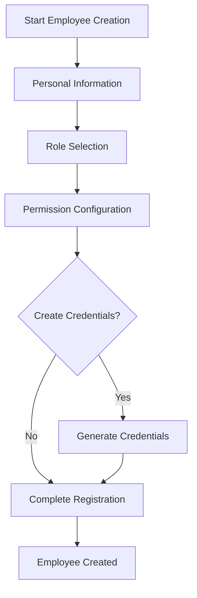
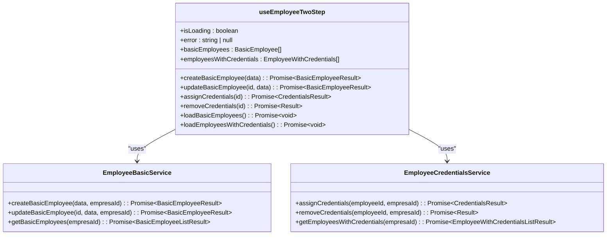
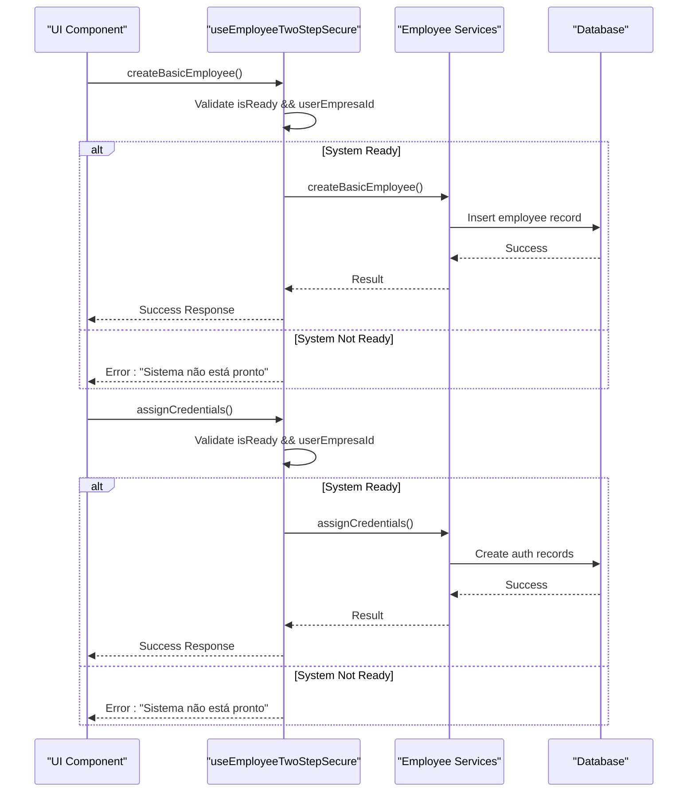
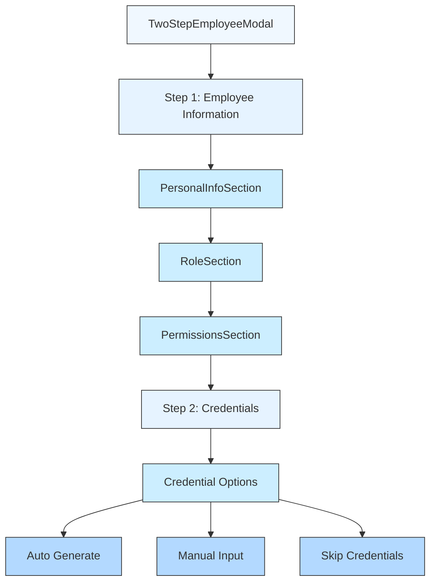
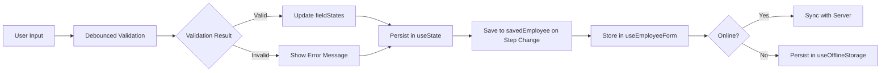
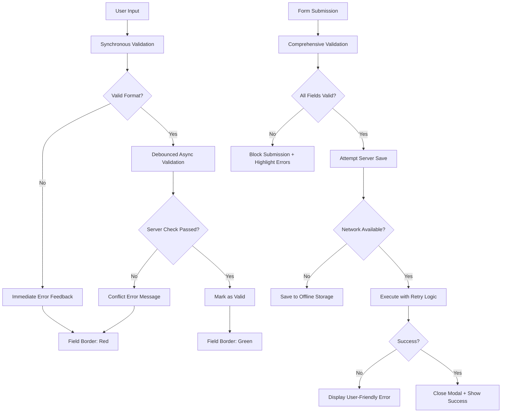
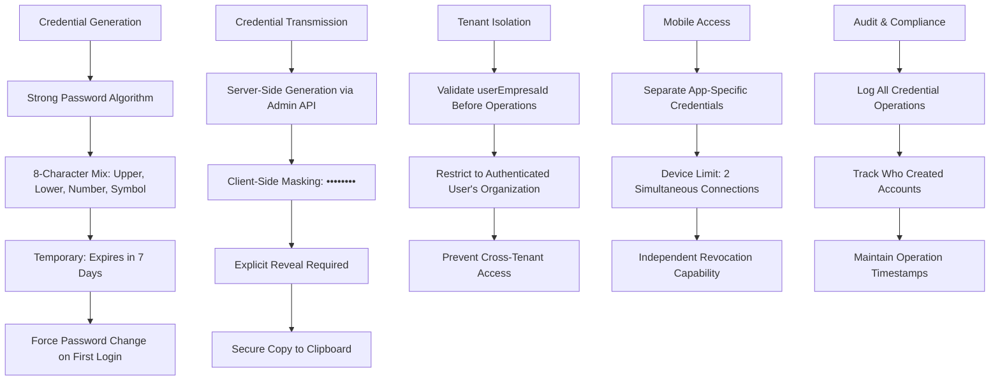

# Two-Step Employee Creation Process

<cite>
**Referenced Files in This Document**   
- [useEmployeeTwoStep.ts](file://src/hooks/useEmployeeTwoStep.ts)
- [useEmployeeTwoStepSecure.ts](file://src/hooks/useEmployeeTwoStepSecure.ts)
- [TwoStepEmployeeModal.tsx](file://src/components/EmployeeModal/TwoStepEmployeeModal.tsx)
- [PersonalInfoSection.tsx](file://src/components/EmployeeModal/PersonalInfoSection.tsx)
- [RoleSection.tsx](file://src/components/EmployeeModal/RoleSection.tsx)
- [PermissionsSection.tsx](file://src/components/EmployeeModal/PermissionsSection.tsx)
- [CredentialsSection.tsx](file://src/components/EmployeeModal/CredentialsSection.tsx)
- [credentialsGenerator.ts](file://src/utils/credentialsGenerator.ts)
- [employee-auth-service.ts](file://src/services/employee-auth-service.ts)
</cite>

## Table of Contents
1. [Introduction](#introduction)
2. [Process Overview](#process-overview)
3. [State Management with useEmployeeTwoStep Hook](#state-management-with-useemployeetwosteptwo-step-hook)
4. [Secure Credential Generation with useEmployeeTwoStepSecure Hook](#secure-credential-generation-with-useemployeetwostepsecure-hook)
5. [UI/UX Flow Between Modal Sections](#uiux-flow-between-modal-sections)
6. [Conditional Rendering and Data Persistence](#conditional-rendering-and-data-persistence)
7. [Error Handling and Validation Strategies](#error-handling-and-validation-strategies)
8. [Security Considerations](#security-considerations)

## Introduction
The two-step employee creation process is designed to separate the collection of personal information from the provisioning of system credentials, providing a more intuitive and secure workflow for administrators. This documentation details the implementation of this process, focusing on the separation of concerns between personal data collection and credential assignment, state management through custom hooks, UI/UX flow between modal sections, conditional rendering logic, data persistence mechanisms, validation strategies, and security considerations for temporary credential generation and transmission.

**Section sources**
- [FLUXO_DUAS_ETAPAS_IMPLEMENTADO.md](file://FLUXO_DUAS_ETAPAS_IMPLEMENTADO.md)

## Process Overview
The two-step employee creation process divides the employee registration into two distinct phases: first collecting essential personal and role information, then optionally provisioning system access credentials. This approach allows organizations to register employees for internal tracking without immediately granting system access, enhancing both security and administrative flexibility.

The process begins with the `TwoStepEmployeeModal` component, which guides administrators through a progressive disclosure interface. In the first step, users provide personal information including name, CPF (Brazilian individual taxpayer registry), email, phone number, and hire date. They also select the employee's role and configure permissions based on predefined presets. Only after completing this foundational information does the process advance to the second step, where credentials can be generated.

This separation ensures that sensitive authentication information is only created when explicitly needed, reducing the attack surface of the system. The workflow includes clear visual indicators showing progress through the steps, with options to skip credential creation entirely if the employee doesn't require system access. This design accommodates various organizational needs, from full-access staff members to those who only need to be tracked in the system without login capabilities.

**Diagram sources**
- [TwoStepEmployeeModal.tsx](file://src/components/EmployeeModal/TwoStepEmployeeModal.tsx)
- [FLUXO_DUAS_ETAPAS_IMPLEMENTADO.md](file://FLUXO_DUAS_ETAPAS_IMPLEMENTADO.md)

**Section sources**
- [TwoStepEmployeeModal.tsx](file://src/components/EmployeeModal/TwoStepEmployeeModal.tsx)
- [FLUXO_DUAS_ETAPAS_IMPLEMENTADO.md](file://FLUXO_DUAS_ETAPAS_IMPLEMENTADO.md)

## State Management with useEmployeeTwoStep Hook
The `useEmployeeTwoStep` hook provides comprehensive state management for the two-step employee creation process, handling both the basic employee data and credential provisioning aspects. This custom React hook encapsulates the business logic for creating employees in stages, maintaining separate states for employees with and without credentials.

The hook manages several key states: `isLoading` for indicating ongoing operations, `error` for capturing any issues during the process, `basicEmployees` for storing employees without credentials, and `employeesWithCredentials` for those with system access. It exposes methods for both stages of the process - `createBasicEmployee` for the first step and `assignCredentials` for the second step. This clear separation of concerns ensures that each phase of the employee creation process can be managed independently while maintaining data consistency.

When creating a basic employee, the hook calls the `EmployeeBasicService` to persist the personal and role information without generating any authentication credentials. Later, when credentials are assigned, it utilizes the `EmployeeCredentialsService` to create the necessary authentication records. The hook also provides utility functions like `loadBasicEmployees` and `loadEmployeesWithCredentials` to refresh the respective lists, ensuring the UI remains synchronized with the backend state.

**Diagram sources**
- [useEmployeeTwoStep.ts](file://src/hooks/useEmployeeTwoStep.ts)

**Section sources**
- [useEmployeeTwoStep.ts](file://src/hooks/useEmployeeTwoStep.ts)

## Secure Credential Generation with useEmployeeTwoStepSecure Hook
The `useEmployeeTwoStepSecure` hook extends the functionality of the base `useEmployeeTwoStep` hook with enhanced security features, particularly focused on proper tenant isolation and user context validation. This secure version ensures that all operations are performed within the correct organizational context by automatically retrieving and validating the user's associated company ID before executing any sensitive operations.

Unlike its counterpart, `useEmployeeTwoStepSecure` incorporates an initialization phase that verifies the current user's enterprise association through the `getCurrentUserEmpresaId()` function. This prevents unauthorized cross-tenant operations by ensuring that employees can only be created within the authenticated user's organization. The hook maintains additional state properties including `userEmpresaId` and `isReady`, which track the tenant context and readiness state of the secure environment.

All critical operations in this hook include pre-execution checks that validate whether the system is properly initialized and whether the user has the appropriate context. If these conditions aren't met, the operations return early with descriptive error messages rather than attempting potentially unsafe operations. This defensive programming approach enhances security by failing gracefully when contextual requirements aren't satisfied, preventing potential data leakage or unauthorized access across tenant boundaries.

The secure hook also implements proper error handling and logging for security-related events, making it easier to audit and monitor credential generation activities. By centralizing these security checks within the hook, the application ensures consistent enforcement of tenant isolation policies across all components that utilize employee creation functionality.

**Diagram sources**
- [useEmployeeTwoStepSecure.ts](file://src/hooks/useEmployeeTwoStepSecure.ts)

**Section sources**
- [useEmployeeTwoStepSecure.ts](file://src/hooks/useEmployeeTwoStepSecure.ts)

## UI/UX Flow Between Modal Sections
The two-step employee creation process implements a seamless user experience through the `TwoStepEmployeeModal` component, which orchestrates the transition between the PersonalInfoSection, RoleSection, PermissionsSection, and CredentialsSection components. The modal presents a clean, progressive interface that guides administrators through each stage of employee creation with clear visual feedback and intuitive navigation controls.

In the first step, the modal displays three consecutive sections for collecting employee information. The PersonalInfoSection captures fundamental details such as name, CPF, contact information, and hire date, with real-time validation feedback for each field. Following this, the RoleSection allows selection of the employee's position from predefined roles like waiter, cook, cashier, supervisor, manager, or admin, each with associated icons and color coding for quick recognition.

After role selection, the PermissionsSection dynamically displays the default permissions associated with the chosen role, providing a preview of access levels across various system modules. This section shows a summary of permissions by module, highlighting the hierarchy level, access type, and specific capabilities the role entails. Users can further customize these permissions by expanding individual modules and toggling specific access rights.

Once all personal and role information is complete, clicking "Next" advances to the second step, which focuses exclusively on credential provisioning. This dedicated screen summarizes the configured employee and offers options to generate credentials automatically, define them manually, or skip credential creation entirely. The transition between steps is visually reinforced with a progress indicator showing "1. Dados do Funcionário" followed by "2. Credenciais (Opcional)".

**Diagram sources**
- [TwoStepEmployeeModal.tsx](file://src/components/EmployeeModal/TwoStepEmployeeModal.tsx)
- [PersonalInfoSection.tsx](file://src/components/EmployeeModal/PersonalInfoSection.tsx)
- [RoleSection.tsx](file://src/components/EmployeeModal/RoleSection.tsx)
- [PermissionsSection.tsx](file://src/components/EmployeeModal/PermissionsSection.tsx)
- [CredentialsSection.tsx](file://src/components/EmployeeModal/CredentialsSection.tsx)

**Section sources**
- [TwoStepEmployeeModal.tsx](file://src/components/EmployeeModal/TwoStepEmployeeModal.tsx)
- [PersonalInfoSection.tsx](file://src/components/EmployeeModal/PersonalInfoSection.tsx)
- [RoleSection.tsx](file://src/components/EmployeeModal/RoleSection.tsx)
- [PermissionsSection.tsx](file://src/components/EmployeeModal/PermissionsSection.tsx)
- [CredentialsSection.tsx](file://src/components/EmployeeModal/CredentialsSection.tsx)

## Conditional Rendering and Data Persistence
The two-step employee creation process implements sophisticated conditional rendering and robust data persistence mechanisms to ensure a seamless user experience while maintaining data integrity throughout the workflow. The system intelligently renders components based on the current step and user choices, particularly evident in the conditional display of the credentials step controlled by the `showCredentialsStep` prop in the `CredentialsSection` component.

Data persistence is achieved through multiple mechanisms working in concert. First, the `TwoStepEmployeeModal` maintains state using React's `useState` hook, preserving the employee object across steps. When transitioning from step one to step two, the completed employee configuration is stored in the `savedEmployee` state variable, ensuring that all previously entered information remains available even if the user navigates back and forth between steps.

The conditional rendering of the credentials section is governed by the `hasSystemAccess` state variable, which acts as a toggle for system access. When this toggle is disabled, the entire credentials interface collapses, displaying instead a warning message explaining that the employee will be registered only for internal tracking without login capabilities. This dynamic rendering reduces cognitive load by hiding irrelevant fields when not needed.

Additionally, the system implements form-level persistence through the `useEmployeeForm` hook, which tracks dirty state and validates input before allowing progression. Field-level validation occurs with debounce timing to prevent excessive processing, with different delay intervals for various fields (300ms for CPF/phone, 400ms for name, 800ms for email) optimized for user experience. Real-time validation results are stored in the `fieldStates` object, preserving validation status even as users navigate between form sections.

For offline scenarios, the system integrates with `useOfflineStorage` to persist employee data locally when network connectivity is unavailable, ensuring no work is lost during temporary outages. This multi-layered approach to data persistence guarantees that employee information remains secure and accessible throughout the creation process, regardless of navigation patterns or connectivity status.

**Diagram sources**
- [TwoStepEmployeeModal.tsx](file://src/components/EmployeeModal/TwoStepEmployeeModal.tsx)
- [useEmployeeForm.ts](file://src/hooks/useEmployeeForm.ts)
- [PersonalInfoSection.tsx](file://src/components/EmployeeModal/PersonalInfoSection.tsx)
- [useOfflineStorage.ts](file://src/hooks/useOfflineStorage.ts)

**Section sources**
- [TwoStepEmployeeModal.tsx](file://src/components/EmployeeModal/TwoStepEmployeeModal.tsx)
- [useEmployeeForm.ts](file://src/hooks/useEmployeeForm.ts)
- [PersonalInfoSection.tsx](file://src/components/EmployeeModal/PersonalInfoSection.tsx)

## Error Handling and Validation Strategies
The two-step employee creation process implements comprehensive error handling and multi-layered validation strategies to ensure data quality and provide meaningful feedback to administrators. The system employs both synchronous client-side validation and asynchronous server-side validation, creating a robust defense against invalid or malicious input.

Client-side validation occurs at multiple levels, beginning with immediate format validation for fields like CPF, phone, and email. The CPF validation checks for proper Brazilian taxpayer registry format, including digit verification algorithms to prevent common entry errors. Phone numbers are validated for minimum length and numeric content, while email addresses undergo standard format validation with regex patterns.

Beyond format validation, the system implements semantic validation through the `useEmployeeValidation` hook, which checks business rules such as required fields, date validity, and logical constraints. Each field's validation status is tracked independently in the `fieldStates` object, which maintains properties for `isValidating`, `isValid`, `message`, and `severity`. This granular tracking enables real-time feedback with appropriate visual indicators - green borders for valid entries, red for errors, and blue spinners during asynchronous validation.

Asynchronous validation occurs through services like `EmployeeAuthService`, which check for uniqueness constraints on usernames and emails by querying the database. These validations use debounced execution (typically 300-800ms delays) to avoid excessive network requests while typing. When conflicts are detected, such as duplicate emails, the system provides specific error messages that guide users toward resolution.

Error handling extends beyond individual fields to encompass workflow-level concerns. The `handleSave` function in `useEmployeeForm` implements retry logic with exponential backoff for network operations, automatically falling back to offline storage when connectivity is unavailable. For timeout scenarios, the system provides clear messaging about potential partial success, advising users to verify results in the employee list.

The error display system prioritizes user experience by consolidating messages in appropriate contexts: field-specific errors appear near the relevant input, general form errors are displayed prominently at the top of the modal, and success notifications provide confirmation with appropriate timing. This hierarchical approach to error communication ensures that administrators can quickly identify and resolve issues without becoming overwhelmed by technical details.

**Diagram sources**
- [useEmployeeValidation.ts](file://src/hooks/useEmployeeValidation.ts)
- [useEmployeeForm.ts](file://src/hooks/useEmployeeForm.ts)
- [credentialsGenerator.ts](file://src/utils/credentialsGenerator.ts)
- [employee-auth-service.ts](file://src/services/employee-auth-service.ts)

**Section sources**
- [useEmployeeValidation.ts](file://src/hooks/useEmployeeValidation.ts)
- [useEmployeeForm.ts](file://src/hooks/useEmployeeForm.ts)
- [credentialsGenerator.ts](file://src/utils/credentialsGenerator.ts)
- [employee-auth-service.ts](file://src/services/employee-auth-service.ts)

## Security Considerations
The two-step employee creation process incorporates multiple security measures to protect sensitive credential information during generation, transmission, and storage. The system follows security best practices by separating credential provisioning from basic employee registration, minimizing the exposure of authentication data and enabling organizations to register employees without immediately granting system access.

Temporary passwords are generated using cryptographically secure randomization, combining uppercase letters, lowercase letters, numbers, and special characters to create 8-character passwords with high entropy. The password generation algorithm ensures at least one character from each character class, meeting common strength requirements while remaining practical for initial use. These temporary passwords expire after seven days, forcing users to change them upon first login, which mitigates the risk of long-term exposure.

Credential transmission security is maintained through multiple layers of protection. The `EmployeeAuthService` handles credential creation through Supabase Auth's administrative API, ensuring that sensitive operations occur server-side rather than in the client browser. When credentials are displayed in the UI, they are masked by default, requiring explicit user action to reveal the temporary password. Additionally, the system provides a secure copy-to-clipboard function that avoids exposing credentials in browser history or logs.

The architecture implements proper tenant isolation through the `useEmployeeTwoStepSecure` hook, which validates that all operations occur within the authenticated user's enterprise context. This prevents cross-tenant credential creation and ensures that employees can only be provisioned within their designated organization. The system also checks for username and email uniqueness before credential generation, preventing conflicts and potential account takeover scenarios.

For mobile access, the system creates separate application-specific credentials for the "app-garcom" (waiter app), limiting device access to two simultaneous connections. This compartmentalization ensures that mobile access can be managed independently from main system access, allowing administrators to revoke mobile privileges without affecting primary authentication credentials. All credential operations are logged for audit purposes, providing visibility into who created accounts and when, supporting compliance with security and privacy regulations.

**Diagram sources**
- [credentialsGenerator.ts](file://src/utils/credentialsGenerator.ts)
- [employee-auth-service.ts](file://src/services/employee-auth-service.ts)
- [useEmployeeTwoStepSecure.ts](file://src/hooks/useEmployeeTwoStepSecure.ts)

**Section sources**
- [credentialsGenerator.ts](file://src/utils/credentialsGenerator.ts)
- [employee-auth-service.ts](file://src/services/employee-auth-service.ts)
- [useEmployeeTwoStepSecure.ts](file://src/hooks/useEmployeeTwoStepSecure.ts)