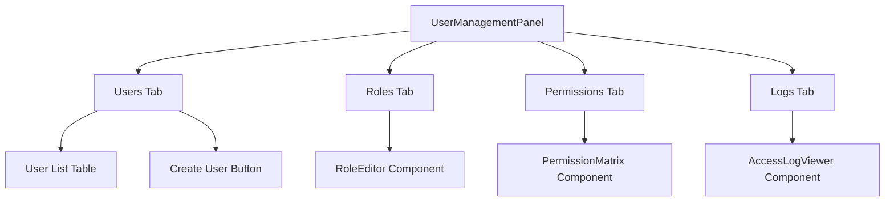
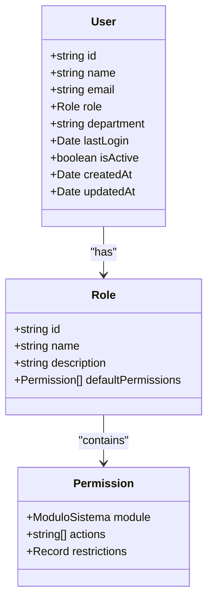
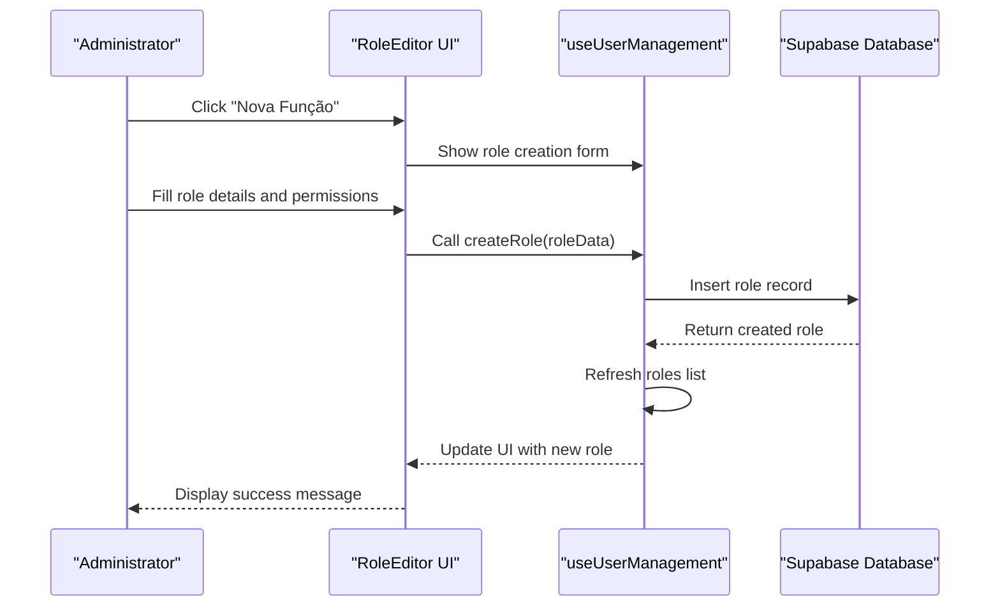
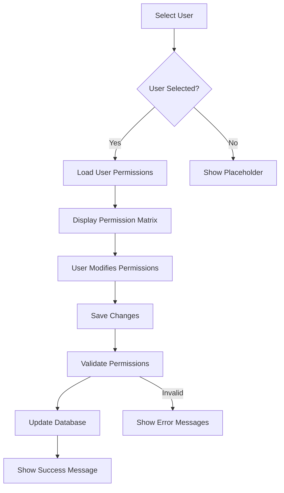
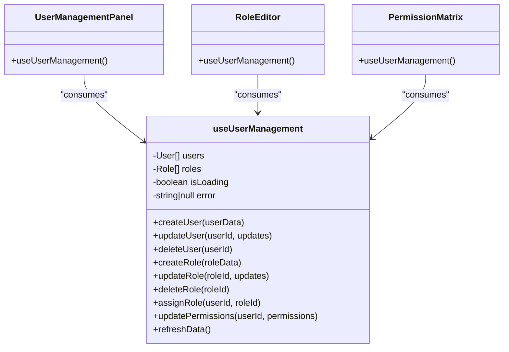
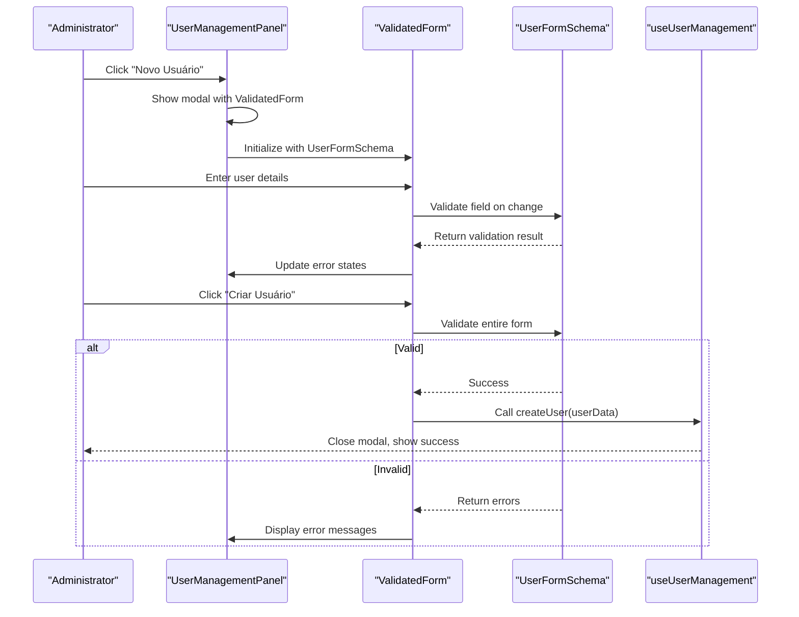

# User Management Interface

<cite>
**Referenced Files in This Document**   
- [UserManagementPanel.tsx](file://src/components/Admin/UserManagementPanel.tsx)
- [useUserManagement.ts](file://src/hooks/useUserManagement.ts)
- [RoleEditor.tsx](file://src/components/Admin/RoleEditor.tsx)
- [PermissionMatrix.tsx](file://src/components/Admin/PermissionMatrix.tsx)
- [AccessLogViewer.tsx](file://src/components/Admin/AccessLogViewer.tsx)
- [ValidatedForm.tsx](file://src/components/Admin/ValidatedForm.tsx)
- [admin.schemas.ts](file://src/schemas/admin.schemas.ts)
- [admin.ts](file://src/types/admin.ts)
- [useAccessLogs.ts](file://src/hooks/useAccessLogs.ts)
</cite>

## Table of Contents
1. [Introduction](#introduction)
2. [Tab-Based Navigation System](#tab-based-navigation-system)
3. [Responsive User Listing Table](#responsive-user-listing-table)
4. [Role Assignment Workflow](#role-assignment-workflow)
5. [Permission Matrix Visualization](#permission-matrix-visualization)
6. [Inline Edit/Delete Functionality](#inline-editdelete-functionality)
7. [State Management with useUserManagement Hook](#state-management-with-useusermanagement-hook)
8. [User Creation Modal with ValidatedForm Integration](#user-creation-modal-with-validatedform-integration)
9. [Real-Time Feedback Mechanisms](#real-time-feedback-mechanisms)
10. [Accessibility Features](#accessibility-features)

## Introduction

The User Management Interface provides a comprehensive administrative panel for managing users, roles, permissions, and access logs within the system. Built using React with TypeScript, this interface offers a modern, responsive design with robust functionality for user administration. The core component, `UserManagementPanel`, orchestrates multiple sub-components through a tab-based navigation system, providing administrators with complete control over user accounts and their associated permissions.

The interface follows a modular architecture where each functional area is encapsulated in its own component, promoting reusability and maintainability. State management is centralized through the `useUserManagement` custom hook, which handles all data operations with the backend via Supabase. Form validation is implemented through the `ValidatedForm` component, ensuring data integrity before submission to the server.

This documentation details the key features and implementation patterns of the User Management Interface, focusing on the tab-based navigation, responsive table design, role assignment workflow, permission matrix visualization, inline editing capabilities, state management approach, modal-based user creation, real-time feedback mechanisms, and accessibility features.

## Tab-Based Navigation System

The User Management Panel implements a tab-based navigation system that organizes user management functionality into four distinct sections: Users, Roles, Permissions, and Logs. This navigation pattern provides a clean, intuitive interface that allows administrators to quickly switch between different aspects of user management without losing context.



**Diagram sources**
- [UserManagementPanel.tsx](file://src/components/Admin/UserManagementPanel.tsx#L13-L339)

**Section sources**
- [UserManagementPanel.tsx](file://src/components/Admin/UserManagementPanel.tsx#L13-L339)

The tab system is implemented using a simple state variable `activeTab` that tracks the currently selected tab:

```typescript
const [activeTab, setActiveTab] = useState<'users' | 'roles' | 'permissions' | 'logs'>('users');
```

Each tab is rendered as a button in a horizontal navigation bar, with visual indicators showing the active tab through border color and text styling. The component uses conditional rendering to display the appropriate content based on the active tab:

- **Users Tab**: Displays a responsive table listing all users with their basic information, role assignments, and status
- **Roles Tab**: Renders the `RoleEditor` component for managing user roles and their default permissions
- **Permissions Tab**: Displays the `PermissionMatrix` component for configuring granular permissions for individual users
- **Logs Tab**: Shows the `AccessLogViewer` component for monitoring user activities and system events

The tab headers include dynamic counters that display the current number of users and roles, providing immediate feedback about the system's state. This design follows accessibility best practices by using semantic HTML buttons for tab controls and maintaining keyboard navigability.

## Responsive User Listing Table

The user listing table in the Users tab is designed to be fully responsive, adapting to different screen sizes while maintaining usability and readability. The table displays comprehensive user information including name, email, assigned role, department, last login date, and account status.



**Diagram sources**
- [admin.ts](file://src/types/admin.ts#L1-L303)

**Section sources**
- [UserManagementPanel.tsx](file://src/components/Admin/UserManagementPanel.tsx#L13-L339)

The table implementation uses standard HTML table elements wrapped in an overflow container to ensure horizontal scrolling on smaller screens:

```jsx
<div className="overflow-x-auto">
  <table className="min-w-full divide-y divide-gray-200">
    {/* Table header and body */}
  </table>
</div>
```

Each row in the table includes inline action buttons for editing and deleting users, following the principle of direct manipulation. User names are displayed with avatars generated from the first letter of their name, enhancing visual recognition. Status indicators use color-coded badges (green for active, red for inactive) to provide immediate visual feedback about account status.

The table cells are optimized for mobile viewing with appropriate padding and whitespace. On smaller screens, less critical information can be hidden or collapsed to maintain readability. The responsive design ensures that administrators can manage users effectively from any device, whether desktop, tablet, or mobile.

## Role Assignment Workflow

The role assignment workflow is facilitated through the `RoleEditor` component, which provides a comprehensive interface for creating, editing, and managing user roles and their associated permissions. This component enables administrators to define role-based access control policies that can be assigned to multiple users.



**Diagram sources**
- [RoleEditor.tsx](file://src/components/Admin/RoleEditor.tsx#L11-L316)
- [useUserManagement.ts](file://src/hooks/useUserManagement.ts#L7-L450)

**Section sources**
- [RoleEditor.tsx](file://src/components/Admin/RoleEditor.tsx#L11-L316)

The workflow begins when an administrator clicks the "Nova Função" (New Role) button, which opens a modal form for creating a new role. The form requires a name and optional description for the role, followed by a permission matrix where administrators can configure default permissions for various system modules.

The permission matrix organizes permissions by system module (e.g., Atendimento Bar, Clientes, Funcionários) with action types (Visualizar, Criar, Editar, Excluir, Administrar) as columns. This grid layout allows for efficient configuration of role permissions through checkbox selection.

When a role is created or updated, the system validates the input data against defined schemas before persisting it to the database. If a role is deleted, the system first checks for active users assigned to that role and prevents deletion if such users exist, maintaining data integrity.

Role editing is accomplished by clicking the "Editar" button on an existing role card, which pre-fills the form with the current role data. This inline editing pattern reduces cognitive load by keeping related actions close to the data they affect.

## Permission Matrix Visualization

The Permission Matrix component provides a visual interface for configuring granular permissions for individual users, going beyond the role-based defaults to allow for customized access control. This feature enables administrators to fine-tune user permissions based on specific requirements.



**Diagram sources**
- [PermissionMatrix.tsx](file://src/components/Admin/PermissionMatrix.tsx#L10-L238)

**Section sources**
- [PermissionMatrix.tsx](file://src/components/Admin/PermissionMatrix.tsx#L10-L238)

The permission matrix is organized as a table with system modules listed as rows and permission actions as columns. Administrators select a user from a dropdown menu, which loads the user's current permissions into the matrix. Each cell contains a checkbox that represents whether the user has a specific permission for a particular module.

The interface includes several usability features:
- A summary section that displays statistics about the configured permissions (modules with full access, write access, read-only access, and no access)
- Real-time validation that prevents saving incomplete configurations
- Loading states during save operations to prevent duplicate submissions
- Clear visual feedback through color-coded permission categories

When permissions are saved, the component converts the matrix data into the format expected by the backend API and calls the `updatePermissions` function from the `useUserManagement` hook. After successful update, the interface provides feedback to the administrator and maintains the user selection for potential additional modifications.

The permission matrix supports the principle of least privilege by allowing administrators to grant only the minimum necessary permissions for each user, enhancing system security.

## Inline Edit/Delete Functionality

The User Management Interface implements inline edit and delete functionality for both users and roles, following the principle of direct manipulation. This approach allows administrators to modify data with minimal interaction steps, improving efficiency and user experience.

For users, the inline actions are available directly in the user listing table:

```jsx
<td className="px-6 py-4 whitespace-nowrap text-sm font-medium">
  <button
    onClick={() => setSelectedUser(user)}
    className="text-blue-600 hover:text-blue-900 mr-3"
  >
    Editar
  </button>
  <button
    onClick={() => handleDeleteUser(user.id)}
    className="text-red-600 hover:text-red-800"
  >
    Excluir
  </button>
</td>
```

Clicking the "Editar" button does not open a separate page but rather pre-fills the user creation modal with the existing user data, effectively transforming it into an edit form. This design pattern conserves screen space and maintains context.

The delete functionality includes a confirmation dialog to prevent accidental deletions:

```javascript
if (window.confirm('Tem certeza que deseja excluir este usuário?')) {
  try {
    await deleteUser(userId);
  } catch (error) {
    console.error('Erro ao excluir usuário:', error);
  }
}
```

For roles, similar inline actions are available on each role card in the Role Editor:

```jsx
<div className="flex space-x-2">
  <button
    onClick={() => handleEditRole(role)}
    className="text-blue-600 hover:text-blue-800 text-sm"
  >
    Editar
  </button>
  <button
    onClick={() => handleDeleteRole(role.id)}
    className="text-red-600 hover:text-red-800 text-sm"
  </>
```

The delete operation for roles includes additional safety checks to prevent deletion of roles that are currently assigned to active users, enforcing referential integrity at the application level.

These inline actions follow accessibility guidelines by using semantic HTML buttons with appropriate labels and supporting keyboard navigation. Visual feedback is provided through hover states and loading indicators during asynchronous operations.

**Section sources**
- [UserManagementPanel.tsx](file://src/components/Admin/UserManagementPanel.tsx#L13-L339)
- [RoleEditor.tsx](file://src/components/Admin/RoleEditor.tsx#L11-L316)

## State Management with useUserManagement Hook

The `useUserManagement` custom hook serves as the central state management solution for the User Management Interface, encapsulating all data operations and state logic. This hook follows the custom hook pattern in React, promoting code reuse and separation of concerns.



**Diagram sources**
- [useUserManagement.ts](file://src/hooks/useUserManagement.ts#L7-L450)

**Section sources**
- [useUserManagement.ts](file://src/hooks/useUserManagement.ts#L7-L450)

The hook manages several pieces of state:
- `users`: Array of User objects representing all users in the current organization
- `roles`: Array of Role objects representing all available roles
- `isLoading`: Boolean indicating whether data operations are in progress
- `error`: String containing error messages from failed operations

It exposes a comprehensive API for user and role management operations, each returning promises to support async/await syntax. All operations are implemented with proper error handling and include audit logging through the `AuthorizationMiddleware`.

The hook uses React's `useCallback` to memoize functions and prevent unnecessary re-renders. It also implements automatic data loading when the organization context changes, ensuring the interface always displays up-to-date information.

Data persistence is handled through Supabase, with appropriate SELECT queries to retrieve user and role data, and INSERT/UPDATE/DELETE operations for modifications. The hook abstracts the complexity of database interactions, providing a clean, Promise-based API to the consuming components.

## User Creation Modal with ValidatedForm Integration

The user creation functionality is implemented as a modal form that integrates with the `ValidatedForm` component for robust client-side validation. This approach provides a seamless user experience while ensuring data quality before submission to the server.



**Diagram sources**
- [UserManagementPanel.tsx](file://src/components/Admin/UserManagementPanel.tsx#L13-L339)
- [ValidatedForm.tsx](file://src/components/Admin/ValidatedForm.tsx#L1-L405)
- [admin.schemas.ts](file://src/schemas/admin.schemas.ts#L1-L312)

**Section sources**
- [UserManagementPanel.tsx](file://src/components/Admin/UserManagementPanel.tsx#L13-L339)

The modal is triggered by clicking the "Novo Usuário" button and displays a form with fields for:
- Name (required, minimum 2 characters)
- Email (required, valid email format)
- Department (optional)
- Role (required, selected from available roles)
- Active status (checkbox with default true)

The `ValidatedForm` component wraps the entire form and manages form state, validation, and submission. It receives a Zod schema (`UserFormSchema`) that defines the validation rules for each field. Field-level validation occurs as the user types, providing immediate feedback, while final validation is performed on form submission.

The integration between `ValidatedForm` and `useUserManagement` is seamless—the form automatically calls the `createUser` function when validation passes, and propagates any server-side errors back to the form for display. This creates a cohesive error handling experience where both client-side and server-side validation messages are presented in the same location.

After successful user creation, the modal closes automatically, and the user list refreshes to include the new user. The form state is reset to prepare for potential creation of additional users.

## Real-Time Feedback Mechanisms

The User Management Interface incorporates several real-time feedback mechanisms to keep administrators informed about the system state and the results of their actions. These mechanisms enhance usability by providing immediate responses to user interactions.

Loading states are implemented throughout the interface to indicate when operations are in progress:

```jsx
if (isLoading) {
  return (
    <div className="flex items-center justify-center p-8">
      <div className="animate-spin rounded-full h-8 w-8 border-b-2 border-blue-600"></div>
    </div>
  );
}
```

This spinner appears when initially loading data or during any data modification operation, preventing user confusion about system responsiveness.

Error handling is comprehensive and user-friendly:

```jsx
if (error) {
  return (
    <div className="bg-red-50 border border-red-200 rounded-md p-4">
      <p className="text-red-800">Erro: {error}</p>
    </div>
  );
}
```

Errors are displayed prominently with appropriate styling, and detailed error messages are logged to the console for debugging purposes.

Form validation provides real-time feedback as users interact with input fields:

```jsx
<ValidatedInput
  label="Nome"
  required
  value={data.name}
  onChange={(value) => updateField('name', value)}
  error={getFieldError('name')}
  placeholder="Digite o nome completo"
/>
```

The `ValidatedForm` component clears field errors when users begin typing, encouraging correction of invalid entries. Submit buttons are disabled during submission to prevent duplicate operations, with visual indication of the loading state ("Criando...").

Success feedback is provided implicitly through interface updates—when operations succeed, the relevant data displays update automatically, confirming the change without requiring additional notifications.

For destructive operations like user deletion, confirmation dialogs provide a safety net against accidental actions:

```javascript
if (window.confirm('Tem certeza que deseja excluir este usuário?')) {
  // Proceed with deletion
}
```

These feedback mechanisms work together to create a responsive, predictable interface that keeps administrators informed about the consequences of their actions.

**Section sources**
- [UserManagementPanel.tsx](file://src/components/Admin/UserManagementPanel.tsx#L13-L339)
- [ValidatedForm.tsx](file://src/components/Admin/ValidatedForm.tsx#L1-L405)

## Accessibility Features

The User Management Interface incorporates several accessibility features to ensure it can be used effectively by administrators with various abilities and assistive technologies. These features follow Web Content Accessibility Guidelines (WCAG) to provide an inclusive user experience.

Keyboard navigation is fully supported throughout the interface. All interactive elements are focusable and can be operated using keyboard inputs:
- Tab key navigates between interactive elements in logical order
- Enter key activates buttons and form submission
- Arrow keys navigate within the permission matrix checkboxes
- Escape key closes modal dialogs

Semantic HTML is used to provide proper structure and meaning:
- Buttons are used for all actionable elements rather than divs or spans
- Form fields have associated labels using the htmlFor/id relationship
- Required fields are marked with asterisks and aria-required attributes
- Status messages use appropriate ARIA live regions for screen readers

Color contrast meets WCAG standards, with sufficient contrast between text and background colors. Visual indicators are supplemented with text labels to ensure information is not conveyed by color alone.

The interface includes several specific accessibility enhancements:
- Focus indicators are visible on interactive elements
- Skip links could be added to allow bypassing repetitive navigation
- Aria-labels are used for icons and other non-text elements
- Dynamic content updates are announced by screen readers
- Form validation errors are programmatically associated with their respective fields

The modal dialogs are implemented as accessible overlays that trap focus within the modal content and can be dismissed with the Escape key. When a modal opens, focus is set to the first interactive element, and when it closes, focus returns to the element that opened it.

These accessibility features ensure that the User Management Interface can be used effectively by all administrators, regardless of their preferred interaction method or assistive technology requirements.

**Section sources**
- [UserManagementPanel.tsx](file://src/components/Admin/UserManagementPanel.tsx#L13-L339)
- [ValidatedForm.tsx](file://src/components/Admin/ValidatedForm.tsx#L1-L405)