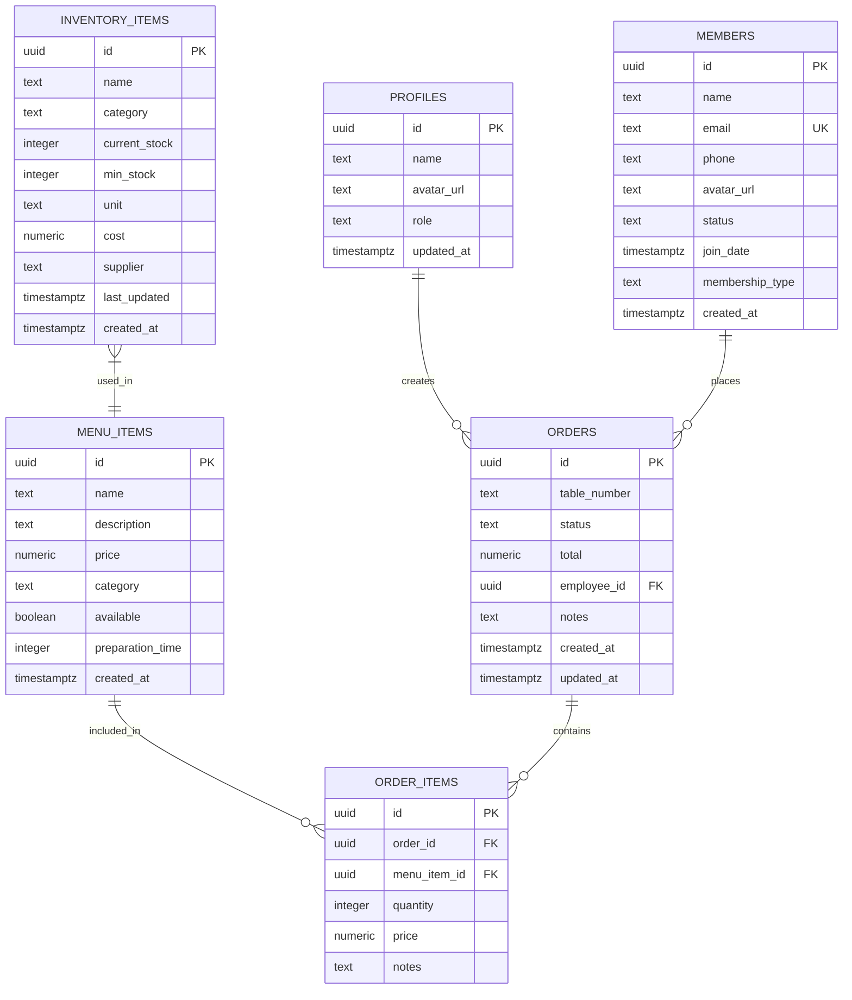
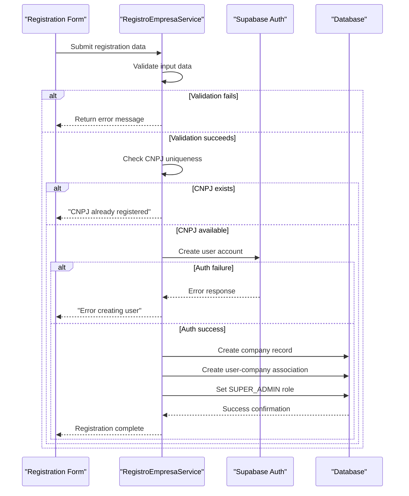

# Installation & Setup

<cite>
**Referenced Files in This Document**   
- [README.md](file://README.md)
- [SETUP_DATABASE.md](file://SETUP_DATABASE.md)
- [CASH_MANAGEMENT_README.md](file://CASH_MANAGEMENT_README.md)
- [.env.example](file://.env.example)
- [supabase/config.toml](file://supabase/config.toml)
- [src/services/registroEmpresaService.ts](file://src/services/registroEmpresaService.ts)
- [src/services/admin-setup-service.ts](file://src/services/admin-setup-service.ts)
- [supabase/migrations/20250729000000_initial_schema.sql](file://supabase/migrations/20250729000000_initial_schema.sql)
- [app-garcom/src/services/SupabaseService.ts](file://app-garcom/src/services/SupabaseService.ts)
</cite>

## Table of Contents
1. [Prerequisites](#prerequisites)
2. [Repository Cloning and Dependency Installation](#repository-cloning-and-dependency-installation)
3. [Environment Configuration](#environment-configuration)
4. [Supabase Database Setup](#supabase-database-setup)
5. [Multi-Tenant System Initialization](#multi-tenant-system-initialization)
6. [Development and Production Configuration](#development-and-production-configuration)
7. [Troubleshooting Common Issues](#troubleshooting-common-issues)
8. [Verification Steps](#verification-steps)

## Prerequisites

Before beginning the installation process, ensure you have the following prerequisites installed on your system:
- Node.js (version 18 or higher)
- npm (Node Package Manager) or yarn
- Supabase CLI (for local database management)
- A Supabase account for cloud deployment

These tools are essential for running the AABB-system application and managing its database components.

## Repository Cloning and Dependency Installation

To begin setting up the AABB-system, first clone the repository from its source control location:

```bash
git clone https://github.com/example/AABB-system.git
cd AABB-system
```

After cloning the repository, install the required dependencies using npm:

```bash
npm install
```

This command will read the `package.json` file and install all necessary packages listed under dependencies and devDependencies. The installation includes frontend libraries, testing frameworks, build tools, and integration packages required for the application to function properly.

For the mobile companion application located in the `app-garcom` directory, navigate to that folder and install its specific dependencies:

```bash
cd app-garcom
npm install
```

Once all dependencies are installed, you can start the development server with:

```bash
npm run dev
```

This will launch the application on the default port, typically accessible at `http://localhost:3000`.

**Section sources**
- [package.json](file://package.json)
- [app-garcom/package.json](file://app-garcom/package.json)

## Environment Configuration

The AABB-system requires proper environment configuration to connect with the Supabase backend. Follow these steps to set up your environment variables:

1. Create a `.env` file in the root directory of the project by copying the example file:
```bash
cp .env.example .env
```

2. Open the `.env` file and configure the following variables with your Supabase project credentials:

```env
VITE_SUPABASE_URL=https://your-project.supabase.co
VITE_SUPABASE_ANON_KEY=your-anon-key-here
```

To obtain these credentials:
- Log in to your Supabase dashboard at [https://app.supabase.com](https://app.supabase.com)
- Select your project or create a new one
- Navigate to **Settings** → **API**
- Copy the **Project URL** to `VITE_SUPABASE_URL`
- Copy the **anon public** key to `VITE_SUPABASE_ANON_KEY`

The environment configuration enables the application to communicate securely with the Supabase authentication and database services. These variables are used throughout the application to establish connections and authenticate requests.

**Section sources**
- [.env.example](file://.env.example)
- [README.md](file://README.md#L65-L75)

## Supabase Database Setup

Setting up the database is a critical step in the installation process. The AABB-system uses Supabase as its backend, requiring specific migrations to be applied to create the necessary database schema.

### Migration Process

The database schema is managed through SQL migration files located in the `supabase/migrations/` directory. To apply these migrations:

1. Using the Supabase CLI, push the local schema to your database:
```bash
supabase db push
```

2. Alternatively, manually execute the migration files in the correct order through the Supabase SQL Editor:
   - `20250729000000_initial_schema.sql`
   - `20250831000001_menu_management_module.sql`
   - `20250901000001_direct_inventory_items_support.sql`
   - `20250901000002_bar_attendance_system.sql`
   - `20250902000001_inventory_available_for_sale.sql`
   - `20250908000001_cash_management_system.sql`

The initial schema migration (`20250729000000_initial_schema.sql`) creates the foundational tables including profiles, members, inventory_items, menu_items, orders, and order_items. It also establishes Row Level Security (RLS) policies to protect data access and sets up triggers for automatic profile creation when new users register.



**Diagram sources**
- [supabase/migrations/20250729000000_initial_schema.sql](file://supabase/migrations/20250729000000_initial_schema.sql)

### Data Seeding

After applying the migrations, seed the database with initial data:

1. Access the Cozinha (Kitchen) module and add menu items
2. Navigate to Estoque (Inventory) and add products with "Disponível para venda" enabled
3. Verify that products appear in the Balcão (Counter) interface

The system will display mock data until properly configured with Supabase. Once connected, real-time synchronization ensures all data changes are immediately reflected across devices.

**Section sources**
- [SETUP_DATABASE.md](file://SETUP_DATABASE.md)
- [supabase/migrations/20250729000000_initial_schema.sql](file://supabase/migrations/20250729000000_initial_schema.sql)

## Multi-Tenant System Initialization

The AABB-system features a multi-tenant architecture that allows multiple companies to operate within the same system while maintaining data isolation. Initializing this system involves creating the first company and establishing the initial administrator user.

### Company Registration Process

The registration process is handled by the `RegistroEmpresaService` class in `src/services/registroEmpresaService.ts`. This service manages the complete workflow of company creation and first user setup.

When a new company registers:
1. Input validation checks for required fields (company name, CNPJ, admin name, email, password)
2. CNPJ format validation using standard Brazilian business identifier rules
3. Email format validation
4. Password strength verification (minimum 8 characters)
5. Confirmation that passwords match



**Diagram sources**
- [src/services/registroEmpresaService.ts](file://src/services/registroEmpresaService.ts#L15-L227)

### First Admin Creation

The first user of each company is automatically designated as the SUPER_ADMIN with full privileges. This process is coordinated between the `RegistroEmpresaService` and `AdminSetupService` classes.

Key aspects of first admin creation:
- Automatic assignment of SUPER_ADMIN role
- Creation of default company configurations
- Establishment of complete permission sets across all modules
- Initialization of security settings and backup policies
- Setup of notification preferences

The `admin-setup-service.ts` file contains logic that detects when a user is the first in the system and automatically configures them as the primary administrator with maximum privileges.

**Section sources**
- [src/services/registroEmpresaService.ts](file://src/services/registroEmpresaService.ts)
- [src/services/admin-setup-service.ts](file://src/services/admin-setup-service.ts)

## Development and Production Configuration

The AABB-system supports both development and production environments with different configuration requirements and deployment strategies.

### Development Environment

For development purposes, the system can run with minimal configuration:

1. Use the demo credentials provided in the README:
   - Email: `demo@clubmanager.com`
   - Password: `demo123456`

2. Run the application locally:
```bash
npm run dev
```

3. The development server automatically loads environment variables from the `.env` file and connects to your Supabase project.

4. For testing without a database connection, the system includes fallback hooks like `useCashManagementFallback` that simulate functionality.

### Production Deployment

To deploy the application to production using Vercel:

1. Prepare environment variables:
```bash
cp .env.example .env.local
```

2. Add your Supabase credentials to `.env.local`:
```env
VITE_SUPABASE_URL=https://your-project.supabase.co
VITE_SUPABASE_ANON_KEY=your-anon-key-here
```

3. Deploy using Vercel CLI:
```bash
npm i -g vercel
vercel
```

Alternatively, connect your GitHub repository to the Vercel dashboard:
- Import your repository
- Add environment variables in project settings
- Configure automatic deployment

The project includes a `vercel.json` configuration file optimized for React SPA deployment, ensuring proper routing and asset handling in production.

**Section sources**
- [README.md](file://README.md#L115-L135)
- [vercel.json](file://vercel.json)

## Troubleshooting Common Issues

This section addresses common setup problems and their solutions.

### Connection Errors

**Symptoms**: Application shows mock data instead of real information, console errors related to Supabase connection.

**Solutions**:
1. Verify that `.env` file contains correct Supabase URL and anon key
2. Test the connection using the SupabaseService utility:
```typescript
const isConnected = await SupabaseService.testConnection();
```
3. Ensure network connectivity to `supabase.co` domains
4. Check firewall settings if behind corporate network

### Migration Failures

**Symptoms**: Database tables not created, 500 errors when accessing features.

**Solutions**:
1. Apply migrations using the Supabase CLI:
```bash
supabase db push
```
2. Verify that the Supabase CLI is authenticated:
```bash
supabase login
```
3. Check migration file order and dependencies
4. For cash management module specifically:
```bash
supabase migration up --to 20250908000001
```

### Authentication Problems

**Symptoms**: Login failures, session timeouts, permission errors.

**Solutions**:
1. Verify that Row Level Security (RLS) policies are properly enabled on all tables
2. Check that the `profiles` table has a record for the authenticated user
3. Ensure the `role` field in profiles table is correctly set
4. Validate that JWT tokens are being properly handled

For immediate troubleshooting, use the diagnostic HTML files provided in the repository:
- `debug-auth-creation.html`
- `debug-system-calls.html`
- `test-login-existing-user.html`

These tools help identify where authentication flows are breaking down.

**Section sources**
- [app-garcom/src/services/SupabaseService.ts](file://app-garcom/src/services/SupabaseService.ts#L15-L80)
- [SETUP_DATABASE.md](file://SETUP_DATABASE.md)

## Verification Steps

After completing the installation and configuration process, verify that the system is functioning correctly through these steps:

1. **Application Launch**: Confirm that `npm run dev` starts the server without errors and the application loads at `http://localhost:3000`.

2. **Supabase Connection**: Verify that environment variables are properly loaded and the application connects to your Supabase project. Check browser developer tools for any network errors.

3. **Authentication Test**: Log in using either the demo credentials or a newly registered account. Successful login should redirect to the Dashboard.

4. **Data Persistence**: Create a new menu item in the Cozinha module and verify it appears in the Bar module, confirming database write operations.

5. **Real-time Functionality**: Open the application in two browser windows and confirm that changes in one window (e.g., updating an order status) are immediately reflected in the other.

6. **Module Accessibility**: Navigate through all main modules (Dashboard, Bar, Cozinha, Estoque, Membros) to ensure they load without errors.

7. **Cash Management Verification**: If cash system migrations were applied, access the Gestão de Caixa module and verify that the Open Cash modal functions correctly.

8. **Multi-tenant Isolation**: Create test data for one company and verify that switching contexts maintains proper data separation.

Successful completion of these verification steps confirms a properly installed and configured AABB-system ready for use.

**Section sources**
- [README.md](file://README.md)
- [CASH_MANAGEMENT_README.md](file://CASH_MANAGEMENT_README.md)