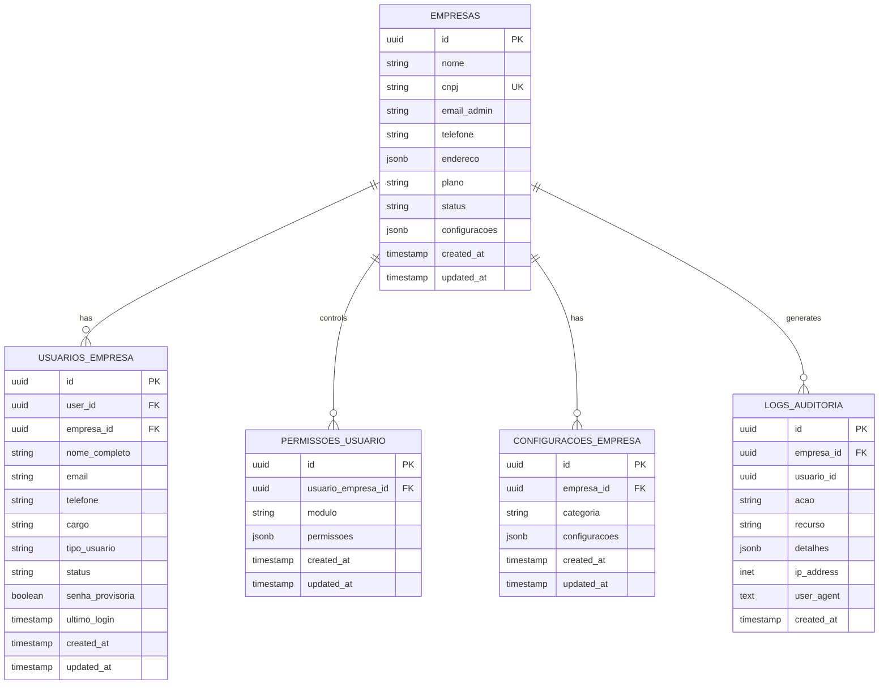
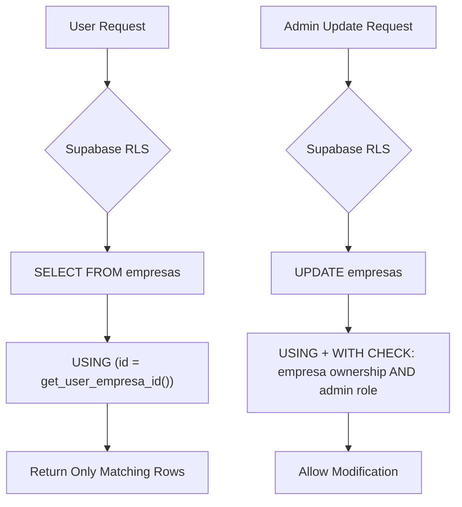
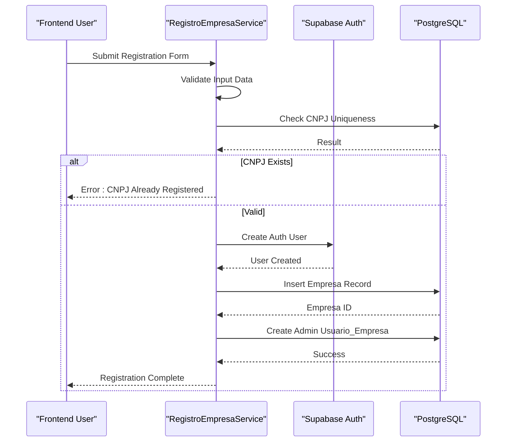
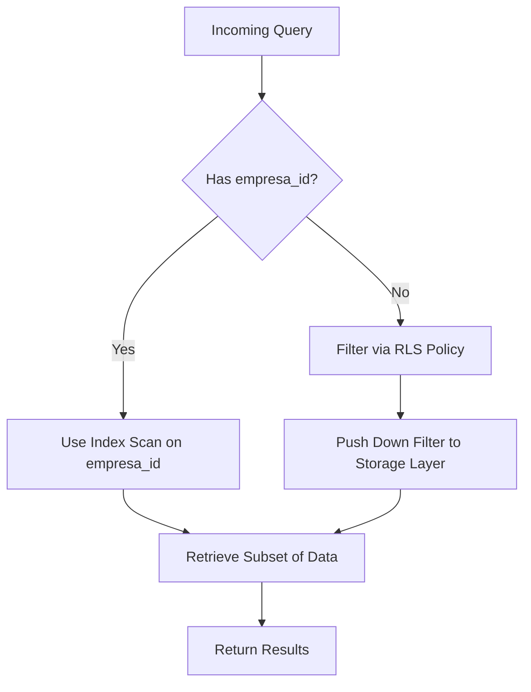

# Multi-Tenant Architecture

<cite>
**Referenced Files in This Document**   
- [20250116000001_multitenant_auth_system.sql](file://supabase/migrations/20250116000001_multitenant_auth_system.sql)
- [20250117000001_add_update_empresa_function.sql](file://supabase/migrations/20250117000001_add_update_empresa_function.sql)
- [20250117000002_fix_empresas_rls_policy.sql](file://supabase/migrations/20250117000002_fix_empresas_rls_policy.sql)
- [registroEmpresaService.ts](file://src/services/registroEmpresaService.ts)
- [authMiddleware.ts](file://src/middleware/authMiddleware.ts)
</cite>

## Table of Contents
1. [Introduction](#introduction)
2. [Schema Design for Multi-Tenancy](#schema-design-for-multi-tenancy)
3. [Data Isolation Strategy with Row Level Security](#data-isolation-strategy-with-row-level-security)
4. [Tenant Identification and Request Context Propagation](#tenant-identification-and-request-context-propagation)
5. [Company Registration and Configuration Workflow](#company-registration-and-configuration-workflow)
6. [Security Measures Against Cross-Tenant Access](#security-measures-against-cross-tenant-access)
7. [Performance Considerations and Indexing Strategies](#performance-considerations-and-indexing-strategies)
8. [Migration Challenges in Multi-Tenant Schema Evolution](#migration-challenges-in-multi-tenant-schema-evolution)
9. [Extending Tenant-Specific Features with Isolation Guarantees](#extending-tenant-specific-features-with-isolation-guarantees)
10. [Conclusion](#conclusion)

## Introduction
The AABB-system implements a multi-tenant architecture using Supabase PostgreSQL, enabling multiple companies to operate within a single application instance while maintaining strict data isolation. This document details the architectural approach, focusing on Row Level Security (RLS) policies, tenant identification via `empresa_id`, request context propagation, schema design, security enforcement, performance optimization, migration strategies, and extensibility patterns.

**Section sources**
- [20250116000001_multitenant_auth_system.sql](file://supabase/migrations/20250116000001_multitenant_auth_system.sql#L1-L217)

## Schema Design for Multi-Tenancy
The database schema is designed around tenant-specific tables that are logically isolated by the `empresa_id` field. Core entities include:
- **empresas**: Stores company metadata such as name, CNPJ, contact information, plan type, and status.
- **usuarios_empresa**: Associates authenticated users with their respective companies, including role and employment status.
- **permissoes_usuario**: Defines granular permissions per user and module.
- **configuracoes_empresa**: Holds configuration settings scoped to each company.
- **logs_auditoria**: Captures audit logs tied to specific tenants.

All tenant-related tables contain an `empresa_id` foreign key referencing the `empresas` table, ensuring referential integrity and enabling RLS-based filtering.

**Diagram sources**
- [20250116000001_multitenant_auth_system.sql](file://supabase/migrations/20250116000001_multitenant_auth_system.sql#L1-L217)

**Section sources**
- [20250116000001_multitenant_auth_system.sql](file://supabase/migrations/20250116000001_multitenant_auth_system.sql#L1-L217)

## Data Isolation Strategy with Row Level Security
Row Level Security (RLS) is enforced across all tenant-sensitive tables to ensure data isolation. The system uses a central function `get_user_empresa_id()` that retrieves the current user's associated `empresa_id` from the `usuarios_empresa` table based on the authenticated `auth.uid()`.

Each table has RLS policies configured:
- **empresas**: Users can only SELECT rows where `id = get_user_empresa_id()`. Administrators can UPDATE only their own company.
- **usuarios_empresa**: Users can view colleagues within the same company (`empresa_id = get_user_empresa_id()`). Only administrators can manage users.
- **permissoes_usuario**, **configuracoes_empresa**, **logs_auditoria**: All access is filtered by `empresa_id`.

These policies prevent any cross-tenant queries unless explicitly permitted through administrative roles.

**Diagram sources**
- [20250116000001_multitenant_auth_system.sql](file://supabase/migrations/20250116000001_multitenant_auth_system.sql#L1-L217)
- [20250117000002_fix_empresas_rls_policy.sql](file://supabase/migrations/20250117000002_fix_empresas_rls_policy.sql#L1-L35)

**Section sources**
- [20250116000001_multitenant_auth_system.sql](file://supabase/migrations/20250116000001_multitenant_auth_system.sql#L1-L217)
- [20250117000002_fix_empresas_rls_policy.sql](file://supabase/migrations/20250117000002_fix_empresas_rls_policy.sql#L1-L35)

## Tenant Identification and Request Context Propagation
Tenant identification is achieved through the `empresa_id` field stored in the `usuarios_empresa` table. Upon authentication, the backend resolves the user’s `empresa_id` using `auth.uid()` and propagates it throughout the request lifecycle.

This context is used in:
- RLS policy evaluation via `get_user_empresa_id()`
- Application-level middleware checks
- Audit logging to associate actions with the correct tenant

The `authMiddleware.ts` ensures that every protected route validates both authentication and tenant membership before allowing access.

**Section sources**
- [authMiddleware.ts](file://src/middleware/authMiddleware.ts#L1-L329)
- [20250116000001_multitenant_auth_system.sql](file://supabase/migrations/20250116000001_multitenant_auth_system.sql#L1-L217)

## Company Registration and Configuration Workflow
New companies are registered through the `RegistroEmpresaService.registrarEmpresa()` method, which orchestrates:
1. Input validation (CNPJ, email, password strength)
2. CNPJ uniqueness check
3. User creation via Supabase Auth
4. Company record insertion into `empresas`
5. First user assignment as administrator in `usuarios_empresa`

Post-registration, the system initializes default configurations and triggers an onboarding flow for setup completion.

**Diagram sources**
- [registroEmpresaService.ts](file://src/services/registroEmpresaService.ts#L1-L227)

**Section sources**
- [registroEmpresaService.ts](file://src/services/registroEmpresaService.ts#L1-L227)

## Security Measures Against Cross-Tenant Access
To prevent unauthorized cross-tenant access:
- All sensitive tables have RLS enabled with strict `empresa_id` filtering.
- Administrative operations require explicit role checks (`tipo_usuario = 'administrador'`).
- Database functions like `update_empresa_data()` validate user permissions before execution.
- Policies use both `USING` and `WITH CHECK` clauses to enforce consistency during reads and writes.
- Audit logs capture all critical operations with `empresa_id`, `usuario_id`, IP, and user agent.

Additionally, application-layer middleware reinforces these rules by validating permissions before processing requests.

**Section sources**
- [20250116000001_multitenant_auth_system.sql](file://supabase/migrations/20250116000001_multitenant_auth_system.sql#L1-L217)
- [20250117000001_add_update_empresa_function.sql](file://supabase/migrations/20250117000001_add_update_empresa_function.sql#L1-L60)
- [authMiddleware.ts](file://src/middleware/authMiddleware.ts#L1-L329)

## Performance Considerations and Indexing Strategies
To maintain query performance under multi-tenancy:
- Indexes are created on all `empresa_id` columns for fast filtering.
- Composite indexes support common access patterns (e.g., `idx_usuarios_empresa_user_id`).
- The `get_user_empresa_id()` function benefits from indexed lookups on `user_id`.
- Queries automatically leverage RLS pushdowns, reducing result set size early in execution.

Regular monitoring of slow queries and index usage is recommended, especially as tenant count grows.

**Diagram sources**
- [20250116000001_multitenant_auth_system.sql](file://supabase/migrations/20250116000001_multitenant_auth_system.sql#L1-L217)

**Section sources**
- [20250116000001_multitenant_auth_system.sql](file://supabase/migrations/20250116000001_multitenant_auth_system.sql#L1-L217)

## Migration Challenges in Multi-Tenant Schema Evolution
Schema migrations must preserve tenant isolation and avoid downtime:
- Migrations are versioned and applied atomically using Supabase’s migration system.
- Changes to RLS policies require careful testing to avoid accidental exposure.
- Adding new tenant-scoped tables requires corresponding RLS policies.
- Altering existing policies (e.g., `fix_empresas_rls_policy.sql`) must maintain backward compatibility.

Automated tests verify RLS behavior post-migration, and rollback scripts are prepared for critical changes.

**Section sources**
- [20250117000002_fix_empresas_rls_policy.sql](file://supabase/migrations/20250117000002_fix_empresas_rls_policy.sql#L1-L35)
- [20250116000001_multitenant_auth_system.sql](file://supabase/migrations/20250116000001_multitenant_auth_system.sql#L1-L217)

## Extending Tenant-Specific Features with Isolation Guarantees
When extending the system with new tenant-specific features:
1. New tables must include `empresa_id` and enable RLS.
2. INSERT/UPDATE operations must respect `WITH CHECK` policies.
3. Application code should use Supabase client filters aligned with RLS conditions.
4. Permission checks should be duplicated at both database and application layers.
5. Use modular permission definitions (e.g., `ModulePermissions`) to allow fine-grained control.

This ensures that new functionality inherits the same isolation guarantees as core modules.

**Section sources**
- [authMiddleware.ts](file://src/middleware/authMiddleware.ts#L1-L329)
- [20250116000001_multitenant_auth_system.sql](file://supabase/migrations/20250116000001_multitenant_auth_system.sql#L1-L217)

## Conclusion
The AABB-system successfully implements a secure, scalable multi-tenant architecture using Supabase PostgreSQL and Row Level Security. By leveraging `empresa_id` for tenant identification, enforcing strict RLS policies, and propagating request context consistently, the system ensures complete data isolation between companies. Combined with robust registration workflows, comprehensive auditing, and performance-aware indexing, this architecture provides a solid foundation for growth while maintaining compliance and security.