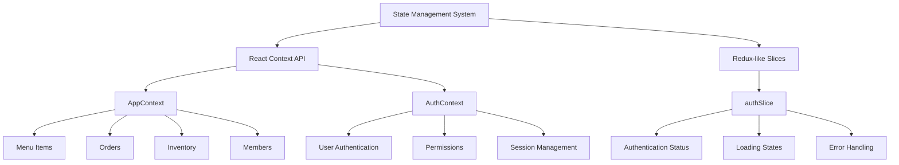
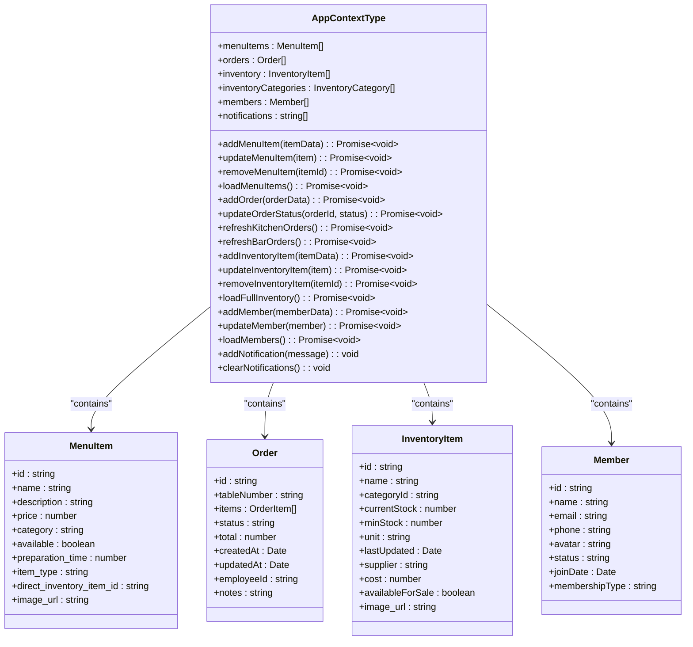
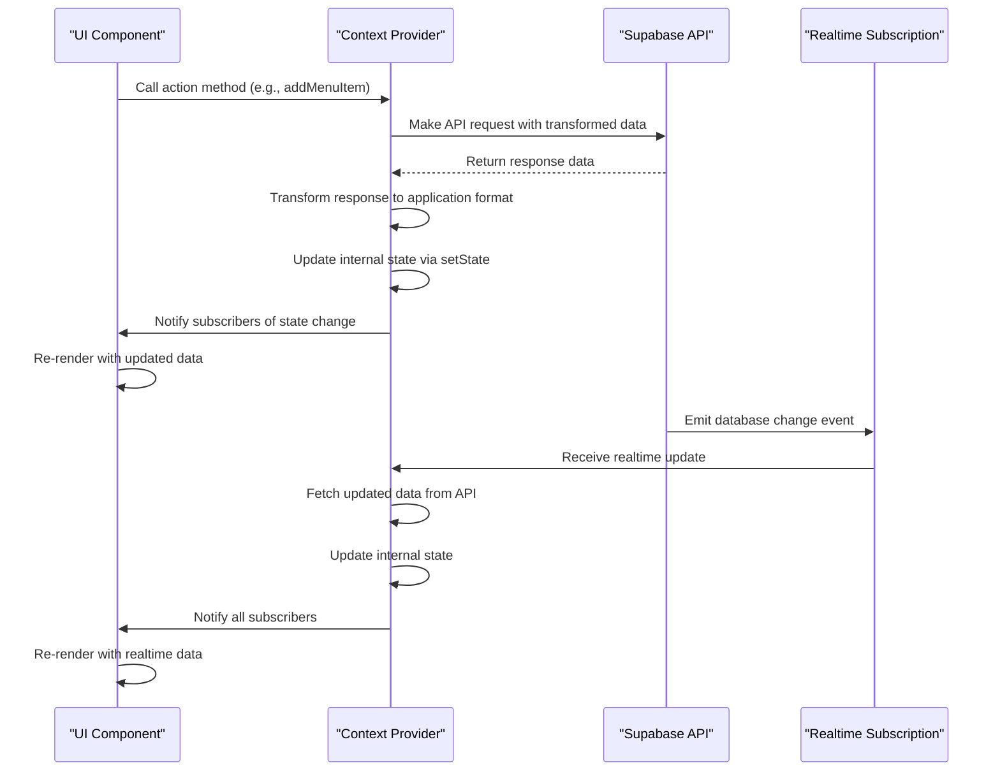
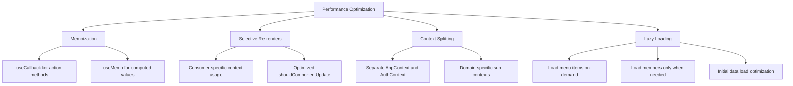
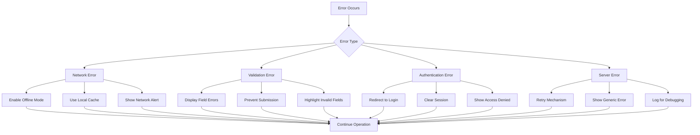
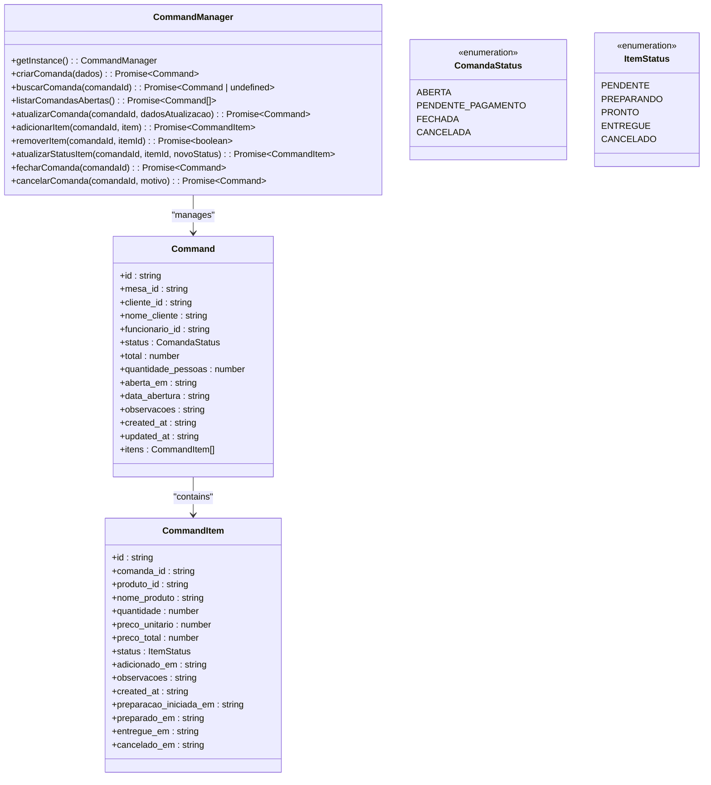

# State Management

<cite>
**Referenced Files in This Document**   
- [AppContext.tsx](file://src/contexts/AppContext.tsx)
- [AuthContext.tsx](file://src/contexts/AuthContext.tsx)
- [authSlice.ts](file://app-garcom/src/store/slices/authSlice.ts)
- [command-manager.ts](file://src/services/command-manager.ts)
</cite>

## Table of Contents
1. [Introduction](#introduction)
2. [Hybrid State Management Architecture](#hybrid-state-management-architecture)
3. [Global Context Providers](#global-context-providers)
4. [Data Flow and Real-time Updates](#data-flow-and-real-time-updates)
5. [Performance Optimization Techniques](#performance-optimization-techniques)
6. [Error Recovery and Fallback States](#error-recovery-and-fallback-states)
7. [Real-time Data Integration with Supabase](#real-time-data-integration-with-supabase)
8. [Best Practices for State Management](#best-practices-for-state-management)
9. [Conclusion](#conclusion)

## Introduction

The AABB-system implements a hybrid state management approach that combines React Context API for global application state with Redux-like slices for specific domains. This architecture provides a scalable solution for managing complex state across different parts of the application while maintaining performance and developer experience. The system is designed to handle both authentication state and application data state, with special considerations for real-time updates from Supabase and offline capabilities.

**Section sources**
- [AppContext.tsx](file://src/contexts/AppContext.tsx#L1-L50)
- [AuthContext.tsx](file://src/contexts/AuthContext.tsx#L1-L50)

## Hybrid State Management Architecture

The state management system in AABB-system employs a dual-strategy approach, leveraging the strengths of both React Context API and Redux patterns. For global application state that needs to be accessed across multiple components, the system uses React Context providers. For domain-specific state that requires complex state transitions and side effects, the system implements Redux-like slices using Redux Toolkit.

This hybrid approach allows the application to maintain a clean separation of concerns while optimizing performance. The Context API handles broad application state such as user authentication, permissions, and high-level UI state, while Redux slices manage more focused domains like authentication flows in the mobile app component.



**Diagram sources**
- [AppContext.tsx](file://src/contexts/AppContext.tsx#L89-L123)
- [AuthContext.tsx](file://src/contexts/AuthContext.tsx#L20-L36)
- [authSlice.ts](file://app-garcom/src/store/slices/authSlice.ts#L124-L129)

**Section sources**
- [AppContext.tsx](file://src/contexts/AppContext.tsx#L1-L150)
- [AuthContext.tsx](file://src/contexts/AuthContext.tsx#L1-L50)
- [authSlice.ts](file://app-garcom/src/store/slices/authSlice.ts#L1-L150)

## Global Context Providers

The system implements two primary context providers: AppContext and AuthContext. These providers serve as the foundation for global state management across the application.

### AppContext Provider

The AppContext provider manages the core application state including menu items, orders, inventory, members, and notifications. It exposes methods for CRUD operations on these entities and maintains real-time subscriptions to database changes through Supabase.

The context shape includes:
- **menuItems**: Array of MenuItem objects representing the restaurant's menu
- **orders**: Array of Order objects tracking current orders
- **inventory**: Array of InventoryItem objects for stock management
- **members**: Array of Member objects for customer loyalty programs
- **notifications**: Array of strings for user notifications
- Various action methods for state manipulation (add, update, remove)



**Diagram sources**
- [AppContext.tsx](file://src/contexts/AppContext.tsx#L89-L123)

### AuthContext Provider

The AuthContext provider manages authentication state, user permissions, and session management. It handles the complete authentication lifecycle including login, logout, and permission validation.

The context shape includes:
- **user**: Current authenticated user object or null
- **permissions**: UserPermissions object containing role-based access control
- **loading**: Boolean indicating authentication loading state
- **error**: String containing any authentication errors
- Action methods for authentication operations
- Utility methods for permission checking

```mermaid
classDiagram
class AuthContextType {
+user : any | null
+permissions : UserPermissions | null
+loading : boolean
+error : string | null
+login(email, password) : Promise~{success : boolean; error? : string}~
+logout() : Promise~void~
+refreshPermissions() : Promise~void~
+hasPermission(module, action) : boolean
+isAdmin() : boolean
+canManageEmployees() : boolean
}
class UserPermissions {
+role : string
+isActive : boolean
+hasSystemAccess : boolean
+permissions : object
}
AuthContextType --> UserPermissions : "contains"
```

**Diagram sources**
- [AuthContext.tsx](file://src/contexts/AuthContext.tsx#L20-L36)

**Section sources**
- [AppContext.tsx](file://src/contexts/AppContext.tsx#L89-L123)
- [AuthContext.tsx](file://src/contexts/AuthContext.tsx#L20-L36)

## Data Flow and Real-time Updates

The state management system implements a comprehensive data flow that connects API responses to context updates and ultimately to component rendering. This flow ensures that all parts of the application remain synchronized with the latest data from the backend.

### Data Flow Process

The data flow follows a consistent pattern across the application:

1. **API Request**: Components initiate actions that trigger API calls
2. **Response Handling**: API responses are processed and transformed
3. **State Update**: Context state is updated via setState functions
4. **Component Re-render**: Components consuming the context re-render with new data
5. **Real-time Updates**: Supabase subscriptions push updates to keep state current



**Diagram sources**
- [AppContext.tsx](file://src/contexts/AppContext.tsx#L139-L491)
- [AuthContext.tsx](file://src/contexts/AuthContext.tsx#L52-L301)

### Real-time Subscriptions

The AppContext implements real-time subscriptions to Supabase database changes, ensuring that all clients receive immediate updates when data changes. This is particularly important for order management, where kitchen and bar staff need to see order status changes instantly.

The subscription logic includes:
- Channel creation for specific tables (orders, comanda_items, balcao_orders)
- Event handlers for INSERT, UPDATE, and DELETE operations
- Debounced refresh mechanisms to prevent excessive re-renders
- Error handling and reconnection logic

**Section sources**
- [AppContext.tsx](file://src/contexts/AppContext.tsx#L139-L491)

## Performance Optimization Techniques

The state management system incorporates several performance optimization techniques to ensure smooth application operation, especially on lower-end devices and in high-concurrency scenarios.

### Memoization and Selective Re-renders

The system leverages React's memoization capabilities to prevent unnecessary re-renders. Context consumers are optimized to only re-render when specific parts of the state they depend on have changed.

Key optimization strategies include:
- Using useCallback to memoize action functions
- Implementing lazy loading for resource-intensive data
- Splitting contexts to minimize re-renders
- Using useMemo for expensive calculations



**Diagram sources**
- [AppContext.tsx](file://src/contexts/AppContext.tsx#L139-L491)
- [AppContextOptimized.tsx](file://src/contexts/AppContextOptimized.tsx#L82-L130)

### Context Splitting Strategy

To avoid the "context hell" problem where a single context update causes all consumers to re-render, the system implements context splitting. The global state is divided into logical domains:

- **AppContext**: Manages application data (menu, orders, inventory, members)
- **AuthContext**: Manages authentication and permissions
- **PrivilegeContext**: Handles fine-grained privilege checks
- **MultitenantAuthContext**: Manages multi-tenant authentication

This separation ensures that authentication state changes don't trigger re-renders in components that only depend on menu data, and vice versa.

**Section sources**
- [AppContext.tsx](file://src/contexts/AppContext.tsx#L1-L50)
- [AuthContext.tsx](file://src/contexts/AuthContext.tsx#L1-L50)
- [PrivilegeContext.tsx](file://src/contexts/PrivilegeContext.tsx#L1-L50)

## Error Recovery and Fallback States

The state management system includes robust error recovery mechanisms and fallback states to ensure application resilience in the face of network issues, API failures, and other unexpected conditions.

### Error Handling Architecture

The system implements a multi-layered error handling approach:

1. **Local Error State**: Each context maintains its own error state
2. **Action-Level Error Handling**: Individual actions handle their specific errors
3. **Global Error Boundaries**: Component-level error boundaries prevent crashes
4. **Fallback UI States**: Predefined fallback states for critical failures



**Diagram sources**
- [AuthContext.tsx](file://src/contexts/AuthContext.tsx#L52-L301)
- [AppContext.tsx](file://src/contexts/AppContext.tsx#L139-L491)

### Fallback States Implementation

The system includes several fallback mechanisms:

- **Offline Mode**: When network connectivity is lost, the application continues to function using locally cached data
- **Demo Mode**: If Supabase configuration is missing, the application runs in demo mode with mock data
- **Graceful Degradation**: Features are disabled rather than causing application crashes
- **Automatic Recovery**: When connectivity is restored, the application synchronizes with the server

These fallback states are particularly evident in the AuthContextSimple implementation, which provides a simplified authentication flow for development and testing environments.

**Section sources**
- [AuthContextWithFallback.tsx](file://src/contexts/AuthContextWithFallback.tsx#L1-L50)
- [AuthContextSimple.tsx](file://src/contexts/AuthContextSimple.tsx#L1-L50)

## Real-time Data Integration with Supabase

The state management system is tightly integrated with Supabase to provide real-time data synchronization across all clients. This integration is crucial for the restaurant's operational efficiency, ensuring that all staff members see the same information simultaneously.

### Command Management System

A key component of the real-time integration is the CommandManager service, which handles comanda (tab) management. This service acts as an intermediary between the frontend and Supabase, providing additional business logic and validation.

The CommandManager implements:
- In-memory caching of open comandas
- Business rule enforcement for state transitions
- Automatic total recalculation
- Real-time synchronization with Supabase
- Conflict resolution for concurrent edits



**Diagram sources**
- [command-manager.ts](file://src/services/command-manager.ts#L20-L619)

### Real-time Subscription Pattern

The system implements a sophisticated real-time subscription pattern that listens to database changes and updates the application state accordingly. This pattern includes:

- Multiple subscription channels for different data types
- Debounced refresh mechanisms to prevent flickering
- Error handling and automatic reconnection
- Batch processing of related events

The AppProvider sets up subscriptions for orders, comanda_items, balcao_orders, and other critical tables, ensuring that all relevant data changes are captured and propagated to the UI.

**Section sources**
- [AppContext.tsx](file://src/contexts/AppContext.tsx#L139-L491)
- [command-manager.ts](file://src/services/command-manager.ts#L20-L619)

## Best Practices for State Management

The AABB-system state management implementation follows several best practices to ensure maintainability, scalability, and developer productivity.

### Adding New State Properties

When adding new state properties to the system, follow these guidelines:

1. **Assess Scope**: Determine if the state should be global (Context) or local (component state)
2. **Choose Appropriate Context**: Select the most specific context (AppContext vs AuthContext)
3. **Define Type Interfaces**: Create TypeScript interfaces for new state shapes
4. **Implement CRUD Methods**: Add appropriate action methods for state manipulation
5. **Add Real-time Support**: Include subscription handlers if real-time updates are needed
6. **Document Dependencies**: Update documentation to reflect new state relationships

### Avoiding Common Pitfalls

The system addresses common state management pitfalls through deliberate design choices:

- **Prop Drilling Prevention**: By using Context API, deeply nested components can access state without passing props through intermediate components
- **Context Overload Avoidance**: Through context splitting, each context remains focused on a specific domain
- **Memory Leak Prevention**: Proper cleanup of subscriptions and event listeners in useEffect cleanup functions
- **Race Condition Mitigation**: Using async/await patterns and proper loading states to prevent race conditions

### Development and Testing Considerations

The system includes several files specifically designed for testing different aspects of the state management:

- **AuthContext.test.tsx**: Tests for authentication context functionality
- **AppContextOptimized.tsx**: Optimized version of AppContext for performance testing
- **AuthContextWithFallback.tsx**: Implementation with built-in fallback mechanisms
- **MultitenantAuthContext.tsx**: Specialized context for multi-tenant authentication scenarios

These test implementations allow developers to verify state management behavior under various conditions and edge cases.

**Section sources**
- [AppContext.tsx](file://src/contexts/AppContext.tsx#L1-L50)
- [AuthContext.tsx](file://src/contexts/AuthContext.tsx#L1-L50)
- [AppContextOptimized.tsx](file://src/contexts/AppContextOptimized.tsx#L1-L50)
- [AuthContextWithFallback.tsx](file://src/contexts/AuthContextWithFallback.tsx#L1-L50)

## Conclusion

The state management system in AABB-system effectively combines React Context API and Redux-like patterns to create a robust, scalable solution for managing application state. By leveraging the strengths of both approaches, the system provides a flexible architecture that can handle complex state requirements while maintaining performance and developer experience.

The hybrid approach allows for global state management through Context providers while enabling domain-specific state management through Redux slices. Real-time integration with Supabase ensures that all clients remain synchronized, and comprehensive error recovery mechanisms provide resilience against network issues and other failures.

By following the documented best practices and avoiding common pitfalls, developers can extend and maintain the state management system effectively, ensuring the continued reliability and performance of the application.

**Section sources**
- [AppContext.tsx](file://src/contexts/AppContext.tsx#L1-L50)
- [AuthContext.tsx](file://src/contexts/AuthContext.tsx#L1-L50)
- [authSlice.ts](file://app-garcom/src/store/slices/authSlice.ts#L1-L50)
- [command-manager.ts](file://src/services/command-manager.ts#L1-L50)