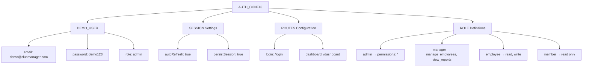
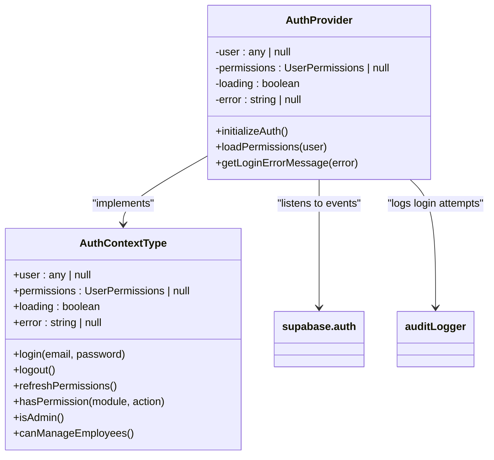
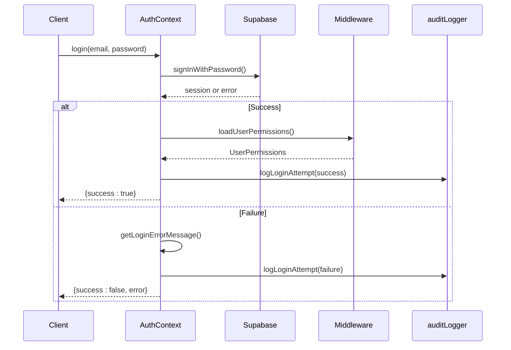
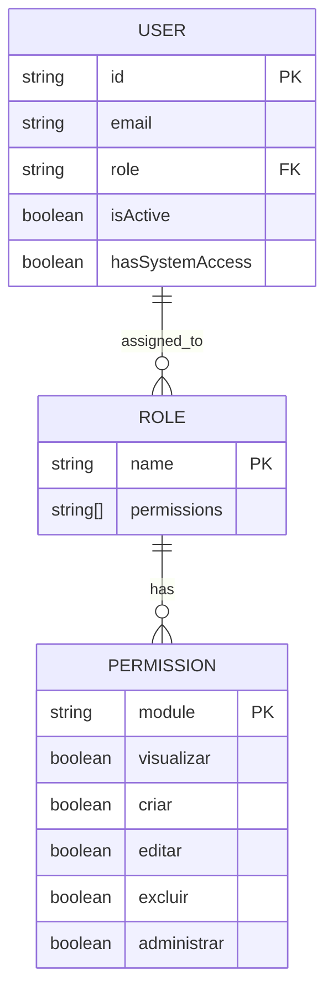
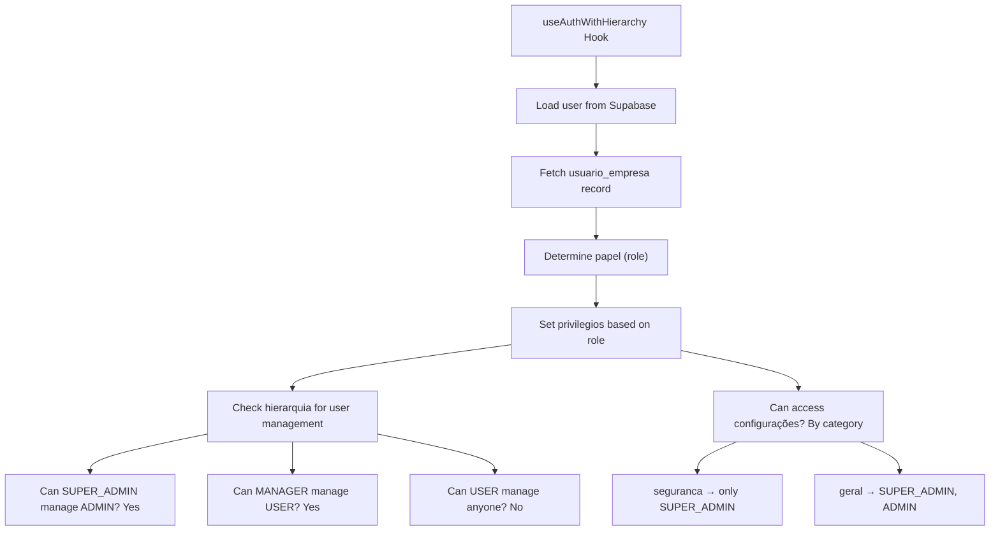
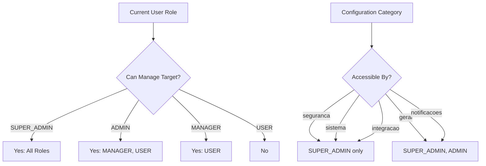
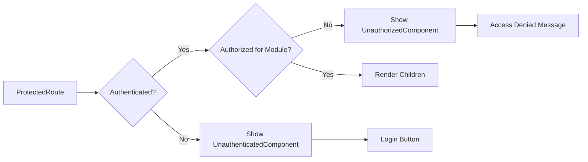

# Authentication & Authorization

<cite>
**Referenced Files in This Document**   
- [auth.ts](file://src/config/auth.ts)
- [AuthContext.tsx](file://src/contexts/AuthContext.tsx)
- [ProtectedRoute.tsx](file://src/components/Auth/ProtectedRoute.tsx)
- [useAuthWithHierarchy.ts](file://src/hooks/useAuthWithHierarchy.ts)
- [PermissionGuard.tsx](file://src/components/Auth/PermissionGuard.tsx)
- [authMiddleware.ts](file://src/middleware/authMiddleware.ts)
- [AuthErrorDisplay.tsx](file://src/components/Auth/AuthErrorDisplay.tsx)
- [ErrorBoundaryOptimized.tsx](file://src/components/Error/ErrorBoundaryOptimized.tsx)
</cite>

## Table of Contents
1. [Introduction](#introduction)
2. [Authentication Configuration](#authentication-configuration)
3. [Context-Based State Management](#context-based-state-management)
4. [Secure Login Flows and Demo Access](#secure-login-flows-and-demo-access)
5. [Role-Based Access Control](#role-based-access-control)
6. [Hierarchical Authorization with useAuthWithHierarchy](#hierarchical-authorization-with-useauthwithhierarchy)
7. [Two-Factor Employee Authentication](#two-factor-employee-authentication)
8. [Temporary Password Handling](#temporary-password-handling)
9. [Privilege Escalation Workflows](#privilege-escalation-workflows)
10. [Protected Route Implementation](#protected-route-implementation)
11. [Security Considerations in authMiddleware](#security-considerations-in-authmiddleware)
12. [Error Handling and Recovery](#error-handling-and-recovery)

## Introduction
The Authentication & Authorization system in the AABB-system is built on Supabase Auth and implements a robust, multi-layered security model. It supports secure login flows, role-based access control (RBAC), hierarchical permissions, demo mode access, and two-factor employee authentication. The system uses context-based state management via `AuthContext` and integrates tightly with protected route components to enforce access policies. Temporary password handling, privilege escalation, session validation, and error recovery are all implemented with security and usability in mind.

**Section sources**
- [AuthContext.tsx](file://src/contexts/AuthContext.tsx#L1-L362)
- [authMiddleware.ts](file://src/middleware/authMiddleware.ts#L1-L330)

## Authentication Configuration
The authentication system is configured through `auth.ts`, which defines roles, permissions, session behavior, and demo user credentials. The configuration includes predefined roles such as admin, manager, employee, and member, each with specific permission sets. Session persistence, auto-refresh, and URL-based session detection are enabled by default. Demo access allows quick testing without requiring real credentials.



**Diagram sources**
- [auth.ts](file://src/config/auth.ts#L1-L49)

**Section sources**
- [auth.ts](file://src/config/auth.ts#L1-L49)

## Context-Based State Management
The `AuthContext` provides global state management for authentication and permissions. It initializes on app load, listens for Supabase auth state changes, and maintains user data, permissions, loading state, and errors. The context exposes utility functions like `hasPermission`, `isAdmin`, and `canManageEmployees`. It also handles session validation, permission refresh, and structured error messaging during login attempts.



**Diagram sources**
- [AuthContext.tsx](file://src/contexts/AuthContext.tsx#L1-L362)

**Section sources**
- [AuthContext.tsx](file://src/contexts/AuthContext.tsx#L1-L362)

## Secure Login Flows and Demo Access
The login process validates credentials via Supabase, checks user status (active, has system access), and loads permissions. Failed attempts are logged with detailed error mapping (e.g., invalid credentials → "Email or password incorrect"). Demo access uses predefined credentials (`demo@clubmanager.com` / `demo123`) and grants full admin rights. The system prevents access for inactive users or those without system access, even if credentials are valid.



**Diagram sources**
- [AuthContext.tsx](file://src/contexts/AuthContext.tsx#L1-L362)
- [authMiddleware.ts](file://src/middleware/authMiddleware.ts#L1-L330)

**Section sources**
- [AuthContext.tsx](file://src/contexts/AuthContext.tsx#L1-L362)
- [authMiddleware.ts](file://src/middleware/authMiddleware.ts#L1-L330)

## Role-Based Access Control
Role-based access control is enforced through the `ROLES` configuration and dynamic permission evaluation. Each role has a defined set of permissions across modules like dashboard, reports, employees, and configurations. Permissions are hierarchical: admins have full access (`*`), managers can manage employees and view reports, while members have read-only access. Custom permissions can override role defaults.



**Diagram sources**
- [auth.ts](file://src/config/auth.ts#L1-L49)
- [authMiddleware.ts](file://src/middleware/authMiddleware.ts#L1-L330)

**Section sources**
- [auth.ts](file://src/config/auth.ts#L1-L49)
- [authMiddleware.ts](file://src/middleware/authMiddleware.ts#L1-L330)

## Hierarchical Authorization with useAuthWithHierarchy
The `useAuthWithHierarchy` hook extends basic authentication with tenant-specific user roles and administrative privileges. It retrieves the user’s enterprise role (SUPER_ADMIN, ADMIN, MANAGER, USER) and determines their ability to manage other users based on hierarchy. Privileges are pre-defined per role, and access to configuration categories (security, integration, etc.) is restricted accordingly.



**Diagram sources**
- [useAuthWithHierarchy.ts](file://src/hooks/useAuthWithHierarchy.ts#L1-L158)

**Section sources**
- [useAuthWithHierarchy.ts](file://src/hooks/useAuthWithHierarchy.ts#L1-L158)

## Two-Factor Employee Authentication
While not explicitly implemented as TOTP, the system supports a two-step employee creation and activation flow. Employees are created with temporary passwords and must change them on first login. The `SenhaProvisionariaGuard` ensures that users with temporary passwords cannot access regular functionality until they update their credentials. This acts as a form of post-login verification.

**Section sources**
- [SenhaProvisionariaGuard.tsx](file://src/components/Auth/SenhaProvisionariaGuard.tsx)
- [FirstLoginPasswordChange.tsx](file://src/components/Auth/FirstLoginPasswordChange.tsx)

## Temporary Password Handling
Temporary passwords are used during initial employee setup. When a user logs in with a temporary password, the system redirects them to a mandatory password change screen (`AlterarSenhaProvisoria`). The `PasswordChangeRequired` component enforces this flow. Once changed, the temporary flag is cleared, and full access is granted. This prevents long-term use of weak or default credentials.

**Section sources**
- [PasswordChangeRequired.tsx](file://src/components/Auth/PasswordChangeRequired.tsx)
- [AlterarSenhaProvisoria.tsx](file://src/pages/Auth/AlterarSenhaProvisoria.tsx)

## Privilege Escalation Workflows
Privilege escalation is controlled through role assignment and hierarchical rules. Only higher-level roles (e.g., SUPER_ADMIN) can assign elevated privileges. The `podeGerenciarUsuario` function checks whether the current user can manage a target user based on role hierarchy. Similarly, `podeAcessarConfiguracao` restricts access to sensitive settings like security and integration to top-tier roles only.



**Diagram sources**
- [useAuthWithHierarchy.ts](file://src/hooks/useAuthWithHierarchy.ts#L1-L158)

**Section sources**
- [useAuthWithHierarchy.ts](file://src/hooks/useAuthWithHierarchy.ts#L1-L158)

## Protected Route Implementation
The `ProtectedRoute` component guards access to routes based on authentication and optional module-level permissions. It uses `requireAuth` and `requireModulePermission` middleware to validate access. If unauthenticated, it shows a login prompt; if unauthorized, it displays an access denied message. A fallback UI can be customized, and loading states are handled gracefully.



**Diagram sources**
- [ProtectedRoute.tsx](file://src/components/Auth/ProtectedRoute.tsx#L1-L273)

**Section sources**
- [ProtectedRoute.tsx](file://src/components/Auth/ProtectedRoute.tsx#L1-L273)

## Security Considerations in authMiddleware
The `authMiddleware` contains core security logic including session validation, permission loading, and access checks. It verifies both authentication and authorization states, ensuring users are active and have system access. Permission evaluation is strict and defaults to deny. Sensitive operations like logout clear tokens securely. Audit logging captures all login attempts for monitoring and compliance.

**Section sources**
- [authMiddleware.ts](file://src/middleware/authMiddleware.ts#L1-L330)

## Error Handling and Recovery
Authentication errors are processed and displayed using `AuthErrorDisplay`, which categorizes errors (network, invalid credentials, rate limit, etc.) and suggests appropriate actions (retry, contact support, reconfirm email). The `ErrorBoundaryOptimized` wraps components to catch runtime exceptions, offering retry or navigation options. Together, they ensure graceful degradation and clear user feedback during failures.

```mermaid
flowchart TD
A[Auth Error Occurs] --> B[processAuthError()]
B --> C{Error Type}
C --> |NETWORK_ERROR| D[Show Refresh Option]
C --> |EMAIL_NOT_CONFIRMED| E[Show Resend Email Button]
C --> |RATE_LIMIT| F[Show Wait Message]
C --> |INVALID_CREDENTIALS| G[Show Retry]
C --> |INSUFFICIENT_PERMISSIONS| H[Show Contact Support]
D --> I[onRetry callback]
G --> I
I --> J[Try Again]
```

**Diagram sources**
- [AuthErrorDisplay.tsx](file://src/components/Auth/AuthErrorDisplay.tsx#L1-L165)
- [ErrorBoundaryOptimized.tsx](file://src/components/Error/ErrorBoundaryOptimized.tsx#L1-L131)

**Section sources**
- [AuthErrorDisplay.tsx](file://src/components/Auth/AuthErrorDisplay.tsx#L1-L165)
- [ErrorBoundaryOptimized.tsx](file://src/components/Error/ErrorBoundaryOptimized.tsx#L1-L131)