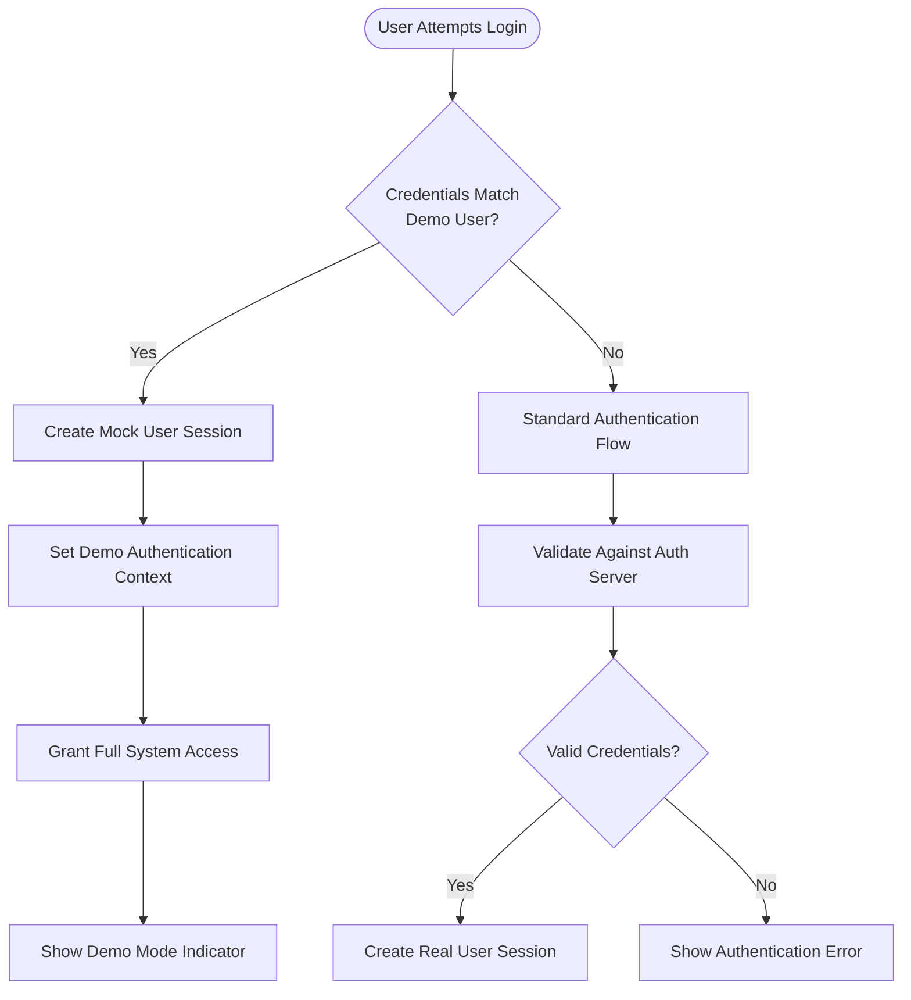
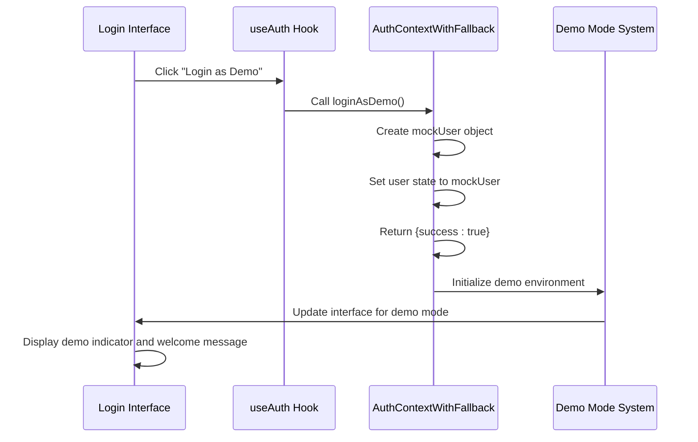
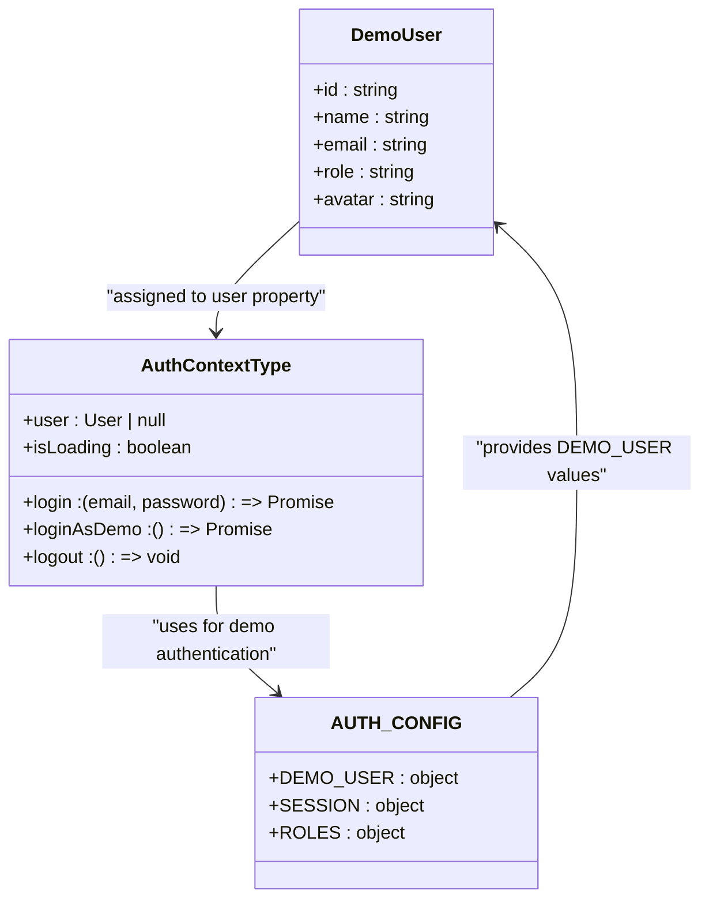
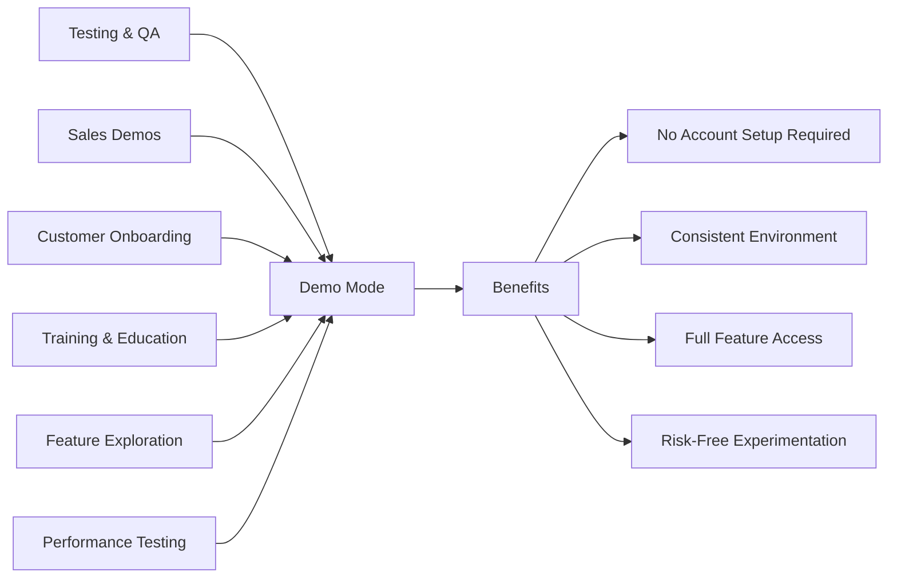
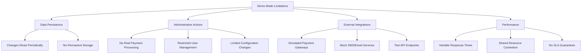
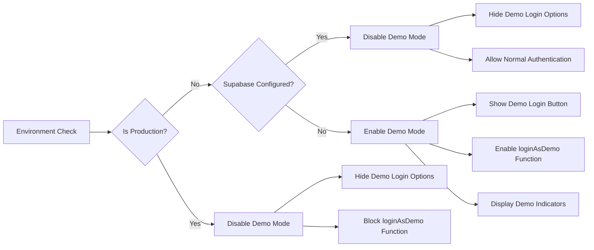

# Demo Mode Access

<cite>
**Referenced Files in This Document**   
- [AuthContextWithFallback.tsx](file://src/contexts/AuthContextWithFallback.tsx)
- [auth.ts](file://src/utils/auth.ts)
- [auth.ts](file://src/config/auth.ts)
- [DemoIndicator.tsx](file://src/components/Auth/DemoIndicator.tsx)
- [DemoWelcome.tsx](file://src/components/Auth/DemoWelcome.tsx)
- [types/auth.ts](file://src/types/auth.ts)
</cite>

## Table of Contents
1. [Introduction](#introduction)
2. [Demo Mode Authentication Bypass](#demo-mode-authentication-bypass)
3. [Implementation of loginAsDemo](#implementation-of-loginasdemo)
4. [Simulated User Profile and Permissions](#simulated-user-profile-and-permissions)
5. [Usage Scenarios](#usage-scenarios)
6. [Limitations of Demo Mode](#limitations-of-demo-mode)
7. [Enabling and Disabling Demo Access](#enabling-and-disabling-demo-access)

## Introduction
The AABB-system includes a demo mode feature designed for testing, presentation, and onboarding purposes. This mode allows users to bypass standard authentication procedures while simulating a fully authorized administrative environment. The demo mode provides access to all system functionalities using predefined credentials, enabling stakeholders to explore the complete feature set without requiring real user accounts or data persistence.

**Section sources**
- [DemoIndicator.tsx](file://src/components/Auth/DemoIndicator.tsx#L0-L160)
- [DemoWelcome.tsx](file://src/components/Auth/DemoWelcome.tsx#L0-L189)

## Demo Mode Authentication Bypass
The demo mode bypasses standard authentication by creating a mock user session instead of validating credentials against the authentication server. When accessing the system in demo mode, users are automatically authenticated as an administrative user with full permissions. This bypass mechanism is implemented through conditional logic that detects demo user credentials and establishes a simulated authentication context without interacting with the Supabase authentication service.

The system identifies demo users by comparing the user's email address with the predefined demo user email configured in the system constants. This approach allows the application to distinguish between regular authenticated sessions and demo sessions, applying different security rules and data handling procedures accordingly.

**Diagram sources**
- [AuthContextWithFallback.tsx](file://src/contexts/AuthContextWithFallback.tsx#L258-L307)
- [auth.ts](file://src/utils/auth.ts#L36-L38)

**Section sources**
- [auth.ts](file://src/config/auth.ts#L0-L48)
- [auth.ts](file://src/utils/auth.ts#L36-L38)

## Implementation of loginAsDemo
The `loginAsDemo` function is implemented within the `AuthContextWithFallback` component and provides the core functionality for entering demo mode. This function creates a mock user object with predefined attributes that simulate a fully authenticated administrative session. When invoked, it bypasses the standard authentication flow and directly sets the authentication context with the demo user data.

The implementation follows a promise-based pattern, returning an object with success status and potential error information. Upon successful execution, the function populates the authentication context with a mock user that has administrator privileges, allowing access to all system features. The function is designed to always succeed under normal conditions, as it does not depend on external authentication services or database queries.

**Diagram sources**
- [AuthContextWithFallback.tsx](file://src/contexts/AuthContextWithFallback.tsx#L258-L307)
- [types/auth.ts](file://src/types/auth.ts#L14)

**Section sources**
- [AuthContextWithFallback.tsx](file://src/contexts/AuthContextWithFallback.tsx#L258-L307)
- [types/auth.ts](file://src/types/auth.ts#L14)

## Simulated User Profile and Permissions
The demo mode utilizes a simulated user profile with predefined attributes that represent an administrative user. The mock user has the following characteristics:
- **Email**: demo@clubmanager.com
- **Name**: Usuário Demo
- **Role**: admin
- **Permissions**: Full system access (represented by '*' wildcard)

This simulated profile grants the user complete access to all modules and functionalities within the system, including administrative features that would normally be restricted to specific roles. The permissions system recognizes the demo user as having maximum privileges, allowing exploration of sensitive areas such as employee management, system configuration, and financial reporting.

The company context in demo mode includes sample data across all business areas, including inventory items, employee records, customer profiles, and transaction history. This comprehensive dataset enables realistic demonstration of system capabilities without requiring actual business data.

**Diagram sources**
- [auth.ts](file://src/config/auth.ts#L0-L48)
- [AuthContextWithFallback.tsx](file://src/contexts/AuthContextWithFallback.tsx#L258-L307)

**Section sources**
- [auth.ts](file://src/config/auth.ts#L0-L48)
- [AuthContextWithFallback.tsx](file://src/contexts/AuthContextWithFallback.tsx#L258-L307)

## Usage Scenarios
The demo mode serves several important purposes within the AABB-system ecosystem:

### Testing and Quality Assurance
Developers and QA engineers use demo mode to rapidly test system functionality without needing to create and manage multiple test accounts. The consistent demo environment ensures reproducible test conditions across different development and staging environments.

### Sales Demonstrations
Sales representatives leverage demo mode to showcase the full capabilities of the system to potential customers. The pre-populated sample data and unrestricted access allow for comprehensive walkthroughs of all features, highlighting the system's value proposition.

### Customer Onboarding
New customers can explore the system in demo mode before committing to data migration and user setup. This hands-on experience helps them understand the interface and plan their implementation strategy.

### Training and Education
Instructor-led training sessions utilize demo mode to teach system navigation and best practices. Trainees can experiment freely with all features without risk of affecting real data.

**Diagram sources**
- [DemoIndicator.tsx](file://src/components/Auth/DemoIndicator.tsx#L0-L160)
- [DemoWelcome.tsx](file://src/components/Auth/DemoWelcome.tsx#L0-L189)

**Section sources**
- [DemoIndicator.tsx](file://src/components/Auth/DemoIndicator.tsx#L0-L160)
- [DemoWelcome.tsx](file://src/components/Auth/DemoWelcome.tsx#L0-L189)

## Limitations of Demo Mode
While demo mode provides extensive access to system features, it has several important limitations that distinguish it from a production environment:

### Data Persistence
All changes made in demo mode are temporary and will be reset periodically. This includes modifications to settings, creation of test records, and any other data manipulations. Users should not rely on demo mode for storing important information.

### Restricted Administrative Actions
Certain high-risk administrative functions are disabled or modified in demo mode, including:
- Real payment processing
- Permanent data deletion
- System configuration changes that affect security
- User account creation/deletion

### External Integrations
Integration with third-party services such as payment gateways, SMS providers, and email delivery systems may be simulated rather than using real connections. This prevents accidental charges or communication with real customers.

### Performance Characteristics
The demo environment may have different performance characteristics compared to production, as it runs on shared resources and may experience variable load from other demo users.

**Diagram sources**
- [AuthContextWithFallback.tsx](file://src/contexts/AuthContextWithFallback.tsx#L258-L307)
- [DemoIndicator.tsx](file://src/components/Auth/DemoIndicator.tsx#L0-L160)

**Section sources**
- [AuthContextWithFallback.tsx](file://src/contexts/AuthContextWithFallback.tsx#L258-L307)
- [DemoIndicator.tsx](file://src/components/Auth/DemoIndicator.tsx#L0-L160)

## Enabling and Disabling Demo Access
Demo access is controlled through configuration settings and can be securely managed to prevent unauthorized use. The system provides mechanisms for both enabling and disabling demo mode based on deployment requirements.

To enable demo access, the `isSupabaseConfigured` flag must be set to false, which triggers the display of demo login options in the user interface. This typically occurs in development or staging environments where Supabase configuration is intentionally omitted.

To disable demo access in production environments, administrators ensure that proper Supabase configuration is in place and that the demo user credentials are not accessible. The system automatically hides demo login options when valid authentication configuration is detected.

Security considerations include:
- Never enabling demo mode in production environments
- Regularly auditing access logs for unauthorized demo usage
- Using environment-specific configuration to control demo availability
- Monitoring for attempts to access demo mode through automated scripts

**Diagram sources**
- [AuthContextWithFallback.tsx](file://src/contexts/AuthContextWithFallback.tsx#L258-L307)
- [config/auth.ts](file://src/config/auth.ts#L0-L48)

**Section sources**
- [AuthContextWithFallback.tsx](file://src/contexts/AuthContextWithFallback.tsx#L258-L307)
- [config/auth.ts](file://src/config/auth.ts#L0-L48)