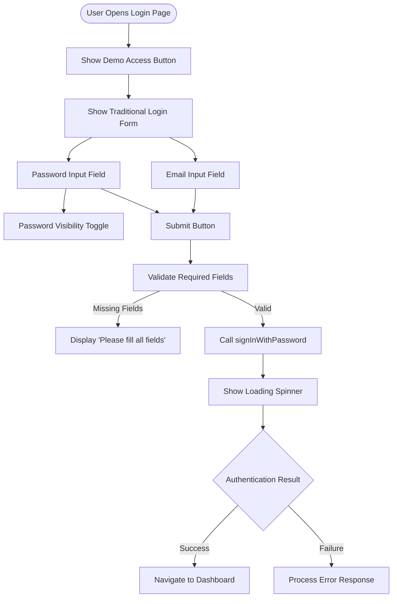
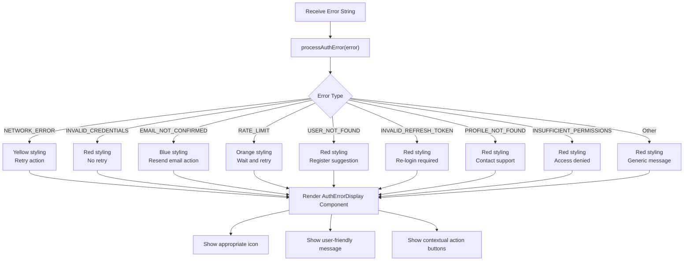
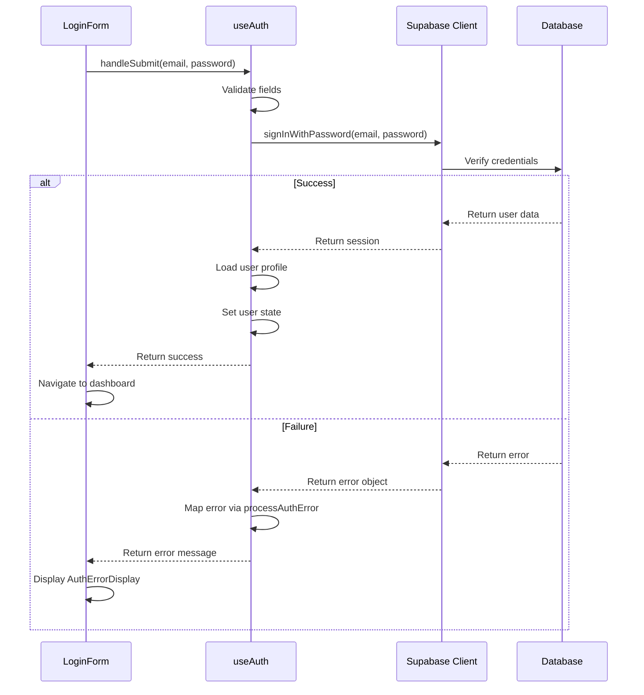
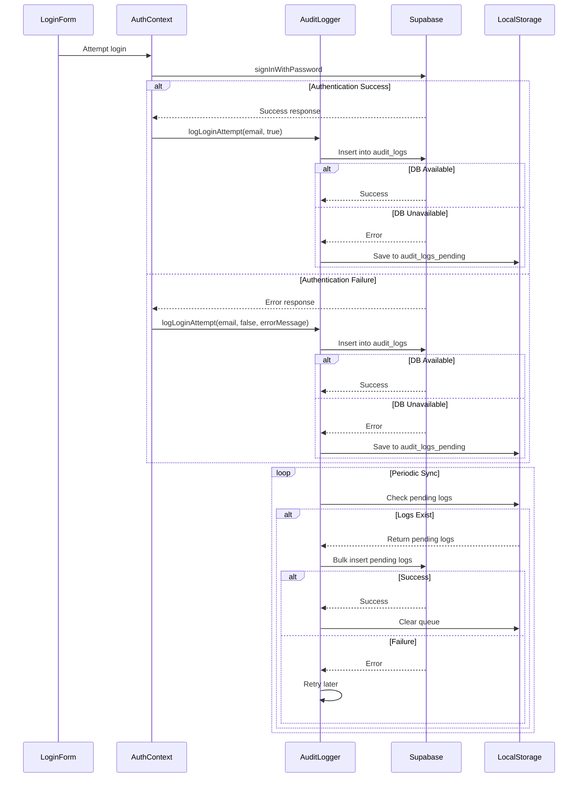

# Login Flow

<cite>
**Referenced Files in This Document**   
- [LoginForm.tsx](file://src/components/Auth/LoginForm.tsx)
- [AuthErrorDisplay.tsx](file://src/components/Auth/AuthErrorDisplay.tsx)
- [useAuthWithHierarchy.ts](file://src/hooks/useAuthWithHierarchy.ts)
- [authErrors.ts](file://src/utils/authErrors.ts)
- [supabase.ts](file://src/lib/supabase.ts)
- [AuthContextSimple.tsx](file://src/contexts/AuthContextSimple.tsx)
- [auditLogger.ts](file://src/utils/auditLogger.ts)
</cite>

## Table of Contents
1. [Introduction](#introduction)
2. [Login Form Implementation](#login-form-implementation)
3. [Authentication State Management](#authentication-state-management)
4. [Error Handling and User Feedback](#error-handling-and-user-feedback)
5. [Supabase Authentication Integration](#supabase-authentication-integration)
6. [Audit Logging of Login Attempts](#audit-logging-of-login-attempts)
7. [Session Persistence Mechanisms](#session-persistence-mechanisms)
8. [Common Issues and Recovery Strategies](#common-issues-and-recovery-strategies)

## Introduction

The login flow in the AABB-system implements a secure authentication mechanism using Supabase Auth for email and password verification. The system provides both traditional login functionality and a demo access option for quick exploration of the application's features. This document details the implementation of the login form, state management, error handling, and security logging mechanisms that ensure a robust user authentication experience.

The login process follows a structured workflow from user input to session establishment, with comprehensive error handling and audit capabilities. The system is designed to handle various scenarios including temporary passwords, inactive users, and network connectivity issues, providing appropriate feedback and recovery options throughout the authentication journey.

## Login Form Implementation

The login form component provides a user-friendly interface for authentication with email and password inputs, password visibility toggle, and visual feedback during the authentication process. The form includes both traditional login and a dedicated demo access button that allows users to quickly explore the system without requiring account creation.



**Section sources**
- [LoginForm.tsx](file://src/components/Auth/LoginForm.tsx#L7-L174)

## Authentication State Management

The authentication state is managed through React context, maintaining user credentials, loading states, and authentication status across the application. The `useAuth` hook provides centralized access to authentication functions and state, enabling consistent behavior throughout the system.

```mermaid
classDiagram
class AuthContextType {
+user : User | null
+login(email, password) : Promise~{success : boolean, error : string | null}~
+loginAsDemo() : Promise~{success : boolean, error : string | null}~
+logout() : void
+isLoading : boolean
}
class User {
+id : string
+name : string
+email : string
+role : 'admin' | 'manager' | 'employee' | 'member'
+avatar? : string
+department? : string
}
class LoginForm {
-email : string
-password : string
-showPassword : boolean
-error : string
+handleSubmit(e) : void
+handleRetry() : void
+handleDemoLogin() : void
}
class useAuthWithHierarchy {
+user : any
+isLoading : boolean
+isAuthenticated : boolean
+usuarioEmpresa : UsuarioEmpresa | null
+empresa : Empresa | null
+papel : PapelUsuario | null
+privilegios : PrivilegiosAdmin
+verificarPrivilegio(privilegio) : boolean
+podeGerenciarUsuario(papelAlvo) : boolean
+recarregarDados() : Promise~void~
+logout() : Promise~void~
}
LoginForm --> useAuthWithHierarchy : "uses"
useAuthWithHierarchy --> AuthContextType : "implements"
AuthContextType --> User : "contains"
```

**Diagram sources**
- [AuthContextSimple.tsx](file://src/contexts/AuthContextSimple.tsx#L22-L332)
- [useAuthWithHierarchy.ts](file://src/hooks/useAuthWithHierarchy.ts#L10-L157)
- [auth.ts](file://src/types/auth.ts#L1-L41)

**Section sources**
- [useAuthWithHierarchy.ts](file://src/hooks/useAuthWithHierarchy.ts#L10-L157)
- [AuthContextSimple.tsx](file://src/contexts/AuthContextSimple.tsx#L22-L332)

## Error Handling and User Feedback

The system implements comprehensive error handling through the `AuthErrorDisplay` component, which processes authentication errors and presents user-friendly messages with appropriate actions. Errors are categorized by type, with distinct visual styling and recovery options based on the nature of the failure.



**Diagram sources**
- [AuthErrorDisplay.tsx](file://src/components/Auth/AuthErrorDisplay.tsx#L12-L143)
- [authErrors.ts](file://src/utils/authErrors.ts#L1-L206)

**Section sources**
- [AuthErrorDisplay.tsx](file://src/components/Auth/AuthErrorDisplay.tsx#L12-L143)
- [authErrors.ts](file://src/utils/authErrors.ts#L1-L206)

## Supabase Authentication Integration

The login flow integrates with Supabase Auth through the `signInWithPassword` method, which handles the actual authentication against the Supabase backend. The integration includes proper configuration management, connection validation, and fallback mechanisms for development environments.



**Diagram sources**
- [supabase.ts](file://src/lib/supabase.ts#L1-L54)
- [AuthContextSimple.tsx](file://src/contexts/AuthContextSimple.tsx#L22-L332)
- [LoginForm.tsx](file://src/components/Auth/LoginForm.tsx#L7-L174)

**Section sources**
- [supabase.ts](file://src/lib/supabase.ts#L1-L54)
- [AuthContextSimple.tsx](file://src/contexts/AuthContextSimple.tsx#L22-L332)

## Audit Logging of Login Attempts

The system implements comprehensive audit logging for all login attempts, recording both successful and failed authentication events. The `auditLogger` service captures essential details while ensuring sensitive information is properly redacted, and supports offline operation with local storage queuing.



**Diagram sources**
- [auditLogger.ts](file://src/utils/auditLogger.ts#L1-L132)
- [AuthContextSimple.tsx](file://src/contexts/AuthContextSimple.tsx#L159-L199)

**Section sources**
- [auditLogger.ts](file://src/utils/auditLogger.ts#L1-L132)

## Session Persistence Mechanisms

The system maintains user sessions through Supabase's built-in persistence mechanisms, with automatic token refresh and session restoration on application restart. The configuration ensures that user authentication state persists across browser sessions while maintaining security best practices.

The session persistence strategy combines Supabase's native capabilities with application-level state management:

1. **Token Storage**: Authentication tokens are stored in browser localStorage with a unique key based on the Supabase project URL
2. **Auto-refresh**: Tokens are automatically refreshed before expiration to maintain continuous access
3. **Session Detection**: The system detects existing sessions from URLs (e.g., after email confirmation flows)
4. **Fallback Handling**: In development environments without proper Supabase configuration, the system gracefully degrades to demo mode

This multi-layered approach ensures reliable session persistence while accommodating different deployment scenarios and network conditions.

**Section sources**
- [supabase.ts](file://src/lib/supabase.ts#L38-L54)

## Common Issues and Recovery Strategies

The login flow anticipates and handles several common authentication issues with appropriate recovery strategies:

### Incorrect Credentials
When users enter incorrect email or password combinations, the system displays a clear "Invalid credentials" message without revealing whether the email or password was incorrect (to prevent user enumeration attacks). Users can retry immediately with corrected credentials.

### Network Errors
For network connectivity issues, the system identifies the problem and suggests checking internet connection. The `AuthErrorDisplay` component shows a retry option, allowing users to attempt reconnection without having to resubmit their credentials.

### Temporary Passwords
For users with temporary passwords (such as after account creation or password reset), the system redirects to a dedicated password change form after successful authentication with the temporary password. This ensures immediate password rotation to a secure, user-chosen value.

### Inactive Users
Users marked as inactive in the system receive a specific error message indicating their account status. Administrators must reactivate these accounts before login can succeed, preventing unauthorized access through disabled accounts.

### Authentication Failure Recovery
The system implements several recovery mechanisms:
- **Retry Logic**: Users can retry failed login attempts directly from the error display
- **Demo Access**: A fully functional demo mode allows users to explore the system even when authentication fails
- **Offline Support**: Audit logs are queued locally when the database is unavailable and synchronized when connectivity is restored
- **Error Context**: Detailed error categorization helps users understand the nature of authentication failures and take appropriate corrective actions

These comprehensive recovery strategies ensure that users can overcome authentication challenges while maintaining system security and usability.

**Section sources**
- [AuthErrorDisplay.tsx](file://src/components/Auth/AuthErrorDisplay.tsx#L12-L143)
- [authErrors.ts](file://src/utils/authErrors.ts#L1-L206)
- [LoginForm.tsx](file://src/components/Auth/LoginForm.tsx#L7-L174)