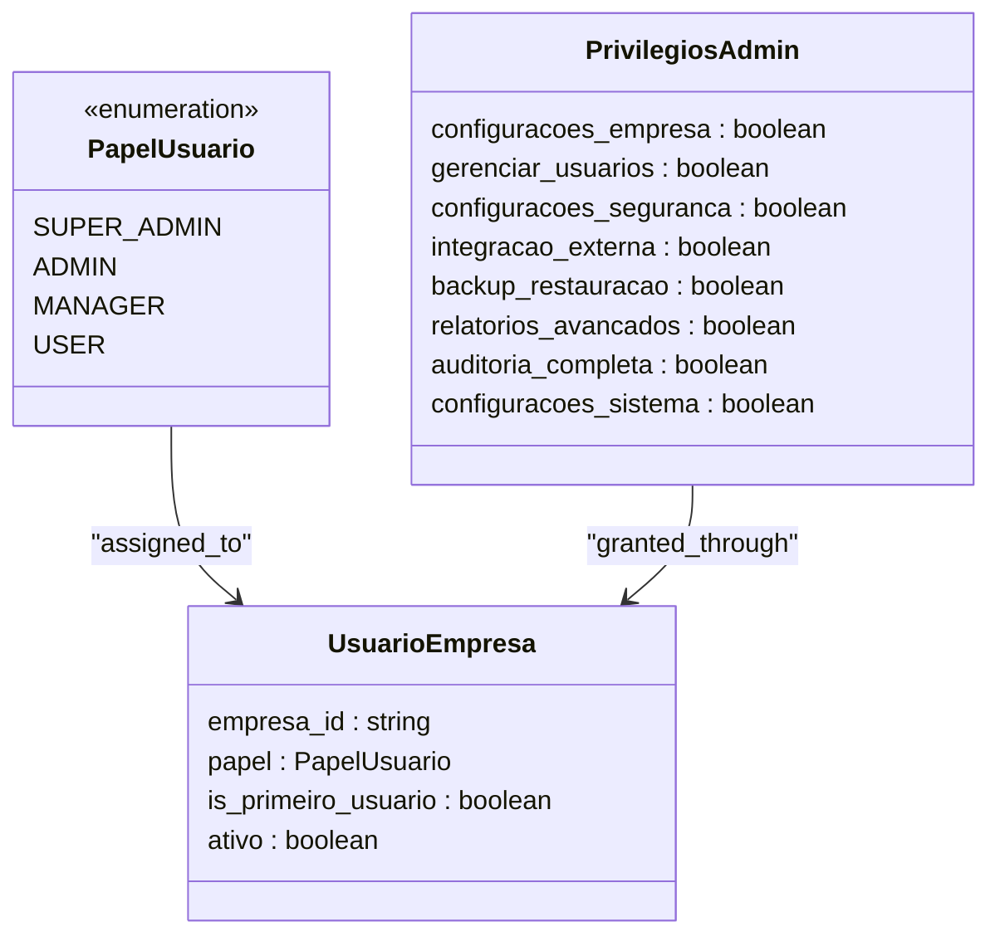
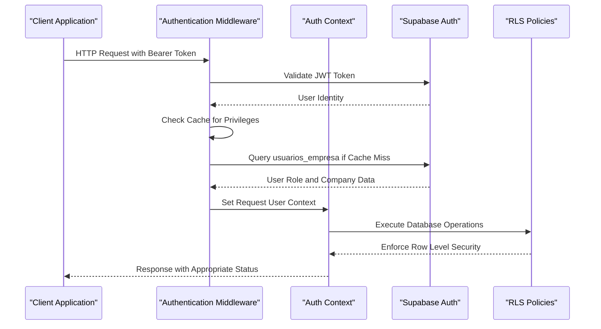
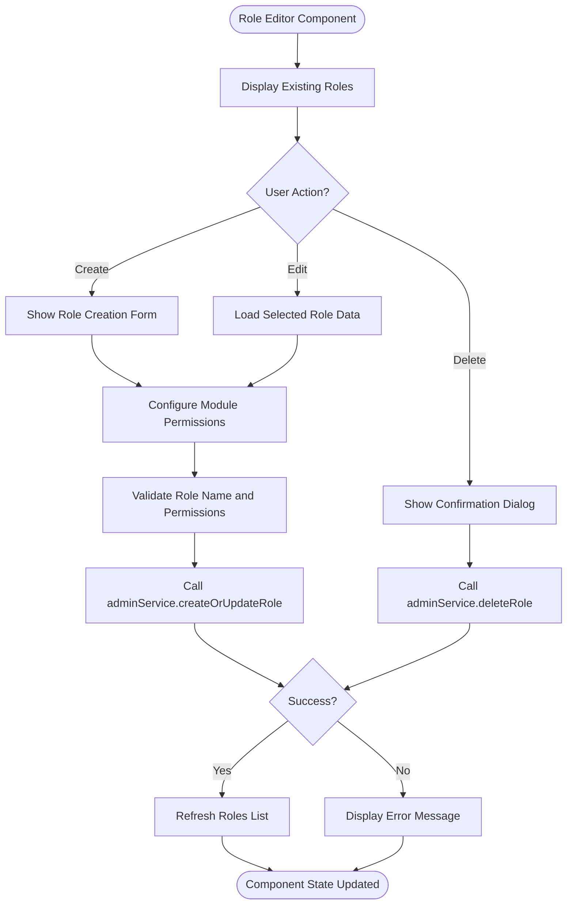
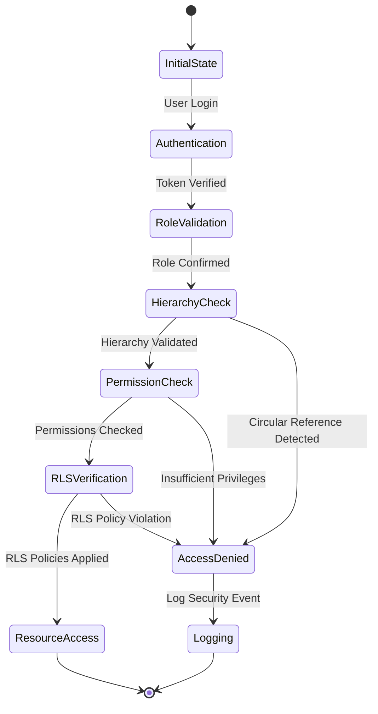
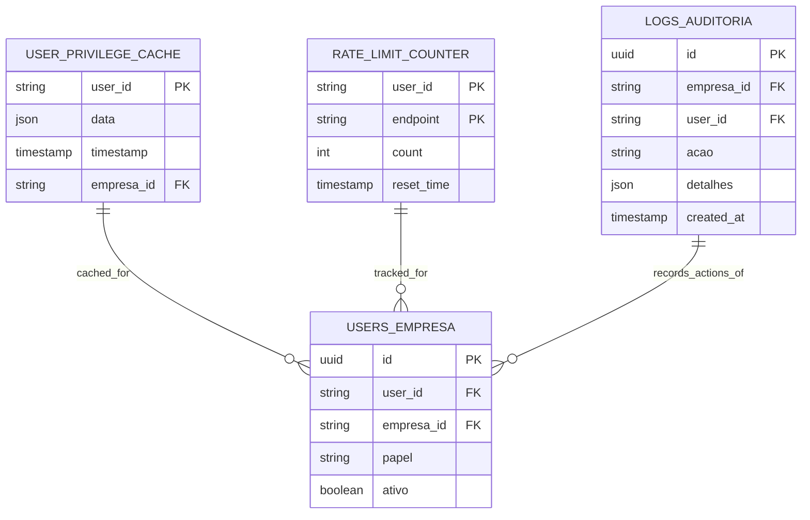

# Administrative Privilege Hierarchy

<cite>
**Referenced Files in This Document**   
- [admin-hierarchy.ts](file://src/types/admin-hierarchy.ts)
- [authorizationMiddleware.ts](file://src/middleware/authorizationMiddleware.ts)
- [RoleEditor.tsx](file://src/components/Admin/RoleEditor.tsx)
- [adminService.ts](file://src/services/adminService.ts)
- [multitenant.ts](file://src/types/multitenant.ts)
</cite>

## Table of Contents
1. [Introduction](#introduction)
2. [Hierarchical Role Structure](#hierarchical-role-structure)
3. [Authorization Middleware Implementation](#authorization-middleware-implementation)
4. [Role Management Components](#role-management-components)
5. [Privilege Inheritance and Cascading Permissions](#privilege-inheritance-and-cascading-permissions)
6. [Security Considerations](#security-considerations)
7. [Performance Implications](#performance-implications)
8. [Troubleshooting Common Issues](#troubleshooting-common-issues)
9. [Conclusion](#conclusion)

## Introduction
The AABB-system implements a comprehensive administrative privilege hierarchy that enables granular access control across organizational levels. This document details the hierarchical role structure, authorization mechanisms, and implementation patterns that govern administrative privileges within the system. The architecture combines role-based access control (RBAC) with attribute-based elements to create a flexible yet secure permission system.

**Section sources**
- [admin-hierarchy.ts](file://src/types/admin-hierarchy.ts#L1-L217)
- [multitenant.ts](file://src/types/multitenant.ts#L3-L81)

## Hierarchical Role Structure
The administrative privilege hierarchy is defined by four distinct roles organized in a strict parent-child relationship: SUPER_ADMIN, ADMIN, MANAGER, and USER. Each role inherits permissions from higher-level roles while maintaining specific restrictions on their capabilities. The hierarchy enforces a clear chain of command where higher-level administrators can manage lower-level roles but cannot modify peers or superiors.



**Diagram sources**
- [multitenant.ts](file://src/types/multitenant.ts#L3-L81)

**Section sources**
- [admin-hierarchy.ts](file://src/types/admin-hierarchy.ts#L66-L71)
- [multitenant.ts](file://src/types/multitenant.ts#L3-L81)

## Authorization Middleware Implementation
The authorization middleware enforces hierarchical access controls through a multi-layered approach that integrates with Supabase Row Level Security (RLS) policies. The middleware performs authentication, role verification, privilege checking, and hierarchical validation before allowing access to protected resources. It implements caching mechanisms to optimize performance while maintaining security integrity.



**Diagram sources**
- [authorizationMiddleware.ts](file://src/middleware/authorizationMiddleware.ts#L1-L280)

**Section sources**
- [authorizationMiddleware.ts](file://src/middleware/authorizationMiddleware.ts#L1-L280)

## Role Management Components
The RoleEditor component provides a user interface for creating, modifying, and deleting roles within the administrative hierarchy. It integrates with the adminService to persist changes and ensures that role modifications adhere to the established hierarchy rules. The component displays a permission matrix that allows administrators to configure granular permissions for each role across different system modules.



**Diagram sources**
- [RoleEditor.tsx](file://src/components/Admin/RoleEditor.tsx#L11-L316)

**Section sources**
- [RoleEditor.tsx](file://src/components/Admin/RoleEditor.tsx#L11-L316)

## Privilege Inheritance and Cascading Permissions
Privilege inheritance follows a cascading model where higher-level administrators automatically gain all permissions of lower-level roles. The system implements this through the `podeGerenciarPapel` method in the AdminService, which determines whether a user can manage another user based on their relative positions in the hierarchy. This ensures that privilege escalation is prevented while enabling appropriate delegation of responsibilities.

```mermaid
graph TB
subgraph "Administrative Hierarchy"
SA[Super Admin] --> A[Admin]
A --> M[Manager]
M --> U[User]
end
subgraph "Permission Flow"
SA -- "Full System Access" --> All[All Modules]
A -- "Restricted Administration" --> Restricted[Except Critical Settings]
M -- "Operational Management" --> Operational[Daily Operations]
U -- "Basic Functionality" --> Basic[Assigned Tasks Only]
end
SA --> A : "Can Create/Edit/Delete"
A --> M : "Can Create/Edit/Delete"
M --> U : "Can Create/Edit/Delete"
style SA fill:#ffcccc,stroke:#333
style A fill:#ccffcc,stroke:#333
style M fill:#ccccff,stroke:#333
style U fill:#ffffcc,stroke:#333
```

**Diagram sources**
- [adminService.ts](file://src/services/adminService.ts#L125-L134)
- [admin-hierarchy.ts](file://src/types/admin-hierarchy.ts#L66-L71)

**Section sources**
- [adminService.ts](file://src/services/adminService.ts#L125-L134)
- [admin-hierarchy.ts](file://src/types/admin-hierarchy.ts#L66-L71)

## Security Considerations
The system addresses several critical security concerns in its hierarchical privilege implementation. Circular references in role hierarchies are prevented by the strict parent-child relationship enforcement in the `RESTRICOES_CRIACAO_USUARIO` configuration. Privilege escalation vulnerabilities are mitigated through the hierarchical validation in both the authorization middleware and adminService methods. The integration with Supabase RLS policies provides an additional layer of database-level security that cannot be bypassed by application logic.



**Diagram sources**
- [authorizationMiddleware.ts](file://src/middleware/authorizationMiddleware.ts#L200-L250)
- [adminService.ts](file://src/services/adminService.ts#L50-L100)

**Section sources**
- [authorizationMiddleware.ts](file://src/middleware/authorizationMiddleware.ts#L200-L250)
- [adminService.ts](file://src/services/adminService.ts#L50-L100)

## Performance Implications
The recursive permission checks in the administrative hierarchy have been optimized through strategic caching and efficient database queries. The authorization middleware implements a 5-minute cache for user privileges to reduce database load while maintaining acceptable staleness thresholds. Rate limiting is applied based on user roles, with higher-privileged accounts allowed more requests per minute to prevent denial-of-service attacks while ensuring operational efficiency.



**Diagram sources**
- [authorizationMiddleware.ts](file://src/middleware/authorizationMiddleware.ts#L35-L50)
- [adminService.ts](file://src/services/adminService.ts#L1-L350)

**Section sources**
- [authorizationMiddleware.ts](file://src/middleware/authorizationMiddleware.ts#L35-L50)

## Troubleshooting Common Issues
Common issues in the administrative privilege hierarchy typically involve permission mismatches, caching inconsistencies, and hierarchical validation errors. When users experience unexpected access denials, administrators should first verify the user's role in the usuarios_empresa table, check the privilege cache status, and review the audit logs for denied access attempts. The system provides comprehensive logging through the logs_auditoria table, which records all administrative actions and access violations.

**Section sources**
- [authorizationMiddleware.ts](file://src/middleware/authorizationMiddleware.ts#L260-L280)
- [adminService.ts](file://src/services/adminService.ts#L300-L350)

## Conclusion
The administrative privilege hierarchy in the AABB-system provides a robust framework for managing access control across organizational levels. By combining a clear role hierarchy with cascading permissions and multi-layered security enforcement, the system balances flexibility with security. The integration of client-side components, server-side middleware, and database-level RLS policies creates a defense-in-depth approach that protects against both accidental misconfigurations and malicious attempts at privilege escalation. Ongoing monitoring and regular audit log reviews are recommended to maintain the integrity of the administrative hierarchy.