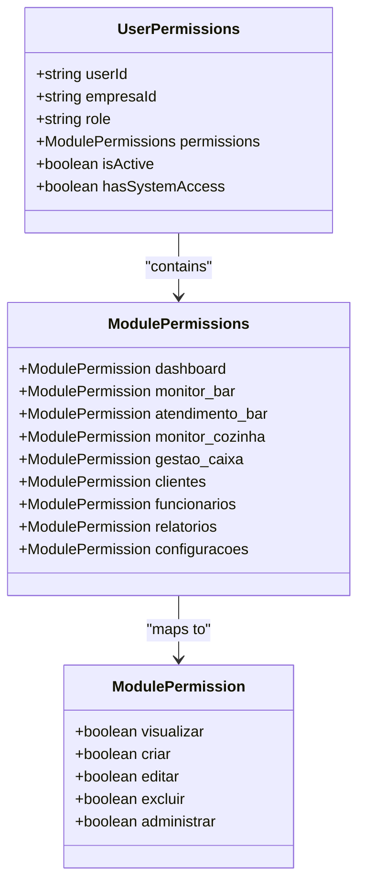
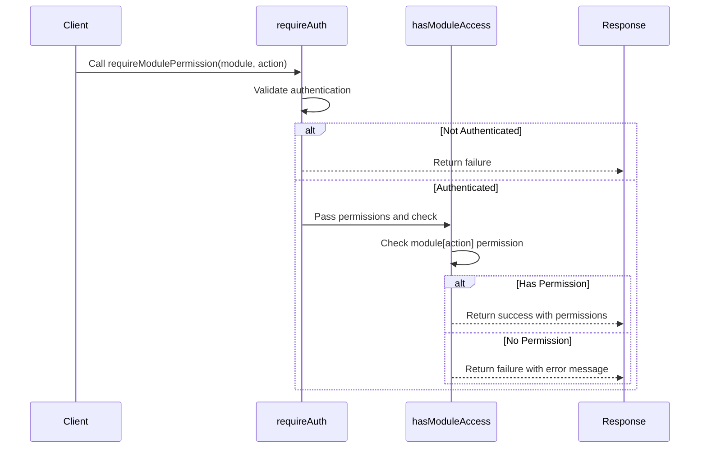
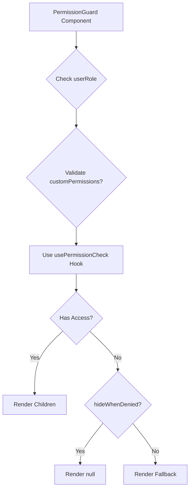
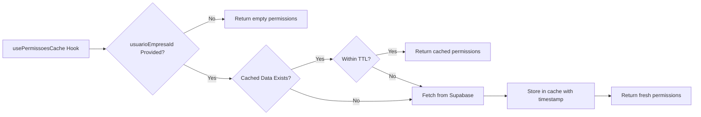

# Permission Checking System

<cite>
**Referenced Files in This Document**   
- [authMiddleware.ts](file://src/middleware/authMiddleware.ts)
- [permission-utils.ts](file://src/utils/permission-utils.ts)
- [PermissionGuard.tsx](file://src/components/Auth/PermissionGuard.tsx)
- [PermissionGuard.tsx](file://src/components/permissions/PermissionGuard.tsx)
- [usePermissoesCache.ts](file://src/hooks/usePermissoesCache.ts)
- [permissions.ts](file://src/types/permissions.ts)
</cite>

## Table of Contents
1. [Introduction](#introduction)
2. [Core Components and Data Structures](#core-components-and-data-structures)
3. [Permission Validation with requireModulePermission](#permission-validation-with-requiremodulepermission)
4. [Integration Between permission-utils and PermissionGuard](#integration-between-permission-utils-and-permissionguard)
5. [Usage Patterns in UI and API](#usage-patterns-in-ui-and-api)
6. [Caching Strategy with usePermissoesCache](#caching-strategy-with-usepermissoescache)
7. [Common Issues and Troubleshooting](#common-issues-and-troubleshooting)
8. [Conclusion](#conclusion)

## Introduction
The permission checking system in the AABB-system is a comprehensive security framework designed to control access to various modules and actions based on user roles and permissions. This document details how the `requireModulePermission` function validates user permissions against required actions such as "visualizar" (view), "editar" (edit), and others using the `UserPermissions` data structure. It also covers the integration between utility functions in `permission-utils` and the `PermissionGuard` components, including real-time evaluation, fallback behaviors, and performance optimization through caching via the `usePermissoesCache` hook.

**Section sources**
- [authMiddleware.ts](file://src/middleware/authMiddleware.ts#L1-L30)
- [permissions.ts](file://src/types/permissions.ts#L1-L50)

## Core Components and Data Structures
The foundation of the permission system lies in several key interfaces and types that define the structure of permissions and roles within the application. The `UserPermissions` interface encapsulates all necessary information about a user's authorization state, including their role, active status, system access, and granular module-level permissions.



**Diagram sources**
- [authMiddleware.ts](file://src/middleware/authMiddleware.ts#L12-L39)
- [permissions.ts](file://src/types/permissions.ts#L58-L71)

The `ModulePermission` interface defines five possible actions: view (`visualizar`), create (`criar`), edit (`editar`), delete (`excluir`), and administer (`administrar`). These are used across all system modules to provide fine-grained access control.

**Section sources**
- [permissions.ts](file://src/types/permissions.ts#L58-L71)
- [authMiddleware.ts](file://src/middleware/authMiddleware.ts#L21-L39)

## Permission Validation with requireModulePermission
The `requireModulePermission` function serves as a middleware for enforcing access control at the API and route level. It performs a two-step validation process: first ensuring the user is authenticated and active, then verifying they possess the required permission for the specified module and action.



**Diagram sources**
- [authMiddleware.ts](file://src/middleware/authMiddleware.ts#L281-L301)
- [authMiddleware.ts](file://src/middleware/authMiddleware.ts#L55-L70)

This function relies on `requireAuth()` to load and validate the user's session and basic permissions, then uses `hasModuleAccess()` to perform the specific permission check. If either step fails, an appropriate error response is returned, preventing unauthorized access.

**Section sources**
- [authMiddleware.ts](file://src/middleware/authMiddleware.ts#L281-L301)
- [authMiddleware.ts](file://src/middleware/authMiddleware.ts#L55-L70)

## Integration Between permission-utils and PermissionGuard
The permission system integrates utility functions from `permission-utils.ts` with React components like `PermissionGuard` to provide both programmatic and declarative access control mechanisms. The `PermissionGuard` component renders children only if the user has the required permissions, leveraging the same underlying logic defined in utility functions.

There are multiple implementations of `PermissionGuard` across different paths, indicating a layered approach to permission handling:
- `src/components/Auth/PermissionGuard.tsx`: Handles general permission and role checks
- `src/components/permissions/PermissionGuard.tsx`: Provides more granular module and action-based protection



**Diagram sources**
- [PermissionGuard.tsx](file://src/components/permissions/PermissionGuard.tsx#L120-L153)
- [permission-utils.ts](file://src/utils/permission-utils.ts#L12-L513)

The integration allows for real-time permission evaluation by combining React's reactivity with cached permission data, while providing fallback behaviors through optional props like `fallback` and `showFallback`.

**Section sources**
- [PermissionGuard.tsx](file://src/components/Auth/PermissionGuard.tsx#L24-L55)
- [PermissionGuard.tsx](file://src/components/permissions/PermissionGuard.tsx#L120-L153)
- [permission-utils.ts](file://src/utils/permission-utils.ts#L12-L513)

## Usage Patterns in UI and API
The permission system is utilized throughout the application in both UI components and API routes. In protected UI elements, `PermissionGuard` wraps sensitive functionality, ensuring only authorized users can interact with them.

For example, administrative features are guarded using role-based checks:
```tsx
<PermissionGuard userRole={user.role} allowedRoles={['gerente']} fallback={<AccessDenied />}>
  <AdminDashboard />
</PermissionGuard>
```

API endpoints use `requireModulePermission` to enforce server-side access control:
```ts
await requireModulePermission('funcionarios', 'editar');
// Proceed with employee update logic
```

Multiple convenience components exist for common patterns:
- `ViewGuard`, `EditGuard`, `CreateGuard` for specific actions
- `ManagerOnlyGuard` for role-specific access
- `MultiplePermissionGuard` for complex permission requirements

These patterns ensure consistent security enforcement across the application surface.

**Section sources**
- [PermissionGuard.tsx](file://src/components/permissions/PermissionGuard.tsx#L200-L350)
- [authMiddleware.ts](file://src/middleware/authMiddleware.ts#L281-L301)

## Caching Strategy with usePermissoesCache
To optimize performance and reduce database load, the system implements a client-side caching mechanism through the `usePermissoesCache` hook. This hook manages permission data with a time-to-live (TTL) strategy, reducing redundant network requests while maintaining up-to-date authorization states.



**Diagram sources**
- [usePermissoesCache.ts](file://src/hooks/usePermissoesCache.ts#L24-L120)

The cache uses a 5-minute TTL (configurable via `CACHE_TTL`) and provides methods to manually refresh or invalidate cached data. This balances performance with security by ensuring permissions are refreshed periodically without overwhelming the database with repeated queries.

Key features include:
- Automatic cache lookup before fetching
- Error handling during database operations
- Manual refresh capability via `recarregarPermissoes`
- Selective invalidation via `invalidarCache`

**Section sources**
- [usePermisso