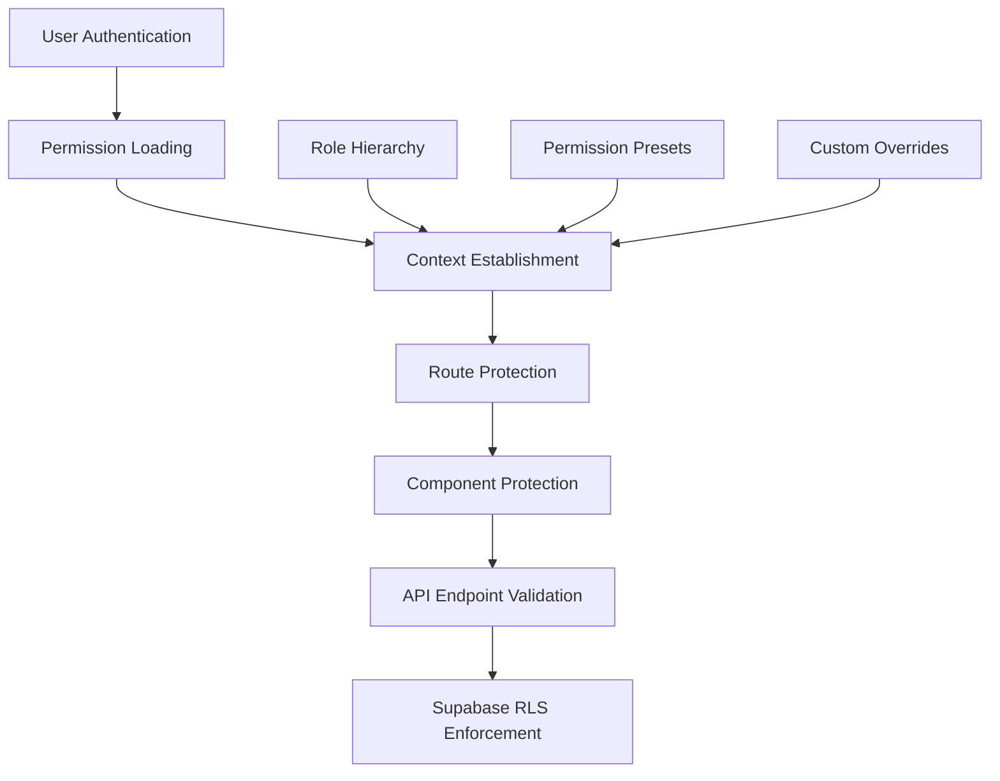
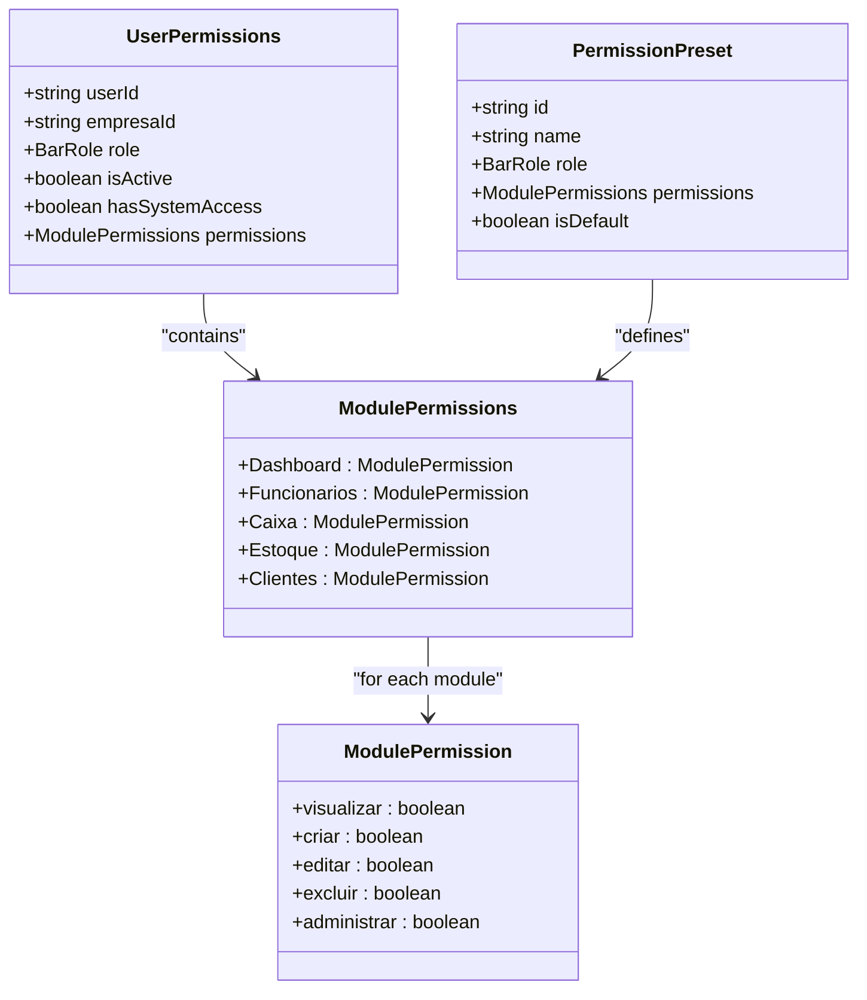
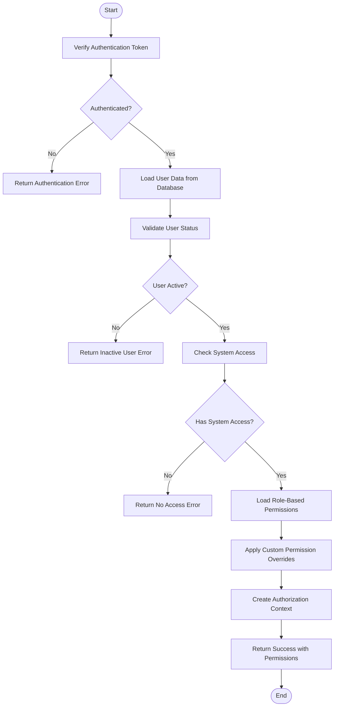
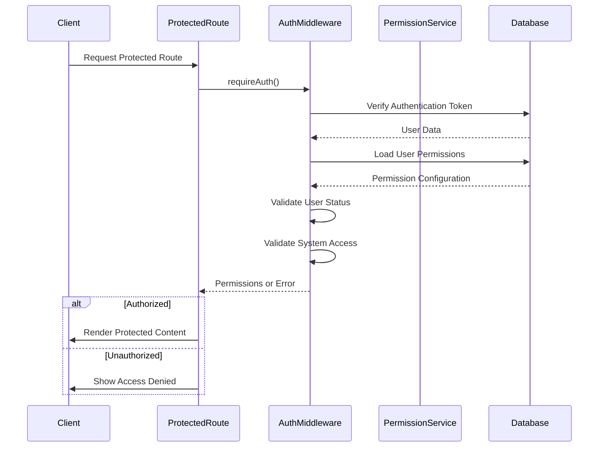
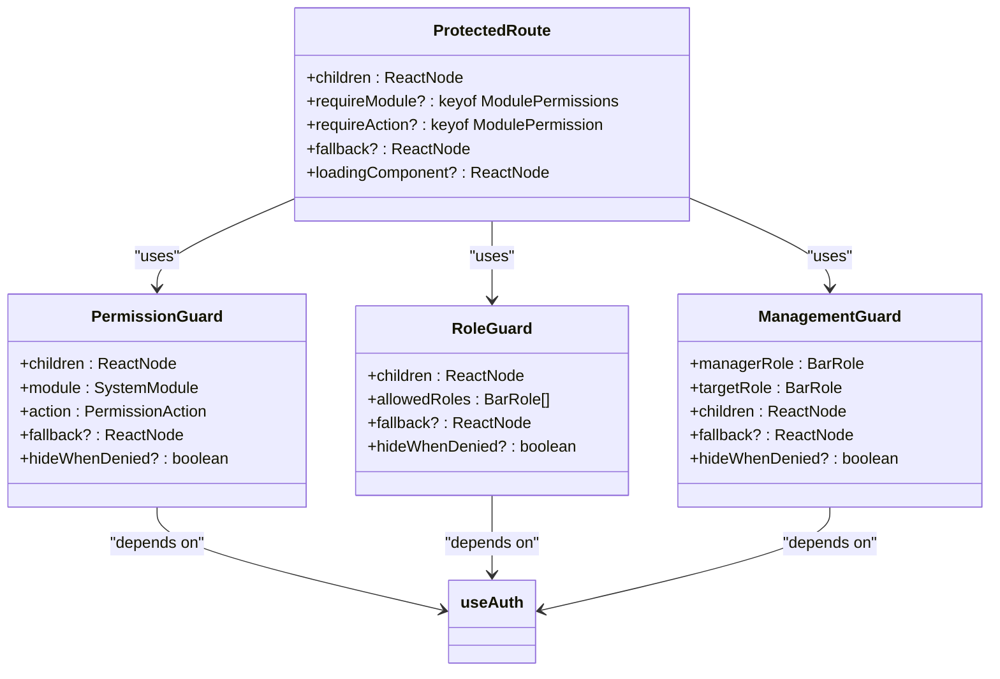
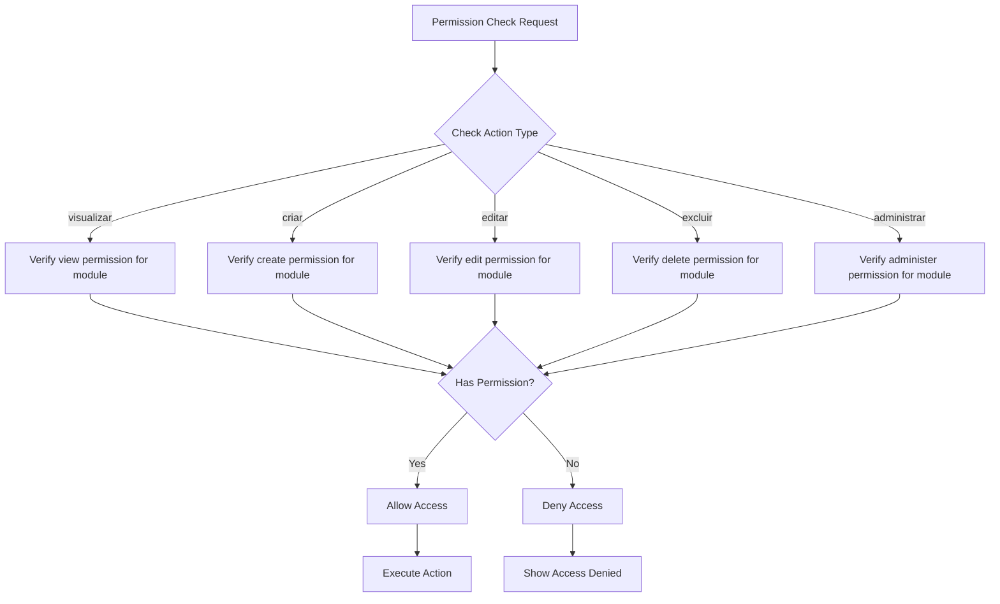
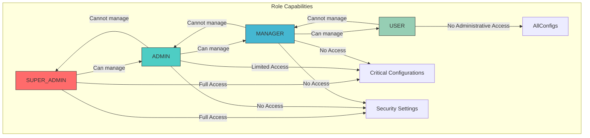
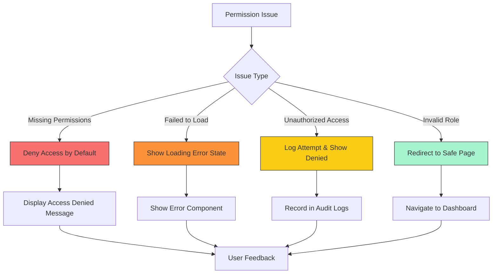

# Role-Based Access Control

<cite>
**Referenced Files in This Document**   
- [authMiddleware.ts](file://src/middleware/authMiddleware.ts)
- [ProtectedRoute.tsx](file://src/components/Auth/ProtectedRoute.tsx)
- [PermissionGuard.tsx](file://src/components/permissions/PermissionGuard.tsx)
- [authorization-middleware.ts](file://src/services/authorization-middleware.ts)
- [permission-presets.ts](file://src/services/permission-presets.ts)
- [permission-utils.ts](file://src/utils/permission-utils.ts)
- [usePermissions.ts](file://src/hooks/usePermissions.ts)
- [types/permissions.ts](file://src/types/permissions.ts)
- [HIERARQUIA_ADMINISTRATIVA_IMPLEMENTADA.md](file://HIERARQUIA_ADMINISTRATIVA_IMPLEMENTADA.md)
- [supabase/migrations/20250119000002_update_rls_policies_hierarchy.sql](file://supabase/migrations/20250119000002_update_rls_policies_hierarchy.sql)
</cite>

## Table of Contents
1. [Introduction](#introduction)
2. [Core Architecture](#core-architecture)
3. [User Permissions Structure](#user-permissions-structure)
4. [Permission Loading Process](#permission-loading-process)
5. [Authorization Middleware](#authorization-middleware)
6. [Protected Route Components](#protected-route-components)
7. [Module-Specific Permission Checks](#module-specific-permission-checks)
8. [Hierarchical Admin Roles](#hierarchical-admin-roles)
9. [Supabase RLS Integration](#supabase-rls-integration)
10. [Common Issues and Fallback Behaviors](#common-issues-and-fallback-behaviors)
11. [Troubleshooting Guide](#troubleshooting-guide)

## Introduction
The Role-Based Access Control (RBAC) system in the AABB-system provides granular security controls through a hierarchical role structure, module-specific permissions, and integration with Supabase Row Level Security (RLS). This document details how permissions are loaded, validated, and enforced throughout the application, covering the complete authentication and authorization flow from initial login to protected component rendering.

**Section sources**
- [HIERARQUIA_ADMINISTRATIVA_IMPLEMENTADA.md](file://HIERARQUIA_ADMINISTRATIVA_IMPLEMENTADA.md#L1-L20)

## Core Architecture
The RBAC system follows a multi-layered architecture combining frontend permission checks with backend RLS policies. The system uses a hierarchical role model where higher-level roles inherit permissions from lower levels while adding administrative capabilities. Permissions are structured around modules and actions, enabling fine-grained control over user access.



**Diagram sources**
- [authMiddleware.ts](file://src/middleware/authMiddleware.ts#L1-L50)
- [authorization-middleware.ts](file://src/services/authorization-middleware.ts#L1-L50)

**Section sources**
- [authMiddleware.ts](file://src/middleware/authMiddleware.ts#L1-L100)
- [authorization-middleware.ts](file://src/services/authorization-middleware.ts#L1-L100)

## User Permissions Structure
User permissions are organized as a nested structure of modules and actions. Each module contains boolean flags for specific actions such as 'visualizar' (view), 'criar' (create), 'editar' (edit), 'excluir' (delete), and 'administrar' (administer). The system defines standard permission templates including READ_ONLY, OPERATIONAL, and FULL permissions that serve as baselines for role configurations.



**Diagram sources**
- [types/permissions.ts](file://src/types/permissions.ts#L1-L50)
- [permission-presets.ts](file://src/services/permission-presets.ts#L1-L50)

**Section sources**
- [types/permissions.ts](file://src/types/permissions.ts#L1-L200)
- [permission-presets.ts](file://src/services/permission-presets.ts#L1-L200)

## Permission Loading Process
Permissions are loaded through the `loadUserPermissions` function during the authentication process. This function retrieves the user's role and permission configuration from the database, applies any custom overrides, and establishes the authorization context. The process includes validation of user status and system access rights before granting authenticated access.



**Diagram sources**
- [authMiddleware.ts](file://src/middleware/authMiddleware.ts#L200-L300)
- [authorization-middleware.ts](file://src/services/authorization-middleware.ts#L50-L100)

**Section sources**
- [authMiddleware.ts](file://src/middleware/authMiddleware.ts#L200-L300)
- [authorization-middleware.ts](file://src/services/authorization-middleware.ts#L50-L150)

## Authorization Middleware
The authorization middleware provides the core functions for permission validation. The `requireAuth` middleware verifies user authentication and loads permissions, while `requireModulePermission` checks specific module-action combinations. These middleware functions are used both at the route level and within API endpoints to ensure consistent access control.



**Diagram sources**
- [authMiddleware.ts](file://src/middleware/authMiddleware.ts#L230-L300)
- [authorization-middleware.ts](file://src/services/authorization-middleware.ts#L80-L150)

**Section sources**
- [authMiddleware.ts](file://src/middleware/authMiddleware.ts#L230-L300)
- [authorization-middleware.ts](file://src/services/authorization-middleware.ts#L80-L200)

## Protected Route Components
Protected route components enforce access control at the UI level. The `ProtectedRoute` component wraps protected pages and routes, verifying authentication and required permissions before rendering content. It supports optional fallback components for unauthorized users and provides loading states during permission validation.



**Diagram sources**
- [ProtectedRoute.tsx](file://src/components/Auth/ProtectedRoute.tsx#L1-L50)
- [PermissionGuard.tsx](file://src/components/permissions/PermissionGuard.tsx#L1-L50)

**Section sources**
- [ProtectedRoute.tsx](file://src/components/Auth/ProtectedRoute.tsx#L1-L300)
- [PermissionGuard.tsx](file://src/components/permissions/PermissionGuard.tsx#L1-L300)

## Module-Specific Permission Checks
Module-specific permission checks are implemented through the `requireModulePermission` function and `PermissionGuard` components. These checks verify whether a user has the required action permission for a specific module. The system supports common actions like 'visualizar' (view), 'editar' (edit), and others across various modules including dashboard, employees, cash management, and inventory.



**Diagram sources**
- [authMiddleware.ts](file://src/middleware/authMiddleware.ts#L280-L300)
- [permission-utils.ts](file://src/utils/permission-utils.ts#L200-L250)

**Section sources**
- [authMiddleware.ts](file://src/middleware/authMiddleware.ts#L280-L300)
- [permission-utils.ts](file://src/utils/permission-utils.ts#L200-L300)

## Hierarchical Admin Roles
The system implements a four-level hierarchical role structure: SUPER_ADMIN, ADMIN, MANAGER, and USER. Higher-level roles can manage lower-level roles but not vice versa. This hierarchy ensures proper separation of duties and prevents privilege escalation. The first user created for an organization automatically becomes a SUPER_ADMIN with full system access.



**Diagram sources**
- [HIERARQUIA_ADMINISTRATIVA_IMPLEMENTADA.md](file://HIERARQUIA_ADMINISTRATIVA_IMPLEMENTADA.md#L76-L126)
- [types/admin-hierarchy.ts](file://src/types/admin-hierarchy.ts#L1-L20)

**Section sources**
- [HIERARQUIA_ADMINISTRATIVA_IMPLEMENTADA.md](file://HIERARQUIA_ADMINISTRATIVA_IMPLEMENTADA.md#L76-L156)
- [types/admin-hierarchy.ts](file://src/types/admin-hierarchy.ts#L1-L50)

## Supabase RLS Integration
The RBAC system integrates with Supabase Row Level Security (RLS) policies to enforce data isolation at the database level. RLS policies are configured to align with the application's role hierarchy, ensuring that users can only access data they are authorized to see. The policies work in conjunction with application-level permission checks to provide defense in depth.

```sql
-- Example RLS policy from supabase/migrations/20250119000002_update_rls_policies_hierarchy.sql
CREATE POLICY "Users can view their own data" ON public.users 
FOR SELECT USING (
  auth.uid() = id OR 
  -- Managers can view team members
  (get_user_role(auth.uid()) = 'MANAGER' AND 
   get_user_manager_id(id) = auth.uid()) OR
  -- Admins can view all users in company
  (get_user_role(auth.uid()) IN ('ADMIN', 'SUPER_ADMIN') AND
   get_user_company(id) = get_user_company(auth.uid()))
);
```

**Diagram sources**
- [supabase/migrations/20250119000002_update_rls_policies_hierarchy.sql](file://supabase/migrations/20250119000002_update_rls_policies_hierarchy.sql#L1-L20)
- [authorization-middleware.ts](file://src/services/authorization-middleware.ts#L100-L150)

**Section sources**
- [supabase/migrations/20250119000002_update_rls_policies_hierarchy.sql](file://supabase/migrations/20250119000002_update_rls_policies_hierarchy.sql#L1-L50)
- [authorization-middleware.ts](file://src/services/authorization-middleware.ts#L100-L200)

## Common Issues and Fallback Behaviors
The system handles several common issues related to permission management. When permissions fail to load, the system defaults to denying access to prevent security breaches. Missing permissions result in denied access rather than granting default privileges. Unauthorized access attempts are logged for audit purposes, and appropriate fallback components are displayed to users without disrupting the overall application flow.



**Diagram sources**
- [authMiddleware.ts](file://src/middleware/authMiddleware.ts#L250-L300)
- [ProtectedRoute.tsx](file://src/components/Auth/ProtectedRoute.tsx#L150-L200)

**Section sources**
- [authMiddleware.ts](file://src/middleware/authMiddleware.ts#L250-L300)
- [ProtectedRoute.tsx](file://src/components/Auth/ProtectedRoute.tsx#L150-L250)

## Troubleshooting Guide
This section addresses common issues encountered with the RBAC system and their solutions:

### Missing Permissions Issue
When users report missing permissions despite being assigned appropriate roles:
1. Verify the user's role assignment in the database
2. Check for custom permission overrides that might be restricting access
3. Confirm the permission preset for the role includes the required actions
4. Validate that the module exists in the user's permission configuration

### Unauthorized Access Attempts
For unauthorized access attempts:
1. Review the user's effective permissions using the PermissionBasedRender component
2. Check if the required module-action combination is enabled
3. Verify the user's role hierarchy position relative to the target resource
4. Examine Supabase RLS policies for additional restrictions

### Permission Loading Failures
When permissions fail to load:
1. Check network connectivity between frontend and backend
2. Verify authentication token validity
3. Confirm database connection for permission retrieval
4. Review error logs for specific failure messages
5. Test fallback behavior to ensure secure default denial

**Section sources**
- [authMiddleware.ts](file://src/middleware/authMiddleware.ts#L250-L300)
- [ProtectedRoute.tsx](file://src/components/Auth/ProtectedRoute.tsx#L150-L250)
- [PermissionBasedRender.tsx](file://src/components/Auth/PermissionBasedRender.tsx#L1-L50)