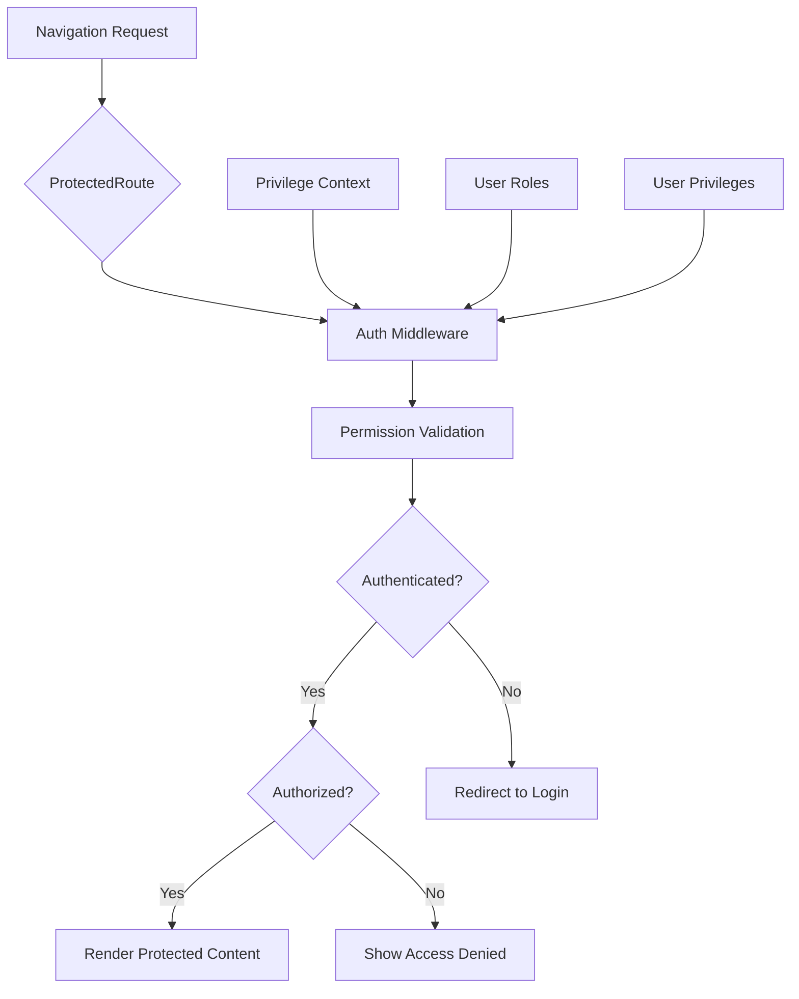
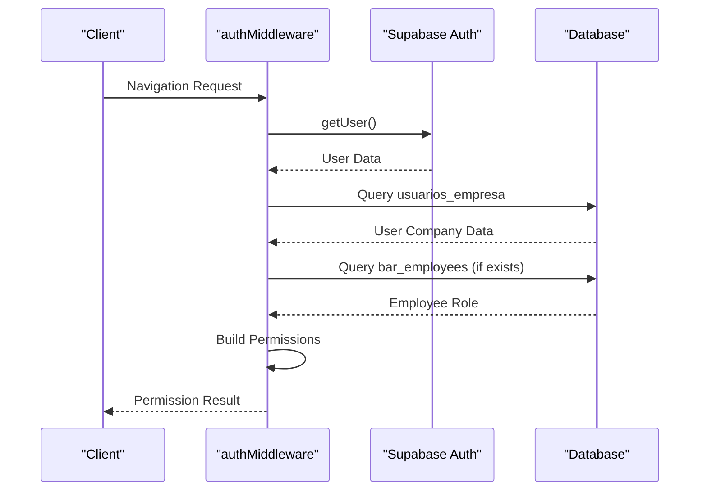
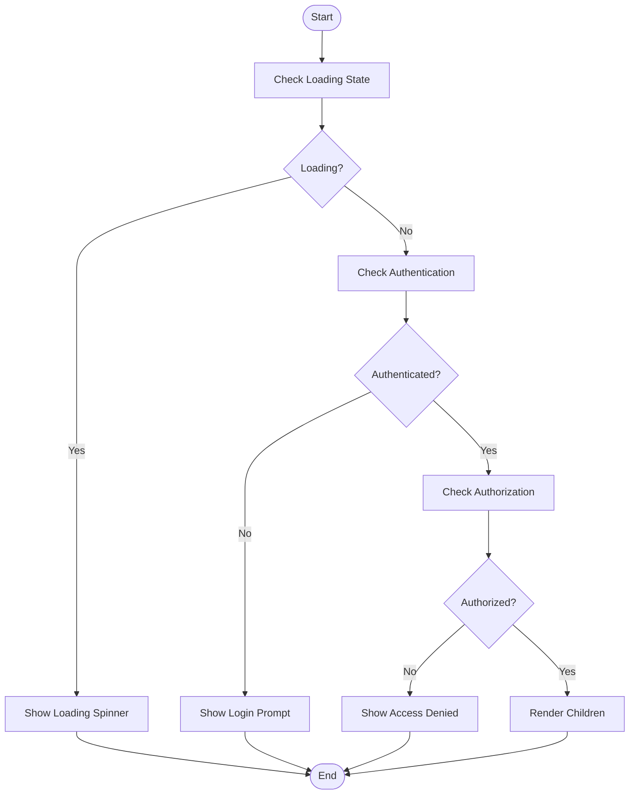
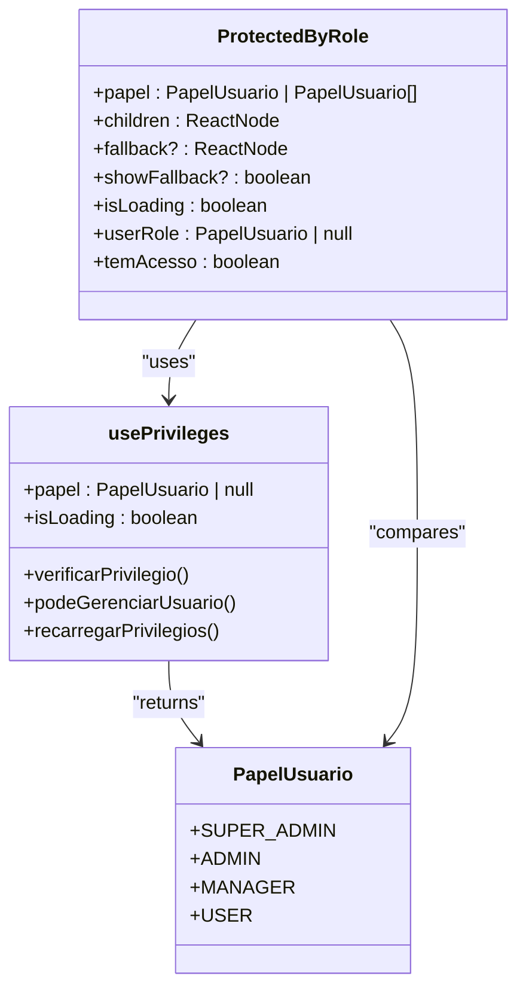
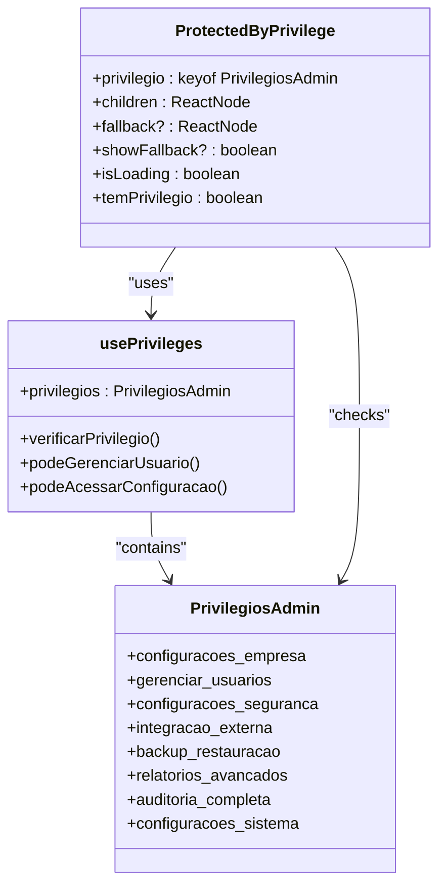
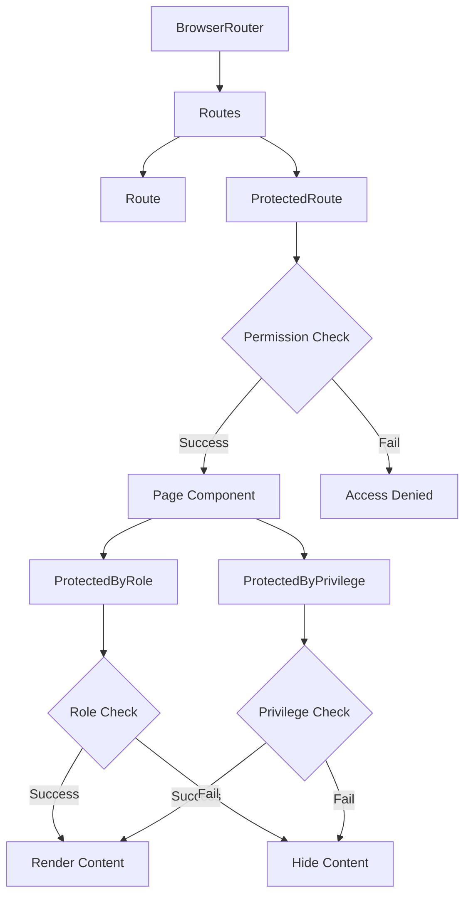

# Route Protection Mechanism

<cite>
**Referenced Files in This Document**   
- [authMiddleware.ts](file://src/middleware/authMiddleware.ts)
- [ProtectedRoute.tsx](file://src/components/Auth/ProtectedRoute.tsx)
- [ProtectedByRole.tsx](file://src/components/Auth/ProtectedByRole.tsx)
- [ProtectedByPrivilege.tsx](file://src/components/Auth/ProtectedByPrivilege.tsx)
- [PrivilegeContext.tsx](file://src/contexts/PrivilegeContext.tsx)
- [multitenant.ts](file://src/types/multitenant.ts)
- [adminService.ts](file://src/services/adminService.ts)
- [privilegeUtils.ts](file://src/utils/privilegeUtils.ts)
</cite>

## Table of Contents
1. [Introduction](#introduction)
2. [Core Components Overview](#core-components-overview)
3. [Authentication Middleware Implementation](#authentication-middleware-implementation)
4. [Protected Route Component Architecture](#protected-route-component-architecture)
5. [Role-Based Access Control](#role-based-access-control)
6. [Privilege-Based Access Control](#privilege-based-access-control)
7. [Integration with React Router](#integration-with-react-router)
8. [Common Issues and Solutions](#common-issues-and-solutions)
9. [Conclusion](#conclusion)

## Introduction
The route protection mechanism in the AABB-system implements a comprehensive security framework that ensures only authorized users can access protected application routes. This system combines authentication validation, role-based access control (RBAC), and privilege-based authorization to create a multi-layered security approach. The implementation leverages middleware functions, React components, and context providers to intercept navigation requests and validate user permissions before rendering protected content.

**Section sources**
- [authMiddleware.ts](file://src/middleware/authMiddleware.ts#L1-L30)
- [ProtectedRoute.tsx](file://src/components/Auth/ProtectedRoute.tsx#L1-L30)

## Core Components Overview
The route protection system consists of several key components working together to enforce access control. The core elements include the `authMiddleware` for permission validation, `ProtectedRoute` component for route-level protection, `ProtectedByRole` and `ProtectedByPrivilege` components for conditional rendering based on user roles and privileges, and the `PrivilegeContext` which manages the user's authorization state throughout the application.

**Diagram sources**
- [ProtectedRoute.tsx](file://src/components/Auth/ProtectedRoute.tsx#L1-L272)
- [authMiddleware.ts](file://src/middleware/authMiddleware.ts#L1-L329)

**Section sources**
- [ProtectedRoute.tsx](file://src/components/Auth/ProtectedRoute.tsx#L1-L272)
- [ProtectedByRole.tsx](file://src/components/Auth/ProtectedByRole.tsx#L1-L86)
- [ProtectedByPrivilege.tsx](file://src/components/Auth/ProtectedByPrivilege.tsx#L1-L131)

## Authentication Middleware Implementation
The `authMiddleware.ts` file contains the core logic for authentication and authorization. It exports several utility functions including `requireAuth` for basic authentication checks and `requireModulePermission` for verifying specific module access. The middleware integrates with Supabase for user authentication and retrieves user permissions from the database, including role information and custom permissions. The `loadUserPermissions` function constructs a comprehensive permission set by combining role-based defaults with any custom permissions assigned to the user.

**Diagram sources**
- [authMiddleware.ts](file://src/middleware/authMiddleware.ts#L1-L329)
- [supabase.ts](file://src/lib/supabase.ts#L1-L10)

**Section sources**
- [authMiddleware.ts](file://src/middleware/authMiddleware.ts#L1-L329)

## Protected Route Component Architecture
The `ProtectedRoute` component serves as the primary gateway for protected routes in the application. It accepts props to specify required modules and actions, and handles three distinct states: loading, unauthenticated, and unauthorized. During the loading state, it displays a spinner while permissions are being verified. If the user is not authenticated, it redirects to the login page. If the user lacks sufficient permissions, it displays an access denied message. The component uses React's useEffect hook to trigger permission checks when required module or action props change.

**Diagram sources**
- [ProtectedRoute.tsx](file://src/components/Auth/ProtectedRoute.tsx#L91-L175)

**Section sources**
- [ProtectedRoute.tsx](file://src/components/Auth/ProtectedRoute.tsx#L91-L175)

## Role-Based Access Control
The `ProtectedByRole` component implements role-based access control, allowing components to be conditionally rendered based on the user's role. It uses the `usePrivileges` hook to access the user's current role and compares it against the required role(s). The component supports both single role checks and array-based role checks, enabling "OR" logic for multiple acceptable roles. It also provides convenience components like `SuperAdminOnly`, `AdminOrHigher`, and `ManagerOrHigher` that encapsulate common role-checking patterns.

**Diagram sources**
- [ProtectedByRole.tsx](file://src/components/Auth/ProtectedByRole.tsx#L11-L35)
- [PrivilegeContext.tsx](file://src/contexts/PrivilegeContext.tsx#L165-L171)
- [multitenant.ts](file://src/types/multitenant.ts#L3-L8)

**Section sources**
- [ProtectedByRole.tsx](file://src/components/Auth/ProtectedByRole.tsx#L11-L35)
- [multitenant.ts](file://src/types/multitenant.ts#L3-L8)

## Privilege-Based Access Control
The `ProtectedByPrivilege` component provides a more granular level of access control based on specific administrative privileges rather than broad roles. It leverages the `usePrivileges` hook's `verificarPrivilegio` method to check if the user has a particular privilege enabled. This approach allows for fine-tuned permission management where users can have specific capabilities regardless of their primary role. The component includes specialized wrappers like `CanManageUsers`, `CanConfigureCompany`, and `CanViewAdvancedReports` for commonly protected functionality.

**Diagram sources**
- [ProtectedByPrivilege.tsx](file://src/components/Auth/ProtectedByPrivilege.tsx#L11-L34)
- [PrivilegeContext.tsx](file://src/contexts/PrivilegeContext.tsx#L165-L171)
- [multitenant.ts](file://src/types/multitenant.ts#L72-L81)

**Section sources**
- [ProtectedByPrivilege.tsx](file://src/components/Auth/ProtectedByPrivilege.tsx#L11-L34)
- [multitenant.ts](file://src/types/multitenant.ts#L72-L81)

## Integration with React Router
The route protection components integrate seamlessly with React Router through wrapper components that handle navigation guards. The `ProtectedRoute` component can be used directly within route definitions to protect entire pages, while `ProtectedByRole` and `ProtectedByPrivilege` can be used within page components to conditionally render specific UI elements. This layered approach allows for both route-level and component-level access control, providing flexibility in how permissions are enforced throughout the application.

**Diagram sources**
- [ProtectedRoute.tsx](file://src/components/Auth/ProtectedRoute.tsx#L91-L175)
- [ProtectedByRole.tsx](file://src/components/Auth/ProtectedByRole.tsx#L11-L35)
- [ProtectedByPrivilege.tsx](file://src/components/Auth/ProtectedByPrivilege.tsx#L11-L34)

**Section sources**
- [ProtectedRoute.tsx](file://src/components/Auth/ProtectedRoute.tsx#L91-L175)
- [ProtectedByRole.tsx](file://src/components/Auth/ProtectedByRole.tsx#L11-L35)
- [ProtectedByPrivilege.tsx](file://src/components/Auth/ProtectedByPrivilege.tsx#L11-L34)

## Common Issues and Solutions
Several common issues can arise with route protection mechanisms, including redirect loops, unauthorized access bypass, and asynchronous permission loading problems. Redirect loops typically occur when the login page itself is accidentally protected, creating an infinite redirect cycle. Unauthorized access bypass can happen if permission checks are not properly implemented on both client and server sides. Asynchronous permission loading issues may cause brief flashes of protected content before authorization is confirmed.

To address these issues, the system implements several safeguards: the `loadingComponent` prop in `ProtectedRoute` ensures proper loading states, explicit error handling prevents silent failures, and the separation of authentication and authorization checks provides clear failure points. Additionally, the use of context providers ensures that permission data is consistently available throughout the component tree, reducing race conditions during route transitions.

**Section sources**
- [ProtectedRoute.tsx](file://src/components/Auth/ProtectedRoute.tsx#L91-L175)
- [authMiddleware.ts](file://src/middleware/authMiddleware.ts#L1-L329)
- [PrivilegeContext.tsx](file://src/contexts/PrivilegeContext.tsx#L1-L201)

## Conclusion
The route protection mechanism in the AABB-system provides a robust and flexible framework for securing application routes and components. By combining middleware-based authentication, role-based access control, and privilege-based authorization, the system enables fine-grained permission management that can accommodate complex organizational hierarchies. The implementation leverages React's component model and context API to create reusable protection components that can be easily integrated throughout the application. This approach ensures that security is maintained consistently across all routes while providing developers with the tools needed to implement sophisticated access control policies.