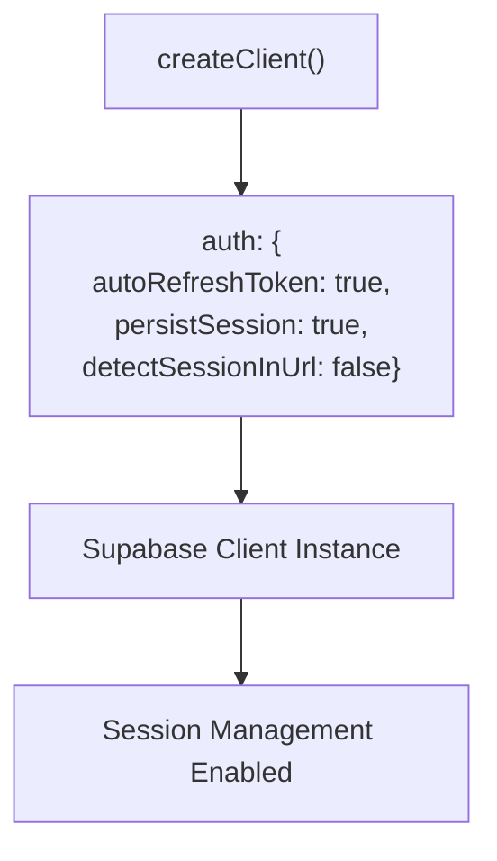
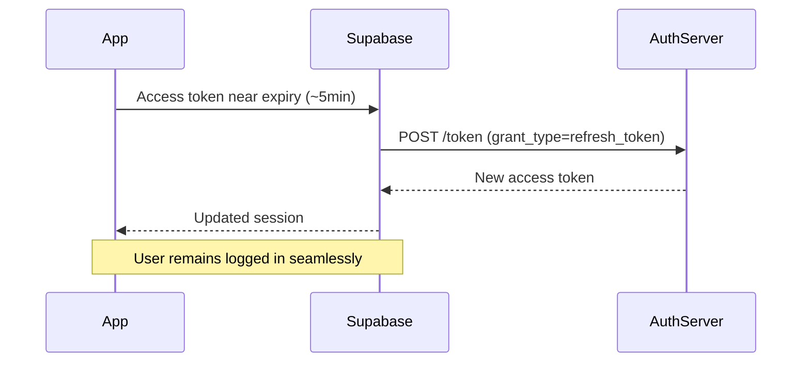
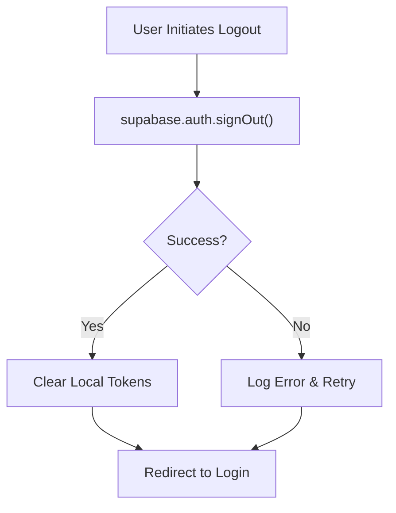
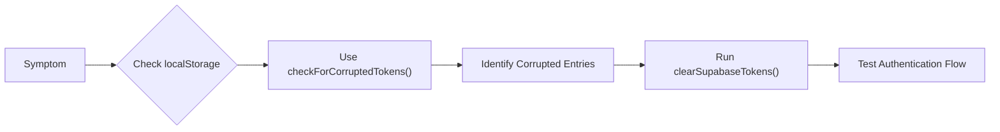

# Session Management

<cite>
**Referenced Files in This Document**   
- [SupabaseService.ts](file://app-garcom/src/services/SupabaseService.ts)
- [auth.ts](file://src/config/auth.ts)
- [supabase.ts](file://src/config/supabase.ts)
- [clearTokens.ts](file://src/utils/clearTokens.ts)
</cite>

## Table of Contents
1. [Introduction](#introduction)
2. [Session Configuration](#session-configuration)
3. [Token Storage and Persistence](#token-storage-and-persistence)
4. [Auto-Refresh Mechanism](#auto-refresh-mechanism)
5. [Logout Procedures and Token Cleanup](#logout-procedures-and-token-cleanup)
6. [Session Expiration and Re-authentication](#session-expiration-and-re-authentication)
7. [Security Considerations](#security-considerations)
8. [Debugging Session Issues](#debugging-session-issues)

## Introduction
This document details the session management implementation within the AABB-system, focusing on Supabase integration for authentication workflows. It covers token handling, persistence strategies, auto-refresh behavior, logout procedures, and security measures designed to protect user sessions across both web and mobile environments.

**Section sources**
- [SupabaseService.ts](file://app-garcom/src/services/SupabaseService.ts#L1-L80)
- [auth.ts](file://src/config/auth.ts#L1-L49)

## Session Configuration
The session behavior in AABB-system is configured through Supabase client initialization with specific auth options that control token refresh, persistence, and URL detection. These settings are defined during the `createClient` call and ensure consistent session handling across application restarts and page reloads.

Key configuration parameters include:
- **autoRefreshToken**: Enables automatic background refresh of access tokens before they expire
- **persistSession**: Determines whether sessions survive browser/tab closures
- **detectSessionInUrl**: Controls if login callback URLs are processed for session creation

These values are set based on environment-specific configurations and can be adjusted globally via the AUTH_CONFIG object.

**Diagram sources**
- [SupabaseService.ts](file://app-garcom/src/services/SupabaseService.ts#L1-L20)
- [auth.ts](file://src/config/auth.ts#L10-L20)

**Section sources**
- [SupabaseService.ts](file://app-garcom/src/services/SupabaseService.ts#L1-L20)
- [auth.ts](file://src/config/auth.ts#L10-L20)

## Token Storage and Persistence
Session tokens are stored using platform-appropriate storage mechanisms. In the Expo-based mobile app (app-garcom), AsyncStorage is used as the storage backend for Supabase authentication tokens. This ensures secure, persistent storage that survives app restarts while maintaining isolation between different user data.

For web clients, Supabase defaults to localStorage for token persistence when no custom storage is specified. The `persistSession` flag controls whether these tokens remain after browser closure—when enabled, users maintain their authenticated state across sessions.

Token storage follows Supabase's naming convention with keys prefixed by "supabase" followed by project-specific identifiers, allowing multiple Supabase projects to coexist without conflict.

**Section sources**
- [SupabaseService.ts](file://app-garcom/src/services/SupabaseService.ts#L1-L20)
- [supabase.ts](file://src/config/supabase.ts#L1-L31)

## Auto-Refresh Mechanism
The AABB-system implements automatic token refreshing through Supabase's built-in refresh functionality. When `autoRefreshToken` is set to true (the default), the system proactively renews access tokens approximately 5 minutes before expiration.

This process occurs transparently in the background without interrupting the user experience. If the refresh fails due to network issues or invalid credentials, the system triggers a logout sequence and redirects to the login page. The refresh mechanism respects exponential backoff strategies on failure and includes retry logic to handle transient network conditions.

**Diagram sources**
- [SupabaseService.ts](file://app-garcom/src/services/SupabaseService.ts#L1-L20)

**Section sources**
- [SupabaseService.ts](file://app-garcom/src/services/SupabaseService.ts#L1-L20)
- [auth.ts](file://src/config/auth.ts#L15-L20)

## Logout Procedures and Token Cleanup
User logout is handled through Supabase's `signOut()` method, which invalidates the current session server-side and clears local tokens. The `SupabaseService.signOut()` wrapper provides additional error handling and logging capabilities.

In addition to standard logout, the system includes a utility function `clearSupabaseTokens()` for manual cleanup of corrupted or stale tokens. This function scans localStorage for all keys containing "supabase" and removes them, then reloads the page to force a clean authentication state.

This utility is particularly useful for resolving issues where token corruption prevents successful login attempts or causes infinite redirect loops.

**Diagram sources**
- [SupabaseService.ts](file://app-garcom/src/services/SupabaseService.ts#L35-L40)
- [clearTokens.ts](file://src/utils/clearTokens.ts#L1-L70)

**Section sources**
- [SupabaseService.ts](file://app-garcom/src/services/SupabaseService.ts#L35-L40)
- [clearTokens.ts](file://src/utils/clearTokens.ts#L1-L70)

## Session Expiration and Re-authentication
When a session expires or becomes invalid, the system automatically redirects users to the login page. The re-authentication workflow preserves the intended destination URL so users can return to their original location after logging back in.

Session duration limits can be enforced at both the application level (via `maxSessionDuration` in security policies) and the database level through RLS (Row Level Security) policies. Idle timeout settings also contribute to session termination after periods of inactivity.

Upon detecting an expired session, the frontend triggers appropriate UI feedback and may prompt for multi-factor authentication depending on organizational security policies.

**Section sources**
- [SecuritySettings.tsx](file://src/components/Admin/SecuritySettings.tsx#L199-L226)
- [configurationService.ts](file://src/services/configurationService.ts#L252-L285)

## Security Considerations
The AABB-system employs several security measures to protect user sessions:

- **Secure Storage**: Tokens are stored in secure, isolated storage mechanisms (AsyncStorage on mobile, localStorage on web)
- **XSS Protection**: All token operations occur within protected contexts, minimizing exposure to cross-site scripting attacks
- **Token Theft Mitigation**: Short-lived access tokens combined with refresh token rotation reduce the window of opportunity for attackers
- **Environment Hardening**: Configuration validation ensures Supabase credentials aren't accidentally exposed in development builds

Administrative controls allow setting maximum session durations, concurrent session limits, and IP-based restrictions to further enhance security posture.

**Section sources**
- [SecuritySettings.tsx](file://src/components/Admin/SecuritySettings.tsx#L0-L64)
- [auth.ts](file://src/config/auth.ts#L30-L49)

## Debugging Session Issues
Several tools and techniques are available for diagnosing session-related problems:

1. **Console Utilities**: The `checkForCorruptedTokens()` function allows developers to inspect existing Supabase tokens in localStorage and identify parsing errors
2. **Token Inspection**: Manual inspection of localStorage entries prefixed with "supabase" can reveal malformed JSON or unexpected values
3. **Network Monitoring**: Observing `/auth/token` API calls helps diagnose refresh failures
4. **Error Logging**: Comprehensive auth error logging captures context, user agent, and full error objects for analysis

The `clearSupabaseTokens()` function serves as both a diagnostic tool and remediation step, exported globally for easy access from browser developer consoles during troubleshooting sessions.

**Diagram sources**
- [clearTokens.ts](file://src/utils/clearTokens.ts#L1-L70)

**Section sources**
- [clearTokens.ts](file://src/utils/clearTokens.ts#L1-L70)
- [authErrors.ts](file://src/utils/authErrors.ts#L127-L206)