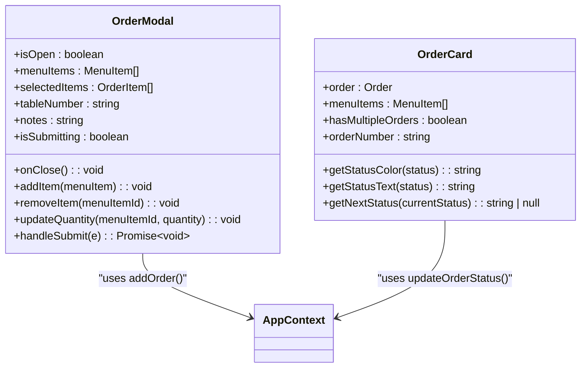
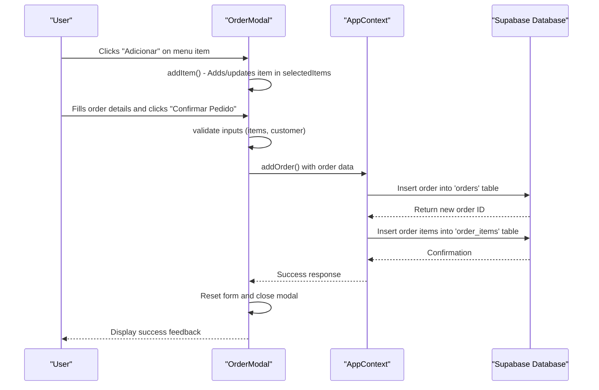
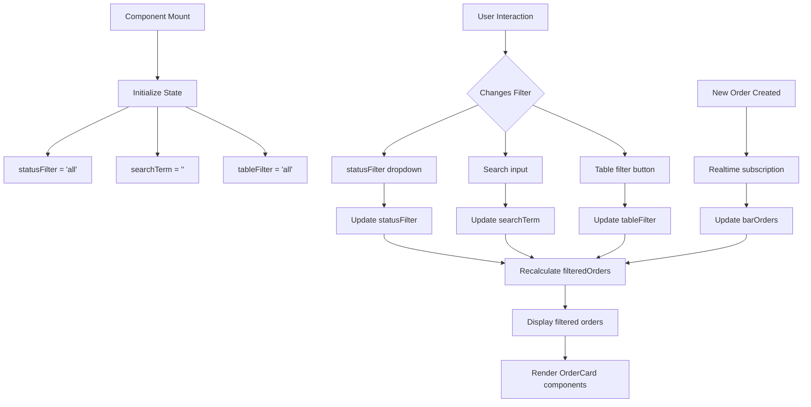
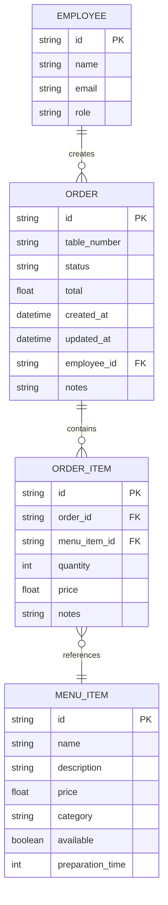
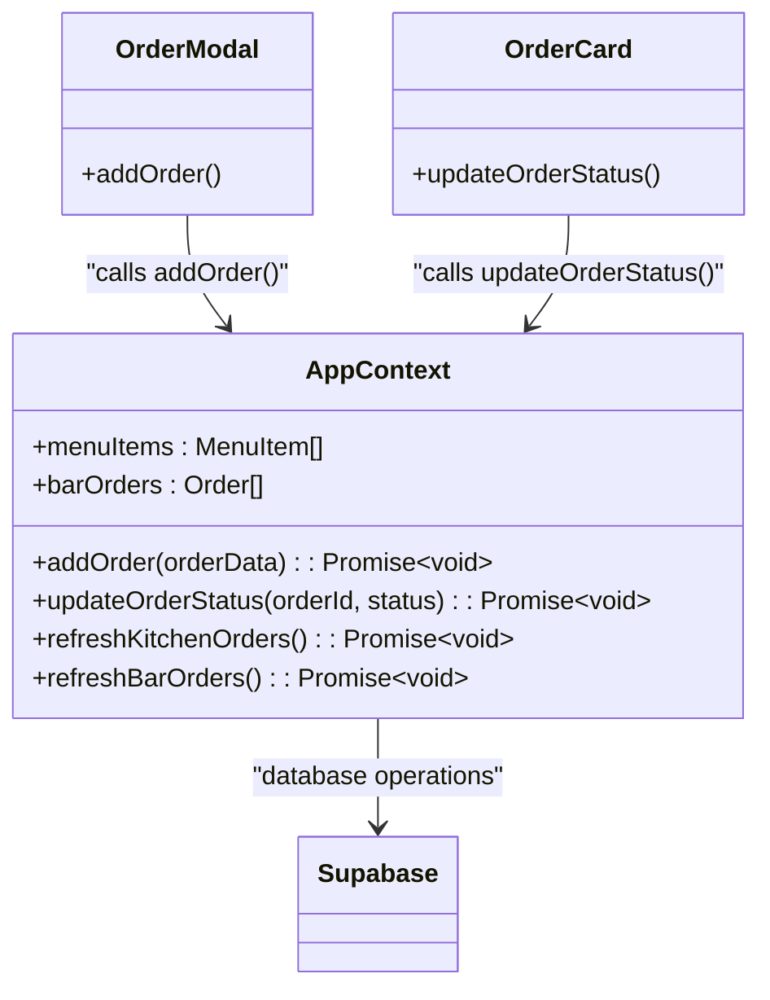
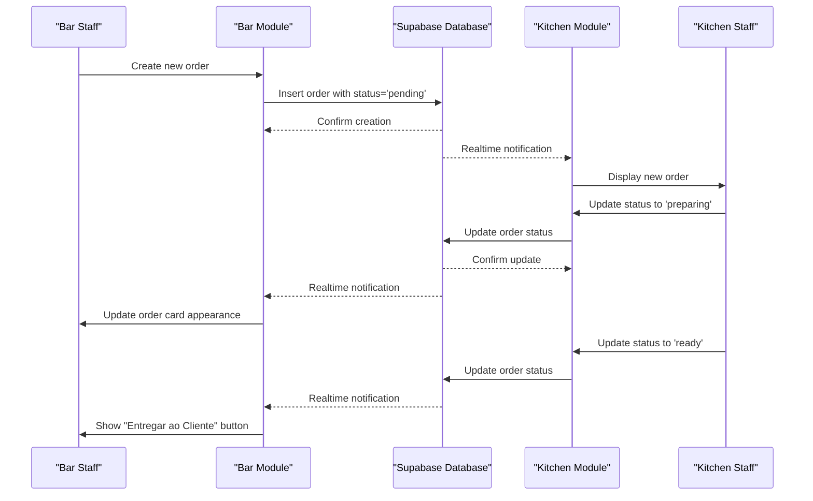
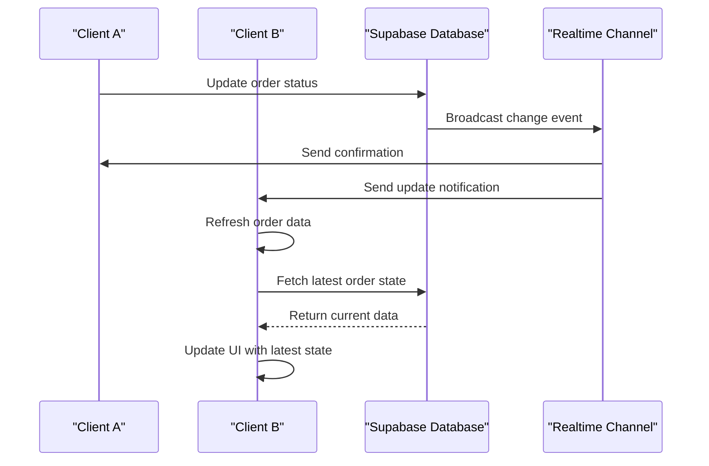

# Bar Module

<cite>
**Referenced Files in This Document**   
- [OrderModal.tsx](file://src/pages/Bar/OrderModal.tsx)
- [OrderCard.tsx](file://src/pages/Bar/OrderCard.tsx)
- [index.tsx](file://src/pages/Bar/index.tsx)
- [AppContext.tsx](file://src/contexts/AppContext.tsx)
- [bar-attendance.ts](file://src/types/bar-attendance.ts)
</cite>

## Table of Contents
1. [Introduction](#introduction)
2. [Core Components](#core-components)
3. [Order Management Implementation](#order-management-implementation)
4. [State Management and Filtering](#state-management-and-filtering)
5. [Revenue Calculation and Order Tracking](#revenue-calculation-and-order-tracking)
6. [Integration with AppContext](#integration-with-appcontext)
7. [Relationship with Kitchen Module](#relationship-with-kitchen-module)
8. [Real-time Updates and Concurrency Handling](#real-time-updates-and-concurrency-handling)
9. [Conclusion](#conclusion)

## Introduction

The Bar Module is a comprehensive order management system designed for restaurant operations, providing functionality for creating new orders, viewing active orders, and tracking order status through the preparation lifecycle. This document details the implementation of key components including OrderModal for creating orders, OrderCard for displaying orders in a responsive grid, and the integration with AppContext for global data access. The module handles multiple orders per table, calculates bar revenue from delivered orders, and maintains real-time synchronization with the Kitchen module through Supabase subscriptions.

**Section sources**
- [index.tsx](file://src/pages/Bar/index.tsx#L0-L34)

## Core Components

The Bar Module consists of two primary components: OrderModal and OrderCard. OrderModal provides an interface for creating new orders with menu item selection, customer association, and order submission. OrderCard displays individual orders in a card format with status indicators, item details, and action buttons based on the current order state.

**Diagram sources**
- [OrderModal.tsx](file://src/pages/Bar/OrderModal.tsx#L14-L286)
- [OrderCard.tsx](file://src/pages/Bar/OrderCard.tsx#L15-L171)

**Section sources**
- [OrderModal.tsx](file://src/pages/Bar/OrderModal.tsx#L14-L286)
- [OrderCard.tsx](file://src/pages/Bar/OrderCard.tsx#L15-L171)

## Order Management Implementation

The order management system implements a complete workflow from order creation to delivery. The OrderModal component allows users to select menu items, specify table numbers, add notes, and submit orders. When a user adds an item to their order, the addItem function checks if the item already exists in the selectedItems array and either increments its quantity or creates a new entry.

The handleSubmit function in OrderModal validates that at least one item has been selected and a customer has been chosen before submitting the order to the AppContext's addOrder function. This function also handles form reset after successful submission, clearing all fields and closing the modal.

**Diagram sources**
- [OrderModal.tsx](file://src/pages/Bar/OrderModal.tsx#L14-L286)

**Section sources**
- [OrderModal.tsx](file://src/pages/Bar/OrderModal.tsx#L14-L286)

## State Management and Filtering

The Bar Module employs React state for filtering active orders by status, table number, and search term. The main BarModule component maintains three state variables: statusFilter, searchTerm, and tableFilter. These states enable dynamic filtering of the order list based on user input.

The filteredOrders array is derived by applying these filters to the barOrders collection from AppContext. Orders are matched against the current filter criteria, including partial text matching for search terms across table numbers, order IDs, and notes. This filtering mechanism provides a responsive user experience, updating the displayed orders as soon as filter values change.

**Diagram sources**
- [index.tsx](file://src/pages/Bar/index.tsx#L32-L52)

**Section sources**
- [index.tsx](file://src/pages/Bar/index.tsx#L0-L52)

## Revenue Calculation and Order Tracking

The Bar Module calculates bar revenue by summing the total amounts of all delivered orders. This calculation is performed using the Array.filter and Array.reduce methods on the barOrders collection, first filtering for orders with a 'delivered' status and then summing their total values.

The module also highlights tables with multiple orders through visual indicators. The hasMultipleOrdersForTable function determines if a table has more than one active order by grouping orders by table number. When such tables are detected, they are highlighted with an orange ring in the OrderCard component, and a summary banner appears above the order list indicating the number of tables with multiple orders.

**Diagram sources**
- [index.tsx](file://src/pages/Bar/index.tsx#L50-L74)
- [index.tsx](file://src/pages/Bar/index.tsx#L32-L34)

**Section sources**
- [index.tsx](file://src/pages/Bar/index.tsx#L50-L74)

## Integration with AppContext

The Bar Module integrates with AppContext for global data access and state management. The useApp hook provides access to essential functions including addOrder, updateOrderStatus, and data collections like menuItems and barOrders. This context-based architecture enables centralized state management while allowing components to remain decoupled.

OrderCard uses the updateOrderStatus function to advance orders through their lifecycle (pending → preparing → ready → delivered). The component determines the next valid status using the getNextStatus function and renders appropriate action buttons. This integration ensures that order status changes are propagated throughout the application and persisted to the database.

**Diagram sources**
- [AppContext.tsx](file://src/contexts/AppContext.tsx#L125-L133)
- [OrderModal.tsx](file://src/pages/Bar/OrderModal.tsx#L14-L286)
- [OrderCard.tsx](file://src/pages/Bar/OrderCard.tsx#L15-L171)

**Section sources**
- [AppContext.tsx](file://src/contexts/AppContext.tsx#L125-L133)

## Relationship with Kitchen Module

The Bar Module shares order data with the Kitchen Module through a common data model and real-time synchronization. Both modules access the same order records in the database, allowing kitchen staff to view and update order statuses as food is prepared. This shared data architecture ensures consistency across different parts of the restaurant operation.

When a bar staff member creates an order, it immediately appears in the kitchen's order queue. As kitchen staff update the order status to 'preparing', 'ready', or 'delivered', these changes are reflected in real-time on the bar interface. This bidirectional data flow enables efficient coordination between service and kitchen teams.

**Diagram sources**
- [AppContext.tsx](file://src/contexts/AppContext.tsx#L127-L133)
- [index.tsx](file://src/pages/Bar/index.tsx#L14-L286)

**Section sources**
- [AppContext.tsx](file://src/contexts/AppContext.tsx#L127-L133)

## Real-time Updates and Concurrency Handling

The Bar Module addresses concurrent order modifications through Supabase realtime subscriptions. The AppContext establishes a subscription to the 'orders' table, listening for INSERT, UPDATE, and DELETE events. When changes occur, the subscription handler fetches the complete updated order list and refreshes the component state.

This approach prevents race conditions that could occur when multiple users modify the same order simultaneously. For example, if a bar staff member and kitchen staff attempt to update an order at the same time, the realtime subscription ensures both interfaces receive the latest state, maintaining data consistency across all clients.

The system also implements optimistic UI updates where appropriate, providing immediate feedback to users while background processes handle database operations. This enhances perceived performance while maintaining data integrity through proper error handling and state rollback mechanisms.

**Diagram sources**
- [AppContext.tsx](file://src/contexts/AppContext.tsx#L127-L133)

**Section sources**
- [AppContext.tsx](file://src/contexts/AppContext.tsx#L127-L133)

## Conclusion

The Bar Module provides a robust order management solution with comprehensive features for restaurant operations. Its implementation of OrderModal and OrderCard components offers an intuitive interface for creating and managing orders, while React state management enables effective filtering and display of active orders. The integration with AppContext centralizes data access and manipulation, ensuring consistency across the application. By sharing order data with the Kitchen Module and leveraging Supabase realtime subscriptions, the system maintains synchronization across different operational areas, preventing conflicts from concurrent modifications. This architecture supports efficient restaurant workflows while providing a responsive user experience for staff members.