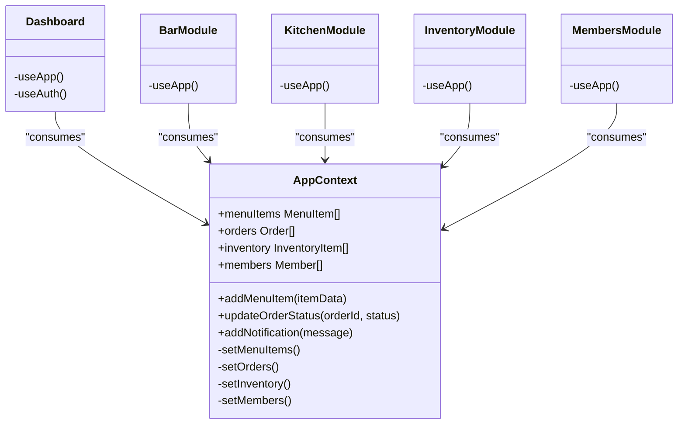
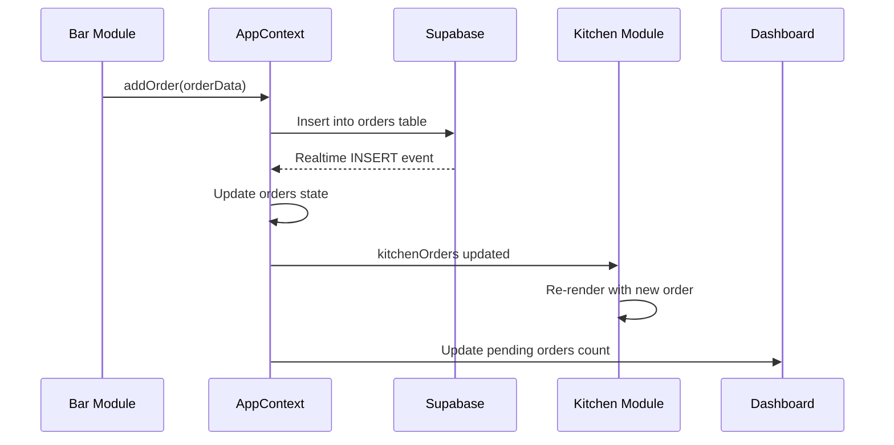

# Core Modules

<cite>
**Referenced Files in This Document **   
- [Dashboard.tsx](file://src/pages/Dashboard.tsx)
- [BarModule.tsx](file://src/pages/Bar/index.tsx)
- [KitchenModule.tsx](file://src/pages/Kitchen/index.tsx)
- [InventoryModule.tsx](file://src/pages/Inventory/index.tsx)
- [MembersModule.tsx](file://src/pages/Members/index.tsx)
- [CashManagement.tsx](file://src/pages/CashManagement/index.tsx)
- [AppContext.tsx](file://src/contexts/AppContext.tsx)
- [supabase-integration.ts](file://src/services/supabase-integration.ts)
</cite>

## Table of Contents
1. [Dashboard Module](#dashboard-module)
2. [Bar Module](#bar-module)
3. [Kitchen Module](#kitchen-module)
4. [Inventory Module](#inventory-module)
5. [Members Module](#members-module)
6. [Cash Management Module](#cash-management-module)
7. [Architectural Integration](#architectural-integration)

## Dashboard Module

The Dashboard module serves as the central hub for monitoring key performance indicators (KPIs) and navigating between system modules. It provides an executive overview of club operations through real-time statistics and quick access to core functionalities.

Key features include:
- Real-time display of today's revenue, pending orders, sales count, and low-stock items
- Interactive alert system for inventory shortages with direct navigation to relevant sections
- Recent orders tracking with status visualization
- Quick-access buttons to all major modules (Bar, Kitchen, Cash Management)
- Demo mode indicators and guided onboarding for new users

The dashboard leverages motion animations for enhanced user experience and employs responsive design principles to ensure usability across device sizes. Navigation is intuitive, with clear visual hierarchy and contextual guidance for first-time users.

**Section sources**
- [Dashboard.tsx](file://src/pages/Dashboard.tsx#L1-L304)

## Bar Module

The Bar module manages order lifecycle from creation to delivery, focusing on table service and counter sales. It handles comanda (tab) management, order placement, and real-time order tracking.

Core functionality includes:
- Order creation through modal interface with menu item selection
- Real-time filtering by status, table number, and search term
- Visual indicators for tables with multiple orders
- Revenue tracking and order statistics
- Support for both table-based and counter (balcão) orders

The module implements a card-based layout for order visualization, with each order card displaying essential information including table number, total amount, status, and order identifier. The component composition follows React best practices with separation of concerns between presentation (OrderCard) and business logic (BarModule).

Routing is handled through React Router, with the Bar module accessible at the `/bar` path. Error handling includes comprehensive logging and user notifications for failed operations.

**Section sources**
- [index.tsx](file://src/pages/Bar/index.tsx#L1-L197)
- [OrderCard.tsx](file://src/pages/Bar/OrderCard.tsx)
- [OrderModal.tsx](file://src/pages/Bar/OrderModal.tsx)

## Kitchen Module

The Kitchen module provides tools for managing food preparation workflows and menu configuration. It offers a dual-tab interface separating order management from menu administration.

Key capabilities:
- Real-time display of pending kitchen orders with preparation status
- Average preparation time calculation based on menu item configurations
- Menu management interface for adding, editing, and removing menu items
- Visual indicators for order urgency and preparation progress
- Count of available dishes considering ingredient availability

The module maintains a filtered view of kitchen orders, showing only those with 'pending' or 'preparing' status. It integrates with the inventory system to determine dish availability, preventing orders for items that lack sufficient stock. The tabbed interface allows kitchen staff to quickly switch between order processing and menu updates without leaving the module.

Performance considerations include memoized calculations for preparation times and efficient state updates to minimize re-renders during high-volume periods.

**Section sources**
- [index.tsx](file://src/pages/Kitchen/index.tsx#L1-L110)
- [KitchenOrders.tsx](file://src/pages/Kitchen/KitchenOrders.tsx)
- [MenuManagement.tsx](file://src/pages/Kitchen/MenuManagement.tsx)

## Inventory Module

The Inventory module enables comprehensive stock monitoring and management. It tracks inventory levels, generates low-stock alerts, and facilitates inventory updates.

Primary features:
- Comprehensive inventory listing with search and filter capabilities
- Real-time calculation of total inventory value
- Visual identification of low-stock items with direct navigation
- Bulk update functionality for efficient inventory adjustments
- Categorization system for organized inventory management

The module displays three key metrics: total inventory value, total number of items, and count of items below minimum stock levels. Clicking on the low-stock counter navigates directly to a filtered view of critical items. The interface supports both individual item management through modals and bulk operations for efficiency.

Error handling strategies include validation of input data before submission and appropriate feedback for failed database operations. The component efficiently handles large inventories through virtualized rendering and optimized data fetching.

**Section sources**
- [index.tsx](file://src/pages/Inventory/index.tsx#L1-L179)
- [InventoryItemCard.tsx](file://src/pages/Inventory/InventoryItemCard.tsx)
- [ItemModal.tsx](file://src/pages/Inventory/ItemModal.tsx)

## Members Module

The Members module manages the sponsor database and member profiles. It provides tools for member registration, profile management, and membership analytics.

Functionality includes:
- Complete member CRUD operations through modal interfaces
- Search and filtering by name and membership status
- Key statistics on total members, active members, and new signups
- Profile management with contact information and status tracking
- Membership type categorization

The module displays member information in a card-based grid layout, with each card showing essential details and supporting edit operations. Statistics are updated in real-time and reflect current membership status. The interface supports responsive layouts, adapting from single-column on mobile devices to multi-column grids on larger screens.

Data validation occurs both client-side and server-side, ensuring data integrity while providing immediate feedback to users during form submission.

**Section sources**
- [index.tsx](file://src/pages/Members/index.tsx#L1-L153)
- [MemberCard.tsx](file://src/pages/Members/MemberCard.tsx)
- [MemberModal.tsx](file://src/pages/Members/MemberModal.tsx)

## Cash Management Module

The Cash Management module handles financial operations including cash sessions, transactions, and reporting. It provides a routing structure that separates different financial views.

Key components:
- Dashboard overview of current cash session
- Detailed transaction history
- Daily cash movement tracking
- Financial reporting capabilities
- Cash session management (opening and closing)

The module uses React Router to organize different financial views under specific paths (`/`, `/reports`, `/transactions`, `/movement`). This routing structure enables deep linking to specific financial reports while maintaining a cohesive user experience within the cash management context.

Each route renders a dedicated component that focuses on a specific aspect of financial management, following the principle of single responsibility. The modular design allows for easy extension with additional financial reports or analysis tools.

**Section sources**
- [index.tsx](file://src/pages/CashManagement/index.tsx#L1-L23)
- [DashboardOverview.tsx](file://src/pages/CashManagement/components/DashboardOverview.tsx)
- [TransactionHistory.tsx](file://src/pages/CashManagement/components/TransactionHistory.tsx)

## Architectural Integration

The core modules are integrated through a shared state management system using React Context API and real-time data synchronization via Supabase.

### State Management with Context API

The AppContext provides a centralized state management solution that enables data sharing across modules:

**Diagram sources **
- [AppContext.tsx](file://src/contexts/AppContext.tsx#L1-L1165)

### Real-time Data Synchronization

Modules maintain data consistency through Supabase real-time subscriptions. When a new order is created in the Bar module, it triggers immediate updates across relevant modules:

**Diagram sources **
- [AppContext.tsx](file://src/contexts/AppContext.tsx#L150-L200)
- [supabase-integration.ts](file://src/services/supabase-integration.ts#L1-L490)

The integration pattern follows these principles:
- Single source of truth through centralized context
- Unidirectional data flow from context to components
- Real-time updates via Supabase change notifications
- Optimistic UI updates for improved responsiveness
- Error recovery mechanisms for network failures

This architecture ensures that when a waiter creates a new order in the Bar module, the Kitchen module immediately receives the order through real-time synchronization, enabling prompt preparation without manual refresh or polling.

**Section sources**
- [AppContext.tsx](file://src/contexts/AppContext.tsx#L1-L1165)
- [supabase-integration.ts](file://src/services/supabase-integration.ts#L1-L490)